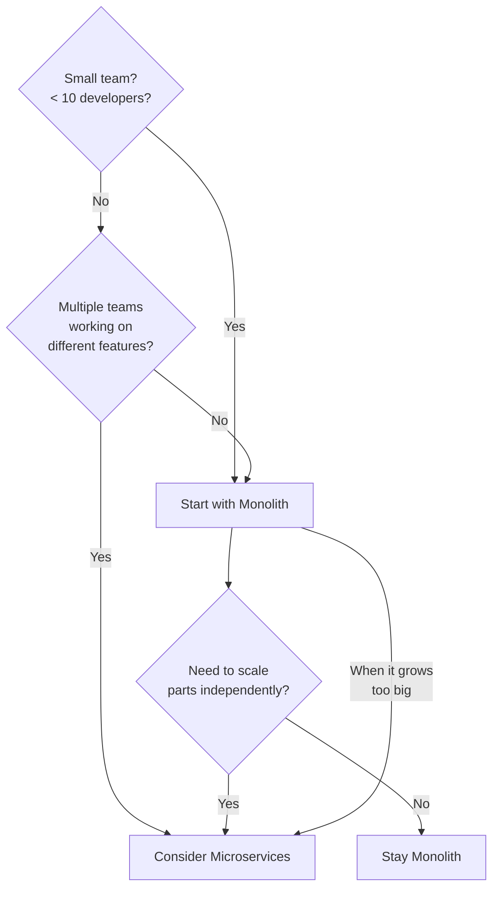
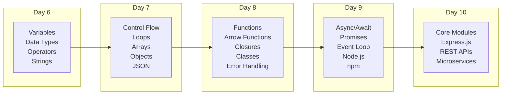

# Day 10: Node.js Deep-Dive & Microservices Intro + Week 2 Revision

---

## Day Schedule (8 Hours)

| Time | Session | Duration |
|------|---------|----------|
| 09:00 - 09:15 | Day 9 Recap & Quick Fire | 15 min |
| 09:15 - 10:15 | Session 1: Node.js Core Modules (fs, path, http, events) | 60 min |
| 10:15 - 10:30 | Break | 15 min |
| 10:30 - 11:45 | Session 2: Express.js — Routing, Middleware & REST Principles | 75 min |
| 11:45 - 13:00 | Session 3: Hands-on — Build a Complete REST API | 75 min |
| 13:00 - 13:45 | Lunch Break | 45 min |
| 13:45 - 14:45 | Session 4: Microservice Architecture & Monolith Comparison | 60 min |
| 14:45 - 15:00 | Break | 15 min |
| 15:00 - 15:30 | Session 5: Week 2 Recap — JavaScript to APIs | 30 min |
| 15:30 - 16:15 | Session 6: Weekly Quiz — 30 Questions (Days 6-10) | 45 min |
| 16:15 - 17:00 | Assignment & Mini Project Brief | 45 min |

---

## What You'll Learn Today

By the end of this session, you will be able to:
- Use Node.js core modules (fs, path, http, events)
- Create a raw HTTP server with Node.js
- Build a REST API using Express.js with full CRUD operations
- Use middleware for logging, parsing, and error handling
- Explain REST principles, HTTP methods, and status codes
- Compare Monolith vs Microservice architecture
- Test APIs using REST Client extension in VS Code
- Build a complete book management microservice

---

## Day 9 Recap — Quick Fire (09:00 - 09:15)

1. What's the difference between sync and async? → _____
2. What does the Event Loop do? → _____
3. A Promise has 3 states: → _____, _____, _____
4. `await` can only be used inside a _____ function
5. `Promise.all` resolves when? → _____
6. What does `npm install` do? → _____
7. What's in `package-lock.json`? → _____
8. What does V8 do in Node.js? → _____

<details>
<summary>Answers</summary>

1. Sync blocks (waits for each task), Async doesn't block (moves on, handles results later)
2. Moves callbacks from the queue to the call stack when the stack is empty
3. Pending, Fulfilled, Rejected
4. `async` function
5. When ALL promises in the array resolve successfully
6. Downloads packages into node_modules and records them in package.json
7. Exact locked versions of all dependencies (ensures everyone gets same versions)
8. Compiles JavaScript to machine code (Google's JS engine)

</details>

---

## Session 1: Node.js Core Modules (09:15 - 10:15)

### What are Core Modules?

Core modules come **built-in** with Node.js — no `npm install` needed! They provide fundamental functionality.

```javascript
// Core modules are imported with require():
const fs = require('fs');       // File System
const path = require('path');   // File Paths
const http = require('http');   // HTTP Server
const events = require('events'); // Event Emitter
```

---

### 1. `fs` — File System Module

Read, write, delete, and manage files:

```javascript
const fs = require('fs').promises;  // Use promises version!

// Read a file:
const content = await fs.readFile('data.txt', 'utf8');

// Write a file:
await fs.writeFile('output.txt', 'Hello World!');

// Append to a file:
await fs.appendFile('log.txt', 'New log entry\n');

// Check if file exists:
try {
  await fs.access('config.json');
  console.log("File exists!");
} catch {
  console.log("File not found");
}

// Delete a file:
await fs.unlink('temp.txt');

// Create a directory:
await fs.mkdir('new-folder', { recursive: true });

// List files in directory:
const files = await fs.readdir('.');
console.log(files);
```

---

### 2. `path` — File Path Utilities

Handle file paths across operating systems (Windows uses `\`, Mac/Linux uses `/`):

```javascript
const path = require('path');

// Join paths safely:
const filePath = path.join('users', 'data', 'config.json');
// Mac/Linux: "users/data/config.json"
// Windows: "users\\data\\config.json"

// Get file name from path:
console.log(path.basename('/home/user/file.txt'));  // "file.txt"

// Get directory from path:
console.log(path.dirname('/home/user/file.txt'));   // "/home/user"

// Get file extension:
console.log(path.extname('report.pdf'));            // ".pdf"
console.log(path.extname('server.config.js'));      // ".js"

// Get absolute path:
console.log(path.resolve('data', 'file.txt'));      
// "/Users/you/project/data/file.txt" (full absolute path)

// Parse a path into components:
const parsed = path.parse('/home/user/docs/report.pdf');
console.log(parsed);
// { root: '/', dir: '/home/user/docs', base: 'report.pdf', ext: '.pdf', name: 'report' }
```

**Why use `path` instead of string concatenation?**
```javascript
// ❌ BAD — breaks on Windows:
const bad = 'users/' + 'data/' + 'file.txt';

// ✅ GOOD — works everywhere:
const good = path.join('users', 'data', 'file.txt');
```

---

### 3. `http` — Create a Web Server

Node.js can create a web server with ZERO external packages:

```javascript
const http = require('http');

const server = http.createServer((request, response) => {
  // 'request' = what the client sent (URL, method, headers)
  // 'response' = what we send back
  
  response.writeHead(200, { 'Content-Type': 'application/json' });
  response.end(JSON.stringify({ message: "Hello from Node.js!", time: new Date() }));
});

server.listen(3000, () => {
  console.log("🚀 Server running at http://localhost:3000");
});
```

Run it, then open `http://localhost:3000` in your browser!

#### Handling Different Routes (Raw Node.js)

```javascript
const http = require('http');

const server = http.createServer((req, res) => {
  res.setHeader('Content-Type', 'application/json');
  
  if (req.url === '/' && req.method === 'GET') {
    res.writeHead(200);
    res.end(JSON.stringify({ message: "Welcome to our API!" }));
    
  } else if (req.url === '/products' && req.method === 'GET') {
    res.writeHead(200);
    res.end(JSON.stringify({ products: ["Laptop", "Mouse", "Keyboard"] }));
    
  } else if (req.url === '/health' && req.method === 'GET') {
    res.writeHead(200);
    res.end(JSON.stringify({ status: "healthy", uptime: process.uptime() }));
    
  } else {
    res.writeHead(404);
    res.end(JSON.stringify({ error: "Not Found" }));
  }
});

server.listen(3000, () => console.log("Server on port 3000"));
```

**Problem:** This gets messy fast with many routes! That's why we use Express.js.

---

### 4. `events` — Event Emitter

The Event Emitter pattern is core to Node.js architecture:

```javascript
const EventEmitter = require('events');

// Create an emitter:
const orderSystem = new EventEmitter();

// Register listeners (what to do when events happen):
orderSystem.on('orderCreated', (order) => {
  console.log(`📦 New order: ${order.id} from ${order.customer}`);
});

orderSystem.on('orderCreated', (order) => {
  console.log(`💰 Amount: ₹${order.amount}`);
});

orderSystem.on('orderApproved', (order) => {
  console.log(`✅ Order ${order.id} approved!`);
});

orderSystem.on('error', (err) => {
  console.log(`❌ Error: ${err.message}`);
});

// Emit events (trigger the listeners):
orderSystem.emit('orderCreated', { id: "PO-001", customer: "TechCorp", amount: 50000 });
orderSystem.emit('orderApproved', { id: "PO-001" });
// Output:
// 📦 New order: PO-001 from TechCorp
// 💰 Amount: ₹50000
// ✅ Order PO-001 approved!
```

**Why this matters for CAP:** SAP CAP uses an event-driven model. Services emit events (before, on, after handlers). Understanding events is key!

---

## Session 2: Express.js — Routing, Middleware & REST (10:30 - 11:45)

### What is Express.js?

**Express.js** = A minimal, fast web framework for Node.js. It makes building APIs easy!

```
Raw Node.js (hard way):          Express.js (easy way):
- Manual URL parsing             - Automatic routing
- Manual JSON handling           - Built-in body parsing
- Manual error handling          - Middleware system
- Lots of boilerplate            - Clean, minimal code
```

**Analogy:** Raw `http` module is like building a house from trees. Express.js is like using prefab walls — same result, 10x faster!

---

### Setting Up Express

```bash
# Create project:
mkdir book-api && cd book-api
npm init -y
npm install express
```

Create `server.js`:

```javascript
const express = require('express');
const app = express();

// Middleware: Parse JSON request bodies
app.use(express.json());

// Route: GET /
app.get('/', (req, res) => {
  res.json({ message: "Welcome to the Book API! 📚" });
});

// Start server:
const PORT = 3000;
app.listen(PORT, () => {
  console.log(`🚀 Server running at http://localhost:${PORT}`);
});
```

Run: `node server.js` → Open `http://localhost:3000`

---

### REST API Principles

**REST** = Representational State Transfer — a set of rules for designing APIs.

#### The 5 HTTP Methods (CRUD)

| HTTP Method | Operation | Description | Example |
|-------------|-----------|-------------|---------|
| **GET** | READ | Fetch data (no body) | Get all books, get one book |
| **POST** | CREATE | Send data to create a resource | Create a new book |
| **PUT** | UPDATE (full) | Replace entire resource | Update all book fields |
| **PATCH** | UPDATE (partial) | Update specific fields | Update just the title |
| **DELETE** | DELETE | Remove a resource | Delete a book |

#### URL Design Convention

```
GET    /books        → Get ALL books
GET    /books/42     → Get book with ID 42
POST   /books        → Create a new book
PUT    /books/42     → Update book 42 (full replace)
PATCH  /books/42     → Update book 42 (partial)
DELETE /books/42     → Delete book 42
```

**Rules:**
- Use **nouns** (not verbs): `/books` ✅, `/getBooks` ❌
- Use **plural**: `/books` ✅, `/book` ❌
- Use **lowercase**: `/books` ✅, `/Books` ❌
- Nested resources: `/authors/5/books` (books by author 5)

---

### HTTP Status Codes

| Code | Meaning | When to Use |
|------|---------|-------------|
| **200** | OK | Successful GET, PUT, PATCH |
| **201** | Created | Successful POST (resource created) |
| **204** | No Content | Successful DELETE (nothing to return) |
| **400** | Bad Request | Invalid data sent by client |
| **401** | Unauthorized | Not logged in |
| **403** | Forbidden | Logged in but no permission |
| **404** | Not Found | Resource doesn't exist |
| **409** | Conflict | Resource already exists (duplicate) |
| **500** | Internal Server Error | Server crashed / unexpected error |

**Memory trick:**
- **2xx** = Success ✅
- **3xx** = Redirect ↪️
- **4xx** = Client's fault ❌ (you sent bad data)
- **5xx** = Server's fault 💥 (we messed up)

---

### Express Routing — Complete CRUD

```javascript
const express = require('express');
const app = express();
app.use(express.json());

// In-memory database (array of books):
let books = [
  { id: 1, title: "Clean Code", author: "Robert Martin", price: 450, year: 2008 },
  { id: 2, title: "The Pragmatic Programmer", author: "David Thomas", price: 550, year: 1999 },
  { id: 3, title: "Node.js in Action", author: "Mike Cantelon", price: 600, year: 2017 }
];
let nextId = 4;

// GET /books — Get all books
app.get('/books', (req, res) => {
  res.json({
    count: books.length,
    data: books
  });
});

// GET /books/:id — Get one book
app.get('/books/:id', (req, res) => {
  const id = parseInt(req.params.id);
  const book = books.find(b => b.id === id);
  
  if (!book) {
    return res.status(404).json({ error: `Book with ID ${id} not found` });
  }
  res.json(book);
});

// POST /books — Create a new book
app.post('/books', (req, res) => {
  const { title, author, price, year } = req.body;
  
  // Validation:
  if (!title || !author) {
    return res.status(400).json({ error: "Title and author are required" });
  }
  
  const newBook = {
    id: nextId++,
    title,
    author,
    price: price || 0,
    year: year || new Date().getFullYear()
  };
  
  books.push(newBook);
  res.status(201).json({ message: "Book created!", data: newBook });
});

// PUT /books/:id — Update a book (full replace)
app.put('/books/:id', (req, res) => {
  const id = parseInt(req.params.id);
  const index = books.findIndex(b => b.id === id);
  
  if (index === -1) {
    return res.status(404).json({ error: `Book with ID ${id} not found` });
  }
  
  const { title, author, price, year } = req.body;
  if (!title || !author) {
    return res.status(400).json({ error: "Title and author are required" });
  }
  
  books[index] = { id, title, author, price: price || 0, year: year || 0 };
  res.json({ message: "Book updated!", data: books[index] });
});

// DELETE /books/:id — Delete a book
app.delete('/books/:id', (req, res) => {
  const id = parseInt(req.params.id);
  const index = books.findIndex(b => b.id === id);
  
  if (index === -1) {
    return res.status(404).json({ error: `Book with ID ${id} not found` });
  }
  
  const deleted = books.splice(index, 1)[0];
  res.json({ message: "Book deleted!", data: deleted });
});

app.listen(3000, () => console.log("📚 Book API on http://localhost:3000"));
```

---

### Middleware — Code That Runs BEFORE Your Routes

Middleware = Functions that have access to `req`, `res`, and `next()`:

```javascript
// Middleware 1: Log every request
const logger = (req, res, next) => {
  const timestamp = new Date().toISOString();
  console.log(`[${timestamp}] ${req.method} ${req.url}`);
  next();  // Pass to next middleware/route
};

// Middleware 2: Add request timing
const timer = (req, res, next) => {
  req.startTime = Date.now();
  res.on('finish', () => {
    const duration = Date.now() - req.startTime;
    console.log(`  → Response: ${res.statusCode} (${duration}ms)`);
  });
  next();
};

// Middleware 3: Validate content type for POST/PUT
const validateContentType = (req, res, next) => {
  if (['POST', 'PUT', 'PATCH'].includes(req.method)) {
    if (!req.is('application/json')) {
      return res.status(415).json({ error: "Content-Type must be application/json" });
    }
  }
  next();
};

// Apply middleware (ORDER MATTERS!):
app.use(logger);
app.use(timer);
app.use(express.json());  // Built-in: parses JSON bodies
```

```
Request Flow:

Client Request → Logger → Timer → JSON Parser → Route Handler → Response
                  ↓          ↓          ↓              ↓
               (logs)    (starts     (parses       (your code
                         timer)      body)          runs!)
```

---

Think of middleware ===> security checkpoint or processing stattion. 

Browser/App → Server

### The request does NOT directly go to your route.
It first passes through multiple middleware functions.

### Imagine entering an airport. 

                         <==================Middleware==========================>
Passenger (Browser/App) → [[[ Security Check → Ticket Check → Boarding Gate ]]]] → Flight (/route logic)

In Express:

Request -> Middleware -> Middleware --> Route --> Response

Each middleware can :

- Read Request Data
- modify Request
- Stop your request
- pass your request to next steps

### Next ()

Each middleware gets ( req, res, next)

req ===> incoming requeste
rest --> Respoinse of the API/ Object
next ==> move to next middleware


Think of middleware ===> security checkpoint or processing stattion. 

Browser/App → Server

### The request does NOT directly go to your route.
It first passes through multiple middleware functions.

### Imagine entering an airport. 

                         <==================Middleware==========================>
Passenger (Browser/App) → [[[ Security Check → Ticket Check → Boarding Gate ]]]] → Flight (/route logic)

In Express:

Request -> Middleware -> Middleware --> Route --> Response

Each middleware can :

- Read Request Data
- modify Request
- Stop your request
- pass your request to next steps

### Next ()

Each middleware gets ( req, res, next)

req ===> incoming requeste
rest --> Respoinse of the API/ Object
next ==> move to next middleware

Think of middleware ===> security checkpoint or processing stattion. 

Browser/App → Server

### The request does NOT directly go to your route.
It first passes through multiple middleware functions.

### Imagine entering an airport. 

                         <==================Middleware==========================>
Passenger (Browser/App) → [[[ Security Check → Ticket Check → Boarding Gate ]]]] → Flight (/route logic)

In Express:

Request -> Middleware -> Middleware --> Route --> Response

Each middleware can :

- Read Request Data
- modify Request
- Stop your request
- pass your request to next steps

### Next ()

Each middleware gets ( req, res, next)

req ===> incoming requeste
rest --> Respoinse of the API/ Object
next ==> move to next middleware


Think of middleware ===> security checkpoint or processing stattion. 

Browser/App → Server

### The request does NOT directly go to your route.
It first passes through multiple middleware functions.

### Imagine entering an airport. 

                         <==================Middleware==========================>
Passenger (Browser/App) → [[[ Security Check → Ticket Check → Boarding Gate ]]]] → Flight (/route logic)

In Express:

Request -> Middleware -> Middleware --> Route --> Response

Each middleware can :

- Read Request Data
- modify Request
- Stop your request
- pass your request to next steps

### Next ()

Each middleware gets ( req, res, next)

req ===> incoming requeste
rest --> Respoinse of the API/ Object
next ==> move to next middleware

```javascript
const logger = (req,res,next) => { 
console.log("Request Received");
next();
}

- Request comes
- Middleware runs
- Print message
- next( sends request forward)


// without next()

### Request gets struck

//logger
//timer
//json parser
//route


```


### Error Handling Middleware

```javascript
// Error handler (must have 4 params: err, req, res, next):
app.use((err, req, res, next) => {
  console.error(`💥 Error: ${err.message}`);
  res.status(err.status || 500).json({
    error: {
      message: err.message,
      status: err.status || 500
    }
  });
});

// To trigger error handler from a route:
app.get('/danger', (req, res, next) => {
  try {
    throw new Error("Something went wrong!");
  } catch (error) {
    error.status = 500;
    next(error);  // Passes to error handling middleware
  }
});
```

---

Session 3: Hands-on — Build a Complete REST API
Step 1: Project Setup 

```bash
mkdir ~/cap-training/product-api
cd ~/cap-training/product-api
npm init -y
npm install express
```

Step 2: Create server.js (Use the CRUD code from Session 2)

Copy the complete CRUD example from above into server.js.

Step 3: Start the Server

```bash
node server.js
```

Step 4: Test with REST Client (Create test.http)

Create a file called test.http in VS Code (requires REST Client extension):

```http
### Get all products
GET http://localhost:3000/products

### Get a single product
GET http://localhost:3000/products/1

### Get a non-existent product (should return 404)
GET http://localhost:3000/products/999

### Create a new product
POST http://localhost:3000/products
Content-Type: application/json

{
  "name": "Wireless Mouse",
  "category": "Electronics",
  "price": 1200,
  "stock": 50
}

### Create another product
POST http://localhost:3000/products
Content-Type: application/json

{
  "name": "Mechanical Keyboard",
  "category": "Electronics",
  "price": 3500,
  "stock": 20
}

### Create with missing fields (should return 400)
POST http://localhost:3000/products
Content-Type: application/json

{
  "price": 500
}

### Update a product
PUT http://localhost:3000/products/1
Content-Type: application/json

{
  "name": "Wireless Mouse Pro",
  "category": "Electronics",
  "price": 1500,
  "stock": 40
}

### Delete a product
DELETE http://localhost:3000/products/3

### Verify deletion
GET http://localhost:3000/products

```
### Step 5: Add Search & Filter (Enhancement)

Add to your `server.js`:

```javascript
// GET /books?author=Martin&minPrice=400
app.get('/books', (req, res) => {
  let result = [...books];
  
  // Filter by author (partial match):
  if (req.query.author) {
    result = result.filter(b => 
      b.author.toLowerCase().includes(req.query.author.toLowerCase())
    );
  }
  
  // Filter by minimum price:
  if (req.query.minPrice) {
    result = result.filter(b => b.price >= parseInt(req.query.minPrice));
  }
  
  // Filter by year:
  if (req.query.year) {
    result = result.filter(b => b.year === parseInt(req.query.year));
  }
  
  // Sort:
  if (req.query.sort === 'price') {
    result.sort((a, b) => a.price - b.price);
  } else if (req.query.sort === 'title') {
    result.sort((a, b) => a.title.localeCompare(b.title));
  }
  
  res.json({ count: result.length, data: result });
});
```

Test:
```http
### Search by author
GET http://localhost:3000/books?author=martin

### Filter by price
GET http://localhost:3000/books?minPrice=500

### Sort by price
GET http://localhost:3000/books?sort=price
```

---

## Session 4: Microservice Architecture (13:45 - 14:45)

### What is a Monolith?

A **monolith** is when your ENTIRE application is one big piece:

```
MONOLITH ARCHITECTURE:
+--------------------------------------------------+
|              ONE BIG APPLICATION                  |
|                                                  |
|  +--------+ +--------+ +--------+ +--------+    |
|  | User   | | Order  | | Payment| |Inventory|    |
|  | Module | | Module | | Module | | Module |    |
|  +--------+ +--------+ +--------+ +--------+    |
|                                                  |
|  +------------------------------------------+   |
|  |           SINGLE DATABASE                 |   |
|  +------------------------------------------+   |
|                                                  |
|  Deployed as ONE unit                            |
|  Scaled as ONE unit                              |
|  If one part crashes, EVERYTHING crashes         |
+--------------------------------------------------+
```

**Like a pizza 🍕** — all toppings baked together. Can't eat just the cheese!

---

### What is Microservice Architecture?

Split the application into **small, independent services** that communicate via APIs:

```
MICROSERVICE ARCHITECTURE:
+----------+    +----------+    +-----------+    +------------+
| User     |    | Order    |    | Payment   |    | Inventory  |
| Service  |    | Service  |    | Service   |    | Service    |
| (Node.js)|    | (Node.js)|    | (Java)    |    | (Python)   |
| Port:3001|    | Port:3002|    | Port:3003 |    | Port:3004  |
+----+-----+    +----+-----+    +-----+-----+    +-----+------+
     |               |                |                 |
     |   REST API    |   REST API     |   REST API      |
     +-------+-------+-------+-------+--------+--------+
             |               |                 |
        +----+----+    +-----+-----+    +------+------+
        |  User   |    |   Order   |    |  Inventory  |
        |   DB    |    |    DB     |    |     DB      |
        +---------+    +-----------+    +-------------+
```

**Like a thali 🍱** — each item in its own bowl. Want more dal? Get a bigger dal bowl without changing the rice!

---

### Monolith vs Microservices — Complete Comparison

| Aspect | Monolith | Microservices |
|--------|----------|---------------|
| **Deployment** | One big unit | Each service deployed independently |
| **Scaling** | Scale entire app (wasteful) | Scale only what's needed |
| **Technology** | One language/framework for all | Each service can use different tech |
| **Team** | One big team | Small teams own individual services |
| **Failure** | One bug can crash everything | One service failure doesn't kill others |
| **Complexity** | Simpler to start | More complex infrastructure |
| **Communication** | Function calls (fast) | Network calls/APIs (slower) |
| **Database** | One shared database | Each service has its own database |
| **Debugging** | Easier (all in one place) | Harder (distributed tracing) |
| **Best for** | Small/medium apps, startups | Large enterprise applications |

---

### When to Use What?



**The Rule:** Start monolith. Split into microservices ONLY when you feel the pain of the monolith.

---

### How SAP CAP Relates

SAP CAP naturally supports BOTH patterns:

```
CAP can be deployed as:

1. MONOLITH (single deployment):
   +---------------------------+
   | CAP Application           |
   | - CatalogService          |
   | - OrderService            |
   | - AdminService            |
   | All in ONE cf push        |
   +---------------------------+

2. MICROSERVICES (multiple deployments):
   +-------------+  +-------------+  +-------------+
   | CAP: Catalog|  | CAP: Orders |  | CAP: Admin  |
   | Service     |  | Service     |  | Service     |
   | cf push cat |  | cf push ord |  | cf push adm |
   +-------------+  +-------------+  +-------------+
         ↕ APIs            ↕ APIs           ↕ APIs
```

**In this course:** We'll build monolith CAP apps (simpler to learn). The architecture supports splitting later when needed.

---

### Real-World Microservice: How Netflix Works

```
Netflix has 700+ microservices:

User opens Netflix →
  ├── Auth Service: Validates login
  ├── Profile Service: Loads user profile
  ├── Recommendation Service: "Because you watched..."
  ├── Search Service: Handles search queries
  ├── Streaming Service: Delivers video content
  ├── Billing Service: Manages subscriptions
  └── Analytics Service: Tracks what you watch

Each one:
- Has its own database
- Has its own team
- Can be deployed independently
- Can crash without killing others
- Can scale independently (Streaming needs WAY more servers than Billing)
```

---

### Communication Between Microservices

| Pattern | How It Works | Speed | Use For |
|---------|-------------|-------|---------|
| **REST API** | HTTP calls between services | Medium | Standard CRUD operations |
| **Message Queue** | Async messages (RabbitMQ, Kafka) | Async | Events, notifications |
| **gRPC** | Binary protocol, faster than REST | Fast | Internal communication |
| **Event Mesh** | Publish/subscribe events | Async | SAP BTP event-driven |

```
Example Flow: User places an order

1. Frontend → Order Service (POST /orders)
2. Order Service → Inventory Service (check stock)
3. Order Service → Payment Service (charge card)
4. Payment Service → Notification Service (email receipt)
5. Order Service → Analytics Service (track metrics)

Each arrow = a REST API call or message
```

---

## Session 5: Week 2 Recap (15:00 - 15:30)

### The Complete JavaScript Journey (Days 6-10)



### What You Can Now Build

After Week 2, you can:
- ✅ Write JavaScript programs with variables, types, operators
- ✅ Use control flow (if/else, loops) and data structures (arrays, objects)
- ✅ Create functions, classes, and use closures
- ✅ Handle asynchronous operations with async/await
- ✅ Build REST APIs that Create, Read, Update, and Delete data
- ✅ Use npm to manage packages and dependencies

### How This Connects to CAP (Week 3+)

| Week 2 Concept | How CAP Uses It |
|----------------|----------------|
| Arrow functions | CAP event handlers: `srv.on('READ', (req) => {...})` |
| Classes | CDS services are class-like objects |
| async/await | All CAP handlers are async |
| Objects/JSON | CDS entities are JSON objects at runtime |
| REST/HTTP | CAP automatically creates OData REST APIs! |
| Express.js | CAP is built ON TOP of Express! |
| npm | CAP projects use package.json and npm dependencies |

**Week 3 Preview:** You'll see how CAP automates everything you did manually today. One CDS file replaces 100+ lines of Express code!

---

## Session 6: Weekly Quiz — 30 Questions (15:30 - 16:15)

### Instructions
- **Total:** 30 questions
- **Time:** 30 minutes
- **Passing:** 21/30 (70%)
- **Covers:** Days 6-10 (JavaScript fundamentals to REST APIs)

---

### JavaScript Basics (Questions 1-8)

**Q1.** What is the output of `typeof null`?
- a) `"null"`
- b) `"undefined"`
- c) `"object"`
- d) `"boolean"`

<details><summary>Answer</summary>c) `"object"` — famous JavaScript bug from 1995</details>

---

**Q2.** `const arr = [1,2,3]; arr.push(4);` — Does this throw an error?
- a) Yes — can't modify a const
- b) No — const prevents reassignment, not mutation of contents
- c) Yes — arrays can't be const
- d) No — but only with let

<details><summary>Answer</summary>b) No error — `const` prevents `arr = [...]` (reassignment), but you CAN modify the array's contents (push, pop, etc.)</details>

---

**Q3.** `[5, 12, 3, 8].filter(n => n > 7)` returns:
- a) `[5, 3]`
- b) `[12, 8]`
- c) `2`
- d) `true`

<details><summary>Answer</summary>b) `[12, 8]` — filter keeps elements where the condition is true (> 7)</details>

---

**Q4.** What does `...` mean in `const [first, ...rest] = [1,2,3,4,5]`?
- a) Spread — expands the array
- b) Rest — collects remaining elements into `rest` array
- c) Syntax error
- d) Deletes the remaining elements

<details><summary>Answer</summary>b) Rest — collects remaining values: `first = 1`, `rest = [2,3,4,5]`</details>

---

**Q5.** Arrow function `(a, b) => a + b` is equivalent to:
- a) `function(a, b) { a + b }`
- b) `function(a, b) { return a + b; }`
- c) `function add(a, b) { }`
- d) `(a, b) => { a + b }`

<details><summary>Answer</summary>b) Single-expression arrow functions have implicit return. With curly braces you'd need explicit `return`.</details>

---

**Q6.** What is a closure?
- a) A way to close browser tabs
- b) A function that remembers variables from its creation scope
- c) A method to end a program
- d) A loop that closes after 5 iterations

<details><summary>Answer</summary>b) A function that retains access to variables from its outer scope, even after that scope has finished executing</details>

---

**Q7.** `JSON.parse('{"name": "SAP"}')` returns:
- a) A string
- b) A JavaScript object `{ name: "SAP" }`
- c) `undefined`
- d) An error

<details><summary>Answer</summary>b) `JSON.parse` converts a JSON string into a usable JavaScript object</details>

---

**Q8.** `class Dog extends Animal` — what does `extends` do?
- a) Deletes the Animal class
- b) Dog inherits all properties and methods from Animal
- c) Creates two separate classes
- d) Merges both classes into one

<details><summary>Answer</summary>b) Inheritance — Dog gets all of Animal's features and can add/override its own</details>

---

### Async & Node.js (Questions 9-18)

**Q9.** What is the output order?
```javascript
console.log("1");
setTimeout(() => console.log("2"), 0);
console.log("3");
```
- a) 1, 2, 3
- b) 1, 3, 2
- c) 2, 1, 3
- d) 3, 2, 1

<details><summary>Answer</summary>b) 1, 3, 2 — setTimeout always goes through the event loop queue, even with 0ms delay</details>

---

**Q10.** `async` functions always return:
- a) `undefined`
- b) A Promise
- c) A callback
- d) An object

<details><summary>Answer</summary>b) A Promise — even `async function f() { return 5; }` returns `Promise.resolve(5)`</details>

---

**Q11.** `await` can be used:
- a) Anywhere in any file
- b) Only inside an `async` function
- c) Only in the browser
- d) Only with setTimeout

<details><summary>Answer</summary>b) `await` is ONLY valid inside `async` functions (or at top-level in ES modules)</details>

---

**Q12.** `Promise.all([p1, p2, p3])` rejects when:
- a) All promises resolve
- b) Any single promise rejects
- c) The first promise resolves
- d) None of the promises resolve

<details><summary>Answer</summary>b) If ANY one promise rejects, the entire Promise.all rejects immediately (fail-fast behavior)</details>

---

**Q13.** The Node.js Event Loop's job is to:
- a) Create new threads for every request
- b) Move callbacks from the queue to the call stack when it's empty
- c) Compile JavaScript
- d) Manage npm packages

<details><summary>Answer</summary>b) The Event Loop checks if the call stack is empty, then moves pending callbacks from the queue to be executed</details>

---

**Q14.** `package-lock.json` should be:
- a) Added to .gitignore
- b) Committed to Git (ensures exact same versions for everyone)
- c) Deleted before deployment
- d) Manually edited to fix bugs

<details><summary>Answer</summary>b) Always commit it — it locks exact dependency versions so every developer and CI server gets identical installs</details>

---

**Q15.** Node.js core module for file operations is:
- a) `file`
- b) `fs`
- c) `io`
- d) `disk`

<details><summary>Answer</summary>b) `fs` (file system) — `require('fs')` or `require('fs').promises` for async</details>

---

**Q16.** `npm install express` adds Express to:
- a) Global system packages
- b) `node_modules/` folder and `dependencies` in package.json
- c) The browser
- d) The database

<details><summary>Answer</summary>b) Downloaded to node_modules/ and recorded in package.json dependencies</details>

---

**Q17.** V8 in Node.js is:
- a) A web framework
- b) A JavaScript engine that compiles JS to machine code
- c) A database
- d) A package manager

<details><summary>Answer</summary>b) Google's V8 engine — compiles JavaScript into fast machine code (same engine used in Chrome)</details>

---

**Q18.** Callback hell is solved by:
- a) Writing more callbacks
- b) Using Promises and async/await (flat, readable code)
- c) Removing all async code
- d) Using global variables

<details><summary>Answer</summary>b) Promises flatten the pyramid, and async/await makes it look synchronous — no more nested callbacks</details>

---

### Express.js & REST APIs (Questions 19-26)

**Q19.** The HTTP method for CREATING a new resource is:
- a) GET
- b) POST
- c) PUT
- d) DELETE

<details><summary>Answer</summary>b) POST — sends data to create a new resource on the server</details>

---

**Q20.** Status code 404 means:
- a) Success
- b) Server error
- c) Resource not found
- d) Unauthorized

<details><summary>Answer</summary>c) Not Found — the requested resource doesn't exist on the server</details>

---

**Q21.** In Express, `app.use(express.json())` does:
- a) Starts the server
- b) Parses incoming JSON request bodies into `req.body`
- c) Sends JSON responses
- d) Validates JSON format

<details><summary>Answer</summary>b) Middleware that automatically parses JSON in request bodies, making it accessible via `req.body`</details>

---

**Q22.** In `app.get('/books/:id', ...)`, how do you access the `id`?
- a) `req.body.id`
- b) `req.params.id`
- c) `req.query.id`
- d) `req.id`

<details><summary>Answer</summary>b) `req.params.id` — URL parameters (`:id`) are in `req.params`. Query strings (`?id=5`) are in `req.query`.</details>

---

**Q23.** Express middleware runs:
- a) After the response is sent
- b) Before the route handler, in order of `app.use()` declaration
- c) Only when there's an error
- d) Once when the server starts

<details><summary>Answer</summary>b) Middleware runs in the order declared, processing each request before it reaches the matching route handler</details>

---

**Q24.** `res.status(201).json({...})` means:
- a) Error response with JSON
- b) Success response (resource created) with JSON body
- c) Redirect with data
- d) Delete the resource

<details><summary>Answer</summary>b) 201 = "Created" (success). The response includes a JSON body, typically the newly created resource.</details>

---

**Q25.** For the URL `/books?author=Martin&sort=price`, how do you access `author`?
- a) `req.params.author`
- b) `req.body.author`
- c) `req.query.author`
- d) `req.url.author`

<details><summary>Answer</summary>c) `req.query.author` — query string parameters (after `?`) are in `req.query`</details>

---

**Q26.** RESTful URL design: Which is correct for getting all books?
- a) `GET /getBooks`
- b) `GET /book`
- c) `GET /books`
- d) `POST /books/getAll`

<details><summary>Answer</summary>c) `GET /books` — use plural nouns, HTTP method indicates action (GET = read), no verbs in URL</details>

---

### Microservices & Architecture (Questions 27-30)

**Q27.** In microservice architecture, each service:
- a) Shares one big database with all other services
- b) Has its own database and communicates via APIs
- c) Must be written in the same language
- d) Cannot be deployed independently

<details><summary>Answer</summary>b) Each microservice owns its data (separate database) and communicates with others through APIs (REST, messaging, etc.)</details>

---

**Q28.** A monolith architecture means:
- a) Multiple small services
- b) One large application with all functionality bundled together
- c) Serverless functions
- d) Only frontend code

<details><summary>Answer</summary>b) All features, modules, and logic in one single deployable unit — one codebase, one database, one deployment</details>

---

**Q29.** Advantage of microservices over monolith:
- a) Simpler to build initially
- b) Each service can scale independently and one failure doesn't crash everything
- c) Requires fewer developers
- d) No network communication needed

<details><summary>Answer</summary>b) Independent scaling + fault isolation. If the payment service gets heavy traffic, scale only that service. If it crashes, other services keep working.</details>

---

**Q30.** SAP CAP framework is built on top of:
- a) Python and Flask
- b) Java and Spring Boot only
- c) Node.js and Express.js (for Node.js runtime)
- d) Ruby on Rails

<details><summary>Answer</summary>c) CAP for Node.js is built on Express.js — understanding Express helps you understand how CAP handles HTTP requests</details>

---

### Quiz Scoring

| Score | Grade | Feedback |
|-------|-------|----------|
| 27-30 | Excellent ⭐ | Ready for CAP development! |
| 24-26 | Very Good 🏆 | Strong foundation, minor gaps to review |
| 21-23 | Good ✅ | Passed! Review the topics you missed |
| 17-20 | Satisfactory ⚠️ | Review async, Express, and REST principles |
| Below 17 | Needs Work 📚 | Revisit Days 8-10 material before Week 3 |

---

## Assignment: Employee Management REST API

### Due: Start of Day 11

Build a complete CRUD REST API for managing employees. Create a project folder `employee-api/`.

```
employee-api/
├── server.js          ← Main Express server
├── routes/
│   └── employees.js   ← Employee route handlers
├── data/
│   └── employees.json ← Initial employee data
├── middleware/
│   └── logger.js      ← Custom logging middleware
├── test.http           ← REST Client test file
└── package.json
```

### Requirements

**Data model — Each employee has:**
```json
{
  "id": "EMP-001",
  "firstName": "Priya",
  "lastName": "Sharma",
  "email": "priya.sharma@company.com",
  "department": "Engineering",
  "designation": "Senior Developer",
  "salary": 95000,
  "joinDate": "2023-04-15",
  "isActive": true,
  "skills": ["JavaScript", "Node.js", "SAP CAP"]
}
```

**Endpoints to implement:**

| Method | Endpoint | Description |
|--------|----------|-------------|
| GET | `/employees` | Get all employees (support filter by department, active status) |
| GET | `/employees/:id` | Get single employee by ID |
| GET | `/employees/stats` | Get statistics (total, by department, avg salary) |
| POST | `/employees` | Create new employee (validate required fields) |
| PUT | `/employees/:id` | Update employee (full replace) |
| PATCH | `/employees/:id` | Partial update (e.g., just salary) |
| DELETE | `/employees/:id` | Soft delete (set isActive = false) |
| GET | `/departments` | Get list of unique departments with employee count |

**Features to implement:**
1. ✅ Auto-generate IDs (EMP-001, EMP-002, ...)
2. ✅ Input validation (email format, required fields, salary > 0)
3. ✅ Custom logger middleware (log method, URL, timestamp)
4. ✅ Error handling middleware (proper status codes)
5. ✅ Query filtering: `GET /employees?department=Engineering&active=true`
6. ✅ Sorting: `GET /employees?sort=salary&order=desc`
7. ✅ Search: `GET /employees?search=priya` (searches name and email)
8. ✅ Pagination: `GET /employees?page=1&limit=5`

**Include at least 8 test employees in your initial data.**

### Grading Rubric

| Criteria | Points |
|----------|--------|
| All CRUD endpoints working | 3 |
| Proper HTTP status codes (200, 201, 400, 404) | 2 |
| Input validation with error messages | 2 |
| Query filters, sort, and search working | 2 |
| Logger middleware + error handling | 1 |
| **Total** | **10** |

---

## Mini Project: Library Microservice (Due Day 12)

### Brief

Build a **Library Management Microservice** — a REST API for managing books, members, and borrowing.

**This is a bigger project (2 days).** Start today, finish by Day 12.

### Services to Build

```
library-microservice/
├── server.js              ← Main Express app
├── routes/
│   ├── books.js           ← Book CRUD
│   ├── members.js         ← Member CRUD
│   └── borrowing.js       ← Borrow/Return logic
├── data/
│   ├── books.json         ← Book catalog
│   └── members.json       ← Member records
├── middleware/
│   ├── auth.js            ← Simple API key authentication
│   ├── logger.js          ← Request logging
│   └── validator.js       ← Input validation
├── test.http              ← Test all endpoints
└── package.json
```

### Endpoints

**Books:**
| Method | Endpoint | Description |
|--------|----------|-------------|
| GET | `/api/books` | List all books (filter by genre, available) |
| GET | `/api/books/:isbn` | Get single book by ISBN |
| POST | `/api/books` | Add new book |
| PUT | `/api/books/:isbn` | Update book details |
| DELETE | `/api/books/:isbn` | Remove book from catalog |

**Members:**
| Method | Endpoint | Description |
|--------|----------|-------------|
| GET | `/api/members` | List all members |
| GET | `/api/members/:id` | Get member details (including borrowed books) |
| POST | `/api/members` | Register new member |
| PATCH | `/api/members/:id` | Update member info |

**Borrowing:**
| Method | Endpoint | Description |
|--------|----------|-------------|
| POST | `/api/borrow` | Borrow a book `{memberId, isbn}` |
| POST | `/api/return` | Return a book `{memberId, isbn}` |
| GET | `/api/borrow/overdue` | List overdue books |
| GET | `/api/borrow/history/:memberId` | Borrowing history for a member |

### Business Rules
1. A member can borrow max 3 books at a time
2. A book can only be borrowed if copies are available
3. Borrowing period is 14 days (track due date)
4. Return endpoint should update both book availability and member record
5. Overdue endpoint lists books past their due date

### Bonus Features (+5 points)
- Simple API key authentication (check header `X-API-Key`)
- Request rate limiting (max 100 requests per minute)
- Pagination on list endpoints
- Search books by title or author

### Grading Rubric

| Criteria | Points |
|----------|--------|
| Books CRUD (all endpoints) | 4 |
| Members CRUD | 3 |
| Borrow/Return logic with business rules | 5 |
| Proper status codes & error handling | 3 |
| Middleware (logger + validator) | 3 |
| test.http with complete test scenarios | 2 |
| **Total** | **20** |

---

## Key Takeaways — Day 10

| # | Topic | One-Line Summary |
|---|---|---|
| 1 | fs module | Read, write, delete files — use `fs.promises` for async |
| 2 | path module | Handle file paths safely across OS (join, resolve, extname) |
| 3 | http module | Create raw HTTP servers (but use Express instead!) |
| 4 | events module | Event emitter pattern — on() listens, emit() triggers |
| 5 | Express.js | Minimal web framework — makes building APIs easy |
| 6 | Routing | `app.get('/path', handler)` — match URL + method to code |
| 7 | Middleware | Functions that run before route handlers (logger, parser, auth) |
| 8 | REST principles | Nouns in URLs, HTTP methods for actions, proper status codes |
| 9 | Status codes | 2xx = success, 4xx = client error, 5xx = server error |
| 10 | Monolith | One big app — simple but doesn't scale well |
| 11 | Microservices | Many small services — scales well but more complex |
| 12 | CAP + Express | CAP is built on Express — today's knowledge directly applies! |

---

## Week 2 Complete! What's Next?

```
WEEK 2 DONE ✅
JavaScript + Node.js + REST APIs

                    ↓

WEEK 3 STARTS NEXT
Introduction to CAP & Database Layer (Days 11-15)

What you'll learn:
├── Day 11: SAP CAP Framework Introduction — Why CAP? First project!
├── Day 12: CDS Data Modeling Part 1 — Entities & Types
├── Day 13: CDS Data Modeling Part 2 — Associations & Compositions
├── Day 14: CDS Data Modeling Part 3 — Views, CSV Data
└── Day 15: Database Layer Review + Mini Project
```

### Get Excited for Week 3!

Everything you learned in Week 2 comes together:
- The JavaScript skills → write CAP event handlers
- The Express knowledge → understand how CAP serves APIs
- The REST principles → CAP automatically generates REST/OData APIs
- The async/await skills → all CAP handlers are async
- The npm/Node.js skills → CAP projects are Node.js projects

**On Day 11, you'll create your first CAP project and see it generate a full REST API from just a few lines of CDS code. Mind = blown! 🤯**

---

*End of Day 10 — Congratulations on completing Week 2!* 🎉
