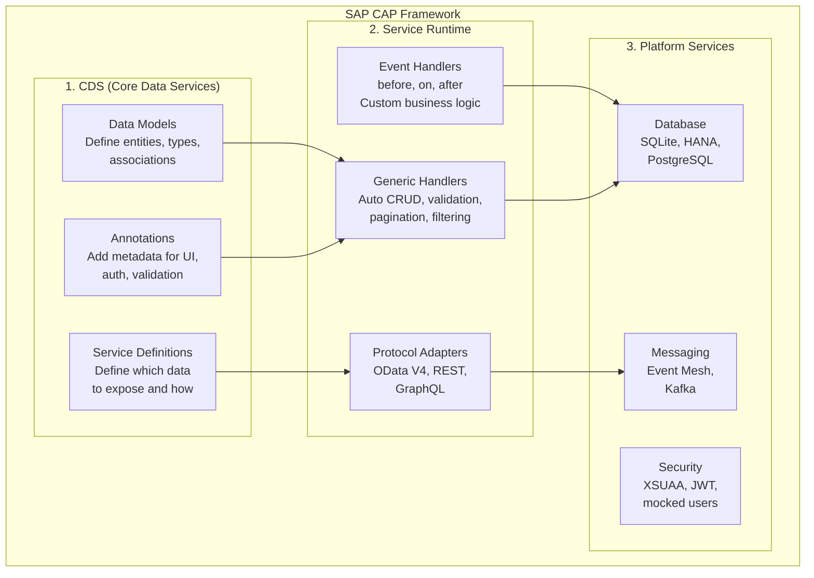
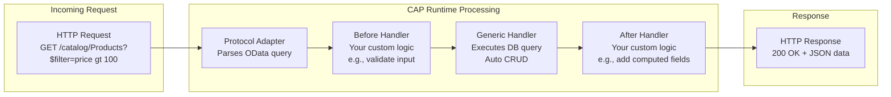

# Day 11: Introduction to SAP CAP Framework

---

## Day Schedule (8 Hours)

| Time | Session | Duration |
|------|---------|----------|
| 09:00 - 09:15 | Welcome to Week 3 & Week 2 Recap | 15 min |
| 09:15 - 10:30 | Session 1: Why CAP? Problems It Solves | 75 min |
| 10:30 - 10:45 | Break | 15 min |
| 10:45 - 12:00 | Session 2: CAP Architecture — CDS, Services & Runtime | 75 min |
| 12:00 - 13:00 | Session 3: Hands-on — Create Your First CAP Project | 60 min |
| 13:00 - 13:45 | Lunch Break | 45 min |
| 13:45 - 14:45 | Session 4: CAP Project Structure Deep-Dive | 60 min |
| 14:45 - 15:00 | Break | 15 min |
| 15:00 - 16:00 | Session 5: CDS Language Introduction & CAP vs RAP | 60 min |
| 16:00 - 16:45 | Session 6: Hands-on — Run cds watch & Compare with Express | 45 min |
| 16:45 - 17:00 | Assessment & Wrap-up | 15 min |

---

## What You'll Learn Today

By the end of this session, you will be able to:
- Explain WHY SAP CAP exists and what problems it solves
- Compare CAP with traditional Node.js/Express development
- Describe CAP architecture (CDS, Services, Runtime)
- Differentiate between CAP and RAP (ABAP-based approach)
- Create a CAP project from scratch using `cds init`
- Understand every file and folder in a CAP project
- Run a CAP app locally with `cds watch`
- Write your first CDS file

---

## Welcome to Week 3! (09:00 - 09:15)

### The Journey So Far

```
Week 1: SAP BTP Foundations (Cloud, Architecture, Tools)
Week 2: JavaScript & Node.js (Language + Express + REST APIs)
                    ↓
Week 3: NOW — SAP CAP Framework (The Main Event!) ⭐
```

### What Changes This Week

| Week 2 (What you did) | Week 3 (What CAP does for you) |
|----------------------|-------------------------------|
| Wrote 100+ lines for a REST API | CAP generates APIs from 5 lines of CDS |
| Manual routing with Express | Automatic OData endpoints |
| Manual database queries | Declarative data model → auto database |
| Manual input validation | Built-in validations |
| Manual authentication code | One annotation: `@requires: 'admin'` |
| Manual CRUD handlers | Generated automatically |

**Week 3 will feel like magic.** Everything you struggled with in Express.js — CAP does it in a few lines.

---

## Session 1: Why CAP? Problems It Solves (09:15 - 10:30)

### The Problem: Building Enterprise Apps Is HARD

Imagine you're building a Purchase Order app for a company. Here's what you need:

```
WITHOUT a framework (plain Node.js/Express):
─────────────────────────────────────────
✗ Design database schema (SQL)
✗ Write migration scripts
✗ Build REST/OData endpoints manually
✗ Implement CRUD for every entity
✗ Add input validation
✗ Add authentication (OAuth, JWT)
✗ Add authorization (roles, permissions)
✗ Handle draft/edit scenarios
✗ Add localization (multi-language)
✗ Add multi-tenancy (SaaS)
✗ Connect to SAP S/4HANA
✗ Deploy to Cloud Foundry
✗ Configure HANA database
✗ Build Fiori UI annotations

Effort: 3-6 months for a senior team
Lines of code: 10,000+
```

```
WITH SAP CAP:
─────────────
✓ Define data model in CDS (20 lines)
✓ Define service in CDS (10 lines)
✓ Add custom logic in JS (where needed)
✓ Everything else is AUTOMATIC!

Effort: 2-4 weeks
Lines of code: 500-1000
```

---

### What is SAP CAP?

**CAP** = **C**loud **A**pplication **P**rogramming Model

It's SAP's **opinionated framework** for building enterprise-grade cloud applications. Think of it as a "super-powered Express.js" designed specifically for business applications on SAP BTP.

```
CAP = CDS (define WHAT) + Runtime (does HOW) + Best Practices (knows WHY)
```

**Analogy:**
- Express.js = a blank canvas and paint (you decide everything)
- SAP CAP = a paint-by-numbers kit (structure is provided, you add creativity where needed)

---

### CAP's Core Philosophy

| Principle | What It Means | Benefit |
|-----------|-------------|---------|
| **Convention over Configuration** | Follow standard patterns, less setup | Less boilerplate, faster development |
| **Declarative over Imperative** | Describe WHAT you want, not HOW to do it | Shorter code, fewer bugs |
| **Focus on Domain** | Write business logic, not plumbing | Developer productivity |
| **Grow as You Go** | Start simple, add complexity only when needed | No over-engineering |
| **Open Standards** | Based on OData, SQL, REST, JSON | Interoperability |

---

### Problems CAP Solves

#### Problem 1: Repetitive CRUD Code

```javascript
// WITHOUT CAP — Express.js (you write ALL of this):
app.get('/products', async (req, res) => { /* query DB, format, return */ });
app.get('/products/:id', async (req, res) => { /* find one, 404 check, return */ });
app.post('/products', async (req, res) => { /* validate, insert, return 201 */ });
app.put('/products/:id', async (req, res) => { /* validate, update, return */ });
app.delete('/products/:id', async (req, res) => { /* find, delete, return */ });
// × 10 entities = 50 route handlers, 500+ lines of boilerplate!
```

```javascript
// WITH CAP — just define the service:
service CatalogService {
  entity Products as projection on db.Products;
}
// DONE! All CRUD endpoints generated automatically.
// GET, POST, PUT, PATCH, DELETE — all working!
```

#### Problem 2: Database Schema + Migration

```javascript
// WITHOUT CAP:
// - Write CREATE TABLE SQL
// - Write ALTER TABLE for changes
// - Track migrations
// - Handle SQLite (dev) vs HANA (prod) differences

// WITH CAP:
entity Products {
  key ID : UUID;
  name   : String(100);
  price  : Decimal(10,2);
  stock  : Integer;
}
// CAP generates SQL for SQLite (local) AND HANA (production) automatically!
```

#### Problem 3: Authentication & Authorization

```javascript
// WITHOUT CAP:
// - Configure XSUAA manually
// - Parse JWT tokens
// - Check roles in every route handler
// - Handle token refresh

// WITH CAP — one line:
service AdminService @(requires: 'admin') {
  entity Products as projection on db.Products;
}
// Done! Only users with 'admin' role can access this service.
```

#### Problem 4: Connecting to SAP Systems

```javascript
// WITHOUT CAP:
// - Download API spec from SAP API Hub
// - Write HTTP client code
// - Handle OAuth token flow
// - Map response data to your model
// - Handle errors, retries, timeouts

// WITH CAP:
// Just import the external service definition:
using { API_BUSINESS_PARTNER } from './external/API_BUSINESS_PARTNER';

service MyService {
  entity Suppliers as projection on API_BUSINESS_PARTNER.A_BusinessPartner;
}
// CAP handles authentication, connection, error handling!
```

---

### Who Uses CAP?

- SAP's own teams (internal product development)
- SAP Partners building extensions
- Enterprise customers building custom apps
- Any developer building on SAP BTP

**CAP is SAP's #1 recommended framework for ALL new development on BTP.**

---

### CAP vs Traditional Development

| Aspect | Plain Express.js | SAP CAP |
|--------|-----------------|---------|
| **Data Model** | Write SQL or ORM code | Declare in CDS (auto-generates DB) |
| **API Endpoints** | Write each route manually | Auto-generated from service definition |
| **Query Parameters** | Parse `req.query` manually | Built-in OData query support ($filter, $expand, $orderby) |
| **Database** | Pick one, write adapters | SQLite (dev) + HANA (prod), switches automatically |
| **Authentication** | Configure passport/JWT manually | Add `@requires` annotation |
| **Draft Handling** | Build complex edit-flow logic | Add `@odata.draft.enabled` annotation |
| **Localization** | Build i18n system | Built-in `.properties` file support |
| **Fiori UI** | Build from scratch | Auto-generated from annotations |
| **Deployment** | Write Dockerfile/mta manually | `cds add mta` generates everything |
| **Testing** | Configure Jest/Mocha | Built-in test utilities |
| **Learning Curve** | Low (but build everything yourself) | Medium (learn CDS, then fast development) |
| **Productivity** | Lower (more code) | Higher (less code, more automation) |
| **Enterprise Ready** | You make it enterprise-grade | Enterprise-grade out of the box |

---

### The "10x Developer" Effect

```
Task: Build a Product Catalog API with CRUD + filtering + sorting + pagination

Express.js:
├── server.js (30 lines)
├── routes/products.js (120 lines)
├── middleware/validate.js (40 lines)
├── db/schema.sql (20 lines)
├── db/connection.js (30 lines)
└── Total: ~240 lines, ~2 hours

SAP CAP:
├── db/schema.cds (8 lines)
├── srv/catalog.cds (3 lines)
└── Total: ~11 lines, ~5 minutes! 🤯
```

**CAP doesn't make you lazy — it makes you PRODUCTIVE.** You spend time on business logic, not plumbing.

---

### Discussion (5 minutes)

Think about the Product API you built on Day 10. How many lines of code did you write? How many of those were "business logic" vs "boilerplate" (routing, validation, error handling, parsing)?

---

## Session 2: CAP Architecture (10:45 - 12:00)

### The Three Pillars of CAP



---

### Pillar 1: CDS (Core Data Services)

**CDS** is a declarative language for defining:
- **Data models** (entities = tables)
- **Services** (APIs exposing data)
- **Annotations** (metadata for UI, security, validation)

```cds
// This is CDS — it's NOT JavaScript! It's its own simple language.

// Define data (like CREATE TABLE):
entity Products {
  key ID    : UUID;
  name      : String(100);
  price     : Decimal(10,2);
  stock     : Integer;
  category  : String(50);
}

// Define a service (like app.get/post/put/delete — but automatic!):
service CatalogService {
  entity Products as projection on Products;
}
```

**What CDS gives you from those 10 lines:**
- ✅ Database table created automatically
- ✅ GET /catalog/Products (with $filter, $orderby, $top, $skip, $expand)
- ✅ GET /catalog/Products(id) 
- ✅ POST /catalog/Products
- ✅ PUT /catalog/Products(id)
- ✅ PATCH /catalog/Products(id)
- ✅ DELETE /catalog/Products(id)
- ✅ OData $metadata document
- ✅ Input validation (types, required fields)

---

### Pillar 2: Service Runtime

The runtime is the "engine" that executes your application:



**Event Handlers** — where YOUR code goes:

```javascript
// srv/catalog.js — custom logic for CatalogService
module.exports = (srv) => {

  // BEFORE a create — validate business rules:
  srv.before('CREATE', 'Products', (req) => {
    if (req.data.price < 0) {
      req.error(400, 'Price cannot be negative');
    }
  });

  // AFTER a read — add computed fields:
  srv.after('READ', 'Products', (products) => {
    for (const p of products) {
      p.availability = p.stock > 0 ? 'In Stock' : 'Out of Stock';
    }
  });

  // Custom action:
  srv.on('submitOrder', async (req) => {
    const { productId, qty } = req.data;
    // your business logic here...
  });
};
```

---

### Pillar 3: Platform Services (Database, Security, Messaging)

CAP abstracts the platform — same code works with different backends:

```
Development (your laptop):
  Database: SQLite (file-based, zero config!)
  Auth: Mocked users (no real login needed)
  Server: localhost:4004

Production (SAP BTP):
  Database: SAP HANA Cloud
  Auth: XSUAA (real OAuth2)
  Server: Cloud Foundry

SAME CODE — Zero changes needed! CAP switches automatically based on environment.
```

| Dev (local) | Production (cloud) | What Switches |
|-------------|-------------------|---------------|
| SQLite | SAP HANA Cloud | Database engine |
| Mock users | XSUAA + IdP | Authentication |
| localhost:4004 | https://app.cfapps... | Server URL |
| npm start | cf push | Deployment method |
| Instant restart | Zero-downtime deploy | Update strategy |

---

### @sap/cds vs @sap/cds-dk — What's the Difference?

| Package | Purpose | When Installed | Contains |
|---------|---------|---------------|----------|
| **@sap/cds-dk** | Development Kit (CLI tools) | Globally: `npm i -g @sap/cds-dk` | `cds` CLI commands (init, watch, build, add) |
| **@sap/cds** | Runtime library | In project: auto-added by `cds init` | Core framework, handlers, DB connectors |

```
@sap/cds-dk → The TOOLBOX (you use it to build)
@sap/cds    → The ENGINE (runs inside your app)

Analogy:
  cds-dk = a carpenter's tools (saw, hammer, drill)
  cds    = the house built with those tools
```

---

### CAP Supported Databases

| Database | Use For | How to Enable |
|----------|---------|---------------|
| **SQLite** | Local development (default) | Comes out of the box! |
| **SAP HANA Cloud** | Production on BTP | `cds add hana` |
| **PostgreSQL** | Alternative production | `cds add postgres` |
| **H2 (Java)** | Java runtime development | Default for Java |

---

### CAP Supported Runtimes

| Runtime | Language | When to Use |
|---------|----------|-------------|
| **Node.js** | JavaScript/TypeScript | Default for most projects (our focus!) |
| **Java** | Java/Spring Boot | When team prefers Java |

**In this course: Node.js runtime only.**

---

## Session 3: Hands-on — Create Your First CAP Project (12:00 - 13:00)

### Step 1: Create the Project

```bash
# Navigate to your training folder:
cd ~/cap-training

# Create a new CAP project:
cds init my-first-cap

# Enter the project:
cd my-first-cap

# Open in VS Code:
code .
```

**What just happened?** `cds init` created a complete project structure with everything you need!

---

### Step 2: Explore What Was Created

```bash
# See the project structure:
ls -la
```

You should see:

```
my-first-cap/
├── app/              ← Frontend/UI code goes here (empty for now)
├── db/               ← Database models (CDS files) go here
├── srv/              ← Service definitions and logic go here
├── package.json      ← Project config (Node.js)
└── README.md         ← Project documentation
```

---

### Step 3: Look at package.json

```bash
cat package.json
```

```json
{
  "name": "my-first-cap",
  "version": "1.0.0",
  "description": "A simple CAP project.",
  "repository": "<Add your repository here>",
  "license": "UNLICENSED",
  "private": true,
  "dependencies": {
    "@sap/cds": "^7",
  },
  "devDependencies": {
    "@sap/cds-dk": "^7"
  },
  "scripts": {
    "start": "cds-serve",
    "watch": "cds watch"
  }
}
```

**Key observations:**
- `@sap/cds` is a dependency (the runtime)
- `@sap/cds-dk` is a devDependency (development tools)
- Scripts: `start` for production, `watch` for development

---

### Step 4: Install Dependencies

```bash
npm install
```

This downloads `@sap/cds`, `express`, and all their sub-dependencies into `node_modules/`.

---

### Step 5: Create Your First Data Model

Create a new file `db/schema.cds`:

```cds
namespace my.bookshop;

entity Books {
  key ID    : Integer;
  title     : String(100);
  author    : String(100);
  price     : Decimal(10,2);
  stock     : Integer;
  category  : String(50);
}

entity Authors {
  key ID    : Integer;
  name      : String(100);
  country   : String(50);
}
```

---

### Step 6: Create Your First Service

Create a new file `srv/catalog-service.cds`:

```cds
using my.bookshop from '../db/schema';

service CatalogService {
  entity Books as projection on bookshop.Books;
  entity Authors as projection on bookshop.Authors;
}
```

**That's it! Three lines to create a full REST API with CRUD for Books and Authors!**

---

### Step 7: Add Sample Data

Create a file `db/data/my.bookshop-Books.csv`:

```csv
ID;title;author;price;stock;category
1;Clean Code;Robert Martin;450;20;Programming
2;The Pragmatic Programmer;David Thomas;550;15;Programming
3;Sapiens;Yuval Noah Harari;400;30;History
4;Atomic Habits;James Clear;350;50;Self-Help
5;Node.js Design Patterns;Mario Casciaro;600;10;Programming
```

Create a file `db/data/my.bookshop-Authors.csv`:

```csv
ID;name;country
1;Robert Martin;USA
2;David Thomas;USA
3;Yuval Noah Harari;Israel
4;James Clear;USA
5;Mario Casciaro;Italy
```

**Naming convention:** `<namespace>-<EntityName>.csv` — CAP auto-loads these!

---

### Step 8: Run It!

```bash
cds watch
```

**Expected output:**

```
[cds] - loaded model from 2 file(s):

  srv/catalog-service.cds
  db/schema.cds

[cds] - connect to db > sqlite { database: ':memory:' }
  > init from db/data/my.bookshop-Books.csv
  > init from db/data/my.bookshop-Authors.csv
[cds] - serving CatalogService { path: '/catalog' }

[cds] - server listening on { url: 'http://localhost:4004' }
[cds] - [ terminate with ^C ]
```

---

### Step 9: Test It!

Open your browser: **http://localhost:4004**

You'll see a welcome page listing available services and entities:

```
Welcome to cds.services

Service Endpoints:
  /catalog - CatalogService
    /catalog/Books
    /catalog/Authors
```

**Try these URLs:**

| URL | What It Returns |
|-----|----------------|
| `http://localhost:4004/odata/v4/catalog/Books` | All books (JSON) |
| `http://localhost:4004/odata/v4/catalog/Books?$filter=price gt 400` | Books over ₹400 |
| `http://localhost:4004/odata/v4/catalog/Books?$orderby=price desc` | Sorted by price |
| `http://localhost:4004/odata/v4/catalog/Books?$top=3` | First 3 books |
| `http://localhost:4004/odata/v4/catalog/Books?$select=title,price` | Only title and price |
| `http://localhost:4004/odata/v4/catalog/Authors` | All authors |
| `http://localhost:4004/odata/v4/catalog/$metadata` | OData metadata (XML) |

**All of this from ~15 lines of CDS code!** No Express routes, no SQL queries, no manual parsing.

---

### Step 10: Test with REST Client

Create `test.http` in your project root:

```http
### Get all books
GET http://localhost:4004/catalog/Books

### Get books filtered by category
GET http://localhost:4004/catalog/Books?$filter=category eq 'Programming'

### Get a specific book
GET http://localhost:4004/catalog/Books(1)

### Create a new book
POST http://localhost:4004/catalog/Books
Content-Type: application/json

{
  "ID": 6,
  "title": "Learning SAP CAP",
  "author": "SAP Team",
  "price": 800,
  "stock": 100,
  "category": "Programming"
}

### Update a book
PATCH http://localhost:4004/catalog/Books(1)
Content-Type: application/json

{
  "price": 499,
  "stock": 25
}

### Delete a book
DELETE http://localhost:4004/catalog/Books(6)

### Get all authors
GET http://localhost:4004/catalog/Authors
```

Click "Send Request" on each — they ALL work!

---

## Session 4: CAP Project Structure Deep-Dive (13:45 - 14:45)

### Complete CAP Project Structure

```
my-cap-project/
│
├── app/                          ← FRONTEND (UI Layer)
│   └── (Fiori apps go here)     
│
├── db/                           ← DATABASE (Data Layer)
│   ├── schema.cds               ← Data model definitions
│   └── data/                    ← CSV files for initial/test data
│       ├── my.bookshop-Books.csv
│       └── my.bookshop-Authors.cs
│
├── srv/                          ← SERVICES (Service Layer)
│   ├── catalog-service.cds      ← Service definition (what to expose)
│   └── catalog-service.js       ← Custom logic (event handlers)
│
├── node_modules/                 ← Installed packages (auto-generated)
├── package.json                  ← Project configuration
├── package-lock.json             ← Locked dependency versions
└── README.md                     ← Documentation
```

---

### Folder-by-Folder Explanation

#### `db/` — The Data Layer

```
What goes here: Data model definitions (entities, types, associations)
File type: .cds files
Think of it as: The DATABASE BLUEPRINT

db/
├── schema.cds          ← Your entities (like CREATE TABLE)
└── data/               ← CSV files (like INSERT INTO)
    ├── Books.csv
    └── Authors.csv
```

**Key rules:**
- One `schema.cds` (or split into multiple .cds files)
- CSV file names must match: `<namespace>-<Entity>.csv`
- CSV separator is `;` (semicolon), not comma!
- Data is loaded automatically when `cds watch` starts

---

#### `srv/` — The Service Layer

```
What goes here: Service definitions + custom business logic
File types: .cds (definition) + .js (handlers)
Think of it as: The API LAYER

srv/
├── catalog-service.cds    ← WHAT to expose (entities, actions)
└── catalog-service.js     ← HOW to customize (event handlers)
```

**Naming convention:** If your service file is `catalog-service.cds`, the custom handler file must be `catalog-service.js` (same name, different extension). CAP links them automatically!

---

#### `app/` — The Frontend Layer

```
What goes here: UI applications (Fiori Elements, SAPUI5)
Think of it as: What USERS see and interact with

app/
└── (We'll add Fiori apps in Week 5)
```

For now, this folder stays empty. CAP works perfectly without a frontend (API-first approach).

---

#### `package.json` — Project Configuration

Key CAP-specific settings:

```json
{
  "cds": {
    "requires": {
      "db": {
        "kind": "sql"
      }
    }
  }
}
```

The `"cds"` section is where CAP-specific config goes (database type, auth mode, etc.). We'll add more settings as we progress.

---

### The MVC Pattern in CAP

CAP follows a layered architecture similar to MVC:

```
┌─────────────────────────────────────────┐
│  app/  (View — UI/Frontend)             │  ← Week 5
├─────────────────────────────────────────┤
│  srv/  (Controller — Services/Logic)    │  ← Week 3-4
├─────────────────────────────────────────┤
│  db/   (Model — Data/Database)          │  ← Week 3
└─────────────────────────────────────────┘
```

| Layer | Folder | Responsibility |
|-------|--------|---------------|
| **Model** | `db/` | Define data structure (entities, associations) |
| **Controller** | `srv/` | Define APIs and business logic |
| **View** | `app/` | Define UI (Fiori annotations) |

---

## Session 5: CDS Language Introduction & CAP vs RAP (15:00 - 16:00)

### CDS — A Quick Tour

CDS (Core Data Services) is CAP's declarative language. It's simple, readable, and powerful.

#### Defining Entities (Tables)

```cds
entity Products {
  key ID   : UUID;           // Primary key (auto-generated UUID)
  name     : String(100);    // VARCHAR(100)
  price    : Decimal(10,2);  // DECIMAL with precision
  stock    : Integer;        // INT
  active   : Boolean;        // BOOLEAN
  created  : DateTime;       // TIMESTAMP
}
```

#### CDS Data Types

| CDS Type | SQL Equivalent | Example |
|----------|---------------|---------|
| `String(n)` | VARCHAR(n) | Names, descriptions |
| `Integer` | INT | Counts, quantities |
| `Decimal(p,s)` | DECIMAL(p,s) | Prices, amounts |
| `Boolean` | BOOLEAN | Flags (true/false) |
| `Date` | DATE | Dates without time |
| `DateTime` | TIMESTAMP | Date + time |
| `UUID` | NVARCHAR(36) | Unique identifiers |
| `LargeString` | CLOB | Long text |
| `LargeBinary` | BLOB | Files, images |

#### Defining Services

```cds
service CatalogService {
  // Expose entity as-is:
  entity Products as projection on db.Products;
  
  // Expose with restrictions (read-only):
  @readonly entity Categories as projection on db.Categories;
  
  // Expose with field selection:
  entity ProductList as projection on db.Products {
    ID, name, price  // Only these 3 fields exposed
  };
}
```

#### Namespaces

```cds
namespace my.company.project;

// Now all entities are under this namespace:
// Full name: my.company.project.Products
entity Products { ... }
entity Orders { ... }
```

---

### CAP vs RAP (RESTful ABAP Programming)

SAP has TWO programming models for building apps on BTP:

| Aspect | CAP (our focus) | RAP (ABAP-based) |
|--------|----------------|-------------------|
| **Language** | JavaScript/TypeScript (Node.js) or Java | ABAP |
| **Data Model** | CDS (CAP flavor) | CDS (ABAP flavor) |
| **Runtime** | Cloud Foundry (Node.js/Java) | ABAP Environment |
| **Database** | HANA, SQLite, PostgreSQL | HANA only |
| **Target Developers** | Full-stack, web developers | ABAP developers |
| **Best For** | Side-by-side extensions, new apps | S/4HANA in-app extensions |
| **UI** | Fiori Elements (annotations) | Fiori Elements (annotations) |
| **Open Source** | Mostly open | SAP proprietary |
| **Learning Curve** | Lower (JS/web developers) | Higher (ABAP knowledge needed) |
| **Community** | Large (npm, GitHub) | SAP-specific |

```
When to use CAP:
✓ Building NEW apps on BTP
✓ Side-by-side extensions
✓ Team knows JavaScript/Java
✓ Need multi-database support
✓ Want rapid prototyping

When to use RAP:
✓ Extending S/4HANA IN-SYSTEM
✓ Team knows ABAP
✓ Need tight S/4HANA integration
✓ Working in ABAP Environment
```

**For this course:** We focus entirely on CAP (Node.js). It's the most versatile and widely applicable approach.

---

### CDS in CAP vs CDS in ABAP — Same Name, Different Dialects

```
CDS in CAP:                          CDS in ABAP:
─────────────                        ─────────────
entity Products {                    define entity Products {
  key ID : UUID;                       key ID : abap.numc(10);
  name   : String(100);                name   : abap.char(100);
}                                    }

CAP CDS → generates SQL              ABAP CDS → generates HANA views
CAP CDS → simpler syntax             ABAP CDS → more verbose
CAP CDS → runs on Node.js/Java       ABAP CDS → runs on ABAP stack
```

Both use "CDS" in the name, but they're different dialects. Don't confuse them!

---

## Session 6: Hands-on — Run cds watch & Compare with Express (16:00 - 16:45)

### Compare: CAP vs Express for Same Feature

Let's compare building the SAME book catalog in Express vs CAP:

#### Express.js Version (from Day 10) — ~80 lines:

```javascript
const express = require('express');
const app = express();
app.use(express.json());

let books = [
  { id: 1, title: "Clean Code", author: "Robert Martin", price: 450, stock: 20 }
  // ...
];

app.get('/books', (req, res) => {
  let result = [...books];
  if (req.query.category) result = result.filter(b => b.category === req.query.category);
  if (req.query.sort) result.sort((a,b) => a[req.query.sort] - b[req.query.sort]);
  res.json({ count: result.length, data: result });
});

app.get('/books/:id', (req, res) => {
  const book = books.find(b => b.id === parseInt(req.params.id));
  if (!book) return res.status(404).json({ error: "Not found" });
  res.json(book);
});

app.post('/books', (req, res) => {
  const { title, author, price, stock } = req.body;
  if (!title || !author) return res.status(400).json({ error: "Title and author required" });
  const book = { id: books.length + 1, title, author, price, stock };
  books.push(book);
  res.status(201).json(book);
});

// ... PUT, PATCH, DELETE (another 40+ lines)

app.listen(3000);
```

#### CAP Version — ~15 lines total:

**db/schema.cds:**
```cds
namespace my.bookshop;

entity Books {
  key ID    : Integer;
  title     : String(100);
  author    : String(100);
  price     : Decimal(10,2);
  stock     : Integer;
  category  : String(50);
}
```

**srv/catalog-service.cds:**
```cds
using my.bookshop from '../db/schema';
service CatalogService {
  entity Books as projection on bookshop.Books;
}
```

**Run:** `cds watch` → Everything works! Filtering, sorting, pagination, CRUD — ALL included.

---

### What CAP Gives You FREE (that you had to code manually):

| Feature | Express (you code it) | CAP (free!) |
|---------|----------------------|-------------|
| GET all | ✍️ Write handler | ✅ Automatic |
| GET by ID | ✍️ Write handler + 404 | ✅ Automatic |
| POST create | ✍️ Write handler + validate | ✅ Automatic |
| PUT update | ✍️ Write handler | ✅ Automatic |
| DELETE | ✍️ Write handler + 404 | ✅ Automatic |
| $filter | ✍️ Parse query, write logic | ✅ Automatic |
| $orderby | ✍️ Sort logic | ✅ Automatic |
| $top / $skip | ✍️ Pagination logic | ✅ Automatic |
| $select | ✍️ Field projection | ✅ Automatic |
| $count | ✍️ Count query | ✅ Automatic |
| $metadata | ❌ Not available | ✅ Automatic (OData) |
| Type validation | ✍️ Manual checks | ✅ Automatic (from CDS types) |

---

### Hands-on Challenge: Extend Your CAP App (10 minutes)

Add a new entity `Reviews` to your bookshop:

1. Add to `db/schema.cds`:
```cds
entity Reviews {
  key ID    : Integer;
  bookId   : Integer;
  reviewer : String(100);
  rating   : Integer;
  comment  : String(500);
}
```

2. Expose in `srv/catalog-service.cds`:
```cds
service CatalogService {
  entity Books as projection on bookshop.Books;
  entity Authors as projection on bookshop.Authors;
  entity Reviews as projection on bookshop.Reviews;
}
```

3. Save both files — `cds watch` auto-restarts!

4. Test: `http://localhost:4004/catalog/Reviews` — new endpoint instantly available!

5. Create a review:
```http
POST http://localhost:4004/catalog/Reviews
Content-Type: application/json

{
  "ID": 1,
  "bookId": 1,
  "reviewer": "Priya",
  "rating": 5,
  "comment": "Excellent book on clean coding practices!"
}
```

**You just added a new entity to your API in under 2 minutes!**

---

## Assessment: MCQ (15 Questions)

**Q1.** CAP stands for:
- a) Cloud API Platform
- b) Cloud Application Programming Model
- c) Core Application Protocol
- d) Central Access Point

**Answer: b)** — Cloud Application Programming Model — SAP's framework for building enterprise cloud apps.

---

**Q2.** The main problem CAP solves is:
- a) Making JavaScript faster
- b) Eliminating repetitive boilerplate code for enterprise apps (CRUD, auth, DB handling)
- c) Replacing HTML and CSS
- d) Making SAP products cheaper

**Answer: b)** — CAP automates the plumbing (routing, DB, auth, validation) so you focus on business logic.

---

**Q3.** CDS in CAP is:
- a) A JavaScript library
- b) A declarative language for defining data models, services, and annotations
- c) A CSS framework
- d) A database server

**Answer: b)** — CDS (Core Data Services) is CAP's own declarative language, separate from JavaScript.

---

**Q4.** `cds init my-project` creates:
- a) A Docker container
- b) A complete CAP project structure with app/, db/, srv/ folders and package.json
- c) A database table
- d) A GitHub repository

**Answer: b)** — Scaffolds the standard CAP project structure ready for development.

---

**Q5.** `cds watch` does:
- a) Monitors your BTP account
- b) Starts a local dev server with auto-reload when files change
- c) Deploys to production
- d) Watches GitHub for changes

**Answer: b)** — Starts localhost:4004 and auto-restarts when you save any CDS or JS file.

---

**Q6.** In a CAP project, data models (entities) go in:
- a) `app/` folder
- b) `srv/` folder
- c) `db/` folder
- d) `node_modules/` folder

**Answer: c)** — `db/` contains schema.cds (data models) and data/ (CSV sample data).

---

**Q7.** In a CAP project, service definitions go in:
- a) `app/` folder
- b) `srv/` folder
- c) `db/` folder
- d) `package.json`

**Answer: b)** — `srv/` contains service CDS files (what to expose) and JS files (custom logic).

---

**Q8.** What database does CAP use locally during development?
- a) SAP HANA
- b) MongoDB
- c) SQLite (in-memory or file-based)
- d) Oracle

**Answer: c)** — SQLite by default for local dev. Zero setup needed. HANA is used in production.

---

**Q9.** The difference between `@sap/cds` and `@sap/cds-dk` is:
- a) They're the same package
- b) `cds-dk` is CLI tools (global); `cds` is the runtime library (in your project)
- c) `cds` is for frontend; `cds-dk` is for backend
- d) `cds-dk` is the paid version

**Answer: b)** — cds-dk = development kit (tools), cds = runtime engine (runs in your app).

---

**Q10.** CAP generates REST APIs automatically because:
- a) It reads your Express route files
- b) It interprets CDS service definitions and generates OData endpoints for exposed entities
- c) It connects to a remote API generator
- d) It copies code from templates

**Answer: b)** — From a CDS service definition, CAP auto-generates full CRUD OData/REST endpoints.

---

**Q11.** CSV data files in CAP must be named:
- a) Any name with .csv extension
- b) `<namespace>-<EntityName>.csv` matching the CDS entity
- c) `data.csv`
- d) Same as the service name

**Answer: b)** — Example: `my.bookshop-Books.csv` for entity `my.bookshop.Books`. CAP auto-loads matching files.

---

**Q12.** CAP vs RAP — CAP is best for:
- a) Modifying S/4HANA core code
- b) Building new side-by-side apps on BTP using JavaScript or Java
- c) Writing ABAP programs
- d) Managing SAP licenses

**Answer: b)** — CAP is for building NEW apps on BTP. RAP is for extending S/4HANA in-system using ABAP.

---

**Q13.** `entity Books as projection on bookshop.Books` means:
- a) Delete the Books entity
- b) Expose the Books entity through this service (create API endpoints for it)
- c) Create a copy of the database
- d) Import Books from another service

**Answer: b)** — A projection exposes an entity through the service, making it accessible via API endpoints.

---

**Q14.** When you save a file with `cds watch` running:
- a) Nothing happens until you restart manually
- b) The server automatically restarts and reflects your changes
- c) It deploys to BTP
- d) It creates a git commit

**Answer: b)** — cds watch detects file changes and auto-restarts the local server instantly.

---

**Q15.** CAP is built on top of:
- a) Django and Python
- b) Express.js (for Node.js runtime)
- c) Ruby on Rails
- d) Apache Tomcat only

**Answer: b)** — CAP's Node.js runtime uses Express.js under the hood. Your Express.js knowledge from Week 2 applies!

---

## Assignment: Document CAP Project Structure

### Due: Start of Day 12

Create a document (Markdown or PDF) that explains the CAP project you created today.

**Include:**

1. **Screenshot** of your running `cds watch` terminal output
2. **Screenshot** of the browser showing `http://localhost:4004`
3. **For each file/folder**, write 2-3 sentences explaining:
   - What it contains
   - Why it exists
   - When you'd modify it

| File/Folder | Your Explanation |
|-------------|-----------------|
| `app/` | |
| `db/schema.cds` | |
| `db/data/` | |
| `srv/catalog-service.cds` | |
| `srv/catalog-service.js` (future) | |
| `package.json` | |
| `node_modules/` | |
| `.gitignore` (create one!) | |

4. **Comparison table:** Write 5 differences you observed between your Express.js API (Day 10) and today's CAP app
5. **Reflection:** In 3 sentences — what surprised you most about CAP?

---

## Key Takeaways

| # | Topic | One-Line Summary |
|---|---|---|
| 1 | CAP | SAP's framework for building enterprise cloud apps with minimal code |
| 2 | CDS | Declarative language for defining data models, services, and annotations |
| 3 | Convention over Config | Follow patterns, write less boilerplate |
| 4 | `cds init` | Creates a complete CAP project structure |
| 5 | `cds watch` | Starts local server with auto-reload (localhost:4004) |
| 6 | `db/` folder | Data models (schema.cds) and sample data (CSV) |
| 7 | `srv/` folder | Service definitions (.cds) and custom logic (.js) |
| 8 | `app/` folder | Frontend/UI (Fiori apps) — empty until Week 5 |
| 9 | Auto CRUD | Define entity in CDS → get full CRUD API automatically |
| 10 | SQLite + HANA | SQLite for dev (zero setup), HANA for production (same code!) |
| 11 | @sap/cds-dk | CLI tools (init, watch, build) — installed globally |
| 12 | @sap/cds | Runtime library — installed in each project |
| 13 | CAP vs RAP | CAP = JS/Java + BTP; RAP = ABAP + S/4HANA |
| 14 | Projection | `entity X as projection on Y` = expose Y through the service |
| 15 | CSV naming | `<namespace>-<Entity>.csv` — auto-loaded by CAP |

---

## Preparation for Day 12

Tomorrow: **CDS Data Modeling Part 1 — Entities & Types**

You'll learn:
- CDS syntax in depth
- All data types
- Keys and auto-generated values (UUID)
- Namespaces
- Reusable types with `type` keyword
- Enums
- Deploy to SQLite and inspect tables

**To prepare:**
- Make sure `cds watch` runs successfully on your project
- Practice adding/modifying entities and watching the server reload
- Explore different OData query options ($filter, $orderby, $top, $select)

---

*End of Day 11 — Welcome to the world of SAP CAP!* 🚀
