# Day 2: SAP BTP Architecture & Cloud Foundry

---

## Day Schedule (8 Hours)

| Time | Session | Duration |
|------|---------|----------|
| 09:00 - 09:15 | Recap of Day 1 & Q&A | 15 min |
| 09:15 - 10:30 | Session 1: SAP BTP Architecture Deep-Dive | 75 min |
| 10:30 - 10:45 | Break | 15 min |
| 10:45 - 12:00 | Session 2: Multi-Cloud Strategy & Regions | 75 min |
| 12:00 - 12:45 | Lunch Break | 45 min |
| 12:45 - 14:00 | Session 3: Cloud Foundry — What, Why & Architecture | 75 min |
| 14:00 - 14:15 | Break | 15 min |
| 14:15 - 15:30 | Session 4: Buildpacks, Containers & Diego | 75 min |
| 15:30 - 16:30 | Session 5: Hands-on Exploration & Whiteboard Exercises | 60 min |
| 16:30 - 17:00 | Session 6: Assessment, Group Quiz & Wrap-up | 30 min |

---

## What You'll Learn Today

By the end of this session, you will be able to:
- Draw and explain the SAP BTP architecture from memory
- Explain SAP's multi-cloud strategy and why it matters
- Describe what Cloud Foundry is and how it works internally
- Compare Cloud Foundry, Kyma, and ABAP Environment
- Explain Buildpacks, Containers, and the Diego orchestrator
- Understand Regions and Availability Zones for high availability

---

## Day 1 Recap — Quick Fire Round (09:00 - 09:15)

Answer these in your head (or shout them out!):

1. What are the 3 cloud service models? → _____, _____, _____
2. SAP BTP is which service model? → _____
3. What does "Clean Core" mean? → _____
4. Name 2 SAP products besides S/4HANA → _____, _____
5. What framework will we use to build apps? → _____

<details>
<summary>Answers</summary>

1. IaaS, PaaS, SaaS
2. PaaS (Platform as a Service)
3. Keep S/4HANA standard, build extensions on BTP
4. SuccessFactors, Ariba, Concur, CX (any two)
5. SAP CAP (Cloud Application Programming Model)

</details>

---

## Session 1: SAP BTP Architecture Deep-Dive (09:15 - 10:30)

### The Big Picture — What Makes Up SAP BTP?

SAP BTP is not a single product — it's a **collection of services, runtimes, and tools** working together on cloud infrastructure.

Think of it like a **shopping mall:**
- The **mall building** = Cloud infrastructure (AWS/Azure/GCP)
- The **floors** = Different service categories
- The **shops** = Individual services (HANA, XSUAA, etc.)
- The **escalators/elevators** = APIs connecting everything
- The **security guards** = Authentication & authorization
- **You** = A developer building a shop (application) in this mall

---

### SAP BTP Architecture — Layer by Layer

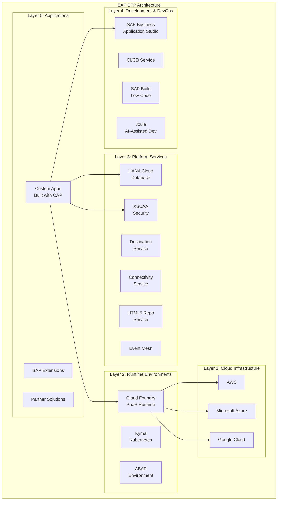
```mermaid
graph TB
    subgraph "SAP BTP Architecture"
        subgraph "Layer 5: Applications"
            A1[Custom Apps<br/>Built with CAP]
            A2[SAP Extensions]
            A3[Partner Solutions]
        end

        subgraph "Layer 4: Development & DevOps"
            D1[SAP Business<br/>Application Studio]
            D2[CI/CD Service]
            D3[SAP Build<br/>Low-Code]
            D4[Joule<br/>AI-Assisted Dev]
        end

        subgraph "Layer 3: Platform Services"
            S1[HANA Cloud<br/>Database]
            S2[XSUAA<br/>Security]
            S3[Destination<br/>Service]
            S4[Connectivity<br/>Service]
            S5[HTML5 Repo<br/>Service]
            S6[Event Mesh]
        end

        subgraph "Layer 2: Runtime Environments"
            R1[Cloud Foundry<br/>PaaS Runtime]
            R2[Kyma<br/>Kubernetes]
            R3[ABAP<br/>Environment]
        end

        subgraph "Layer 1: Cloud Infrastructure"
            I1[AWS]
            I2[Microsoft Azure]
            I3[Google Cloud]
        end
    end

    A1 --> D1
    A1 --> S1
    A1 --> S2
    A1 --> R1
    R1 --> I1
    R1 --> I2
    R1 --> I3
```

---

### Layer-by-Layer Explanation

#### Layer 1: Cloud Infrastructure (The Foundation)

This is the **physical hardware** — servers in data centers around the world.

| Provider | Role in SAP BTP | Data Centers |
|----------|----------------|--------------|
| **AWS** | Hosts BTP services in multiple regions | US, EU, Asia, etc. |
| **Microsoft Azure** | Alternative infrastructure provider | US, EU, Asia, etc. |
| **Google Cloud** | Third option for infrastructure | US, EU, Asia, etc. |

**Key Point:** SAP doesn't own these data centers! They RENT infrastructure from AWS/Azure/GCP and build their platform on top.

```
Real World Analogy:
- AWS/Azure/GCP = Land owners (provide the plot)
- SAP BTP = Builder (builds the mall on the plot)
- You = Tenant (open your shop in the mall)
```

---

#### Layer 2: Runtime Environments (Where Your Code Runs)

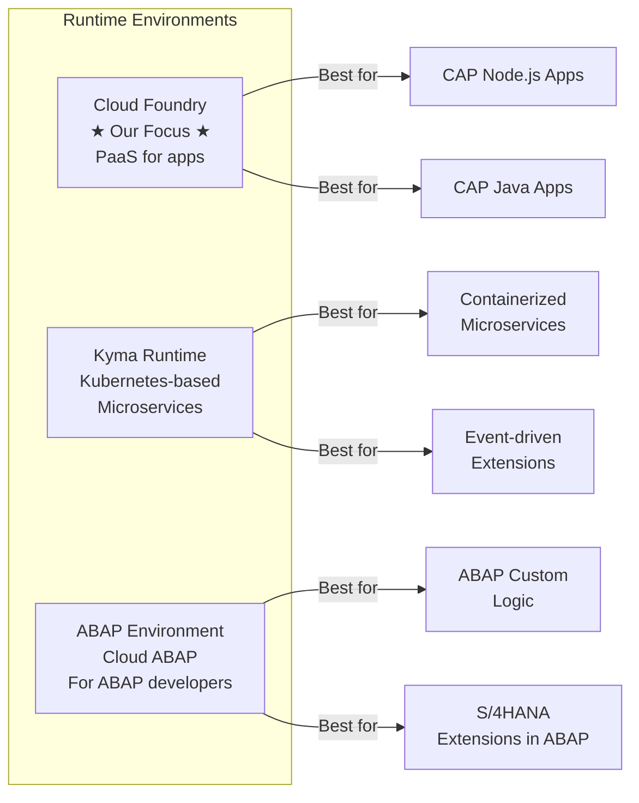
```mermaid
graph LR
    subgraph "Runtime Environments"
        CF[Cloud Foundry<br/>★ Our Focus ★<br/>PaaS for apps]
        KY[Kyma Runtime<br/>Kubernetes-based<br/>Microservices]
        AB[ABAP Environment<br/>Cloud ABAP<br/>For ABAP developers]
    end

    CF -->|Best for| N1[CAP Node.js Apps]
    CF -->|Best for| N2[CAP Java Apps]
    KY -->|Best for| N3[Containerized<br/>Microservices]
    KY -->|Best for| N4[Event-driven<br/>Extensions]
    AB -->|Best for| N5[ABAP Custom<br/>Logic]
    AB -->|Best for| N6[S/4HANA<br/>Extensions in ABAP]
```

| Runtime | Technology | Best For | We'll Use? |
|---------|-----------|----------|------------|
| **Cloud Foundry** | PaaS (buildpacks) | CAP apps, standard web apps | ✅ YES |
| **Kyma** | Kubernetes (containers) | Microservices, event-driven apps | ❌ Not in this course |
| **ABAP Environment** | SAP ABAP server | ABAP developers, S/4HANA extensions | ❌ Not in this course |

**Why Cloud Foundry for us?**
- Simplest deployment model (just push your code!)
- Perfect for CAP Node.js applications
- No need to understand containers/Kubernetes yet
- SAP's most mature runtime for business apps

---

#### Layer 3: Platform Services (The Building Blocks)

These are **ready-to-use services** that your application can consume:

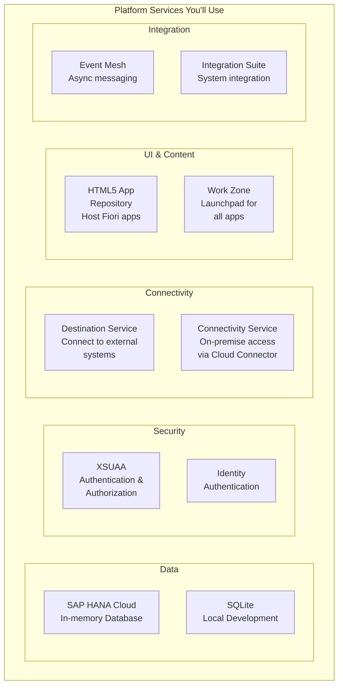
```mermaid
graph TB
    subgraph "Platform Services You'll Use"
        subgraph "Data"
            HC[SAP HANA Cloud<br/>In-memory Database]
            SQ[SQLite<br/>Local Development]
        end

        subgraph "Security"
            XS[XSUAA<br/>Authentication &<br/>Authorization]
            IA[Identity<br/>Authentication]
        end

        subgraph "Connectivity"
            DS[Destination Service<br/>Connect to external<br/>systems]
            CS[Connectivity Service<br/>On-premise access<br/>via Cloud Connector]
        end

        subgraph "UI & Content"
            H5[HTML5 App<br/>Repository<br/>Host Fiori apps]
            WZ[Work Zone<br/>Launchpad for<br/>all apps]
        end

        subgraph "Integration"
            EM[Event Mesh<br/>Async messaging]
            IS[Integration Suite<br/>System integration]
        end
    end
```

| Service | What It Does | When You'll Learn It |
|---------|-------------|---------------------|
| **SAP HANA Cloud** | Production database (super-fast, in-memory) | Week 6 (Day 27-28) |
| **XSUAA** | Handles login, roles, permissions | Week 6 (Day 29-30) |
| **Destination Service** | Stores connection details to other systems | Week 7 (Day 34) |
| **Connectivity Service** | Connects cloud to on-premise systems | Week 8 (Day 36-37) |
| **HTML5 App Repository** | Hosts your Fiori UI apps (serverless) | Week 7 (Day 34) |
| **SAP Build Work Zone** | Enterprise portal/launchpad | Week 7 (Day 35) |

---

#### Layer 4: Development Tools

| Tool | What It Is | Analogy |
|------|-----------|---------|
| **SAP Business Application Studio (BAS)** | Cloud-based IDE (code editor) | VS Code in the cloud |
| **SAP Build** | Low-code/no-code development | Drag-and-drop app builder |
| **SAP Joule** | AI assistant for development | ChatGPT for SAP coding |
| **CI/CD Service** | Automated testing & deployment | Auto-pilot for your code |

---

#### Layer 5: Applications (What You Build!)

This is where YOUR applications live — the CAP apps we'll build in this course!

```
Your CAP Application:
+------------------------------------------+
|  Fiori UI (Frontend)                     |  ← Week 5
+------------------------------------------+
|  CAP Service Layer (Business Logic)      |  ← Week 3-4
+------------------------------------------+
|  CDS Data Model (Database Schema)        |  ← Week 3
+------------------------------------------+
         |
         | Deployed to Cloud Foundry (Layer 2)
         | Uses HANA Cloud, XSUAA (Layer 3)
         | Runs on AWS/Azure/GCP (Layer 1)
```

---

### SAP BTP Account Hierarchy — Detailed View

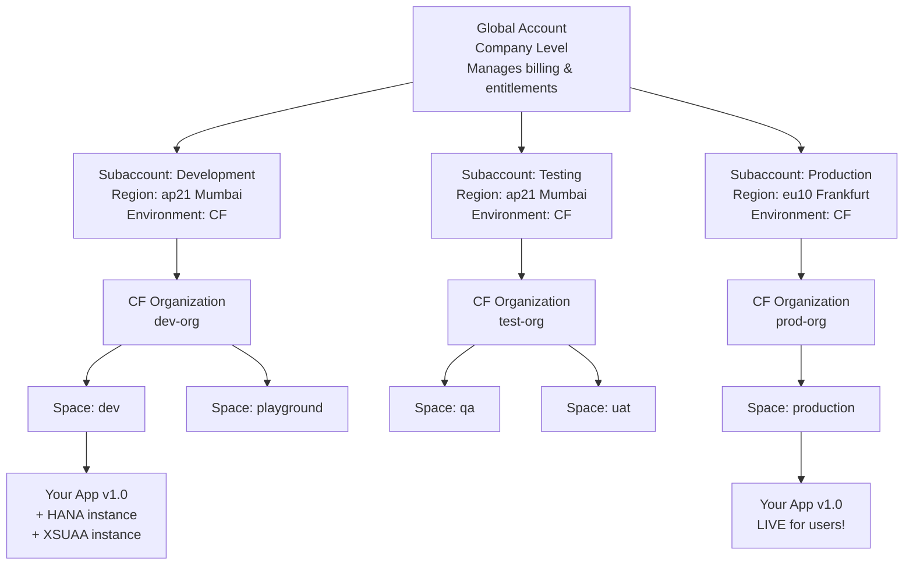
```mermaid
graph TB
    GA[Global Account<br/>Company Level<br/>Manages billing & entitlements]

    GA --> SA1[Subaccount: Development<br/>Region: ap21 Mumbai<br/>Environment: CF]
    GA --> SA2[Subaccount: Testing<br/>Region: ap21 Mumbai<br/>Environment: CF]
    GA --> SA3[Subaccount: Production<br/>Region: eu10 Frankfurt<br/>Environment: CF]

    SA1 --> ORG1[CF Organization<br/>dev-org]
    SA2 --> ORG2[CF Organization<br/>test-org]
    SA3 --> ORG3[CF Organization<br/>prod-org]

    ORG1 --> SP1[Space: dev]
    ORG1 --> SP2[Space: playground]
    ORG2 --> SP3[Space: qa]
    ORG2 --> SP4[Space: uat]
    ORG3 --> SP5[Space: production]

    SP1 --> APP1[Your App v1.0<br/>+ HANA instance<br/>+ XSUAA instance]
    SP5 --> APP2[Your App v1.0<br/>LIVE for users!]
```

#### Hierarchy Explained

| Level | What It Is | Who Manages | Real-World Analogy |
|-------|-----------|-------------|-------------------|
| **Global Account** | Top-level container | SAP Admin / IT Lead | The entire office building |
| **Subaccount** | Isolated environment in a specific region | Team Lead | A floor in the building |
| **Organization** | Cloud Foundry grouping | DevOps team | A department on the floor |
| **Space** | Where apps actually run | Developers | A specific room/desk |

---

### Entitlements & Quotas — Who Gets What?

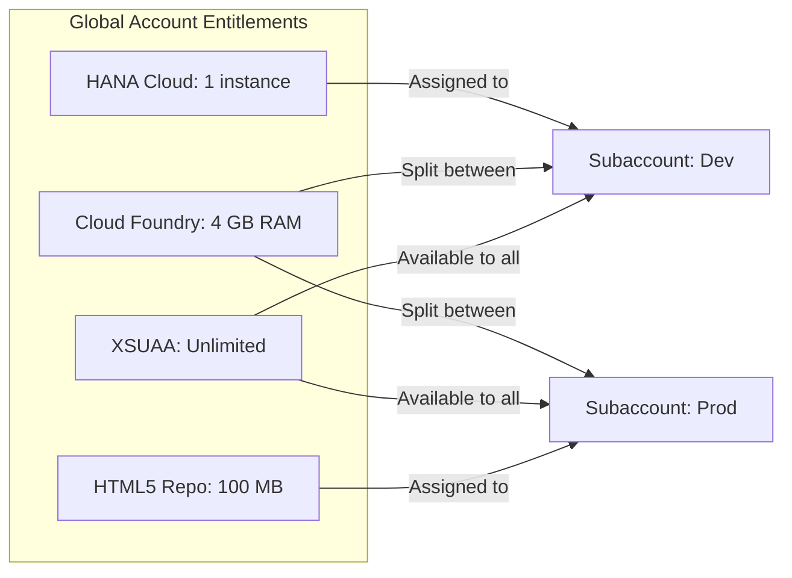
```mermaid
graph LR
    subgraph "Global Account Entitlements"
        E1[HANA Cloud: 1 instance]
        E2[Cloud Foundry: 4 GB RAM]
        E3[XSUAA: Unlimited]
        E4[HTML5 Repo: 100 MB]
    end

    E1 -->|Assigned to| SA1[Subaccount: Dev]
    E2 -->|Split between| SA1
    E2 -->|Split between| SA2[Subaccount: Prod]
    E3 -->|Available to all| SA1
    E3 -->|Available to all| SA2
    E4 -->|Assigned to| SA2
```

| Concept | Definition | Example |
|---------|-----------|---------|
| **Entitlement** | What services you're ALLOWED to use | "You can use HANA Cloud" |
| **Quota** | HOW MUCH of a service you can use | "You get 32 GB of HANA storage" |
| **Service Plan** | The tier/variant of a service | "HANA Cloud — hdi-shared plan" |

**Analogy:** 
- Entitlement = Your gym membership card (permission to enter)
- Quota = The number of classes you can attend per month (limit)
- Service Plan = Regular vs Premium membership (what features you get)

---

### Interactive Exercise: Label the Architecture (5 minutes)

Copy this diagram on paper and fill in the blanks:

```
+-------------------------------------------------------+
|                    SAP BTP                              |
|                                                       |
|  Layer 5: _____________ (What you build)              |
|                                                       |
|  Layer 4: _____________ (How you build)               |
|                                                       |
|  Layer 3: _____________ (What helps you build)        |
|                                                       |
|  Layer 2: _____________ (Where code runs)             |
|                                                       |
|  Layer 1: _____________ (The physical stuff)          |
+-------------------------------------------------------+
```

<details>
<summary>Answers</summary>

- Layer 5: **Applications** (Custom apps, extensions)
- Layer 4: **Development Tools** (BAS, Build, Joule, CI/CD)
- Layer 3: **Platform Services** (HANA, XSUAA, Destination, etc.)
- Layer 2: **Runtime Environments** (Cloud Foundry, Kyma, ABAP)
- Layer 1: **Cloud Infrastructure** (AWS, Azure, GCP)

</details>

---

## Session 2: Multi-Cloud Strategy & Regions (10:45 - 12:00)

### What is Multi-Cloud?

**Multi-Cloud** = Running your platform on MORE THAN ONE cloud provider.

Most companies use just one cloud (AWS OR Azure OR GCP). SAP BTP is special — it runs on **all three!**

### Why Does SAP Use Multi-Cloud?

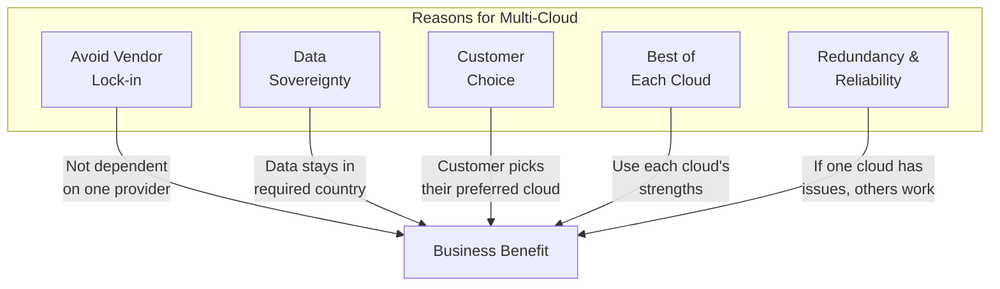
```mermaid
graph TB
    subgraph "Reasons for Multi-Cloud"
        R1[Avoid Vendor<br/>Lock-in]
        R2[Data<br/>Sovereignty]
        R3[Customer<br/>Choice]
        R4[Best of<br/>Each Cloud]
        R5[Redundancy &<br/>Reliability]
    end

    R1 -->|"Not dependent<br/>on one provider"| B1[Business Benefit]
    R2 -->|"Data stays in<br/>required country"| B1
    R3 -->|"Customer picks<br/>their preferred cloud"| B1
    R4 -->|"Use each cloud's<br/>strengths"| B1
    R5 -->|"If one cloud has<br/>issues, others work"| B1
```

| Reason | Explanation | Example |
|--------|------------|---------|
| **Avoid Vendor Lock-in** | Not tied to a single provider's pricing/terms | If AWS raises prices, SAP can shift workloads |
| **Data Sovereignty** | Some countries require data to stay within borders | German companies need EU data centers |
| **Customer Choice** | Customers already using Azure may want BTP on Azure | A Microsoft-heavy company prefers Azure |
| **Best of Each Cloud** | Each provider has unique strengths | GCP for AI/ML, Azure for enterprise integration |
| **Redundancy** | If one provider has an outage, others still work | AWS outage doesn't take down all of SAP BTP |

---

### Regions & Availability Zones

#### What is a Region?

A **Region** = A geographical location where cloud providers have data centers.

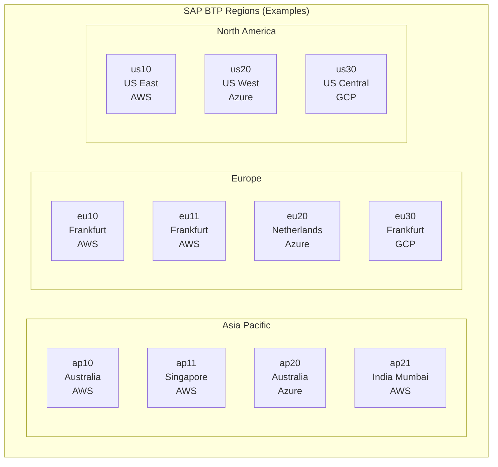
```mermaid
graph TB
    subgraph "SAP BTP Regions (Examples)"
        subgraph "Asia Pacific"
            AP1[ap10<br/>Australia<br/>AWS]
            AP2[ap11<br/>Singapore<br/>AWS]
            AP3[ap20<br/>Australia<br/>Azure]
            AP4[ap21<br/>India Mumbai<br/>AWS]
        end

        subgraph "Europe"
            EU1[eu10<br/>Frankfurt<br/>AWS]
            EU2[eu11<br/>Frankfurt<br/>AWS]
            EU3[eu20<br/>Netherlands<br/>Azure]
            EU4[eu30<br/>Frankfurt<br/>GCP]
        end

        subgraph "North America"
            US1[us10<br/>US East<br/>AWS]
            US2[us20<br/>US West<br/>Azure]
            US3[us30<br/>US Central<br/>GCP]
        end
    end
```

#### Region Naming Convention

SAP BTP regions follow a pattern:

```
Format: <geography><number>

Examples:
  eu10 = Europe, region #10 (AWS Frankfurt)
  us20 = US, region #20 (Azure US West)
  ap21 = Asia Pacific, region #21 (AWS Mumbai)
  eu30 = Europe, region #30 (GCP Frankfurt)

Pattern:
  *10, *11 = AWS
  *20, *21 = Azure
  *30 = GCP
```

#### What is an Availability Zone (AZ)?

An **Availability Zone** = A separate data center WITHIN a region, with its own power, cooling, and networking.

```
Region: eu10 (Frankfurt, Germany)
+-------------------------------------------------------+
|                                                       |
|  +---------------+  +---------------+  +----------+  |
|  | AZ-1          |  | AZ-2          |  | AZ-3     |  |
|  | Data Center A |  | Data Center B |  | Data     |  |
|  |               |  |               |  | Center C |  |
|  | [Your App     |  | [Your App     |  |          |  |
|  |  Copy 1]      |  |  Copy 2]      |  | [Backup] |  |
|  +---------------+  +---------------+  +----------+  |
|         |                   |                |        |
|         +------- High-speed private link ----+        |
|                                                       |
+-------------------------------------------------------+
```

**Why multiple AZs?**
- If Data Center A catches fire → your app still runs in Data Center B
- If there's a power outage in one AZ → others are unaffected
- Your data is replicated across AZs for safety

**Real-World Analogy:**
- Region = A city (Mumbai)
- Availability Zone = Different buildings in that city
- Your app = Stored in multiple buildings, so even if one building has a problem, you're safe

---

### How to Choose a Region?

| Factor | What to Consider | Example |
|--------|-----------------|---------|
| **Latency** | Pick region closest to your users | Indian users → ap21 (Mumbai) |
| **Data Residency** | Legal requirements for data location | EU regulations → eu10 (Frankfurt) |
| **Service Availability** | Not all services available in all regions | Check BTP Discovery Center |
| **Cost** | Pricing can vary by region | Some regions are slightly cheaper |
| **Provider Preference** | Company may prefer specific cloud | Microsoft-heavy → Azure regions (*20) |

### For This Course

We'll use the **Trial Account** which is typically assigned to:
- **Region:** ap21 (Singapore/Mumbai - AWS) or us10 (US East - AWS)
- **Runtime:** Cloud Foundry
- **Limitation:** Limited resources, 90-day validity

---

### Discussion: Multi-Cloud Scenario (10 minutes)

**Scenario:** You're consulting for "GlobalRetail" — a company with:
- Headquarters in Germany
- Stores in India, USA, and Japan
- Strict EU data privacy rules (GDPR)
- Want fast app performance for ALL regions

**Questions to discuss:**
1. Which region would you use for their EU customer data? Why?
2. Would they benefit from multi-cloud? How?
3. If their Indian stores need fast performance, which region would you pick?

<details>
<summary>Suggested Answers</summary>

1. **eu10 or eu20** (Frankfurt or Netherlands) — GDPR requires EU data to stay in EU
2. **Yes** — Different regions for different needs. Maybe Azure for EU (they use Microsoft), AWS for India (ap21 Mumbai = lowest latency for Indian stores)
3. **ap21** (Mumbai, AWS) — closest to Indian users = lowest latency

</details>

---

## Session 3: Cloud Foundry — What, Why & Architecture (12:45 - 14:00)

### What is Cloud Foundry?

**Cloud Foundry** is an **open-source Platform-as-a-Service (PaaS)** that makes it easy to deploy, run, and scale applications.

#### The Origin Story

```
Timeline:
2009 ──── VMware starts Cloud Foundry project
2011 ──── Released as open-source
2014 ──── Cloud Foundry Foundation formed
         (backed by SAP, IBM, Google, Microsoft, etc.)
2015 ──── SAP adopts Cloud Foundry for SAP Cloud Platform
2018 ──── SAP BTP's primary runtime
2024 ──── Still SAP's recommended runtime for CAP apps
```

**Key Fact:** Cloud Foundry is NOT an SAP-only technology! It's an open standard used by many companies. SAP chose to build on it rather than create something proprietary.

---

### Why Cloud Foundry? — The Developer Experience

#### Without Cloud Foundry (The Hard Way):

```
To deploy a simple web app, you need to:
1. Provision a virtual machine (IaaS)
2. Install the operating system
3. Install Node.js runtime
4. Configure the network & firewall
5. Set up load balancer
6. Configure SSL certificates
7. Set up monitoring
8. Deploy your code
9. Manage updates & patches
10. Handle scaling manually

Time: Days to weeks
Skills needed: DevOps, networking, security, Linux admin
```

#### With Cloud Foundry (The Easy Way):

```
To deploy the same app:
1. Write your code
2. Run: cf push my-app

Time: Minutes
Skills needed: Just know how to code!
```

**Cloud Foundry's Promise:** *"Here is my source code. Run it on the cloud for me. I do not care how."*

---

### Cloud Foundry Architecture — Internal Components

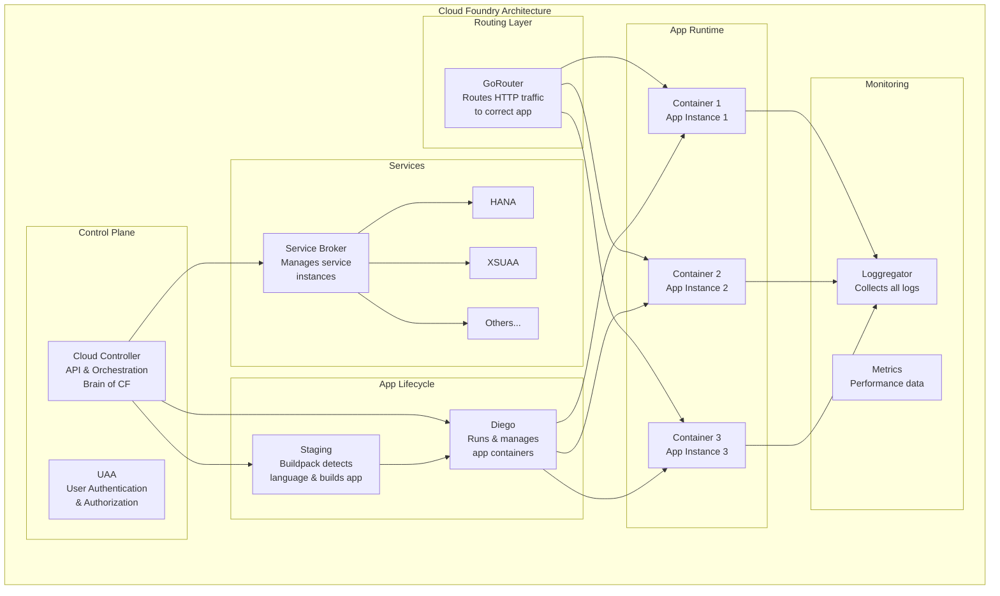
```mermaid
graph TB
    subgraph "Cloud Foundry Architecture"
        subgraph "Routing Layer"
            RT[GoRouter<br/>Routes HTTP traffic<br/>to correct app]
        end

        subgraph "Control Plane"
            CC[Cloud Controller<br/>API & Orchestration<br/>Brain of CF]
            UAA[UAA<br/>User Authentication<br/>& Authorization]
        end

        subgraph "App Lifecycle"
            STG[Staging<br/>Buildpack detects<br/>language & builds app]
            DG[Diego<br/>Runs & manages<br/>app containers]
        end

        subgraph "App Runtime"
            C1[Container 1<br/>App Instance 1]
            C2[Container 2<br/>App Instance 2]
            C3[Container 3<br/>App Instance 3]
        end

        subgraph "Services"
            SB[Service Broker<br/>Manages service<br/>instances]
            SVC1[HANA]
            SVC2[XSUAA]
            SVC3[Others...]
        end

        subgraph "Monitoring"
            LOG[Loggregator<br/>Collects all logs]
            MET[Metrics<br/>Performance data]
        end
    end

    RT --> C1
    RT --> C2
    RT --> C3
    CC --> STG
    CC --> DG
    CC --> SB
    STG --> DG
    DG --> C1
    DG --> C2
    DG --> C3
    SB --> SVC1
    SB --> SVC2
    SB --> SVC3
    C1 --> LOG
    C2 --> LOG
    C3 --> LOG
```

---

### Component-by-Component Explanation

#### 1. GoRouter (The Traffic Controller)

```
Think of it as: A RECEPTIONIST at a hotel

What it does:
- Every HTTP request enters through GoRouter
- It looks at the URL and routes it to the correct app
- If you have multiple copies of your app (scaling), it balances traffic between them

Example:
  Request to: https://my-cap-app.cfapps.us10.hana.ondemand.com
  GoRouter → Finds "my-cap-app" → Sends to one of its running containers
```

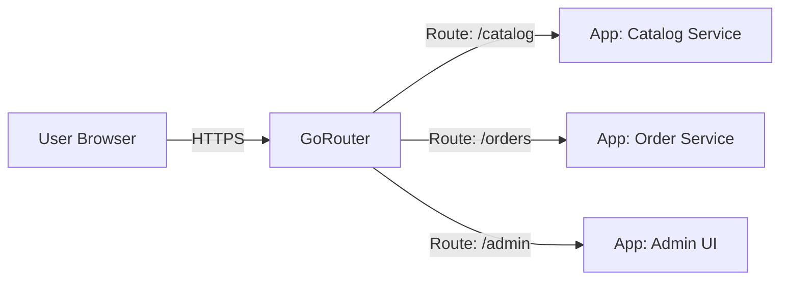
```mermaid
graph LR
    U[User Browser] -->|HTTPS| GR[GoRouter]
    GR -->|Route: /catalog| A1[App: Catalog Service]
    GR -->|Route: /orders| A2[App: Order Service]
    GR -->|Route: /admin| A3[App: Admin UI]
```

---

#### 2. Cloud Controller (The Brain)

```
Think of it as: The MANAGER of the entire system

What it does:
- Receives commands from developers (cf push, cf scale, cf delete)
- Orchestrates all other components
- Manages the lifecycle of apps (create, update, delete)
- Handles org/space/user management
- Exposes REST APIs that CF CLI uses

When you type "cf push":
  CF CLI → sends request to → Cloud Controller → coordinates everything
```

---

#### 3. UAA (User Account & Authentication)

```
Think of it as: The SECURITY GUARD

What it does:
- Handles user login/logout
- Issues OAuth2 tokens
- Manages user permissions (who can do what)
- Integrates with identity providers (corporate SSO, SAP IAS)

In SAP BTP: UAA is extended as XSUAA (Extended Services for UAA)
```

---

#### 4. Staging (The Build Phase)

```
Think of it as: A CHEF PREPPING ingredients

What it does:
- Takes your source code
- Detects what language/framework you're using
- Downloads necessary dependencies (npm install)
- Compiles/builds your application
- Creates a "droplet" (packaged, ready-to-run app)

Example for our CAP app:
  1. Detects: Node.js application (because of package.json)
  2. Runs: npm install (downloads dependencies)
  3. Bundles: Everything into a droplet
  4. Ready: Hands droplet to Diego for running
```

---

#### 5. Diego (The Container Orchestrator)

```
Think of it as: A HOTEL ROOM MANAGER assigning rooms to guests

What it does:
- Takes the built droplet and runs it in containers
- Decides WHICH server to run your app on
- Monitors health (restarts crashed apps automatically!)
- Handles scaling (spin up more containers when needed)
- Distributes apps across multiple machines for resilience

Diego's components:
  - BBS (Bulletin Board System): Stores desired state
  - Cells: The actual machines that run containers
  - Rep: Agent on each Cell that manages containers
  - Auctioneer: Decides where to place new containers
```

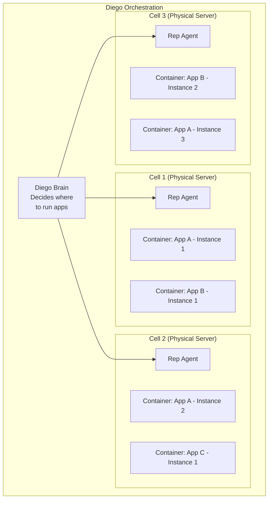
```mermaid
graph TB
    subgraph "Diego Orchestration"
        BRAIN[Diego Brain<br/>Decides where<br/>to run apps]

        subgraph "Cell 1 (Physical Server)"
            REP1[Rep Agent]
            CT1[Container: App A - Instance 1]
            CT2[Container: App B - Instance 1]
        end

        subgraph "Cell 2 (Physical Server)"
            REP2[Rep Agent]
            CT3[Container: App A - Instance 2]
            CT4[Container: App C - Instance 1]
        end

        subgraph "Cell 3 (Physical Server)"
            REP3[Rep Agent]
            CT5[Container: App B - Instance 2]
            CT6[Container: App A - Instance 3]
        end
    end

    BRAIN --> REP1
    BRAIN --> REP2
    BRAIN --> REP3
```

---

#### 6. Service Broker (The Marketplace)

```
Think of it as: A SHOPPING CATALOG for services

What it does:
- Lists all available services (HANA, XSUAA, etc.)
- Creates service instances when requested
- Generates credentials (service keys)
- Binds services to your apps (gives your app access)

When you need a database:
  1. cf create-service hana hdi-shared my-db
     → Service Broker creates a HANA HDI container
  2. cf bind-service my-app my-db
     → Service Broker gives your app the connection details
```

---

#### 7. Loggregator (The Logger)

```
Think of it as: A DIARY that records everything

What it does:
- Collects logs from ALL app instances
- Streams them to you in real-time (cf logs my-app)
- Collects metrics (CPU, memory, disk usage)
- Helps you debug issues

When something goes wrong:
  cf logs my-app --recent → Shows you what happened
```

---

### The Complete Flow: What Happens When You "cf push"

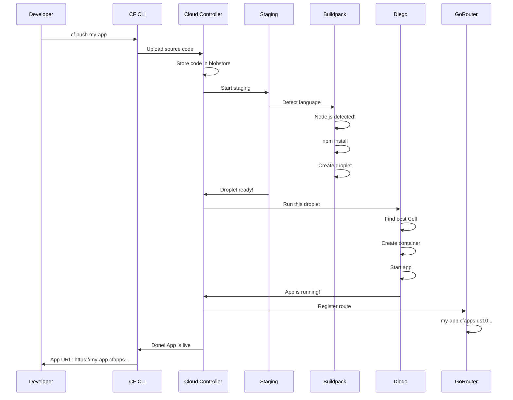
```mermaid
sequenceDiagram
    participant Dev as Developer
    participant CLI as CF CLI
    participant CC as Cloud Controller
    participant STG as Staging
    participant BP as Buildpack
    participant DG as Diego
    participant RT as GoRouter

    Dev->>CLI: cf push my-app
    CLI->>CC: Upload source code
    CC->>CC: Store code in blobstore
    CC->>STG: Start staging
    STG->>BP: Detect language
    BP->>BP: Node.js detected!
    BP->>BP: npm install
    BP->>BP: Create droplet
    STG->>CC: Droplet ready!
    CC->>DG: Run this droplet
    DG->>DG: Find best Cell
    DG->>DG: Create container
    DG->>DG: Start app
    DG->>CC: App is running!
    CC->>RT: Register route
    RT->>RT: my-app.cfapps.us10...
    CC->>CLI: Done! App is live
    CLI->>Dev: App URL: https://my-app.cfapps...
```

**In simple words:**
1. You push your code → Cloud Controller receives it
2. Staging phase → Buildpack detects Node.js, installs dependencies, creates package
3. Running phase → Diego puts your packaged app into a container and starts it
4. Routing → GoRouter maps a URL to your running app
5. You get the app URL → Users can access it!

---

### Cloud Foundry vs Kyma vs ABAP Environment

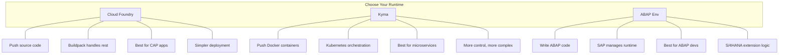
```mermaid
graph TB
    subgraph "Choose Your Runtime"
        CF[Cloud Foundry]
        KY[Kyma]
        AB[ABAP Env]
    end

    CF --- CF1[Push source code]
    CF --- CF2[Buildpack handles rest]
    CF --- CF3[Best for CAP apps]
    CF --- CF4[Simpler deployment]

    KY --- KY1[Push Docker containers]
    KY --- KY2[Kubernetes orchestration]
    KY --- KY3[Best for microservices]
    KY --- KY4[More control, more complex]

    AB --- AB1[Write ABAP code]
    AB --- AB2[SAP manages runtime]
    AB --- AB3[Best for ABAP devs]
    AB --- AB4[S/4HANA extension logic]
```

#### Detailed Comparison

| Feature | Cloud Foundry | Kyma | ABAP Environment |
|---------|--------------|------|------------------|
| **Deployment Unit** | Source code + Buildpack | Docker container | ABAP code |
| **Abstraction Level** | High (PaaS) | Medium (CaaS) | High (specialized) |
| **Languages** | Node.js, Java, Python, Go | Any (containerized) | ABAP only |
| **Scaling** | `cf scale my-app -i 3` | Kubernetes autoscaler | SAP managed |
| **Learning Curve** | Low-Medium | High (need Kubernetes knowledge) | Medium (need ABAP) |
| **Best Use Case** | Business applications, CAP | Event-driven, polyglot microservices | S/4HANA extensions in ABAP |
| **Container Knowledge** | Not needed! | Required | Not needed |
| **Cost** | Pay per GB RAM used | Pay per cluster | Pay per ABAP unit |

#### When to Choose What?

```
Decision Tree:

Are you building a CAP app?
  └── YES → Cloud Foundry ✅

Do you need Kubernetes features (sidecars, custom networking)?
  └── YES → Kyma

Are you an ABAP developer extending S/4HANA?
  └── YES → ABAP Environment

Not sure?
  └── Start with Cloud Foundry (simplest, most documented)
```

---

## Session 4: Buildpacks, Containers & Diego (14:15 - 15:30)

### What is a Buildpack?

A **Buildpack** is a set of scripts that transforms your source code into a runnable application. It automates everything you'd normally do manually to deploy an app.

```
Think of it as: A RECIPE that turns raw ingredients into a finished dish

Your source code (raw ingredients)
     ↓
Buildpack (the recipe + chef)
     ↓
Running application (the finished dish)
```

#### How Buildpacks Work — Step by Step

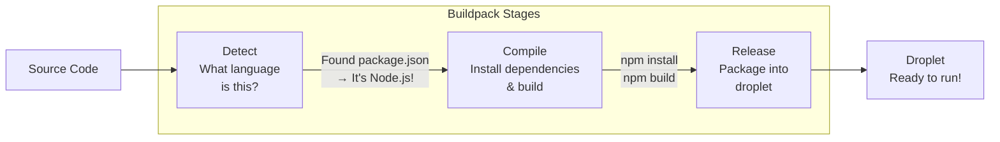
```mermaid
graph LR
    subgraph "Buildpack Stages"
        D[Detect<br/>What language<br/>is this?]
        C[Compile<br/>Install dependencies<br/>& build]
        R[Release<br/>Package into<br/>droplet]
    end

    SC[Source Code] --> D
    D -->|"Found package.json<br/>→ It's Node.js!"| C
    C -->|"npm install<br/>npm build"| R
    R --> DR[Droplet<br/>Ready to run!]
```

#### The 3 Stages of a Buildpack

| Stage | What Happens | For Node.js |
|-------|-------------|-------------|
| **Detect** | Checks if this buildpack can handle your app | Looks for `package.json` file |
| **Compile** | Downloads runtime + installs dependencies | Downloads Node.js + runs `npm install` |
| **Release** | Creates the runnable package (droplet) | Packages everything together |

---

### Common Buildpacks in SAP BTP Cloud Foundry

| Buildpack | Detects | For |
|-----------|---------|-----|
| **nodejs_buildpack** | `package.json` | CAP Node.js apps, Express apps |
| **java_buildpack** | `pom.xml` or `.war` file | CAP Java apps, Spring Boot |
| **staticfile_buildpack** | `Staticfile` config | Fiori/UI5 frontend apps |
| **python_buildpack** | `requirements.txt` | Python scripts, Flask apps |
| **go_buildpack** | `go.mod` | Go applications |

**For this course:** We'll primarily use `nodejs_buildpack` (for our CAP backend) and `staticfile_buildpack` (for Fiori UI).

---

### What is a Container?

A **Container** is a lightweight, isolated environment that runs your application. Think of it as a sealed box containing everything your app needs.

```
Physical Server (One big computer)
+----------------------------------------------------------+
|  Operating System (Linux)                                |
|                                                          |
|  +------------------+ +------------------+ +----------+  |
|  | Container 1      | | Container 2      | | Container| |
|  |                  | |                  | | 3        | |
|  | Node.js 18       | | Java 17          | | Python   | |
|  | Your CAP App     | | Another App      | | Script   | |
|  | Dependencies     | | Its Dependencies | | Its Deps | |
|  |                  | |                  | |          | |
|  | Isolated!        | | Isolated!        | | Isolated!| |
|  +------------------+ +------------------+ +----------+  |
|                                                          |
+----------------------------------------------------------+
```

#### Container vs Virtual Machine

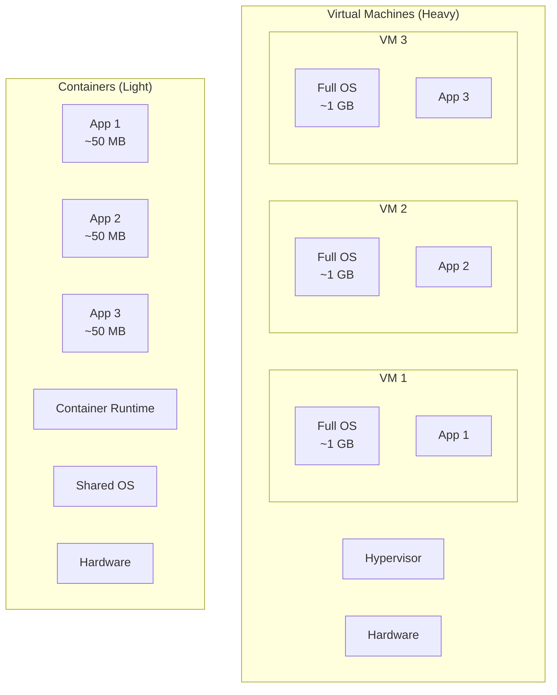
```mermaid
graph TB
    subgraph "Virtual Machines (Heavy)"
        subgraph "VM 1"
            OS1[Full OS<br/>~1 GB]
            A1[App 1]
        end
        subgraph "VM 2"
            OS2[Full OS<br/>~1 GB]
            A2[App 2]
        end
        subgraph "VM 3"
            OS3[Full OS<br/>~1 GB]
            A3[App 3]
        end
        HV[Hypervisor]
        HW1[Hardware]
    end

    subgraph "Containers (Light)"
        C1B[App 1<br/>~50 MB]
        C2B[App 2<br/>~50 MB]
        C3B[App 3<br/>~50 MB]
        CRT[Container Runtime]
        OS4[Shared OS]
        HW2[Hardware]
    end
```

| Feature | Virtual Machine | Container |
|---------|----------------|-----------|
| **Size** | Gigabytes (full OS each) | Megabytes (shared OS) |
| **Startup Time** | Minutes | Seconds |
| **Resource Usage** | Heavy (each VM has own OS) | Light (share the host OS) |
| **Isolation** | Full hardware isolation | Process-level isolation |
| **Use Case** | Need different OS, full isolation | Running apps efficiently |

**Key Point:** In Cloud Foundry, you don't create containers yourself! Diego does it automatically. You just push code, and CF handles containerization.

---

### Diego Deep-Dive — The Heart of Cloud Foundry

**Diego** (from "Diego el Container") is the container orchestration system in Cloud Foundry. It's the component that actually runs and manages your applications.

#### What Diego Does

```
1. PLACES your app → Decides which server (Cell) to use
2. RUNS your app    → Starts it in a container
3. MONITORS health  → Checks if app is alive every few seconds
4. HEALS failures   → Auto-restarts crashed apps
5. SCALES            → Adds/removes containers based on demand
6. BALANCES          → Distributes apps across multiple Cells
```

#### Diego Architecture

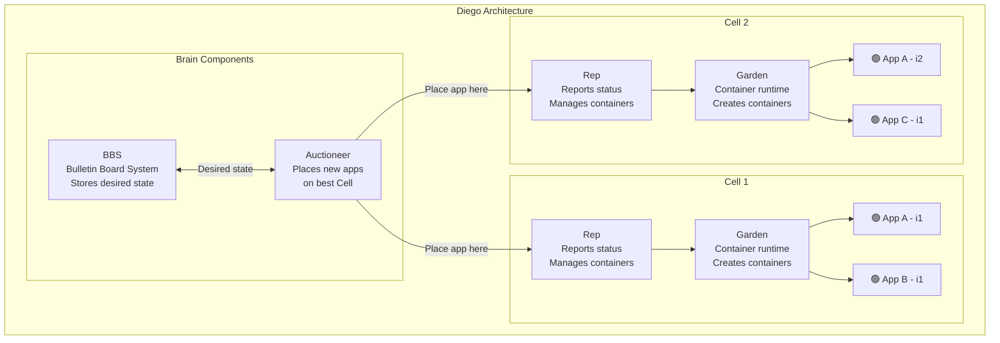
```mermaid
graph TB
    subgraph "Diego Architecture"
        subgraph "Brain Components"
            BBS[BBS<br/>Bulletin Board System<br/>Stores desired state]
            AUC[Auctioneer<br/>Places new apps<br/>on best Cell]
        end

        subgraph "Cell 1"
            REP1[Rep<br/>Reports status<br/>Manages containers]
            G1[Garden<br/>Container runtime<br/>Creates containers]
            APP1[🟢 App A - i1]
            APP2[🟢 App B - i1]
        end

        subgraph "Cell 2"
            REP2[Rep<br/>Reports status<br/>Manages containers]
            G2[Garden<br/>Container runtime<br/>Creates containers]
            APP3[🟢 App A - i2]
            APP4[🟢 App C - i1]
        end
    end

    BBS <-->|"Desired state"| AUC
    AUC -->|"Place app here"| REP1
    AUC -->|"Place app here"| REP2
    REP1 --> G1
    G1 --> APP1
    G1 --> APP2
    REP2 --> G2
    G2 --> APP3
    G2 --> APP4
```

#### Diego Components Explained

| Component | Role | Analogy |
|-----------|------|---------|
| **BBS** (Bulletin Board System) | Stores the desired state of all apps | A whiteboard listing which apps should be running where |
| **Auctioneer** | Decides which Cell should run a new app | A matchmaker pairing apps with available Cells |
| **Rep** (Representative) | Agent on each Cell, manages containers on that machine | A floor manager in a hotel |
| **Garden** | The actual container runtime (creates/destroys containers) | The room-building crew |
| **Cell** | A physical/virtual machine that runs containers | A hotel building |

---

#### Self-Healing in Action

One of the most powerful features of Diego is **self-healing:**

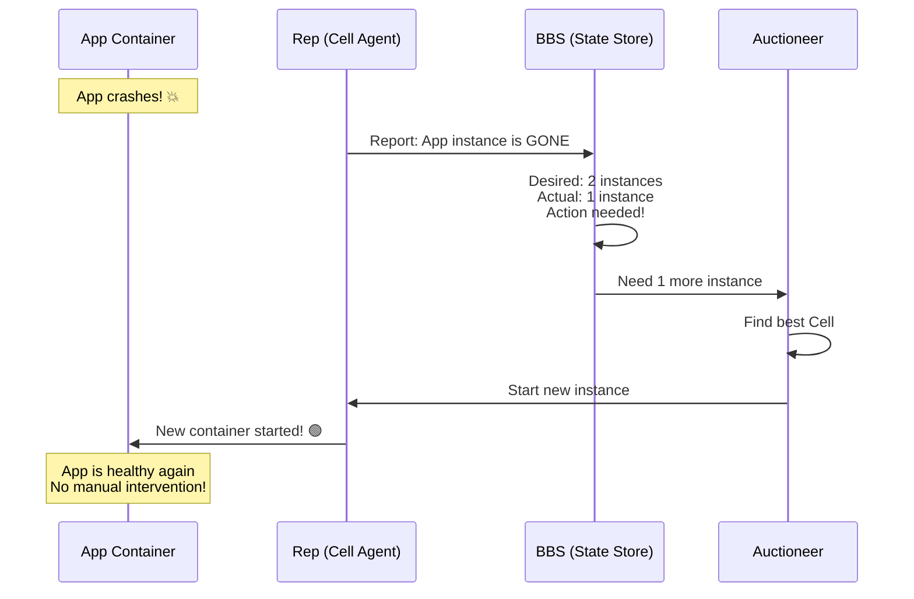
```mermaid
sequenceDiagram
    participant App as App Container
    participant Rep as Rep (Cell Agent)
    participant BBS as BBS (State Store)
    participant AUC as Auctioneer

    Note over App: App crashes! 💥
    Rep->>BBS: Report: App instance is GONE
    BBS->>BBS: Desired: 2 instances<br/>Actual: 1 instance<br/>Action needed!
    BBS->>AUC: Need 1 more instance
    AUC->>AUC: Find best Cell
    AUC->>Rep: Start new instance
    Rep->>App: New container started! 🟢
    Note over App: App is healthy again<br/>No manual intervention!
```

**Real-world scenario:**
- You have 3 instances of your CAP app running
- One instance crashes (memory leak, bug, etc.)
- Diego detects the crash within seconds
- Diego automatically starts a new instance on another Cell
- Users never notice downtime!

**You don't need to wake up at 3 AM to restart your app!**

---

### Scaling in Cloud Foundry

#### Horizontal Scaling (More Instances)

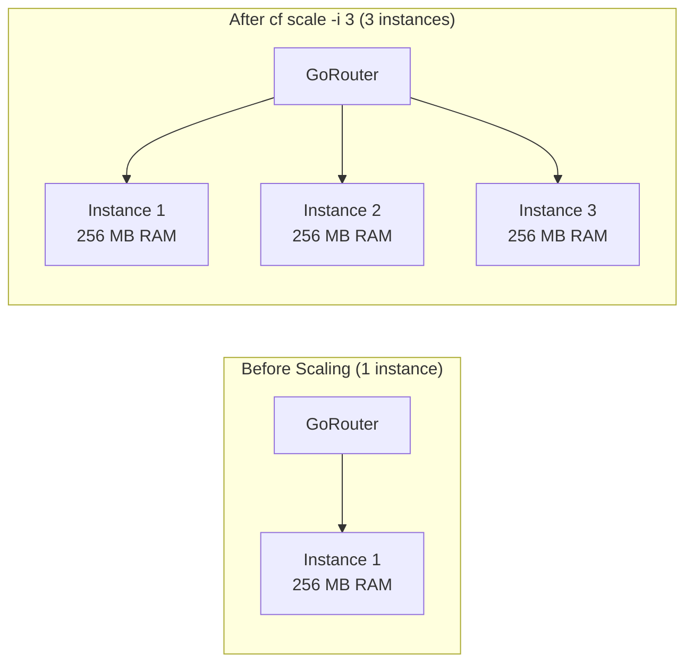
```mermaid
graph LR
    subgraph "Before Scaling (1 instance)"
        LB1[GoRouter] --> I1[Instance 1<br/>256 MB RAM]
    end

    subgraph "After cf scale -i 3 (3 instances)"
        LB2[GoRouter] --> I2[Instance 1<br/>256 MB RAM]
        LB2 --> I3[Instance 2<br/>256 MB RAM]
        LB2 --> I4[Instance 3<br/>256 MB RAM]
    end
```

#### Vertical Scaling (More Resources)

```
Before: cf scale my-app -m 256M   (256 MB RAM per instance)
After:  cf scale my-app -m 512M   (512 MB RAM per instance — handles more load)
```

| Scaling Type | Command | What Changes | When to Use |
|-------------|---------|--------------|-------------|
| **Horizontal** | `cf scale my-app -i 3` | Number of instances (copies) | High traffic, more requests |
| **Vertical** | `cf scale my-app -m 512M` | Memory/CPU per instance | Complex processing, large data |

---

### Cloud Foundry CLI — Key Commands Preview

You'll use these commands throughout the course (starting Week 7):

| Command | What It Does | Example |
|---------|-------------|---------|
| `cf login` | Log into Cloud Foundry | `cf login -a https://api.cf.us10.hana.ondemand.com` |
| `cf push` | Deploy your application | `cf push my-cap-app` |
| `cf apps` | List all running apps | Shows name, state, memory, URLs |
| `cf logs` | View application logs | `cf logs my-app --recent` |
| `cf scale` | Scale app instances/memory | `cf scale my-app -i 3` |
| `cf services` | List service instances | Shows HANA, XSUAA instances |
| `cf create-service` | Create a new service | `cf create-service hana hdi-shared my-db` |
| `cf bind-service` | Connect service to app | `cf bind-service my-app my-db` |
| `cf env` | View environment variables | Shows service credentials |
| `cf delete` | Delete an application | `cf delete my-app` |

**Don't worry about memorizing these now!** We'll practice them hands-on in Week 7.

---

### The Complete Picture — From Code to Running App

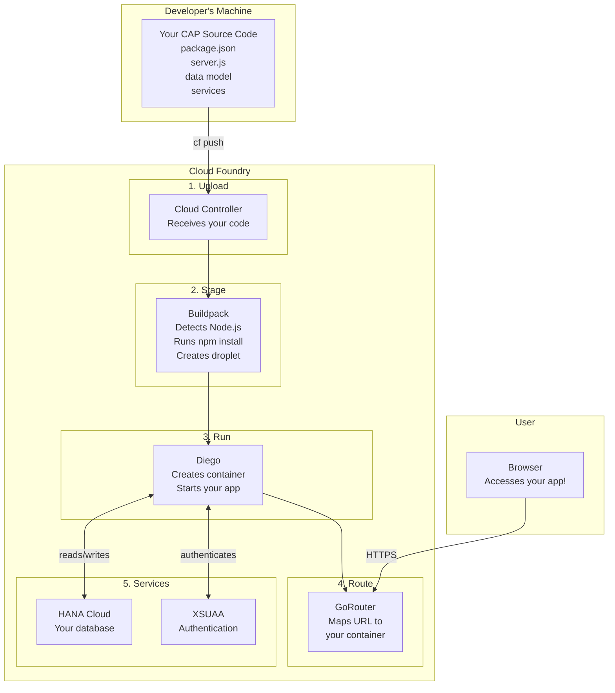
```mermaid
graph TB
    subgraph "Developer's Machine"
        CODE[Your CAP Source Code<br/>package.json<br/>server.js<br/>data model<br/>services]
    end

    subgraph "Cloud Foundry"
        subgraph "1. Upload"
            CC[Cloud Controller<br/>Receives your code]
        end

        subgraph "2. Stage"
            BP[Buildpack<br/>Detects Node.js<br/>Runs npm install<br/>Creates droplet]
        end

        subgraph "3. Run"
            DG[Diego<br/>Creates container<br/>Starts your app]
        end

        subgraph "4. Route"
            GR[GoRouter<br/>Maps URL to<br/>your container]
        end

        subgraph "5. Services"
            HANA[HANA Cloud<br/>Your database]
            XS[XSUAA<br/>Authentication]
        end
    end

    subgraph "User"
        BROWSER[Browser<br/>Accesses your app!]
    end

    CODE -->|cf push| CC
    CC --> BP
    BP --> DG
    DG --> GR
    DG <-->|reads/writes| HANA
    DG <-->|authenticates| XS
    BROWSER -->|HTTPS| GR
```

---

## Session 5: Hands-on Exploration & Whiteboard Exercises (15:30 - 16:30)

### Activity 1: Draw the BTP Architecture (15 minutes)

On paper or whiteboard, draw the SAP BTP architecture from memory. Include:

1. The 5 layers (Infrastructure → Applications)
2. At least 2 items in each layer
3. Arrows showing how layers connect

**Scoring:**
- 5 layers correctly labeled: 5 points
- 2+ items per layer: 5 points
- Correct connections between layers: 5 points
- Bonus: Include the account hierarchy: 3 points

---

### Activity 2: Cloud Foundry "cf push" Flowchart (15 minutes)

Draw a flowchart showing what happens when a developer runs `cf push`. Include:

1. At least 5 steps
2. The CF components involved at each step
3. What happens if the app crashes after deployment

**Template to fill in:**

```
Developer runs "cf push"
    ↓
Step 1: _____________ receives the code
    ↓
Step 2: _____________ detects the language
    ↓
Step 3: _____________ installs dependencies and creates _____________
    ↓
Step 4: _____________ places the app in a _____________
    ↓
Step 5: _____________ maps the URL
    ↓
App is live! URL: https://_______________

If app crashes:
    ↓
Step 6: _____________ detects the failure
    ↓
Step 7: _____________ automatically restarts in a new _____________
```

<details>
<summary>Answers</summary>

1. **Cloud Controller** receives the code
2. **Buildpack** detects the language
3. **Buildpack** installs dependencies and creates **droplet**
4. **Diego** places the app in a **container**
5. **GoRouter** maps the URL
6. **Diego (Rep)** detects the failure
7. **Diego (Auctioneer)** automatically restarts in a new **container**

</details>

---

### Activity 3: Explore SAP BTP Trial Landscape (15 minutes)

1. Go to [SAP BTP Trial](https://cockpit.hanatrial.ondemand.com/)
   - If you don't have an account yet, note what you see on the landing page
   - If you have one from yesterday's prep, log in and explore

2. Things to observe:
   - What **region** is your trial in?
   - Can you find the **Cloud Foundry** environment?
   - Look at the **Service Marketplace** — how many services do you see?
   - Find **Entitlements** — what services are you entitled to?

3. Screenshot (or note down):
   - The subaccount overview page
   - The Cloud Foundry org and space names
   - The API endpoint URL

---

### Activity 4: Component Matching Game (15 minutes)

#### Round 1: Match the Component to Its Role

| # | Component | | Role |
|---|-----------|---|------|
| 1 | GoRouter | | A. Detects language and builds app |
| 2 | Cloud Controller | | B. Creates and manages containers |
| 3 | Diego | | C. Routes HTTP traffic to correct app |
| 4 | Buildpack | | D. Manages authentication tokens |
| 5 | UAA | | E. The "brain" — orchestrates all operations |
| 6 | Service Broker | | F. Collects logs from all instances |
| 7 | Loggregator | | G. Creates and manages service instances |

<details>
<summary>Answers</summary>

1-C, 2-E, 3-B, 4-A, 5-D, 6-G, 7-F

</details>

#### Round 2: True or False?

| # | Statement | T/F |
|---|-----------|-----|
| 1 | Cloud Foundry is proprietary SAP technology | |
| 2 | Diego automatically restarts crashed apps | |
| 3 | You need to know Docker to use Cloud Foundry | |
| 4 | SAP BTP only runs on AWS | |
| 5 | A buildpack detects your programming language automatically | |
| 6 | Kyma uses Kubernetes while Cloud Foundry uses Diego | |
| 7 | All SAP BTP services are available in all regions | |
| 8 | In CF, you deploy source code, not containers | |

<details>
<summary>Answers</summary>

1. **False** — It's open-source, maintained by Cloud Foundry Foundation
2. **True** — Self-healing is a core Diego feature
3. **False** — CF abstracts containers away; you just push code
4. **False** — It runs on AWS, Azure, AND GCP (multi-cloud)
5. **True** — The "detect" phase of a buildpack does this
6. **True** — Different orchestration systems
7. **False** — Service availability varies by region
8. **True** — That's the key difference from Kyma (which uses Docker containers)

</details>

#### Round 3: Fill in the Sequence

Put these in the correct order for `cf push`:

- [ ] Diego creates container and starts app
- [ ] GoRouter maps URL to running container
- [ ] Cloud Controller receives source code
- [ ] Developer runs `cf push`
- [ ] Buildpack creates droplet
- [ ] User accesses app via browser

<details>
<summary>Correct Order</summary>

1. Developer runs `cf push`
2. Cloud Controller receives source code
3. Buildpack creates droplet
4. Diego creates container and starts app
5. GoRouter maps URL to running container
6. User accesses app via browser

</details>

---

## Session 6: Assessment & Wrap-up (16:30 - 17:00)

### MCQ Assessment: 15 Questions

#### SAP BTP Architecture

**Q1.** How many layers are in the SAP BTP architecture?
- a) 3
- b) 4
- c) 5
- d) 7

<details><summary>Answer</summary>c) 5 — Infrastructure, Runtime Environments, Platform Services, Development Tools, Applications</details>

---

**Q2.** Which layer of SAP BTP contains HANA Cloud and XSUAA?
- a) Runtime Environments
- b) Platform Services
- c) Cloud Infrastructure
- d) Applications

<details><summary>Answer</summary>b) Platform Services — these are ready-to-use services your app consumes</details>

---

**Q3.** What is the correct hierarchy in SAP BTP (top to bottom)?
- a) Space → Organization → Subaccount → Global Account
- b) Global Account → Subaccount → Organization → Space
- c) Global Account → Organization → Subaccount → Space
- d) Subaccount → Global Account → Space → Organization

<details><summary>Answer</summary>b) Global Account → Subaccount → Organization → Space</details>

---

**Q4.** An "Entitlement" in SAP BTP means:
- a) The amount of a service you can use
- b) Permission to use a specific service
- c) The cost of a service
- d) The region where a service runs

<details><summary>Answer</summary>b) Permission to use a specific service (Quota = how much)</details>

---

#### Multi-Cloud & Regions

**Q5.** SAP BTP runs on which cloud providers?
- a) Only AWS
- b) AWS and Azure only
- c) AWS, Azure, and Google Cloud
- d) SAP's own data centers only

<details><summary>Answer</summary>c) AWS, Azure, and Google Cloud (multi-cloud strategy)</details>

---

**Q6.** The SAP BTP region "ap21" refers to:
- a) Europe, AWS
- b) Asia Pacific, AWS
- c) Asia Pacific, Azure
- d) Australia, GCP

<details><summary>Answer</summary>b) Asia Pacific, AWS (ap = Asia Pacific, *21 = AWS variant)</details>

---

**Q7.** What is an Availability Zone?
- a) A country where cloud is available
- b) A separate data center within a region for redundancy
- c) The time zone of a server
- d) A pricing tier for services

<details><summary>Answer</summary>b) A separate data center within a region — provides redundancy if one data center fails</details>

---

#### Cloud Foundry

**Q8.** Cloud Foundry is:
- a) A proprietary SAP technology
- b) An open-source PaaS platform
- c) A database
- d) A programming language

<details><summary>Answer</summary>b) An open-source PaaS platform — maintained by the Cloud Foundry Foundation</details>

---

**Q9.** What does a Buildpack do?
- a) Builds physical servers
- b) Detects language, installs dependencies, and packages your app
- c) Creates user accounts
- d) Manages database connections

<details><summary>Answer</summary>b) It automates the detect → compile → release process for your source code</details>

---

**Q10.** Which component routes HTTP traffic to the correct application in Cloud Foundry?
- a) Diego
- b) Cloud Controller
- c) GoRouter
- d) UAA

<details><summary>Answer</summary>c) GoRouter — it's the traffic controller that directs requests to the right app</details>

---

**Q11.** What happens if your app crashes in Cloud Foundry?
- a) You must manually restart it
- b) Diego automatically restarts it in a new container
- c) The app is permanently lost
- d) An email is sent to the developer

<details><summary>Answer</summary>b) Diego automatically restarts it — this is the self-healing capability</details>

---

**Q12.** The command to deploy an application to Cloud Foundry is:
- a) `cf deploy`
- b) `cf push`
- c) `cf upload`
- d) `cf start`

<details><summary>Answer</summary>b) `cf push` — the single command that uploads, stages, and starts your app</details>

---

#### Comparison & Concepts

**Q13.** Which SAP BTP runtime is Kubernetes-based?
- a) Cloud Foundry
- b) Kyma
- c) ABAP Environment
- d) Node.js Runtime

<details><summary>Answer</summary>b) Kyma — it uses Kubernetes for container orchestration</details>

---

**Q14.** In Cloud Foundry, you deploy:
- a) Docker containers
- b) Virtual machine images
- c) Source code (buildpack handles the rest)
- d) Compiled binary executables only

<details><summary>Answer</summary>c) Source code — the buildpack automatically detects, compiles, and packages it</details>

---

**Q15.** Diego's "self-healing" means:
- a) The code fixes its own bugs
- b) Crashed app instances are automatically restarted
- c) The database backs itself up
- d) Errors are automatically logged

<details><summary>Answer</summary>b) Crashed app instances are automatically restarted without manual intervention</details>

---

### Bonus MCQs (5 Extra)

**Q16.** Which CF component is called the "brain" of Cloud Foundry?
- a) GoRouter
- b) Diego
- c) Cloud Controller
- d) Buildpack

<details><summary>Answer</summary>c) Cloud Controller — it receives all commands and orchestrates all components</details>

---

**Q17.** What is a "droplet" in Cloud Foundry?
- a) A small water drop
- b) A packaged, ready-to-run version of your application
- c) A type of service
- d) A logging mechanism

<details><summary>Answer</summary>b) A droplet is the output of the staging phase — your app fully packaged with all dependencies</details>

---

**Q18.** The SAP BTP service that manages authentication (login) is:
- a) HANA Cloud
- b) XSUAA
- c) Destination Service
- d) HTML5 Repository

<details><summary>Answer</summary>b) XSUAA (Extended Services for UAA) — handles OAuth2 tokens, user auth, and roles</details>

---

**Q19.** Why does SAP use a multi-cloud strategy?
- a) It's cheaper
- b) To avoid vendor lock-in and meet data sovereignty requirements
- c) Because one cloud isn't powerful enough
- d) SAP owns all three cloud providers

<details><summary>Answer</summary>b) Avoid vendor lock-in, data sovereignty, and customer choice</details>

---

**Q20.** In the Cloud Foundry account model, where do applications actually run?
- a) Global Account
- b) Subaccount
- c) Organization
- d) Space

<details><summary>Answer</summary>d) Space — this is the lowest level where apps are deployed and services are bound</details>

---

#### Challenge 1: Name That Component

I'll describe what a component does. You name it!

1. "I receive the developer's code when they type `cf push`" → _____________
2. "I figure out what programming language you used" → _____________
3. "I decide which physical machine should run your app" → _____________
4. "I send web traffic to the right application container" → _____________
5. "I restart your app automatically if it crashes" → _____________
6. "I create database instances when you request them" → _____________
7. "I check your password and issue you a token" → _____________

<details>
<summary>Answers</summary>

1. Cloud Controller
2. Buildpack (detect phase)
3. Diego Auctioneer
4. GoRouter
5. Diego (self-healing)
6. Service Broker
7. UAA / XSUAA

</details>

#### Challenge 2: Architecture Speed Draw

Each team draws the SAP BTP architecture on a whiteboard/paper in 3 minutes. Points for:
- All 5 layers labeled correctly (5 pts)
- At least 2 items per layer (5 pts)
- Account hierarchy shown (3 pts)
- Cloud Foundry internal components (5 pts)
- Neat and readable (2 pts)

**Total possible: 20 points**

---

## Key Takeaways

| # | Topic | One-Line Summary |
|---|---|---|
| 1 | BTP Architecture | 5 layers: Infrastructure → Runtime → Services → Tools → Apps |
| 2 | Multi-Cloud | SAP BTP runs on AWS, Azure, AND GCP — customer chooses |
| 3 | Regions | Geographical locations for data centers (e.g., eu10 = Frankfurt, AWS) |
| 4 | Availability Zones | Multiple data centers per region for redundancy |
| 5 | Cloud Foundry | Open-source PaaS — push code, it handles the rest |
| 6 | Buildpacks | Auto-detect language, install deps, create runnable package |
| 7 | Diego | Container orchestrator — runs, monitors, self-heals apps |
| 8 | GoRouter | Routes web traffic to the correct app instance |
| 9 | Self-Healing | Crashed apps auto-restart — no manual intervention needed |
| 10 | CF vs Kyma vs ABAP | CF = source code push, Kyma = containers/K8s, ABAP = ABAP devs |

---

## Glossary of New Terms

| Term | Definition |
|------|-----------|
| **Buildpack** | Scripts that detect language, install dependencies, and package your app for deployment |
| **Container** | A lightweight, isolated environment that runs your application |
| **Diego** | Cloud Foundry's container orchestration system (runs and manages apps) |
| **Droplet** | A packaged, ready-to-run application (output of staging) |
| **GoRouter** | Cloud Foundry's HTTP traffic router |
| **Cloud Controller** | The "brain" of CF — receives commands and orchestrates operations |
| **UAA/XSUAA** | User Account and Authentication service (handles login/tokens) |
| **Cell** | A physical/virtual machine in CF that runs application containers |
| **Rep** | Agent running on each Cell that manages containers |
| **Auctioneer** | Diego component that decides where to place new app instances |
| **Service Broker** | Manages the lifecycle of service instances (create, bind, delete) |
| **Loggregator** | Collects and streams logs from all app instances |
| **Region** | A geographical location with cloud data centers |
| **Availability Zone** | An independent data center within a region |
| **Entitlement** | Permission to use a specific service in BTP |
| **Quota** | The maximum amount of a service you can consume |
| **Self-Healing** | Automatic restart of crashed app instances without manual intervention |
| **Multi-Cloud** | Strategy of running on multiple cloud providers simultaneously |

---

## Preparation for Day 3

Tomorrow we will cover **SAP BTP Account Setup & Navigation**. To prepare:
- If you haven't already, create an SAP account at [SAP.com](https://www.sap.com/)
- Try accessing the [SAP BTP Trial](https://cockpit.hanatrial.ondemand.com/) signup page
- Make sure you have a valid email address (preferably personal, not company)
- We will be creating trial accounts hands-on — make sure you have:
  - Stable internet connection
  - A phone for 2FA verification
  - Chrome or Firefox browser (latest version)

---

## Additional Resources

| Resource | Link | Purpose |
|----------|------|---------|
| Cloud Foundry Official Docs | https://docs.cloudfoundry.org/ | Deep-dive into CF architecture |
| SAP BTP Architecture Overview | https://help.sap.com/docs/btp | Official SAP documentation |
| Cloud Foundry Foundation | https://www.cloudfoundry.org/ | CF community and resources |
| SAP Discovery Center | https://discovery-center.cloud.sap/ | Guided BTP missions |
| CF Buildpack Docs | https://docs.cloudfoundry.org/buildpacks/ | All available buildpacks |
| Diego Design Notes | https://docs.cloudfoundry.org/concepts/diego/diego-architecture.html | Diego internals |

---

*End of Day 2*
