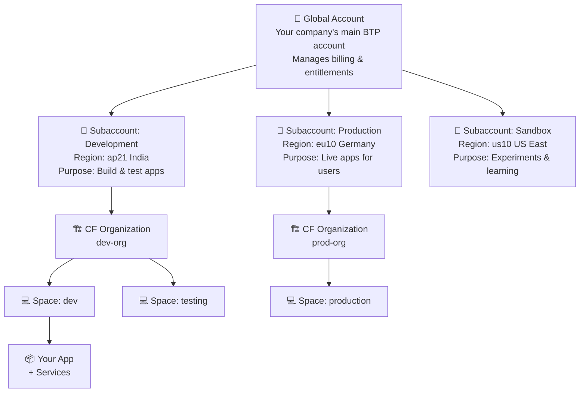
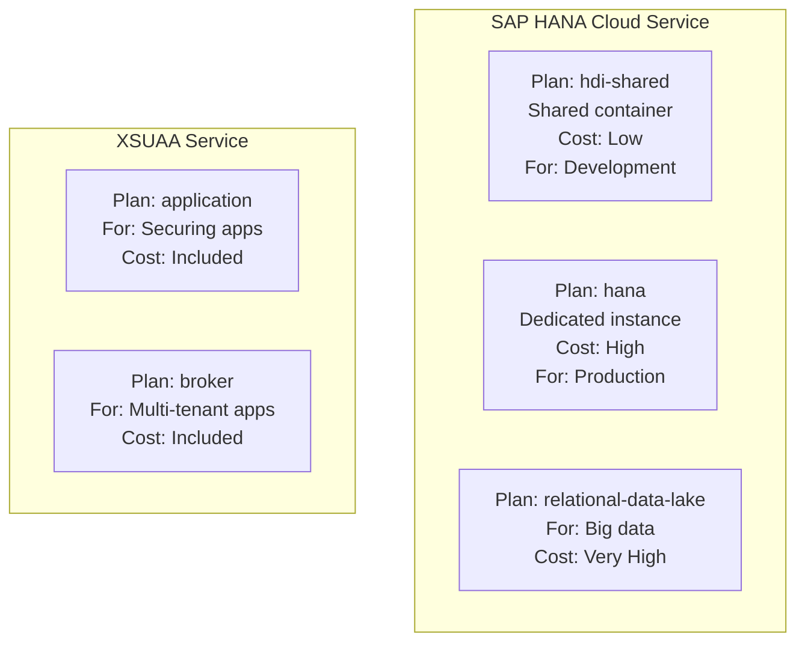
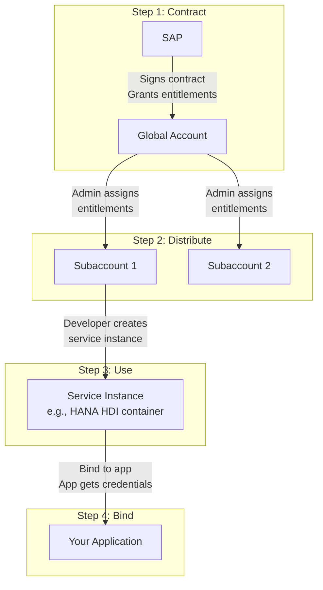
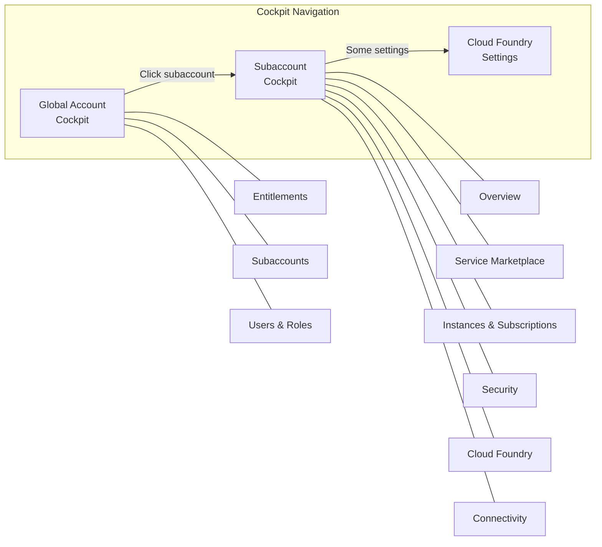
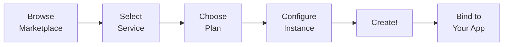

# Day 3: SAP BTP Account Setup & Navigation

---

## Day Schedule (8 Hours)

| Time | Session | Duration |
|------|---------|----------|
| 09:00 - 09:15 | Recap of Day 2 & Q&A | 15 min |
| 09:15 - 10:15 | Session 1: Global Account, Subaccount, Org & Space Hierarchy | 60 min |
| 10:15 - 10:30 | Break | 15 min |
| 10:30 - 11:30 | Session 2: Entitlements, Quotas & Commercial Models | 60 min |
| 11:30 - 12:30 | Session 3: Hands-on — Create SAP BTP Trial Account | 60 min |
| 12:30 - 13:15 | Lunch Break | 45 min |
| 13:15 - 14:15 | Session 4: SAP BTP Cockpit Navigation | 60 min |
| 14:15 - 14:30 | Break | 15 min |
| 14:30 - 15:30 | Session 5: Service Marketplace & Booster Programs | 60 min |
| 15:30 - 16:30 | Session 6: Hands-on — Explore Cockpit, Entitlements & Settings | 60 min |
| 16:30 - 17:00 | Assessment & Wrap-up | 30 min |

---

## What You'll Learn Today

By the end of this session, you will be able to:
- Explain the BTP account hierarchy (Global Account → Space)
- Create your own SAP BTP Trial account
- Navigate the BTP Cockpit confidently
- Understand entitlements, quotas, and how to assign them
- Explore the Service Marketplace
- Use Boosters to auto-configure environments

---

## Day 2 Recap — Quick Fire (09:00 - 09:15)

Answer quickly:
1. Name the 5 layers of SAP BTP architecture → _____, _____, _____, _____, _____
2. What does Diego do? → _____
3. What is a Buildpack? → _____
4. The command to deploy an app to Cloud Foundry? → _____
5. Name one advantage of multi-cloud strategy → _____

<details>
<summary>Answers</summary>

1. Infrastructure, Runtime Environments, Platform Services, Development Tools, Applications
2. Runs and manages application containers (orchestrator)
3. Detects language, installs dependencies, packages your app into a droplet
4. `cf push`
5. Avoid vendor lock-in / data sovereignty / customer choice (any one)

</details>

---

## Session 1: Global Account, Subaccount, Org & Space (09:15 - 10:15)

### The Big Idea — Why Do We Need a Hierarchy?

Imagine you're running a school:
- **School** = One organization (Global Account)
- **Floors** = Different departments/projects (Subaccounts)
- **Classrooms** = Specific team areas (Organizations)
- **Desks** = Where students sit and work (Spaces)

You wouldn't put ALL students in one room, right? You organize them by grade, subject, and section. SAP BTP works the same way!

---

### The 4-Level Hierarchy



---

### Level 1: Global Account

```
+----------------------------------------------------------+
|                    GLOBAL ACCOUNT                         |
|                                                          |
|  👤 Owner: Company Admin / IT Manager                    |
|  💰 Billing: All costs roll up here                      |
|  📋 Entitlements: What services you're allowed to use    |
|  🌍 Not tied to any region                               |
|                                                          |
|  Think of it as: The COMPANY HEADQUARTERS                |
+----------------------------------------------------------+
```

**What it does:**
- Top-level container for everything
- Manages billing and commercial contracts
- Holds all entitlements (service permissions)
- Distributes entitlements to subaccounts

**Who manages it:**
- Company admin / SAP contract owner
- In trial: YOU are the admin!

**Key point:** You can only have ONE Global Account per SAP contract (or trial).

---

### Level 2: Subaccount

```
+----------------------------------------------------------+
|                    SUBACCOUNT                             |
|                                                          |
|  📍 Region: Specific location (e.g., ap21 = Mumbai)     |
|  🏗️ Environment: Cloud Foundry / Kyma / ABAP            |
|  👥 Members: Who has access to this subaccount           |
|  📋 Entitlements: Assigned from Global Account           |
|                                                          |
|  Think of it as: A BRANCH OFFICE in a specific city      |
+----------------------------------------------------------+
```

**What it does:**
- Provides an isolated environment
- Tied to a specific **region** (you choose during creation)
- Has its own set of members and permissions
- Contains one or more runtime environments

**Common subaccount strategy:**

| Subaccount | Purpose | Region | Who Uses It |
|-----------|---------|--------|-------------|
| Development | Build & test new features | Closest to dev team | Developers |
| QA / Staging | Testing before going live | Same as production | Testers |
| Production | Live apps serving real users | Closest to end users | End users (via apps) |

**Real-world analogy:**
- Global Account = "TCS" (the company)
- Subaccount "Dev" = "TCS Bangalore Office" (where developers work)
- Subaccount "Prod" = "TCS Mumbai Office" (where client-facing work happens)

---

### Level 3: Organization (Cloud Foundry specific)

```
+----------------------------------------------------------+
|                    ORGANIZATION                           |
|                                                          |
|  📦 Belongs to: One Subaccount                           |
|  👥 Members: Org-level roles                             |
|  📊 Quotas: Memory and routes assigned                   |
|                                                          |
|  Think of it as: A DEPARTMENT within the branch office   |
+----------------------------------------------------------+
```

**What it does:**
- Groups related Spaces together
- Manages shared quotas (memory, routes)
- Usually ONE org per subaccount (for most use cases)

**Important:** Organization is a **Cloud Foundry concept** only. If you use Kyma or ABAP runtime, you don't have orgs.

**In Trial Account:** You get exactly 1 organization, automatically created.

---

### Level 4: Space (Where the action happens!)

```
+----------------------------------------------------------+
|                       SPACE                               |
|                                                          |
|  📦 Contains: Your deployed applications                 |
|  🔌 Contains: Your service instances                     |
|  👥 Members: Space-level roles (developer, manager)      |
|                                                          |
|  Think of it as: YOUR DESK where you do actual work      |
+----------------------------------------------------------+
```

**What it does:**
- This is where applications are deployed
- Where service instances live (HANA, XSUAA, etc.)
- Where you run `cf push`!
- Provides isolation between different projects/stages

**Common space patterns:**

| Pattern | Spaces | Use Case |
|---------|--------|----------|
| **By environment** | dev, test, prod | Different stages of same app |
| **By project** | project-a, project-b | Different apps in same org |
| **By team** | team-alpha, team-beta | Different teams, same department |

**In Trial Account:** You get 1 space called "dev" by default.

---

### The Complete Picture — With a Real Example

Let's say "FreshMart Retail" uses SAP BTP:

```
🏢 Global Account: FreshMart-BTP
├── 📁 Subaccount: FreshMart-Dev (Region: ap21, Mumbai)
│   └── 🏗️ Org: freshmart-dev-org
│       ├── 💻 Space: backend-dev     [CAP apps being built]
│       ├── 💻 Space: frontend-dev    [Fiori apps being built]
│       └── 💻 Space: experiments     [Testing new ideas]
│
├── 📁 Subaccount: FreshMart-QA (Region: ap21, Mumbai)
│   └── 🏗️ Org: freshmart-qa-org
│       └── 💻 Space: testing         [QA team runs tests here]
│
└── 📁 Subaccount: FreshMart-Prod (Region: eu10, Frankfurt)
    └── 🏗️ Org: freshmart-prod-org
        └── 💻 Space: production      [Live apps for real users!]
```

---

### Trial Account Structure (What YOU Will Get)

When you create a trial account, you automatically get:

```
🏢 Global Account: <your-trial-id>trial
└── 📁 Subaccount: trial (Region: auto-assigned, e.g., ap21)
    └── 🏗️ Org: <your-id>trial
        └── 💻 Space: dev
```

**Trial Limitations:**
| Feature | Trial | Enterprise (Real) |
|---------|-------|-------------------|
| Duration | 90 days (renewable) | Unlimited |
| Subaccounts | 1 | Many |
| CF Memory | 4 GB | Based on contract |
| HANA Cloud | 30 GB (limited) | As purchased |
| Support | Community only | Enterprise support |

---

### Interactive Exercise: Design an Account Structure (5 minutes)

**Scenario:** You're setting up SAP BTP for "EduLearn" — an online education company with:
- A student-facing web app
- An admin portal for teachers
- A mobile app backend
- Teams in India (developers) and Germany (operations)

Design their account structure:

| Level | Name | Purpose |
|-------|------|---------|
| Global Account | ? | ? |
| Subaccount 1 | ? | Region: ? |
| Subaccount 2 | ? | Region: ? |
| Space 1 | ? | ? |
| Space 2 | ? | ? |

<details>
<summary>One possible answer</summary>

| Level | Name | Purpose |
|-------|------|---------|
| Global Account | EduLearn-BTP | Company-wide BTP account |
| Subaccount 1 | EduLearn-Dev | Region: ap21 (India, close to dev team) |
| Subaccount 2 | EduLearn-Prod | Region: eu10 (Germany, close to operations & EU users) |
| Space 1 (in Dev) | development | Where developers build and test |
| Space 2 (in Prod) | production | Live apps for students and teachers |

Other valid answers exist! The key is: Dev in India (close to devs), Prod in region close to users.

</details>

---

### Roles & Permissions at Each Level

| Level | Role | What They Can Do |
|-------|------|-----------------|
| **Global Account** | Administrator | Manage entitlements, create subaccounts, billing |
| **Subaccount** | Subaccount Administrator | Manage members, assign entitlements, configure |
| **Subaccount** | Subaccount Viewer | View settings but can't change anything |
| **CF Org** | Org Manager | Create/delete spaces, manage org members |
| **CF Org** | Org Auditor | View org info (read-only) |
| **CF Space** | Space Developer | Deploy apps, create services (THIS IS YOU!) |
| **CF Space** | Space Manager | Manage space members |
| **CF Space** | Space Auditor | View space info (read-only) |

**For this course:** You'll be the **admin of everything** in your trial account!

---

## Session 2: Entitlements, Quotas & Commercial Models (10:30 - 11:30)

### What are Entitlements?

**Entitlement** = Permission to use a specific service on SAP BTP.

Think of it like a **buffet meal ticket:**
- The ticket (entitlement) gives you permission to enter the buffet
- Without the ticket, you can't eat anything — even if the food is right there!

```
Global Account has entitlements:
+------------------------------------------+
| ✅ SAP HANA Cloud (allowed)              |
| ✅ XSUAA (allowed)                       |
| ✅ Cloud Foundry Runtime (allowed)       |
| ✅ Destination Service (allowed)         |
| ❌ SAP AI Core (NOT entitled)            |
| ❌ Integration Suite (NOT entitled)      |
+------------------------------------------+
         |
         | Assign to subaccounts
         ↓
+------------------+  +------------------+
| Subaccount: Dev  |  | Subaccount: Prod |
| ✅ HANA Cloud    |  | ✅ HANA Cloud    |
| ✅ XSUAA         |  | ✅ XSUAA         |
| ✅ CF Runtime    |  | ✅ CF Runtime    |
| ✅ Destination   |  | ❌ Destination   |
+------------------+  +------------------+
```

---

### What are Quotas?

**Quota** = The AMOUNT of a service you can use.

If entitlement is the buffet ticket, quota is **how many plates you can take:**

| Concept | Buffet Analogy | BTP Example |
|---------|---------------|-------------|
| **Entitlement** | "You may enter the buffet" | "You can use HANA Cloud" |
| **Quota** | "You can take 3 plates" | "You get 32 GB of HANA storage" |

---

### Service Plans — The Tiers

Each service has **plans** — different levels of capability:



**Real-world analogy:**
- Service = "Netflix"
- Plan: Basic = 1 screen, 720p
- Plan: Standard = 2 screens, 1080p
- Plan: Premium = 4 screens, 4K

Similarly in BTP:
- HANA Cloud Plan: hdi-shared = Shared (cheap, for dev)
- HANA Cloud Plan: hana = Dedicated (expensive, for production)

---

### How Entitlements Flow



**The steps:**
1. **SAP gives entitlements** to your Global Account (based on contract/trial)
2. **Admin distributes** entitlements to subaccounts
3. **Developer creates** a service instance (using the entitlement)
4. **Developer binds** the service to their application

---

### Entitlements in Trial Account

Good news! In the trial account, most common services are **pre-entitled:**

| Service | Plan | Quota in Trial |
|---------|------|---------------|
| Cloud Foundry Runtime | MEMORY | 4 GB |
| SAP HANA Cloud | hana-td | 1 instance (30 GB) |
| SAP HANA Schemas & HDI Containers | hdi-shared | Limited |
| XSUAA | application | Unlimited |
| Destination Service | lite | 1 instance |
| HTML5 Application Repository | app-host | 100 MB |
| SAP Build Work Zone | standard | 1 subscription |
| Continuous Integration & Delivery | default | 1 instance |

---

### Commercial Models — How Companies Pay for BTP

#### 1. CPEA (Cloud Platform Enterprise Agreement)

```
How it works:
+------------------------------------------+
|  Company buys "credits" upfront          |
|  (Like buying a prepaid card)            |
|                                          |
|  Credits: 100,000 cloud credits          |
|                                          |
|  Usage:                                  |
|  - HANA Cloud uses 500 credits/month     |
|  - CF Runtime uses 200 credits/month     |
|  - XSUAA uses 50 credits/month           |
|                                          |
|  Flexibility: Use any service,           |
|  credits deducted based on consumption   |
+------------------------------------------+
```

**Analogy:** Like a **prepaid mobile plan** — buy ₹500 credits, use on calls, data, or SMS however you want.

**Best for:** Large enterprises that use many different BTP services.

---

#### 2. Subscription Model

```
How it works:
+------------------------------------------+
|  Company subscribes to specific services |
|  (Like subscribing to Netflix + Spotify) |
|                                          |
|  Subscriptions:                          |
|  - SAP Build Work Zone: ₹X/month        |
|  - SAP Integration Suite: ₹Y/month      |
|  - CF Runtime (2 GB): ₹Z/month          |
|                                          |
|  Fixed cost: Pay same every month        |
|  regardless of usage                     |
+------------------------------------------+
```

**Analogy:** Like a **postpaid plan with fixed packages** — ₹399/month for unlimited calls + 2GB/day data.

**Best for:** Companies with predictable, steady usage.

---

#### 3. Pay-As-You-Go (PAYG)

```
How it works:
+------------------------------------------+
|  Pay only for what you actually use      |
|  (Like your electricity bill)            |
|                                          |
|  This month:                             |
|  - CF Runtime: Used 1.5 GB = ₹X         |
|  - HANA Cloud: Used 10 GB = ₹Y          |
|  - API calls: 50,000 = ₹Z               |
|                                          |
|  No commitment, no upfront payment       |
+------------------------------------------+
```

**Analogy:** Like an **auto-rickshaw meter** — pay exactly for the distance traveled.

**Best for:** Small projects, exploration, variable workloads.

---

#### 4. Free Tier & Trial

| Type | Duration | Purpose | Limitations |
|------|----------|---------|-------------|
| **Trial** | 90 days | Learning & evaluation | Limited services, auto-deleted |
| **Free Tier** | Unlimited (with paid account) | Always-free tier of select services | Very limited quotas |

**For this course: We use Trial!**

---

### Comparison Summary

| Model | Payment | Flexibility | Best For |
|-------|---------|-------------|----------|
| **CPEA** | Prepaid credits | High (use any service) | Large enterprises |
| **Subscription** | Fixed monthly | Medium (specific services) | Predictable workloads |
| **Pay-As-You-Go** | Usage-based | High (no commitment) | Small/variable projects |
| **Trial** | Free | Low (limited services) | Learning! |

---

### Quick Check: Can You Answer These?

1. What's the difference between an entitlement and a quota?
2. If a service is NOT entitled in your subaccount, can you use it?
3. A company uses HANA Cloud heavily in December but barely in June. Which model saves money?
4. In trial, how much CF memory do you get?

<details>
<summary>Answers</summary>

1. Entitlement = permission to use (yes/no). Quota = how much you can use (amount).
2. No! You must first assign the entitlement from Global Account to the subaccount.
3. Pay-As-You-Go (PAYG) — pay less in low-usage months.
4. 4 GB

</details>

---


## Session 4: SAP BTP Cockpit Navigation (13:15 - 14:15)

### What is the BTP Cockpit?

The **BTP Cockpit** is the web-based admin console for SAP BTP. It's where you:
- Manage accounts and members
- View and assign entitlements
- Create service instances
- Monitor applications
- Access development tools

Think of it as the **"Settings App"** for your entire BTP environment.

---

### Cockpit Levels — Different Views for Different Levels

The cockpit looks different depending on which level you're viewing:



---

### Global Account Cockpit — Left Navigation Menu

When you first log in, you're at the Global Account level:

```
+--------------------------------------------------+
|  🏢 Global Account: <your-id>trial               |
|--------------------------------------------------|
| LEFT MENU:              |  MAIN CONTENT:          |
|                         |                         |
| 📊 Account Explorer     |  [Subaccount tiles]     |
| 📋 Entitlements         |                         |
| 👥 Users                |                         |
| 🔧 Resource Providers   |                         |
| 📈 Usage               |                         |
| ⚙️ Settings             |                         |
|                         |                         |
+--------------------------------------------------+
```

| Menu Item | What It Shows | When You'll Use It |
|-----------|-------------|-------------------|
| **Account Explorer** | All subaccounts as tiles or directory tree | To see all your subaccounts |
| **Entitlements** | What services you have & distribution | To assign services to subaccounts |
| **Users** | Who has access to the global account | To add team members |
| **Resource Providers** | External resource provider configs | Advanced — not in this course |
| **Usage** | Service consumption data | To check how much you've used |

---

### Subaccount Cockpit — Left Navigation Menu

Click on a subaccount to enter the Subaccount Cockpit:

```
+--------------------------------------------------+
|  📁 Subaccount: trial                            |
|--------------------------------------------------|
| LEFT MENU:              |  MAIN CONTENT:          |
|                         |                         |
| 📊 Overview             |  [Subaccount details]   |
| 🛒 Service Marketplace  |                         |
| 📦 Instances & Subs     |                         |
| 🔌 Connectivity         |                         |
|    └─ Destinations      |                         |
| 🔒 Security             |                         |
|    ├─ Users             |                         |
|    ├─ Roles             |                         |
|    └─ Trust Config      |                         |
| ☁️ Cloud Foundry        |                         |
|    ├─ Org Members       |                         |
|    └─ Spaces            |                         |
| 🌐 HTML5 Applications  |                         |
| 📋 Entitlements         |                         |
|                         |                         |
+--------------------------------------------------+
```

| Menu Item | What It Shows | When You'll Use It |
|-----------|-------------|-------------------|
| **Overview** | Summary of subaccount (region, CF info, links) | Quick reference |
| **Service Marketplace** | Browse all available services | To discover & create services |
| **Instances & Subscriptions** | Your running service instances | To manage existing services |
| **Connectivity → Destinations** | Connections to external systems | Week 7-8 (integration) |
| **Security → Users** | Subaccount members and roles | Managing access |
| **Security → Trust Configuration** | Identity provider settings | Week 6 (authentication) |
| **Cloud Foundry → Spaces** | Your CF spaces and deployed apps | To see running apps |
| **Entitlements** | What's assigned to this subaccount | To check available services |

---

### Key Cockpit Pages — What Each Looks Like

#### Overview Page

```
+--------------------------------------------------+
|  📊 Subaccount Overview                          |
|--------------------------------------------------|
|                                                  |
|  General Information:                            |
|  ├─ Subaccount Name: trial                       |
|  ├─ Subaccount ID: abc123-def456-...            |
|  ├─ Region: ap21 (Singapore, AWS)               |
|  ├─ Created: May 18, 2026                        |
|  └─ State: Active ●                             |
|                                                  |
|  Cloud Foundry Environment:                      |
|  ├─ API Endpoint: https://api.cf.ap21...        |
|  ├─ Org Name: your-trial-org                    |
|  └─ Org ID: xyz789-...                          |
|                                                  |
|  Labels: (for organizing subaccounts)            |
|  [+ Add Label]                                   |
|                                                  |
+--------------------------------------------------+
```

#### Service Marketplace Page

```
+--------------------------------------------------+
|  🛒 Service Marketplace                          |
|--------------------------------------------------|
|  [🔍 Search services...]                         |
|                                                  |
|  +--------+  +--------+  +--------+  +--------+ |
|  |  HANA  |  | XSUAA  |  | Destin-|  | HTML5  | |
|  |  Cloud |  |        |  | ation  |  | Repo   | |
|  |  📊    |  |  🔒    |  |  🔌    |  |  🌐    | |
|  +--------+  +--------+  +--------+  +--------+ |
|                                                  |
|  +--------+  +--------+  +--------+  +--------+ |
|  | Work   |  | CI/CD  |  | Event  |  | Connect| |
|  | Zone   |  |        |  | Mesh   |  | ivity  | |
|  |  🏗️    |  |  🔄    |  |  📨    |  |  🔗    | |
|  +--------+  +--------+  +--------+  +--------+ |
|                                                  |
+--------------------------------------------------+
```

---

### Navigation Tips & Tricks

#### Breadcrumb Navigation

At the top of the cockpit, you'll always see where you are:

```
Home > Global Account > trial (Subaccount) > Service Marketplace
  ↑        ↑                ↑                      ↑
Click any level to go back!
```

#### Quick Navigation Shortcuts

| Want to... | Path |
|-----------|------|
| See all subaccounts | Global Account → Account Explorer |
| Create a service | Subaccount → Service Marketplace → Click service → Create |
| Check running apps | Subaccount → Cloud Foundry → Spaces → Click space |
| Add team members | Subaccount → Security → Users → Add button |
| View consumption | Global Account → Usage |

---

## Session 5: Service Marketplace & Booster Programs (14:30 - 15:30)

### The Service Marketplace

The Service Marketplace is like an **app store** for SAP BTP services. Browse, discover, and create service instances.

#### How to Access

```
Subaccount → Left Menu → Service Marketplace
```

#### What You'll See

Each service tile shows:
```
+---------------------------+
|  Service Name             |
|  [Icon]                   |
|                           |
|  Short description        |
|                           |
|  Category: Database       |
|  Plans: 3 available       |
+---------------------------+
```

---

### Key Services You'll Use in This Course

| Service | Icon | Purpose | When We'll Use It |
|---------|------|---------|-------------------|
| **SAP HANA Cloud** | 📊 | Production database | Week 6 |
| **SAP HANA Schemas & HDI** | 📊 | Database containers for apps | Week 6 |
| **Authorization & Trust (XSUAA)** | 🔒 | App security & authentication | Week 6 |
| **Destination** | 🔌 | Store external system connections | Week 7-8 |
| **HTML5 Application Repository** | 🌐 | Host Fiori/UI5 apps | Week 7 |
| **SAP Build Work Zone** | 🏗️ | Fiori Launchpad for apps | Week 7 |
| **Continuous Integration & Delivery** | 🔄 | Automated builds & deploys | Optional |

---

### Creating a Service Instance — The Flow



#### Example: Creating a Destination Service Instance

1. Go to **Service Marketplace**
2. Search for "Destination"
3. Click on the **Destination** tile
4. Click **"Create"** button
5. Fill in:
   - Plan: `lite`
   - Instance Name: `my-destination`
   - (Leave other settings as default)
6. Click **"Create"**
7. Done! Your service instance appears in "Instances & Subscriptions"

---

### Service Instance vs Subscription — What's the Difference?

| Type | What It Is | How You Use It | Example |
|------|-----------|---------------|---------|
| **Instance** | A service your app connects to programmatically | Bind to your app, app uses it via APIs | HANA Cloud, XSUAA, Destination |
| **Subscription** | A ready-to-use application/tool | Access via URL in browser | SAP Build Work Zone, Business Application Studio |

```
Instance (for your app to use):
  Your App → connects to → HANA Cloud instance
  Your App → connects to → XSUAA instance

Subscription (for YOU to use):
  You → open browser → Business Application Studio
  You → open browser → SAP Build Work Zone
```

---

### What are Booster Programs?

**Boosters** are one-click automation wizards that set up complex configurations automatically.

Think of them as **"Easy Setup" buttons** — instead of manually creating services, configuring settings, and linking everything together, a Booster does it all in one go!

```
WITHOUT a Booster (manual setup):
Step 1: Create subaccount          ← you do this
Step 2: Enable Cloud Foundry       ← you do this
Step 3: Assign entitlements        ← you do this
Step 4: Create service instances   ← you do this
Step 5: Configure trust settings   ← you do this
Step 6: Add required roles         ← you do this

WITH a Booster (automated):
Step 1: Select Booster             ← you do this
Step 2: Click "Start"             ← you do this
Step 3: Wait 2 minutes            ← relax!
Step 4: Everything is ready!      ← magic! ✨
```

---

### Available Boosters (Examples)

| Booster Name | What It Sets Up |
|-------------|----------------|
| **Get Started with SAP BTP** | Basic subaccount with CF environment |
| **Set Up SAP Business Application Studio** | BAS subscription + required services |
| **Set Up SAP Build Work Zone** | Work Zone + required services & roles |
| **Set Up SAP HANA Cloud** | HANA Cloud instance with tools |
| **Prepare an Account for Development** | Full dev environment ready |

---

### How to Use a Booster

#### Step 1: Find Boosters

```
Global Account → Left Menu → Boosters
```

#### Step 2: Browse Available Boosters

```
+--------------------------------------------------+
|  🚀 Boosters                                    |
|--------------------------------------------------|
|  [🔍 Search boosters...]                         |
|                                                  |
|  +--------------------------------------------+  |
|  | 🚀 Get Started with SAP BTP                |  |
|  | Sets up subaccount with Cloud Foundry       |  |
|  | [Start]                                     |  |
|  +--------------------------------------------+  |
|                                                  |
|  +--------------------------------------------+  |
|  | 🚀 Set Up SAP Business Application Studio  |  |
|  | Subscribe to BAS and configure access       |  |
|  | [Start]                                     |  |
|  +--------------------------------------------+  |
|                                                  |
+--------------------------------------------------+
```


### When to Use Boosters vs Manual Setup

| Scenario | Use Booster? | Why? |
|----------|-------------|------|
| First time setting up | ✅ Yes | Saves time, avoids mistakes |
| Learning how things work | ❌ No (do manually) | Understand each step |
| Production setup | ❌ No (do manually) | Need precise control |
| Quick demo/POC | ✅ Yes | Speed over understanding |

**For this course:** We'll use Boosters for some setups AND do manual configuration for others — so you learn both ways!

---

## Session 6: Hands-on — Explore Cockpit, Entitlements & Settings (15:30 - 16:30)

### Activity 1: Navigate Your Trial Account (15 minutes)

Now that you have your trial account, explore it! Complete this checklist:

| # | Task | Done? | What You Found |
|---|------|-------|----------------|
| 1 | Find your Global Account name | ☐ | |
| 2 | Click on your "trial" subaccount | ☐ | |
| 3 | Find the region of your subaccount | ☐ | |
| 4 | Find the CF API Endpoint | ☐ | |
| 5 | Find your Org name | ☐ | |
| 6 | Navigate to Cloud Foundry → Spaces | ☐ | |
| 7 | Note the space name | ☐ | |
| 8 | Go back to Global Account (use breadcrumb) | ☐ | |

---

### Activity 2: Explore the Service Marketplace (10 minutes)

1. Navigate to: **Subaccount → Service Marketplace**
2. Browse through available services
3. Find and click on these services (just look at the details, don't create anything yet):
   - SAP HANA Cloud
   - Authorization and Trust Management (XSUAA)
   - Destination

4. For each service, note down:

| Service | Available Plans | Short Description |
|---------|----------------|-------------------|
| HANA Cloud | | |
| XSUAA | | |
| Destination | | |

---

### Activity 3: Check Entitlements (10 minutes)

1. Navigate to: **Subaccount → Entitlements**
2. You'll see a list of all entitled services
3. Answer these questions:

| Question | Your Answer |
|----------|-------------|
| How many services are entitled? | |
| Is "Cloud Foundry Runtime" entitled? | |
| What's the quota for CF Runtime? | |
| Is "SAP HANA Cloud" entitled? | |
| Can you find "SAP AI Core" in entitlements? | |

4. Click **"Configure Entitlements"** (just to see the UI — don't change anything!)
5. Click **"Cancel"** to exit without changes

---

### Activity 4: Explore Subaccount Settings (10 minutes)

1. Navigate through these pages and note what you find:

**Security → Trust Configuration:**
- What identity provider is configured?
- What is the "Default Identity Provider"?

**Cloud Foundry → Org Members:**
- Who are the org members?
- What role do you have?

**Overview page:**
- What is your Subaccount ID? (long string of characters)
- What labels (if any) are assigned?

---

### Activity 5: Find a Booster (10 minutes)

1. Go back to **Global Account** level
2. Look for **"Boosters"** in the left menu
3. Browse available boosters
4. Find the booster for **"Set Up SAP Business Application Studio"**
5. **DON'T run it yet!** Just read:
   - What prerequisites does it need?
   - What will it create?
   - What entitlements does it require?

---

### Activity 6: Take Screenshots (5 minutes)

Take screenshots of:
1. Your Global Account overview
2. Your Subaccount overview (showing region and CF info)
3. Service Marketplace
4. Entitlements page

**Save these for the assignment!**

---

## Assessment: MCQ (15 Questions)

### Account Hierarchy

**Q1.** What is the correct order of SAP BTP account hierarchy (top to bottom)?
- a) Subaccount → Global Account → Org → Space
- b) Global Account → Subaccount → Organization → Space
- c) Space → Organization → Subaccount → Global Account
- d) Global Account → Organization → Subaccount → Space

<details><summary>Answer</summary>b) Global Account → Subaccount → Organization → Space</details>

---

**Q2.** Where do applications actually run in SAP BTP?
- a) Global Account
- b) Subaccount
- c) Organization
- d) Space

<details><summary>Answer</summary>d) Space — this is the lowest level where apps are deployed</details>

---

**Q3.** A Subaccount is tied to a specific:
- a) Programming language
- b) Region (geographical location)
- c) Developer
- d) Application

<details><summary>Answer</summary>b) Region — you choose the region when creating a subaccount</details>

---

**Q4.** In a trial account, how many subaccounts do you get?
- a) Unlimited
- b) 5
- c) 1
- d) 3

<details><summary>Answer</summary>c) 1 — the trial gives you one subaccount called "trial"</details>

---

**Q5.** The "Organization" level exists only in which runtime?
- a) Kyma
- b) ABAP Environment
- c) Cloud Foundry
- d) All runtimes

<details><summary>Answer</summary>c) Cloud Foundry — Org is a CF-specific concept</details>

---

### Entitlements & Quotas

**Q6.** What is an "Entitlement" in SAP BTP?
- a) The cost of a service
- b) Permission to use a specific service
- c) The region where a service runs
- d) A type of application

<details><summary>Answer</summary>b) Permission to use a specific service</details>

---

**Q7.** What is a "Quota" in SAP BTP?
- a) The amount of a service you're allowed to consume
- b) The name of a service
- c) A type of subaccount
- d) The number of developers allowed

<details><summary>Answer</summary>a) The amount of a service you're allowed to consume (e.g., 4 GB of CF memory)</details>

---

**Q8.** Entitlements flow from:
- a) Subaccount to Global Account
- b) Space to Organization
- c) Global Account to Subaccount
- d) Service to Application

<details><summary>Answer</summary>c) Global Account to Subaccount — admin assigns entitlements downward</details>

---

**Q9.** A "Service Plan" determines:
- a) The tier/variant of a service (e.g., free vs premium)
- b) The color of the service icon
- c) The programming language to use
- d) The name of the developer

<details><summary>Answer</summary>a) The tier/variant — like "hdi-shared" vs "hana" for HANA Cloud</details>

---

### Commercial Models

**Q10.** In CPEA, a company:
- a) Pays per individual service subscription
- b) Buys credits upfront and uses them across any service
- c) Gets everything for free
- d) Pays only for hosting

<details><summary>Answer</summary>b) Buys credits upfront and uses them flexibly across services</details>

---

**Q11.** Which commercial model is best for a startup with unpredictable usage?
- a) CPEA
- b) Subscription
- c) Pay-As-You-Go
- d) Enterprise License

<details><summary>Answer</summary>c) Pay-As-You-Go — no upfront commitment, pay only for actual usage</details>

---

### BTP Cockpit & Marketplace

**Q12.** The Service Marketplace is found at which level?
- a) Global Account
- b) Subaccount
- c) Organization
- d) Space

<details><summary>Answer</summary>b) Subaccount — navigate to Subaccount → Service Marketplace</details>

---

**Q13.** What is the difference between a Service Instance and a Subscription?
- a) No difference
- b) Instance = app connects to it; Subscription = you access it via browser
- c) Instance is free; Subscription is paid
- d) Instance is for development; Subscription is for production

<details><summary>Answer</summary>b) Instance = your app connects programmatically; Subscription = a ready-to-use app you open in browser (like BAS)</details>

---

**Q14.** What is a Booster in SAP BTP?
- a) A way to speed up your internet
- b) An automated wizard that sets up complex configurations in one click
- c) A premium support plan
- d) A faster database engine

<details><summary>Answer</summary>b) An automated wizard that configures services, roles, and settings automatically</details>

---

**Q15.** How long does a SAP BTP Trial account last?
- a) 30 days
- b) 60 days
- c) 90 days
- d) Forever

<details><summary>Answer</summary>c) 90 days — but can be extended once</details>

---

### Bonus MCQs (5 Extra)

**Q16.** How much Cloud Foundry memory do you get in trial?
- a) 1 GB
- b) 2 GB
- c) 4 GB
- d) 8 GB

<details><summary>Answer</summary>c) 4 GB</details>

---

**Q17.** To add a team member to your subaccount, you go to:
- a) Service Marketplace
- b) Security → Users
- c) Cloud Foundry → Spaces
- d) Entitlements

<details><summary>Answer</summary>b) Security → Users</details>

---

**Q18.** Which role allows you to deploy apps in a Space?
- a) Space Auditor
- b) Space Manager
- c) Space Developer
- d) Org Manager

<details><summary>Answer</summary>c) Space Developer — this is the role for deploying and managing apps</details>

---

**Q19.** You want to check which services your subaccount is allowed to use. Where do you go?
- a) Service Marketplace
- b) Entitlements
- c) Cloud Foundry → Spaces
- d) Security → Trust Configuration

<details><summary>Answer</summary>b) Entitlements — shows what services are assigned to your subaccount</details>

---

**Q20.** A company wants three isolated environments (dev, test, prod) in BTP. What should they create?
- a) 3 Global Accounts
- b) 3 Subaccounts
- c) 3 Buildpacks
- d) 3 Databases

<details><summary>Answer</summary>b) 3 Subaccounts — each provides an isolated environment with its own region and settings</details>

---

## Assignment: Screenshot-Based Account Setup Documentation

### Objective

Document your SAP BTP Trial account setup with screenshots and explanations. This creates a personal reference guide you can use throughout the course.

---

### Instructions

Create a document (Word/PDF/Google Doc) with the following sections. Include a **screenshot** for each step plus a **2-3 sentence explanation** of what you're seeing.

#### Section 1: Account Overview (3 screenshots)

| # | Screenshot Of | What to Explain |
|---|--------------|-----------------|
| 1 | Global Account overview page | What is the Global Account name? What information do you see? |
| 2 | Subaccount overview page | What region is it in? What environment is enabled? |
| 3 | Cloud Foundry → Spaces page | What is your space name? What's the status? |

#### Section 2: Service Marketplace (3 screenshots)

| # | Screenshot Of | What to Explain |
|---|--------------|-----------------|
| 4 | Service Marketplace main page | How many services are available? Name 3 you recognize. |
| 5 | HANA Cloud service details | What plans are available? What does it cost in trial? |
| 6 | XSUAA service details | What is this service for? What plan would you use? |

#### Section 3: Entitlements (2 screenshots)

| # | Screenshot Of | What to Explain |
|---|--------------|-----------------|
| 7 | Entitlements page (full list) | How many entitlements do you have? Name 5. |
| 8 | CF Runtime quota details | How much memory is allocated? |

#### Section 4: Key Details Table

Fill in this table (no screenshot needed, just type the info):

| Detail | Your Value |
|--------|-----------|
| Global Account Name | |
| Subaccount Name | |
| Subaccount ID | |
| Region | |
| CF API Endpoint | |
| Org Name | |
| Space Name | |
| Total CF Memory Quota | |
| Number of Entitled Services | |

#### Section 5: Reflection (No screenshot, just text)

Answer in 2-3 sentences each:
1. What was the easiest part of setting up the trial?
2. What was confusing or tricky?
3. Which BTP service are you most excited to learn about? Why?

---

### Submission Details

| Detail | Requirement |
|--------|-------------|
| **Format** | PDF or Word document |
| **File name** | `YourName_Day3_BTP_Setup` |
| **Expected length** | 4-6 pages (with screenshots) |
| **Due** | Start of Day 4 |

### Grading Rubric

| Criteria | Points |
|----------|--------|
| All 8 screenshots present and clear | 4 |
| Explanations are correct and in own words | 3 |
| Key details table filled accurately | 2 |
| Reflection shows understanding | 1 |
| **Total** | **10** |

---

## Key Takeaways

| # | Topic | One-Line Summary |
|---|---|---|
| 1 | Hierarchy | Global Account → Subaccount → Organization → Space |
| 2 | Global Account | Top-level container, manages billing and entitlements |
| 3 | Subaccount | Isolated environment tied to a specific region |
| 4 | Space | Where apps are deployed and services are bound |
| 5 | Entitlement | Permission to use a service (yes/no) |
| 6 | Quota | How much of a service you can use (amount) |
| 7 | Service Plan | Tier of a service (free/lite/standard/premium) |
| 8 | CPEA | Buy credits upfront, use across any service |
| 9 | Service Marketplace | Browse and create service instances |
| 10 | Boosters | One-click wizards that auto-configure complex setups |

---

## Glossary of New Terms

| Term | Definition |
|------|-----------|
| **Global Account** | Top-level BTP container that manages billing and entitlements |
| **Subaccount** | An isolated environment within a Global Account, tied to a region |
| **Organization** | Cloud Foundry grouping level between subaccount and space |
| **Space** | Lowest level in CF where apps run and services are bound |
| **Entitlement** | Permission to use a specific BTP service |
| **Quota** | Maximum amount of a service that can be consumed |
| **Service Plan** | A specific tier/variant of a service (e.g., lite, standard) |
| **Service Instance** | A running copy of a service that your app can connect to |
| **Subscription** | A SaaS application you access directly via browser |
| **CPEA** | Cloud Platform Enterprise Agreement — prepaid credit model |
| **Pay-As-You-Go** | Commercial model where you pay based on actual consumption |
| **Booster** | Automated setup wizard that configures services and settings |
| **BTP Cockpit** | Web-based admin console for managing SAP BTP |
| **Service Marketplace** | Catalog of all available BTP services |
| **Role Collection** | A group of roles assigned to users for access control |
| **Trust Configuration** | Settings for identity providers (who can log in) |

---

## Preparation for Day 4

Tomorrow we will **install development tools** on your machine. To prepare:

- Make sure your laptop has at least **5 GB free disk space**
- You should have **administrator access** on your laptop (to install software)
- Check if you already have any of these installed:
  - VS Code (type `code --version` in terminal)
  - Node.js (type `node --version` in terminal)
  - Git (type `git --version` in terminal)
- Keep your BTP trial account credentials handy
- Have a **GitHub account** ready (create at https://github.com if you don't have one)

---

## Additional Resources

| Resource | Link | Purpose |
|----------|------|---------|
| SAP BTP Cockpit (Trial) | https://cockpit.hanatrial.ondemand.com/ | Your trial dashboard |
| BTP Account Model Docs | https://help.sap.com/docs/btp/sap-business-technology-platform/account-model | Official account hierarchy docs |
| Entitlements Documentation | https://help.sap.com/docs/btp/sap-business-technology-platform/entitlements-and-quotas | Deep-dive into entitlements |
| Service Marketplace Guide | https://help.sap.com/docs/btp/sap-business-technology-platform/using-services-in-sap-btp | How to use services |
| SAP BTP Boosters | https://help.sap.com/docs/btp/sap-business-technology-platform/boosters | Booster documentation |

---

*End of Day 3*
