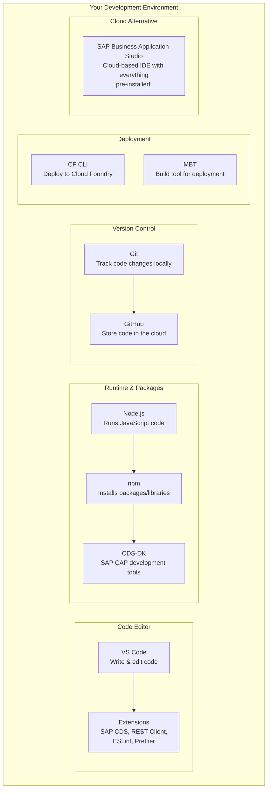
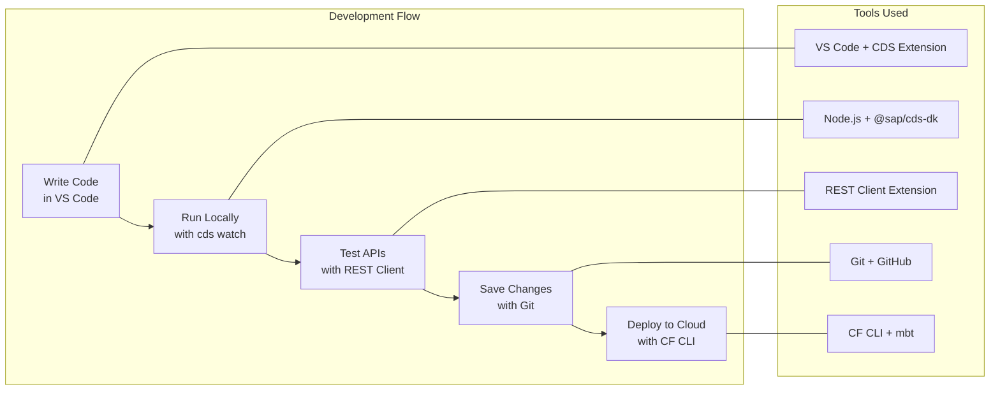
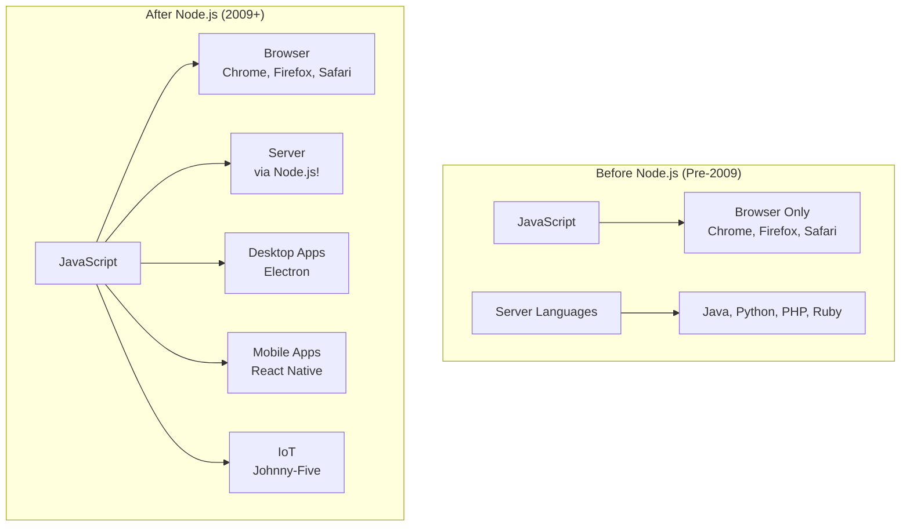
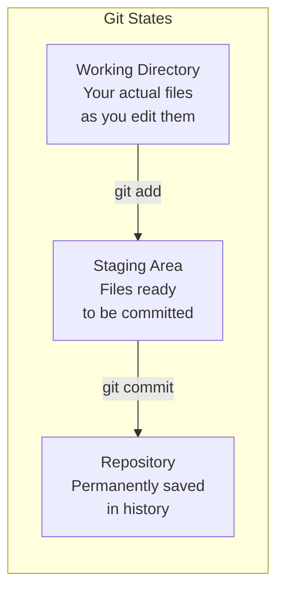

# Day 4: Development Tools Installation & Setup

---

## Day Schedule (8 Hours)

| Time | Session | Duration |
|------|---------|----------|
| 09:00 - 09:15 | Recap of Day 3 & Q&A | 15 min |
| 09:15 - 10:15 | Session 1: Overview of Development Tools for CAP | 60 min |
| 10:15 - 10:30 | Break | 15 min |
| 10:30 - 11:45 | Session 2: VS Code — Features, Extensions & Customization | 75 min |
| 11:45 - 12:45 | Session 3: Hands-on — Install VS Code + Extensions | 60 min |
| 12:45 - 13:30 | Lunch Break | 45 min |
| 13:30 - 14:30 | Session 4: Node.js, npm & Git — Theory | 60 min |
| 14:30 - 14:45 | Break | 15 min |
| 14:45 - 16:00 | Session 5: Hands-on — Install Node.js, Git, CF CLI & CDS-DK | 75 min |
| 16:00 - 16:45 | Session 6: SAP Business Application Studio (BAS) Setup | 45 min |
| 16:45 - 17:00 | Assessment, Final Checklist & Wrap-up | 15 min |

---

## What You'll Learn Today

By the end of this session, you will be able to:
- Explain why each development tool is needed for CAP development
- Install and configure VS Code with SAP-specific extensions
- Install Node.js and understand npm package management
- Install and configure Git for version control
- Install Cloud Foundry CLI for future deployments
- Install the SAP CDS Development Kit (@sap/cds-dk)
- Set up a workspace in SAP Business Application Studio
- Verify all tools are working correctly

---

## Day 3 Recap — Quick Fire (09:00 - 09:15)

1. What are the 4 levels in BTP account hierarchy? → _____, _____, _____, _____
2. What is an entitlement? → _____
3. What is the difference between a Service Instance and a Subscription? → _____
4. What is a Booster? → _____
5. How long does a trial account last? → _____

<details>
<summary>Answers</summary>

1. Global Account → Subaccount → Organization → Space
2. Permission to use a specific BTP service
3. Instance = your app connects to it; Subscription = you access it directly in browser
4. One-click wizard that auto-configures complex setups
5. 90 days (renewable once)

</details>

---

## Session 1: Overview of Development Tools for CAP (09:15 - 10:15)

### Why Do We Need Tools?

Think of building a CAP application like building a house:

| House Building | CAP Development | Tool |
|---------------|-----------------|------|
| You need a workbench | You need a place to write code | **VS Code** (code editor) |
| You need bricks & cement | You need a programming language & runtime | **Node.js** (runtime) |
| You need a hardware store | You need a place to get packages/libraries | **npm** (package manager) |
| You need blueprints | You need to track changes to your design | **Git** (version control) |
| You need a delivery truck | You need to deploy your app to the cloud | **CF CLI** (deployment tool) |
| You need specialized SAP tools | You need SAP-specific capabilities | **@sap/cds-dk** (SAP CAP toolkit) |
| You need a cloud workshop | You need an online workspace (alternative to VS Code) | **SAP BAS** (cloud IDE) |

---

### The Complete Developer Toolkit for CAP



---

### Tool-by-Tool Introduction

#### 1. VS Code (Visual Studio Code)

```
+--------------------------------------------------+
|  What:   Free code editor by Microsoft           |
|  Why:    Lightweight, fast, extensible           |
|  Used by: 73% of developers worldwide!          |
|  Cost:   FREE                                    |
+--------------------------------------------------+
```

**Why not Notepad?** 
- Notepad doesn't understand code (no colors, no auto-complete)
- VS Code gives you: syntax highlighting, auto-complete, error detection, integrated terminal, Git support, debugging

**Analogy:** Notepad is like writing with a pencil. VS Code is like writing with a smart pen that corrects your spelling, suggests words, and organizes your pages automatically!

---

#### 2. Node.js

```
+--------------------------------------------------+
|  What:   JavaScript runtime (runs JS outside     |
|          the browser)                            |
|  Why:    CAP uses Node.js as its backend runtime |
|  Version: We'll use LTS (Long Term Support)      |
|  Cost:   FREE                                    |
+--------------------------------------------------+
```

**Why Node.js?**
- JavaScript was originally only for browsers (frontend)
- Node.js lets you run JavaScript on servers (backend)
- CAP framework is built on Node.js
- One language (JavaScript) for everything!

**Analogy:** JavaScript is like a chef who could only cook in restaurant kitchens (browser). Node.js gives that chef a portable kitchen — now they can cook anywhere (server, desktop, IoT)!

```
Before Node.js:
  Browser  →  JavaScript ✓
  Server   →  Java, Python, PHP (not JavaScript!)

After Node.js:
  Browser  →  JavaScript ✓
  Server   →  JavaScript ✓  ← Node.js made this possible!
```

---

#### 3. npm (Node Package Manager)

```
+--------------------------------------------------+
|  What:   Package manager for Node.js             |
|  Why:    Install & manage code libraries easily  |
|  Comes with: Installed automatically with Node.js|
|  Cost:   FREE                                    |
+--------------------------------------------------+
```

**What is a "package"?**
- A package is a reusable piece of code someone else wrote
- Instead of writing everything from scratch, you use packages
- npm has over 2 million packages available!

**Analogy:** npm is like an **app store for code libraries**. Need date formatting? `npm install moment`. Need a web server? `npm install express`. Need SAP CAP? `npm install @sap/cds-dk`!

**Key npm commands you'll use:**

| Command | What It Does | Example |
|---------|-------------|---------|
| `npm install` | Install all project dependencies | `npm install` (reads package.json) |
| `npm install <pkg>` | Install a specific package | `npm install express` |
| `npm install -g <pkg>` | Install globally (available everywhere) | `npm install -g @sap/cds-dk` |
| `npm init` | Create a new project | `npm init -y` |
| `npm start` | Run your project | `npm start` |
| `npm run <script>` | Run a custom script | `npm run build` |

---

#### 4. Git

```
+--------------------------------------------------+
|  What:   Version control system                  |
|  Why:    Track every change to your code         |
|  Created by: Linus Torvalds (also created Linux!)|
|  Cost:   FREE                                    |
+--------------------------------------------------+
```

**Why version control?**

Without Git:
```
My Project/
├── app.js
├── app_v2.js
├── app_v2_final.js
├── app_v2_final_FINAL.js
├── app_v2_final_FINAL_thisone.js    😱
└── app_backup_dont_delete.js
```

With Git:
```
My Project/
├── app.js         ← Always the latest version!

Git history (invisible, stored safely):
  Commit 5: "Added login feature"        ← today
  Commit 4: "Fixed payment bug"          ← yesterday
  Commit 3: "Added shopping cart"        ← 3 days ago
  Commit 2: "Created product catalog"    ← last week
  Commit 1: "Initial project setup"      ← 2 weeks ago

  → You can go back to ANY version at any time!
```

**Analogy:** Git is like a **time machine** for your code. Made a mistake? Go back in time. Want to try something risky? Create a parallel universe (branch). Someone else wants to work on the same code? Git merges changes automatically!

---

#### 5. Cloud Foundry CLI (cf)

```
+--------------------------------------------------+
|  What:   Command-line tool to interact with CF   |
|  Why:    Deploy apps to SAP BTP Cloud Foundry    |
|  When:   We'll use it heavily in Week 7          |
|  Cost:   FREE                                    |
+--------------------------------------------------+
```

**What it does:**
- Log into your BTP Cloud Foundry space
- Push (deploy) your application
- View logs of running apps
- Scale apps up/down
- Manage service instances

**We install it NOW so it's ready when we need it later!**

---

#### 6. @sap/cds-dk (SAP CDS Development Kit)

```
+--------------------------------------------------+
|  What:   SAP's CAP development toolkit           |
|  Why:    Provides cds commands for building apps |
|  Install: npm install -g @sap/cds-dk            |
|  Cost:   FREE                                    |
+--------------------------------------------------+
```

**What it gives you:**

| Command | What It Does | When You'll Use It |
|---------|-------------|-------------------|
| `cds init` | Create a new CAP project | Week 3 (first CAP project!) |
| `cds watch` | Run your app with auto-reload | Every day from Week 3! |
| `cds add hana` | Add HANA database support | Week 6 |
| `cds add mta` | Add deployment configuration | Week 7 |
| `cds deploy` | Deploy data model to database | Week 3 onwards |
| `cds compile` | Compile CDS models | Debugging |
| `cds env` | Show CDS environment settings | Configuration |

**This is the MOST IMPORTANT tool for our course!**

---

#### 7. SAP Business Application Studio (BAS)

```
+--------------------------------------------------+
|  What:   Cloud-based IDE (code editor in browser)|
|  Why:    Everything pre-installed! Zero setup!   |
|  Access: Via SAP BTP subscription                |
|  Cost:   FREE (in trial)                         |
+--------------------------------------------------+
```

**BAS vs VS Code:**

| Feature | VS Code (Local) | BAS (Cloud) |
|---------|-----------------|-------------|
| Installation | Install on your machine | Open in browser |
| Setup time | 30-60 minutes | 5 minutes |
| Tools pre-installed | No (you install each tool) | Yes! Everything ready |
| Internet required | Only for downloads | Always (it's in the cloud) |
| Performance | Depends on your laptop | Consistent (cloud server) |
| Offline work | Yes | No |
| Customization | Unlimited | Limited to SAP tools |

**For this course:** We'll use BOTH!
- **VS Code** for learning (understand what each tool does)
- **BAS** as backup and for SAP-specific generators

---

### How All Tools Work Together



**The Daily Development Cycle (from Week 3 onwards):**
1. Open VS Code → write/edit CDS models and JavaScript
2. Run `cds watch` → see your app running at localhost:4004
3. Test APIs using REST Client → verify everything works
4. `git add` + `git commit` → save your progress
5. When ready: `cf push` → deploy to SAP BTP (Week 7+)

---

### What is a CLI? (For absolute beginners)

**CLI = Command Line Interface**

It's a way to talk to your computer using **text commands** instead of clicking buttons.

```
GUI (Graphical User Interface) — what you're used to:
+--------------------------------------------------+
|  📁 File Explorer                                |
|  [Click] [Drag] [Double-click] [Right-click]    |
|                                                  |
|  📄 file1.txt                                   |
|  📄 file2.js                                    |
|  📁 folder1                                     |
+--------------------------------------------------+

CLI (Command Line Interface) — what developers use:
+--------------------------------------------------+
|  $ ls                                            |
|  file1.txt  file2.js  folder1/                   |
|                                                  |
|  $ mkdir new-project                             |
|  $ cd new-project                                |
|  $ npm init -y                                   |
|  $ code .                                        |
+--------------------------------------------------+
```

**Why do developers prefer CLI?**
- Faster (no clicking, just type)
- Repeatable (save commands as scripts)
- Powerful (do things GUI can't do)
- Remote (control servers you can't physically touch)

**Don't worry!** We'll learn CLI commands gradually. By the end of the course, you'll be comfortable with the terminal!

---

### Essential Terminal Commands (Cheat Sheet)

You'll need these basic commands throughout the course:

| Command | What It Does | Example | Analogy |
|---------|-------------|---------|---------|
| `ls` (Mac/Linux) / `dir` (Windows) | List files in current folder | `ls` | Looking at files on your desk |
| `cd <folder>` | Change directory (go into a folder) | `cd my-project` | Walking into a room |
| `cd ..` | Go up one folder | `cd ..` | Walking out of a room |
| `mkdir <name>` | Create a new folder | `mkdir my-app` | Creating a new drawer |
| `pwd` | Show current location | `pwd` → `/Users/you/projects` | "Where am I?" |
| `clear` | Clear the terminal screen | `clear` | Wiping the whiteboard |
| `code .` | Open current folder in VS Code | `code .` | "Open this in my editor" |
| `node --version` | Check Node.js version | `node --version` → v20.x.x | "Is this installed?" |
| `npm --version` | Check npm version | `npm --version` → 10.x.x | "Is this installed?" |

**Pro tip:** Press ↑ (up arrow) in terminal to repeat the last command!

---

### Discussion Activity (10 minutes)

Think about apps you use daily (WhatsApp, Instagram, Swiggy, etc.):

1. What programming language do you think their BACKEND is written in?
2. Where do you think their code is stored? (Hint: version control!)
3. How do you think they deploy updates without downtime?

---

## Session 2: VS Code — Features, Extensions & Customization (10:30 - 11:45)

### What is VS Code?

**Visual Studio Code** is a free, open-source code editor made by Microsoft. It's the #1 most popular editor in the world.

**Fun Fact:** VS Code itself is written in JavaScript/TypeScript and runs on... Electron (which uses Node.js)! 🤯

---

### VS Code Interface — Know Your Editor

```
+----------------------------------------------------------------+
|  [File] [Edit] [Selection] [View] [Go] [Run] [Terminal] [Help] |  ← Menu Bar
|----------------------------------------------------------------|
| [📁] |                                          |  [Problems]  |
| [🔍] |  // Welcome Tab                          |  [Output]    |
| [🌿] |                                          |  [Terminal]   |  ← Panel
| [🐛] |  Your code appears here                  |  [Debug]     |
| [📦] |  (Editor Area)                           |              |
|      |                                          |              |
|      |                                          |              |
|  ↑   |                                          |              |
| Side |                                          |              |
| Bar  |                                          |              |
|      |                                          |              |
|----------------------------------------------------------------|
|  main.js  •  Ln 1, Col 1  |  Spaces: 2  |  UTF-8  |  Node.js |  ← Status Bar
+----------------------------------------------------------------+
```

#### Key Areas of VS Code

| Area | Location | Purpose |
|------|----------|---------|
| **Activity Bar** | Left edge (icons) | Switch between panels (files, search, git, debug, extensions) |
| **Side Bar** | Left panel | Shows file explorer, search results, git changes, etc. |
| **Editor Area** | Center (largest) | Where you write and edit code |
| **Panel** | Bottom | Terminal, problems, output, debug console |
| **Status Bar** | Very bottom | File info, git branch, errors/warnings count |
| **Command Palette** | Top center (popup) | Access ANY VS Code feature by typing |

---

### Essential VS Code Keyboard Shortcuts

| Shortcut (Windows/Linux) | Shortcut (Mac) | What It Does |
|--------------------------|----------------|-------------|
| `Ctrl + Shift + P` | `Cmd + Shift + P` | Open Command Palette (MOST IMPORTANT!) |
| `Ctrl + P` | `Cmd + P` | Quick open file by name |
| `Ctrl + B` | `Cmd + B` | Toggle sidebar visibility |
| `` Ctrl + ` `` | `` Cmd + ` `` | Toggle terminal |
| `Ctrl + S` | `Cmd + S` | Save file |
| `Ctrl + /` | `Cmd + /` | Comment/uncomment line |
| `Ctrl + D` | `Cmd + D` | Select next occurrence of word |
| `Ctrl + Shift + F` | `Cmd + Shift + F` | Search across all files |
| `Alt + ↑/↓` | `Option + ↑/↓` | Move line up/down |
| `Ctrl + Shift + K` | `Cmd + Shift + K` | Delete entire line |
| `Ctrl + Z` | `Cmd + Z` | Undo |
| `Ctrl + Shift + Z` | `Cmd + Shift + Z` | Redo |

**The #1 shortcut to remember:** `Ctrl + Shift + P` (Command Palette) — it's the gateway to EVERYTHING in VS Code!

---

### VS Code Extensions — Superpowers for Your Editor

Extensions are like **apps for your editor**. They add new features.

#### Required Extensions for This Course

| Extension | Publisher | What It Does | Priority |
|-----------|-----------|-------------|----------|
| **SAP CDS Language Support** | SAP | Syntax highlighting, auto-complete for CDS files | 🔴 Must have |
| **REST Client** | Huachao Mao | Test APIs directly in VS Code | 🔴 Must have |
| **ESLint** | Microsoft | Finds JavaScript errors as you type | 🟡 Recommended |
| **Prettier** | Prettier | Auto-formats your code beautifully | 🟡 Recommended |
| **GitLens** | GitKraken | Enhanced Git features in the editor | 🟡 Recommended |
| **Material Icon Theme** | Philipp Kief | Beautiful file/folder icons | 🟢 Nice to have |
| **Auto Rename Tag** | Jun Han | Auto-renames paired HTML/XML tags | 🟢 Nice to have |
| **Bracket Pair Colorizer** | Built-in (v2+) | Colors matching brackets | 🟢 Nice to have (built-in now) |

---

#### SAP CDS Language Support — What It Gives You

This is the **single most important extension** for our course!

```
WITHOUT the CDS extension:
+--------------------------------------------------+
|  entity Books {                                  |
|    key ID : UUID;                                |
|    title : String;                               |
|    author : Association to Authors;              |
|  }                                               |
|                                                  |
|  (All plain white text, no help, no completion)  |
+--------------------------------------------------+

WITH the CDS extension:
+--------------------------------------------------+
|  entity Books {                    ← blue (keyword)|
|    key ID : UUID;                  ← highlighted   |
|    title : String;                 ← type colored  |
|    author : Association to Authors;← link colored  |
|  }                                               |
|                                                  |
|  ✓ Syntax highlighting (colors!)                 |
|  ✓ Auto-complete (suggests as you type)          |
|  ✓ Error detection (red underlines)              |
|  ✓ Go to definition (Ctrl+click)                 |
|  ✓ Code snippets (type shortcuts)                |
+--------------------------------------------------+
```

---

#### REST Client Extension — Test APIs Without Leaving VS Code

Instead of switching to Postman or a browser, test APIs right inside VS Code!

```
Create a file: test.http
+--------------------------------------------------+
|  ### Get all books                               |
|  GET http://localhost:4004/catalog/Books          |
|                                                  |
|  ### Create a new book                           |
|  POST http://localhost:4004/catalog/Books         |
|  Content-Type: application/json                  |
|                                                  |
|  {                                               |
|    "title": "Learning CAP",                      |
|    "author": "SAP Team"                          |
|  }                                               |
|                                                  |
|  [Send Request]  ← Click this to execute!        |
+--------------------------------------------------+
```

**Why REST Client over Postman?**
- No separate app to install
- Requests saved as files (versioned with Git!)
- Share API tests with your team easily
- Lightweight and fast

---

### VS Code Settings — Make It Yours

#### Recommended Settings for This Course

Open Settings: `Ctrl + ,` (or `Cmd + ,` on Mac)

| Setting | Value | Why |
|---------|-------|-----|
| Auto Save | `afterDelay` | Never lose work (saves automatically!) |
| Tab Size | `2` | Industry standard for JavaScript/CDS |
| Format On Save | `true` | Code auto-formats when you save |
| Word Wrap | `on` | Long lines wrap instead of scrolling sideways |
| Terminal Font Size | `14` | Easy to read in terminal |
| Minimap | `false` (optional) | Gives more editor space |

#### How to Change Settings

1. Press `Ctrl + ,` (or `Cmd + ,`)
2. Search for the setting name
3. Change the value
4. Settings auto-save!

Or edit `settings.json` directly:
```json
{
  "editor.tabSize": 2,
  "editor.formatOnSave": true,
  "editor.wordWrap": "on",
  "files.autoSave": "afterDelay",
  "terminal.integrated.fontSize": 14
}
```

---

### VS Code Themes — Make It Look Good!

VS Code comes with themes. Popular choices:

| Theme | Style | Good For |
|-------|-------|----------|
| **Dark+ (default dark)** | Dark background, colorful text | Late-night coding |
| **Light+ (default light)** | White background | Bright environments |
| **One Dark Pro** | Atom-style dark theme | Popular choice |
| **Dracula** | Purple-tinted dark | Easy on eyes |
| **GitHub Light/Dark** | GitHub's color scheme | Clean look |

Change theme: `Ctrl + Shift + P` → type "Color Theme" → pick one!

---

## Session 3: Hands-on — Install VS Code + Extensions (11:45 - 12:45)

### Step 1: Download & Install VS Code

#### For Windows:
1. Go to: **https://code.visualstudio.com/**
2. Click **"Download for Windows"** (Stable, x64)
3. Run the downloaded `.exe` file
4. **Important checkboxes during installation:**
   - ✅ Add "Open with Code" action to Windows Explorer file context menu
   - ✅ Add "Open with Code" action to Windows Explorer directory context menu
   - ✅ Add to PATH (important!)
5. Click "Install" → "Finish"

#### For Mac:
1. Go to: **https://code.visualstudio.com/**
2. Click **"Download for Mac"** (Apple Silicon or Intel based on your Mac)
3. Open the downloaded `.zip` file
4. Drag **Visual Studio Code.app** to your **Applications** folder
5. Open VS Code from Applications
6. Add to PATH: Open VS Code → `Cmd + Shift + P` → type "Shell Command" → click "Install 'code' command in PATH"

#### For Linux (Ubuntu/Debian):
```bash
sudo apt update
sudo apt install code
```

---

### Step 2: Verify VS Code Installation

Open a terminal (or command prompt) and type:
```bash
code --version
```

**Expected output:**
```
1.89.0      (or similar version number)
abc123def   (commit hash)
x64         (architecture)
```

If you see a version number — VS Code is installed! ✓

---

### Step 3: Install Required Extensions

#### Method 1: Using the Extension Marketplace (GUI)

1. Open VS Code
2. Click the **Extensions icon** in the Activity Bar (or press `Ctrl + Shift + X`)
3. Search for and install each extension:

**Extension 1: SAP CDS Language Support**
```
Search: "SAP CDS"
Publisher: SAP SE
Click: [Install]
```

**Extension 2: REST Client**
```
Search: "REST Client"
Publisher: Huachao Mao
Click: [Install]
```

**Extension 3: ESLint**
```
Search: "ESLint"
Publisher: Microsoft
Click: [Install]
```

**Extension 4: Prettier - Code Formatter**
```
Search: "Prettier"
Publisher: Prettier
Click: [Install]
```

**Extension 5: Material Icon Theme** (optional but recommended)
```
Search: "Material Icon Theme"
Publisher: Philipp Kief
Click: [Install]
→ After install, click "Set File Icon Theme"
```

---

#### Method 2: Using Terminal (Faster!)

Open VS Code terminal (`` Ctrl + ` ``) and run these commands:

```bash
code --install-extension SAPSE.vscode-cds
code --install-extension humao.rest-client
code --install-extension dbaeumer.vscode-eslint
code --install-extension esbenp.prettier-vscode
code --install-extension PKief.material-icon-theme
```

---

### Step 4: Verify Extensions

1. Press `Ctrl + Shift + X` to open Extensions
2. Click **"Installed"** filter at the top
3. You should see all 5 extensions listed as enabled

---

### Step 5: Configure VS Code Settings

1. Press `Ctrl + ,` to open Settings
2. Make these changes:

| Search For | Change To |
|-----------|-----------|
| "Auto Save" | `afterDelay` |
| "Tab Size" | `2` |
| "Format On Save" | ✅ Check the box |
| "Word Wrap" | `on` |
| "Default Formatter" | Select "Prettier - Code Formatter" |

---

### Step 6: Test Your Setup

1. Create a new file: `Ctrl + N`
2. Save as: `test.cds` (any folder)
3. Type this code:

```cds
namespace my.bookshop;

entity Books {
  key ID : Integer;
  title  : String(100);
  stock  : Integer;
}
```

4. **Check:** Do you see syntax highlighting (colors)?
   - `entity` should be colored differently from `Books`
   - `String`, `Integer` should have their own color
   - If YES → CDS extension is working! ✓

5. Delete the test file when done

---

### Hands-on Exercise: Explore VS Code (10 minutes)

Try these challenges:

| # | Challenge | How To Do It |
|---|-----------|-------------|
| 1 | Open the Command Palette | `Ctrl + Shift + P` |
| 2 | Open a new terminal | `` Ctrl + ` `` |
| 3 | Change the color theme | Command Palette → "Color Theme" |
| 4 | Create a new file called `hello.js` | `Ctrl + N`, then `Ctrl + S` |
| 5 | Type `console.log("Hello World!")` | Just type it in the editor |
| 6 | Open the integrated terminal and run it | `` Ctrl + ` `` then `node hello.js` |
| 7 | Split the editor into 2 panels | `Ctrl + \` |
| 8 | Close all editors | `Ctrl + K, Ctrl + W` |

---

## Session 4: Node.js, npm & Git — Theory (13:30 - 14:30)

### Node.js Deep-Dive

#### What is Node.js?



**Node.js = V8 JavaScript Engine (from Chrome) + Extra capabilities (file system, networking, etc.)**

---

#### Node.js Version Naming

| Type | Example | Meaning |
|------|---------|---------|
| **LTS** (Long Term Support) | v20.x.x | Stable, tested, recommended for production |
| **Current** | v21.x.x | Latest features but might have bugs |

**We always use LTS!** (Currently Node.js 20 LTS)

**Why LTS?**
- 30 months of support and security patches
- Companies use it in production
- SAP officially supports it for CAP

---

#### How Node.js and npm Work Together

```
Node.js Installation:
+------------------------------------------+
|                                          |
|  +------------------+  +---------------+ |
|  | Node.js Runtime  |  | npm           | |
|  | (runs JS code)   |  | (installs     | |
|  |                  |  |  packages)    | |
|  | Command: node    |  | Command: npm  | |
|  +------------------+  +---------------+ |
|                                          |
+------------------------------------------+
         |                      |
         |                      |
  node app.js           npm install express
  (runs your code)      (downloads a library)
```

---

### npm — The Package Manager

#### What is package.json?

Every Node.js project has a `package.json` file — it's like an **ID card** for your project:

```json
{
  "name": "my-cap-project",
  "version": "1.0.0",
  "description": "My first CAP application",
  "scripts": {
    "start": "cds-serve",
    "watch": "cds watch"
  },
  "dependencies": {
    "@sap/cds": "^7.0.0",
    "express": "^4.18.0"
  },
  "devDependencies": {
    "@sap/cds-dk": "^7.0.0"
  }
}
```

| Field | What It Means | Analogy |
|-------|-------------|---------|
| `name` | Project name | Your name |
| `version` | Current version | Your age |
| `description` | What the project does | Your bio |
| `scripts` | Custom commands you can run | Your daily routines |
| `dependencies` | Packages your app NEEDS to run | Ingredients for a recipe |
| `devDependencies` | Packages needed only during development | Kitchen tools (not served to customers) |

---

#### Global vs Local Install

| Type | Command | Where It Goes | Use For |
|------|---------|--------------|---------|
| **Global** (`-g`) | `npm install -g @sap/cds-dk` | System-wide (available everywhere) | CLI tools you use across projects |
| **Local** (default) | `npm install express` | `node_modules/` in your project | Libraries specific to one project |

```
Global install:
  You → can use `cds` command from ANY folder

Local install:
  You → can only use the package in THIS project's folder
```

**Rule of thumb:**
- **Install globally:** CLI tools (cds-dk, cf cli, eslint)
- **Install locally:** Libraries your app imports (express, @sap/cds)

---

#### node_modules — The Black Hole 🕳️

When you run `npm install`, it creates a `node_modules` folder containing all downloaded packages.

```
my-project/
├── package.json          ← Defines what you need
├── node_modules/         ← Contains actual packages (DON'T TOUCH!)
│   ├── express/
│   ├── @sap/cds/
│   ├── lodash/
│   └── ... (hundreds of folders!)
├── app.js
└── .gitignore            ← Tells Git to IGNORE node_modules!
```

**Important rules:**
- ❌ NEVER edit files inside `node_modules`
- ❌ NEVER commit `node_modules` to Git (it's too big!)
- ✅ Always add `node_modules` to `.gitignore`
- ✅ If you delete `node_modules`, just run `npm install` to recreate it

---

### Git — Version Control Deep Dive

#### The 3 States of Git

Every file in a Git project is in one of 3 states:



**Analogy — Taking a Group Photo:**
1. **Working Directory** = Everyone wandering around (you're editing files)
2. **Staging Area** = "Everyone line up for the photo!" (you select which changes to save)
3. **Repository** = *CLICK!* Photo is taken and saved in the album (changes are permanently recorded)

---

#### Essential Git Commands

| Command | What It Does | Analogy |
|---------|-------------|---------|
| `git init` | Create a new git repo in current folder | "Start tracking this folder" |
| `git status` | Show which files changed | "What's different since last photo?" |
| `git add <file>` | Stage a file for commit | "Get in line for the photo!" |
| `git add .` | Stage ALL changed files | "Everyone get in line!" |
| `git commit -m "message"` | Save staged changes permanently | *CLICK!* Take the photo |
| `git log` | Show history of commits | "Show me the photo album" |
| `git diff` | Show what changed in files | "What's different from last save?" |
| `git clone <url>` | Download a repo from GitHub | "Copy someone's project" |
| `git push` | Upload commits to GitHub | "Upload photos to the cloud" |
| `git pull` | Download latest from GitHub | "Get latest photos from the cloud" |

---

#### Git Workflow Visualization

```
Your typical Git workflow:

1. Edit files (Working Directory)
   app.js → add new feature

2. Check what changed
   $ git status
   → modified: app.js

3. Stage the changes
   $ git add app.js
   → app.js moves to staging area

4. Commit (save permanently)
   $ git commit -m "Added login feature"
   → Saved in repository history!

5. Push to GitHub (share with team)
   $ git push origin main
   → Now everyone can see your changes!
```

---

#### Why .gitignore Matters

Some files should NEVER be tracked by Git:

```
# .gitignore file for CAP projects

node_modules/          ← Too big (100s of MBs!)
.env                   ← Contains passwords/secrets!
*.sqlite               ← Local database (regenerated)
mta_archives/          ← Build outputs
default-env.json       ← Local environment variables
```

**We'll create proper .gitignore files when we start our CAP project in Week 3!**

---

### Interactive Quiz: Match the Tool to Its Job (5 minutes)

| # | Job Description | Tool |
|---|----------------|------|
| 1 | "I write and edit code with colors and auto-complete" | ? |
| 2 | "I run JavaScript code outside the browser" | ? |
| 3 | "I install packages/libraries from the internet" | ? |
| 4 | "I track every change to your code over time" | ? |
| 5 | "I deploy your app to SAP BTP Cloud Foundry" | ? |
| 6 | "I provide SAP-specific commands like cds init and cds watch" | ? |
| 7 | "I test API endpoints without leaving the editor" | ? |

<details>
<summary>Answers</summary>

1. VS Code
2. Node.js
3. npm
4. Git
5. CF CLI
6. @sap/cds-dk
7. REST Client (VS Code extension)

</details>

---

## Session 5: Hands-on — Install Node.js, Git, CF CLI & CDS-DK (14:45 - 16:00)

### Installation 1: Node.js (LTS)

#### For Windows:
1. Go to: **https://nodejs.org/**
2. Click the **LTS** version (should say "Recommended For Most Users")
3. Run the downloaded `.msi` installer
4. Click "Next" through all screens (keep defaults)
5. **Important:** Make sure "Add to PATH" is checked
6. Click "Install" → "Finish"

#### For Mac:
```bash
# Option 1: Download from website
# Go to https://nodejs.org/ and download the .pkg file

# Option 2: Using Homebrew (if you have it)
brew install node@20
```

#### For Linux (Ubuntu):
```bash
curl -fsSL https://deb.nodesource.com/setup_20.x | sudo -E bash -
sudo apt-get install -y nodejs
```

---

#### Verify Node.js Installation

Open a NEW terminal (close and reopen if already open) and run:

```bash
node --version
```
**Expected:** `v20.x.x` (or similar LTS version)

```bash
npm --version
```
**Expected:** `10.x.x` (or similar)

---

#### Quick Test: Run Your First JavaScript!

1. Open terminal
2. Type `node` and press Enter (you're now in Node.js REPL!)
3. Type: `console.log("Hello, I am a future SAP developer!")`
4. Press Enter
5. You should see: `Hello, I am a future SAP developer!`
6. Type `.exit` to leave the REPL

```
$ node
Welcome to Node.js v20.x.x
> console.log("Hello, I am a future SAP developer!")
Hello, I am a future SAP developer!
> 2 + 2
4
> "SAP" + " " + "BTP"
'SAP BTP'
> .exit
$
```

**Congratulations! You just ran JavaScript outside a browser!** 🎉

---

### Installation 2: Git

#### For Windows:
1. Go to: **https://git-scm.com/download/win**
2. Download and run the installer
3. **Important settings during installation:**
   - Default editor: Select **"Use Visual Studio Code as Git's default editor"**
   - PATH: Select **"Git from the command line and also from 3rd-party software"**
   - Line endings: **"Checkout Windows-style, commit Unix-style"**
   - Everything else: keep defaults
4. Click "Install" → "Finish"

#### For Mac:
```bash
# Git usually comes pre-installed on Mac!
# Verify with: git --version

# If not installed, you'll be prompted to install Xcode Command Line Tools
# Or use Homebrew:
brew install git
```

#### For Linux (Ubuntu):
```bash
sudo apt update
sudo apt install git
```

---

#### Verify Git Installation

```bash
git --version
```
**Expected:** `git version 2.x.x`

---

#### Configure Git (Your Identity)

Git needs to know who you are (this appears in your commits):

```bash
git config --global user.name "Your Name"
git config --global user.email "your.email@example.com"
```

**Replace with your actual name and email!**

Verify your configuration:
```bash
git config --global user.name
git config --global user.email
```

#### Additional Recommended Git Settings

```bash
# Set VS Code as default editor for Git
git config --global core.editor "code --wait"

# Set default branch name to 'main' (modern standard)
git config --global init.defaultBranch main

# Enable colored output
git config --global color.ui auto
```

---

#### Quick Test: Create Your First Git Repository

```bash
# Create a test folder
mkdir git-test
cd git-test

# Initialize git
git init

# Check status
git status

# Create a file
echo "Hello Git!" > readme.txt

# Check status again (file shows as untracked)
git status

# Stage the file
git add readme.txt

# Commit
git commit -m "My first commit!"

# See your commit in the log
git log
```

**Expected output of `git log`:**
```
commit abc1234... (HEAD -> main)
Author: Your Name <your.email@example.com>
Date:   Mon May 19 2026 ...

    My first commit!
```

**You just made your first Git commit!** 🎉

```bash
# Cleanup: go back and delete test folder
cd ..
rm -rf git-test
```

---

### Installation 3: Cloud Foundry CLI

#### For Windows:
1. Go to: **https://github.com/cloudfoundry/cli/wiki/V8-CLI-Installation**
2. Download the Windows 64-bit installer
3. Run the installer
4. Follow the setup wizard (keep defaults)

#### For Mac:
```bash
# Using Homebrew
brew install cloudfoundry/tap/cf-cli@8
```

#### For Linux (Ubuntu):
```bash
# Add Cloud Foundry repository
wget -q -O - https://packages.cloudfoundry.org/debian/cli.cloudfoundry.org.key | sudo apt-key add -
echo "deb https://packages.cloudfoundry.org/debian stable main" | sudo tee /etc/apt/sources.list.d/cloudfoundry-cli.list
sudo apt update
sudo apt install cf8-cli
```

---

#### Verify CF CLI Installation

```bash
cf --version
```
**Expected:** `cf version 8.x.x`

---

#### Quick Test: Check CF CLI Help

```bash
cf help
```

This shows all available commands. Don't worry about understanding them all now — we'll use them in Week 7!

Key commands you'll eventually use:
```
cf login          - Log in to Cloud Foundry
cf push           - Deploy an app
cf apps           - List running apps
cf logs           - View app logs
cf services       - List service instances
```

---

### Installation 4: SAP CDS Development Kit (@sap/cds-dk)

This is installed via npm (which you installed with Node.js):

```bash
npm install -g @sap/cds-dk
```

**What the flags mean:**
- `install` = download and install the package
- `-g` = globally (available from any folder, not just one project)
- `@sap/cds-dk` = the package name (SAP's CAP Development Kit)

**This will take 1-2 minutes** (downloading many packages).

---

#### Verify CDS-DK Installation

```bash
cds --version
```

**Expected output (similar to):**
```
@sap/cds-dk: 7.x.x
@sap/cds: 7.x.x
Node.js: v20.x.x
```

---

#### Quick Test: Try CDS Commands

```bash
# Show help
cds help

# Show available commands
cds

# Show environment
cds env
```

**The most important cds commands (preview):**

| Command | What It Does | When We'll Use It |
|---------|-------------|-------------------|
| `cds init my-project` | Create a new CAP project | Week 3 Day 11 |
| `cds watch` | Start local server with live reload | Every day from Week 3! |
| `cds add hana` | Add HANA database config | Week 6 |
| `cds add mta` | Add deployment config | Week 7 |
| `cds deploy` | Deploy data model | Week 3+ |
| `cds compile <file>` | Compile a CDS file | Debugging |

---

#### Quick Test: Peek at What cds init Creates

Let's quickly see what a CAP project looks like (we'll do this properly in Week 3):

```bash
# Create a temporary test project
mkdir cds-test
cd cds-test
cds init

# Look at what was created
ls
```

**Expected output:**
```
app/          ← Frontend code goes here
db/           ← Database models go here
srv/          ← Service definitions go here
package.json  ← Project configuration
README.md     ← Documentation
```

```bash
# Clean up
cd ..
rm -rf cds-test
```

**Exciting!** That's the skeleton of every CAP project we'll build! 

---

### Installation Summary Checkpoint

Run all version commands together to verify everything:

```bash
echo "=== VS Code ===" && code --version
echo "=== Node.js ===" && node --version
echo "=== npm ===" && npm --version
echo "=== Git ===" && git --version
echo "=== CF CLI ===" && cf --version
echo "=== CDS-DK ===" && cds --version
```

**Your output should look something like:**
```
=== VS Code ===
1.89.0
...
=== Node.js ===
v20.14.0
=== npm ===
10.7.0
=== Git ===
git version 2.45.0
=== CF CLI ===
cf version 8.7.0
=== CDS-DK ===
@sap/cds-dk: 7.9.0
@sap/cds: 7.9.0
Node.js: v20.14.0
```

**All showing versions? Everything is installed!** ✅

---

### Troubleshooting Installation Issues

| Problem | Likely Cause | Solution |
|---------|-------------|----------|
| `'node' is not recognized` | PATH not set | Restart terminal; reinstall Node.js with "Add to PATH" checked |
| `'git' is not recognized` | Git not in PATH | Restart terminal; reinstall Git with PATH option |
| `'cf' is not recognized` | CF CLI not in PATH | Restart terminal; or manually add to system PATH |
| `'cds' is not recognized` | npm global path issue | Run: `npm config get prefix` and add that path to system PATH |
| `npm ERR! permission denied` | Need admin/sudo | Mac/Linux: use `sudo npm install -g @sap/cds-dk` |
| `npm WARN deprecated` | Package has newer version | Ignore these warnings — not an error! |
| Slow npm install | Network/firewall | Try: `npm config set registry https://registry.npmjs.org/` |

**Golden Rule:** Always CLOSE and REOPEN your terminal after installing something new!

---

## Session 6: SAP Business Application Studio (BAS) Setup (16:00 - 16:45)

### What is SAP Business Application Studio?

**BAS** = A cloud-based IDE (Integrated Development Environment) provided by SAP.

Think of it as **"VS Code in the cloud"** — but pre-configured with everything you need for SAP development!

```
+--------------------------------------------------+
|  Your Browser (Chrome/Firefox)                   |
|                                                  |
|  +--------------------------------------------+  |
|  |  SAP Business Application Studio           |  |
|  |                                            |  |
|  |  Looks and feels like VS Code!             |  |
|  |  But runs on SAP's servers, not your laptop|  |
|  |                                            |  |
|  |  Pre-installed:                            |  |
|  |  ✓ Node.js                                 |  |
|  |  ✓ Git                                     |  |
|  |  ✓ CF CLI                                  |  |
|  |  ✓ @sap/cds-dk                             |  |
|  |  ✓ SAP Fiori tools                         |  |
|  |  ✓ MTA Build Tool                          |  |
|  |  ✓ All SAP extensions                      |  |
|  |                                            |  |
|  +--------------------------------------------+  |
|                                                  |
+--------------------------------------------------+
```

---

### When to Use BAS vs Local VS Code

| Situation | Use BAS | Use Local VS Code |
|-----------|---------|-------------------|
| Laptop is slow/low specs | ✅ | ❌ |
| No internet available | ❌ | ✅ |
| Want zero setup | ✅ | ❌ |
| Need SAP Fiori generators | ✅ (built-in) | ❌ (needs extra setup) |
| Want full customization | ❌ | ✅ |
| Working in a team (shared setup) | ✅ | ❌ |
| Learning/exploring | Either works! | Either works! |

---

### Step-by-Step: Set Up BAS

#### Step 1: Subscribe to BAS in BTP Trial

1. Log into SAP BTP Trial Cockpit: **https://cockpit.hanatrial.ondemand.com/**
2. Click on your **"trial"** subaccount
3. Go to **Service Marketplace** (left menu)
4. Search for **"SAP Business Application Studio"**
5. Click on it → Click **"Create"** → Plan: **"trial"**
6. Wait 1-2 minutes for subscription to activate

```
Service Marketplace → SAP Business Application Studio
+--------------------------------------------------+
|  SAP Business Application Studio                 |
|                                                  |
|  Plan: trial (free)                              |
|                                                  |
|  [  Create  ]  ← Click this!                    |
|                                                  |
+--------------------------------------------------+
```

---

#### Step 2: Access BAS

1. After subscription is active, go to **"Instances and Subscriptions"** (left menu)
2. Find **"SAP Business Application Studio"** in the Subscriptions list
3. Click **"Go to Application"** (or the link icon)
4. BAS opens in a new browser tab!

---

#### Step 3: Create a Dev Space

A **Dev Space** is your personal workspace in BAS. Think of it as a dedicated virtual machine for your project.

1. Click **"Create Dev Space"**
2. Fill in:
   - **Name:** `CAPDevelopment` (or any name you like)
   - **Type:** Select **"Full Stack Cloud Application"** ← This includes everything for CAP!
3. Click **"Create Dev Space"**
4. Wait 1-2 minutes for it to start (status changes to "RUNNING")
5. Click on the Dev Space name to open it

```
Create Dev Space:
+--------------------------------------------------+
|  Name: [CAPDevelopment        ]                  |
|                                                  |
|  Choose Application Type:                        |
|                                                  |
|  ○ Basic Tools                                   |
|  ● Full Stack Cloud Application  ← Select this! |
|  ○ SAP Fiori                                     |
|  ○ SAP HANA Native Application                   |
|  ○ SAP Mobile Application                        |
|                                                  |
|  Additional SAP Extensions: (optional)           |
|  ☐ MTA Tools                                     |
|  ☐ SAP HANA Tools                                |
|                                                  |
|  [  Create Dev Space  ]                          |
+--------------------------------------------------+
```

---

#### Step 4: Explore BAS Interface

Once your Dev Space is running and you open it:

```
+----------------------------------------------------------------+
|  SAP Business Application Studio                                |
|----------------------------------------------------------------|
|  Looks almost IDENTICAL to VS Code!                            |
|                                                                |
|  - Same layout (Activity Bar, Sidebar, Editor, Panel)          |
|  - Same keyboard shortcuts                                     |
|  - Same extension system                                       |
|  - Terminal included (with all tools pre-installed!)            |
|                                                                |
|  Open terminal: Ctrl + ` (backtick)                           |
|  Try: node --version, npm --version, cds --version, cf --version|
+----------------------------------------------------------------+
```

---

#### Step 5: Verify Tools in BAS

Open the terminal in BAS (`` Ctrl + ` ``) and run:

```bash
node --version
npm --version
git --version
cf --version
cds --version
```

**Everything should work without installing anything!** That's the magic of BAS.

---

### BAS Dev Space Management

| Dev Space Status | Meaning | Action |
|-----------------|---------|--------|
| 🟢 RUNNING | Active and accessible | You can open and use it |
| 🟡 STARTING | Booting up | Wait 1-2 minutes |
| ⚪ STOPPED | Not running (saves resources) | Click "▶" to start |
| 🔴 ERROR | Something went wrong | Delete and recreate |

**Important:**
- Dev Spaces auto-stop after inactivity (usually 1 hour in trial)
- You can have max 2 Dev Spaces in trial (only 1 running at a time)
- Data is saved even when stopped — you don't lose your work!

---

### BAS vs Local: Quick Comparison Demo

| Feature | Local (What You Did Today) | BAS (What You Just Set Up) |
|---------|---------------------------|---------------------------|
| Setup time | ~45 minutes | ~5 minutes |
| Node.js | You installed it | Pre-installed ✓ |
| Git | You installed it | Pre-installed ✓ |
| CF CLI | You installed it | Pre-installed ✓ |
| CDS-DK | You installed it | Pre-installed ✓ |
| SAP Extensions | You installed them | Pre-installed ✓ |
| Fiori Generators | Need extra setup later | Pre-installed ✓ |
| Works offline | Yes ✓ | No ✗ |
| Performance | Depends on your laptop | Consistent (cloud) |
| Customization | Unlimited | Limited |

**Recommendation:** Use **local VS Code** as primary (you learn more), use **BAS** as backup or when you need SAP-specific generators!

---

## Assessment: MCQ (15 Questions)

### Code Editor

**Q1.** What is VS Code?
- a) A web browser
- b) A free code editor by Microsoft
- c) A database
- d) A cloud service

<details><summary>Answer</summary>b) A free code editor by Microsoft — the most popular code editor in the world</details>

---

**Q2.** Which keyboard shortcut opens the Command Palette in VS Code?
- a) Ctrl + S
- b) Ctrl + P
- c) Ctrl + Shift + P
- d) Ctrl + C

<details><summary>Answer</summary>c) Ctrl + Shift + P — the gateway to every VS Code feature</details>

---

**Q3.** The SAP CDS Language Support extension provides:
- a) Database management
- b) Syntax highlighting and auto-complete for .cds files
- c) Cloud deployment
- d) Git integration

<details><summary>Answer</summary>b) Syntax highlighting and auto-complete for .cds files</details>

---

### Node.js & npm

**Q4.** Node.js allows you to:
- a) Run JavaScript only in browsers
- b) Run JavaScript outside the browser (on servers)
- c) Write CSS code
- d) Create databases

<details><summary>Answer</summary>b) Run JavaScript outside the browser — on servers, desktops, and more</details>

---

**Q5.** What does LTS stand for in "Node.js LTS"?
- a) Latest Technology Standard
- b) Long Term Support
- c) Linux Terminal System
- d) Low Technical Specification

<details><summary>Answer</summary>b) Long Term Support — stable, tested, recommended for production use</details>

---

**Q6.** What is npm?
- a) A programming language
- b) A Node.js Package Manager
- c) A database tool
- d) A browser extension

<details><summary>Answer</summary>b) Node Package Manager — installs and manages JavaScript libraries</details>

---

**Q7.** `npm install -g @sap/cds-dk` — what does the `-g` flag mean?
- a) Install in current folder only
- b) Install globally (available from any folder)
- c) Install the latest version
- d) Install without dependencies

<details><summary>Answer</summary>b) Install globally — the tool is available from any folder on your system</details>

---

**Q8.** The `package.json` file contains:
- a) Your application's source code
- b) Project metadata and list of dependencies
- c) Database configuration
- d) HTML templates

<details><summary>Answer</summary>b) Project metadata (name, version) and list of dependencies (packages needed)</details>

---

### Git

**Q9.** Git is used for:
- a) Creating websites
- b) Version control (tracking code changes over time)
- c) Testing applications
- d) Deploying to the cloud

<details><summary>Answer</summary>b) Version control — tracking every change to your code with full history</details>

---

**Q10.** The command `git commit -m "message"` does what?
- a) Uploads code to GitHub
- b) Saves staged changes permanently in the repository
- c) Creates a new branch
- d) Downloads code from a server

<details><summary>Answer</summary>b) Saves (commits) the staged changes permanently with a descriptive message</details>

---

**Q11.** Which file tells Git to ignore certain files/folders?
- a) .gitconfig
- b) .gitignore
- c) .gitexclude
- d) .gitnone

<details><summary>Answer</summary>b) .gitignore — lists files and folders Git should NOT track (like node_modules)</details>

---

### SAP Tools

**Q12.** The `cds watch` command:
- a) Deploys your app to the cloud
- b) Starts a local server with auto-reload when files change
- c) Installs dependencies
- d) Creates a new project

<details><summary>Answer</summary>b) Starts a local development server that auto-reloads when you change code</details>

---

**Q13.** The Cloud Foundry CLI (`cf`) is used to:
- a) Write code
- b) Deploy applications to SAP BTP Cloud Foundry
- c) Design databases
- d) Create user interfaces

<details><summary>Answer</summary>b) Deploy and manage applications in SAP BTP's Cloud Foundry environment</details>

---

**Q14.** SAP Business Application Studio (BAS) is:
- a) A local application installed on your PC
- b) A cloud-based IDE accessed through a browser
- c) A database tool
- d) A mobile app

<details><summary>Answer</summary>b) A cloud-based IDE (code editor in the browser) with SAP tools pre-installed</details>

---

**Q15.** What type of Dev Space should you create in BAS for CAP development?
- a) Basic Tools
- b) SAP HANA Native Application
- c) Full Stack Cloud Application
- d) SAP Mobile Application

<details><summary>Answer</summary>c) Full Stack Cloud Application — includes all tools needed for CAP (Node.js, CDS, Fiori, etc.)</details>

---

### Bonus MCQs (5 Extra)

**Q16.** The `node_modules` folder should:
- a) Be committed to Git
- b) Never be committed to Git (add to .gitignore)
- c) Be deleted after installation
- d) Be shared via email

<details><summary>Answer</summary>b) Never committed to Git — it's too large and can be regenerated with `npm install`</details>

---

**Q17.** Which command creates a new CAP project?
- a) `cds new`
- b) `cds init`
- c) `cds create`
- d) `npm init cds`

<details><summary>Answer</summary>b) `cds init` — creates the standard CAP project structure (app, db, srv folders)</details>

---

**Q18.** The REST Client extension in VS Code lets you:
- a) Create REST APIs
- b) Test/call APIs directly from VS Code using .http files
- c) Build user interfaces
- d) Deploy applications

<details><summary>Answer</summary>b) Test APIs by sending HTTP requests directly from .http files in VS Code</details>

---

**Q19.** `git config --global user.name "Your Name"` sets:
- a) Your GitHub password
- b) The name that appears on your Git commits
- c) Your VS Code username
- d) Your SAP BTP login

<details><summary>Answer</summary>b) The author name that will appear on all your Git commits</details>

---

**Q20.** What is the advantage of BAS over local VS Code for SAP development?
- a) It's faster
- b) All SAP tools are pre-installed (zero setup needed)
- c) It works offline
- d) It has better themes

<details><summary>Answer</summary>b) All SAP tools come pre-installed — no need to install Node.js, Git, CDS-DK, or extensions manually</details>

---

## Final Checklist — Verify All Tools

Use this checklist to confirm everything is installed correctly. Run each command and check the output:

### The Verification Script

Copy and paste this into your terminal:

```bash
echo "======================================"
echo "  SAP CAP Development Environment"
echo "  Installation Verification"
echo "======================================"
echo ""
echo "1. VS Code:"
code --version 2>/dev/null && echo "   ✓ Installed" || echo "   ✗ NOT FOUND"
echo ""
echo "2. Node.js:"
node --version 2>/dev/null && echo "   ✓ Installed" || echo "   ✗ NOT FOUND"
echo ""
echo "3. npm:"
npm --version 2>/dev/null && echo "   ✓ Installed" || echo "   ✗ NOT FOUND"
echo ""
echo "4. Git:"
git --version 2>/dev/null && echo "   ✓ Installed" || echo "   ✗ NOT FOUND"
echo ""
echo "5. Cloud Foundry CLI:"
cf --version 2>/dev/null && echo "   ✓ Installed" || echo "   ✗ NOT FOUND"
echo ""
echo "6. SAP CDS-DK:"
cds --version 2>/dev/null && echo "   ✓ Installed" || echo "   ✗ NOT FOUND"
echo ""
echo "======================================"
echo "  Git Configuration:"
echo "  Name:  $(git config --global user.name)"
echo "  Email: $(git config --global user.email)"
echo "======================================"
echo ""
echo "7. VS Code Extensions:"
code --list-extensions 2>/dev/null | grep -i "sapse\|rest-client\|eslint\|prettier" || echo "   Check manually in VS Code"
echo ""
echo "======================================"
echo "  VERIFICATION COMPLETE!"
echo "======================================"
```

### Manual Checklist

| # | Tool | Command | Expected Output | Your Status |
|---|------|---------|-----------------|-------------|
| 1 | VS Code | `code --version` | 1.89+ | ☐ Working |
| 2 | Node.js | `node --version` | v20.x.x | ☐ Working |
| 3 | npm | `npm --version` | 10.x.x | ☐ Working |
| 4 | Git | `git --version` | 2.40+ | ☐ Working |
| 5 | CF CLI | `cf --version` | 8.x.x | ☐ Working |
| 6 | CDS-DK | `cds --version` | 7.x.x | ☐ Working |
| 7 | Git username | `git config --global user.name` | Your name | ☐ Set |
| 8 | Git email | `git config --global user.email` | Your email | ☐ Set |
| 9 | SAP CDS extension | Check in VS Code | Installed & enabled | ☐ Working |
| 10 | REST Client extension | Check in VS Code | Installed & enabled | ☐ Working |
| 11 | BAS Dev Space | Access BAS URL | Status: RUNNING | ☐ Working |

### What If Something Failed?

| Tool | Quick Fix |
|------|-----------|
| VS Code not in terminal | Add to PATH: VS Code → Cmd Palette → "Shell Command: Install" |
| Node.js not found | Close & reopen terminal; or reinstall with PATH option |
| npm permission errors | Mac/Linux: prefix with `sudo`; Windows: run terminal as Admin |
| Git not found | Close & reopen terminal; or reinstall |
| CF CLI not found | Restart terminal; verify installation folder is in PATH |
| CDS not found | Check: `npm list -g @sap/cds-dk`; reinstall if needed |
| BAS won't start | Check entitlements; try deleting and recreating Dev Space |

---

## Key Takeaways

| # | Topic | One-Line Summary |
|---|---|---|
| 1 | VS Code | Free code editor — our primary workspace for writing CAP apps |
| 2 | Extensions | SAP CDS + REST Client are must-haves; they add superpowers to VS Code |
| 3 | Node.js | JavaScript runtime — lets us run CAP apps locally |
| 4 | npm | Package manager — installs libraries and tools from the internet |
| 5 | Git | Version control — tracks every change to code, enables collaboration |
| 6 | .gitignore | Tells Git to ignore node_modules, .env, and other generated files |
| 7 | CF CLI | Deployment tool — pushes apps to SAP BTP (used in Week 7) |
| 8 | @sap/cds-dk | SAP's CAP toolkit — provides cds init, cds watch, cds deploy |
| 9 | BAS | Cloud IDE — VS Code in the browser with everything pre-installed |
| 10 | package.json | Project ID card — lists dependencies, scripts, and metadata |

---

## Glossary of New Terms

| Term | Definition |
|------|-----------|
| **IDE** | Integrated Development Environment — a tool for writing code (VS Code, BAS) |
| **CLI** | Command Line Interface — text-based way to interact with tools |
| **Terminal** | The window where you type CLI commands |
| **Node.js** | JavaScript runtime that allows JS to run outside browsers |
| **npm** | Node Package Manager — installs JS packages from the internet |
| **Package** | A reusable piece of code (library) published on npmjs.com |
| **package.json** | File that defines a Node.js project and its dependencies |
| **node_modules** | Folder containing all installed packages (never commit to Git!) |
| **LTS** | Long Term Support — stable Node.js version recommended for production |
| **Git** | Distributed version control system for tracking code changes |
| **Repository (Repo)** | A folder tracked by Git (contains the full history of changes) |
| **Commit** | A saved snapshot of your code at a point in time |
| **Staging Area** | Where you prepare files before committing them |
| **.gitignore** | File listing what Git should NOT track |
| **CF CLI** | Cloud Foundry Command Line Interface — deploys apps to BTP |
| **@sap/cds-dk** | SAP CDS Development Kit — CAP framework tooling |
| **Dev Space** | A virtual workspace in SAP Business Application Studio |
| **Extension** | A plugin that adds features to VS Code |
| **REPL** | Read-Eval-Print Loop — interactive coding mode (try `node` in terminal) |

---

## Preparation for Day 5

Tomorrow is **BTP Services & Revision Day** (Week 1 finale!). To prepare:
- Make sure ALL tools from today are working (run the checklist script)
- Keep your BTP Trial account logged in
- Review your notes from Days 1-4 — there will be a cumulative quiz!
- If any tool is not working, arrive 15 minutes early for troubleshooting help
- Optional: Try running `cds init test-project` and explore the generated files

---

## Additional Resources

| Resource | Link | Purpose |
|----------|------|---------|
| VS Code Download | https://code.visualstudio.com/ | Download VS Code |
| Node.js Download | https://nodejs.org/ | Download Node.js LTS |
| Git Download | https://git-scm.com/ | Download Git |
| CF CLI Releases | https://github.com/cloudfoundry/cli/releases | CF CLI downloads |
| SAP CDS-DK | https://www.npmjs.com/package/@sap/cds-dk | npm page for CDS-DK |
| VS Code Keyboard Shortcuts | https://code.visualstudio.com/shortcuts/keyboard-shortcuts-windows.pdf | Full shortcut reference |
| Git Cheat Sheet | https://education.github.com/git-cheat-sheet-education.pdf | Quick Git reference |
| SAP BAS Documentation | https://help.sap.com/docs/bas | BAS official docs |
| npm Documentation | https://docs.npmjs.com/ | npm official docs |

---

*End of Day 4*
