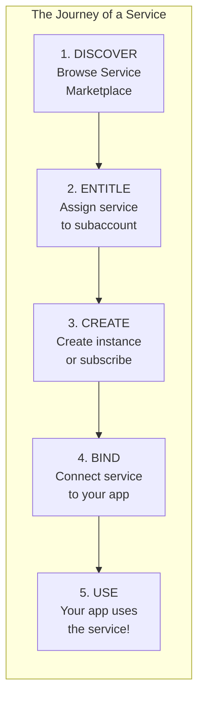
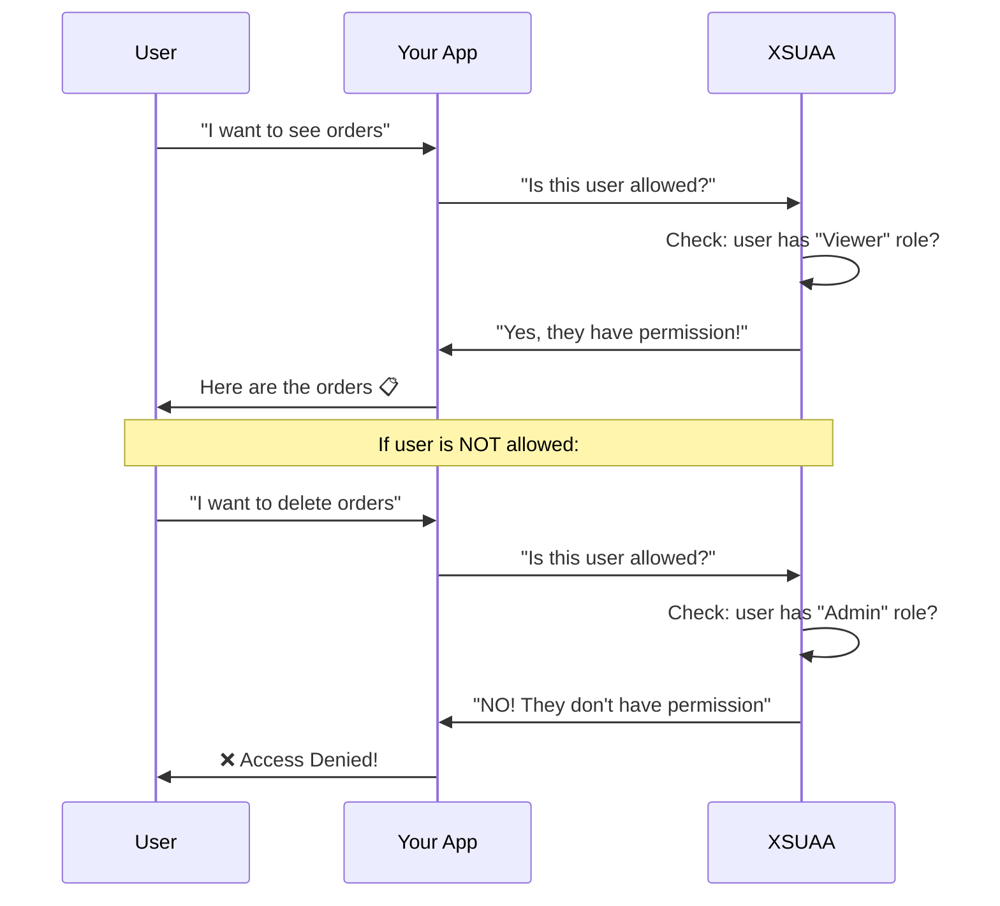
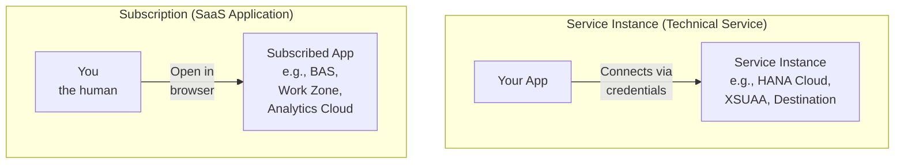
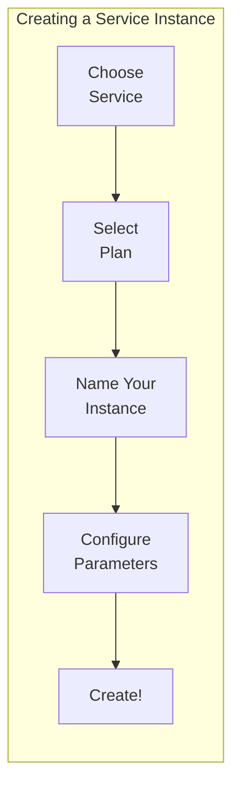
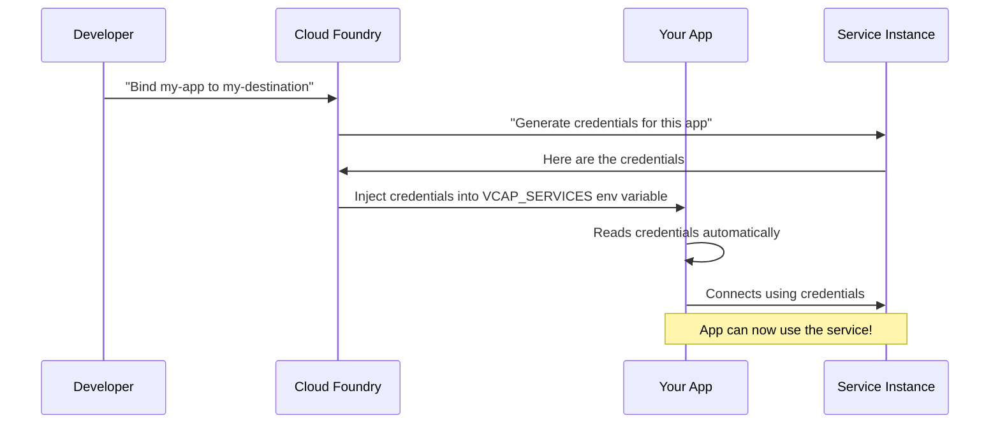
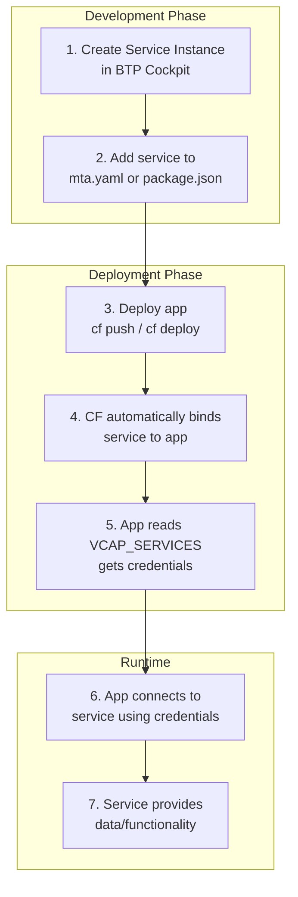
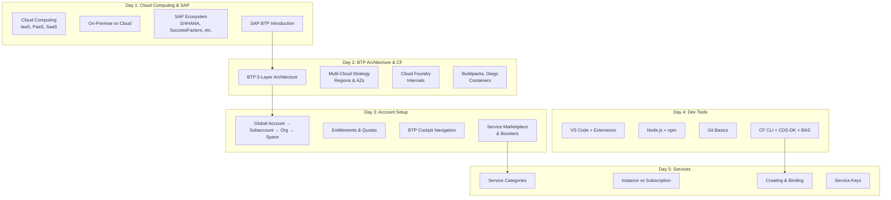

# Day 5: BTP Services & Revision Day (Week 1 Finale)

---

## Day Schedule (8 Hours)

| Time | Session | Duration |
|------|---------|----------|
| 09:00 - 09:15 | Day 4 Recap & Tool Check | 15 min |
| 09:15 - 10:30 | Session 1: SAP BTP Service Categories Deep-Dive | 75 min |
| 10:30 - 10:45 | Break | 15 min |
| 10:45 - 12:00 | Session 2: Subscribing, Creating & Binding Services | 75 min |
| 12:00 - 13:00 | Session 3: Hands-on — Subscribe to BAS & Create Service Instance | 60 min |
| 13:00 - 13:45 | Lunch Break | 45 min |
| 13:45 - 14:45 | Session 4: Service Keys & Environment Variables | 60 min |
| 14:45 - 15:00 | Break | 15 min |
| 15:00 - 15:45 | Session 5: Week 1 Recap — Everything Comes Together | 45 min |
| 15:45 - 16:30 | Session 6: Weekly Assessment — 30 Question Quiz | 45 min |
| 16:30 - 17:00 | Session 7: Group Assignment & Wrap-up | 30 min |

---

## What You'll Learn Today

By the end of this session, you will be able to:
- List and explain all SAP BTP service categories
- Differentiate between service instances and subscriptions
- Subscribe to a service (SAP Business Application Studio)
- Create a service instance (Destination service)
- Generate and understand service keys
- Explain how apps consume services via environment variables
- Recall all major concepts from Week 1 (Days 1-5)

---

## Day 4 Recap & Tool Check (09:00 - 09:15)

### Quick Verification

Everyone run this in your terminal:

```bash
node --version && npm --version && git --version && cds --version
```

**All showing versions? Great!** If anyone has issues, pair up with a neighbor who has a working setup.

### Quick Fire Questions

1. What command creates a new CAP project? → _____
2. What does `npm install -g` do? → _____
3. Name the 3 states of Git → _____, _____, _____
4. What does the REST Client extension do? → _____
5. What is BAS? → _____

<details>
<summary>Answers</summary>

1. `cds init`
2. Installs a package globally (available from any folder)
3. Working Directory, Staging Area, Repository
4. Test APIs directly from VS Code using .http files
5. SAP Business Application Studio — cloud-based IDE with all SAP tools pre-installed

</details>

---

## Session 1: SAP BTP Service Categories Deep-Dive (09:15 - 10:30)

### What is a "Service" in SAP BTP?

A **Service** in BTP is a ready-to-use capability that you can add to your application. Instead of building everything from scratch, you pick services from a catalog and plug them into your app.

**Analogy: Building a Smartphone**

Imagine building a phone from scratch:
- ❌ Design your own GPS chip
- ❌ Build your own camera sensor
- ❌ Write your own Bluetooth driver

OR... use pre-built components:
- ✅ Buy a GPS module and plug it in
- ✅ Buy a camera module and connect it
- ✅ Buy a Bluetooth chip and wire it

**SAP BTP services work the same way!** Instead of coding your own database, authentication, or integration layer — you use SAP's ready-made services.

---

### The Service Lifecycle — From Catalog to App



| Step | What You Do | Where |
|------|------------|-------|
| **Discover** | Browse available services, read documentation | Service Marketplace |
| **Entitle** | Make sure your subaccount is allowed to use it | Entitlements page |
| **Create** | Create an instance (or subscribe to a SaaS app) | Service Marketplace / CLI |
| **Bind** | Connect the service to your application | Cockpit / CLI / mta.yaml |
| **Use** | Your app reads credentials and uses the service | Runtime (automatic via environment) |

---

### SAP BTP Service Categories

SAP BTP organizes its 90+ services into clear categories:

```mermaid
graph TB
    subgraph "SAP BTP Service Categories"
        subgraph "1. Database & Data Management"
            DB1[SAP HANA Cloud]
            DB2[HANA HDI Containers]
            DB3[Object Store]
            DB4[PostgreSQL on SAP BTP]
        end

        subgraph "2. Security"
            SEC1[XSUAA<br/>Auth & Trust]
            SEC2[Identity Authentication]
            SEC3[Identity Provisioning]
            SEC4[Malware Scanning]
        end

        subgraph "3. Integration"
            INT1[Integration Suite]
            INT2[Destination Service]
            INT3[Connectivity Service]
            INT4[Event Mesh]
        end

        subgraph "4. Application Development"
            DEV1[SAP BAS<br/>Cloud IDE]
            DEV2[CI/CD Service]
            DEV3[Transport Management]
            DEV4[Feature Flags]
        end

        subgraph "5. Analytics & AI"
            AI1[SAP Analytics Cloud]
            AI2[SAP AI Core]
            AI3[SAP AI Launchpad]
            AI4[Document Information Extraction]
        end

        subgraph "6. User Experience"
            UX1[SAP Build Work Zone]
            UX2[HTML5 App Repository]
            UX3[UI Theme Designer]
            UX4[Mobile Services]
        end
    end
```



---

### Category 1: Database & Data Management

| Service | What It Does | When You'll Use It | Analogy |
|---------|-------------|-------------------|---------|
| **SAP HANA Cloud** | In-memory database (super fast!) | Week 6 — production database | A super-fast filing cabinet |
| **HANA HDI Containers** | Isolated database schemas for apps | Week 6 — app database containers | Separate drawers in the cabinet |
| **Object Store** | Store files (images, PDFs, etc.) | When apps need file storage | A cloud-based USB drive |
| **PostgreSQL** | Open-source database alternative | When HANA isn't needed | A regular filing cabinet |

#### Why HANA Cloud is Special

```
Traditional Database (Disk-based):
+------------------------------------------+
|  Hard Disk (slow reads)                  |
|  → Query: "Find all orders > ₹10000"    |
|  → Time: 5-30 seconds                   |
+------------------------------------------+

SAP HANA Cloud (In-Memory):
+------------------------------------------+
|  RAM (super fast reads!)                 |
|  → Query: "Find all orders > ₹10000"    |
|  → Time: 0.01 seconds!                  |
+------------------------------------------+
```

**Why is it faster?** Data lives in RAM (memory) instead of hard disk. Reading from RAM is 100,000x faster than reading from disk!

**Analogy:** 
- Traditional DB = Looking for a book in a warehouse (walk there, find shelf, pull it out)
- HANA = The book is already open on your desk (instant access!)

---

### Category 2: Security Services

| Service | What It Does | When You'll Use It | Analogy |
|---------|-------------|-------------------|---------|
| **XSUAA** | Authentication (login) & Authorization (permissions) | Week 6 — securing your app | Security guard at the door |
| **Identity Authentication** | Manages user identities (corporate SSO) | Production — enterprise login | ID card system |
| **Identity Provisioning** | Syncs users between systems | When users need access to multiple systems | HR system that creates ID cards |
| **Malware Scanning** | Scans uploaded files for viruses | When your app accepts file uploads | Antivirus for your app |

#### How XSUAA Works (Simplified)



---

### Category 3: Integration Services

| Service | What It Does | When You'll Use It | Analogy |
|---------|-------------|-------------------|---------|
| **Destination Service** | Stores connection details to other systems | Week 7 — connecting to external APIs | An address book |
| **Connectivity Service** | Connects cloud to on-premise systems | Week 8 — accessing S/4HANA on-premise | A secure tunnel/bridge |
| **Integration Suite** | Integrates multiple systems together | Week 8 — enterprise integration | A universal translator |
| **Event Mesh** | Sends messages between systems asynchronously | Advanced — event-driven architecture | A post office |

#### Understanding the Destination Service

```
The Problem:
  Your app needs to connect to multiple external systems.
  Each has: URL, username, password, certificates...
  Where do you store all these connection details safely?

The Solution: DESTINATION SERVICE!

+------------------------------------------+
|  Destination Service (Address Book)      |
|                                          |
|  +------------------------------------+  |
|  | Name: S4HANA_PROD                  |  |
|  | URL: https://s4hana.company.com    |  |
|  | Auth: OAuth2                        |  |
|  | Token URL: https://auth.company... |  |
|  +------------------------------------+  |
|                                          |
|  +------------------------------------+  |
|  | Name: GOOGLE_MAPS_API              |  |
|  | URL: https://maps.googleapis.com   |  |
|  | Auth: API Key                       |  |
|  | Key: AIzaSy...                      |  |
|  +------------------------------------+  |
|                                          |
|  +------------------------------------+  |
|  | Name: PAYMENT_GATEWAY              |  |
|  | URL: https://api.razorpay.com      |  |
|  | Auth: Basic                         |  |
|  | User: rzp_live_xxxxx               |  |
|  +------------------------------------+  |
+------------------------------------------+
         |
         | Your app asks: "Give me the S4HANA connection"
         | Destination Service responds with all details
         ↓
+------------------------------------------+
|  Your CAP Application                    |
|  → Reads destination at runtime          |
|  → Connects to S/4HANA automatically    |
+------------------------------------------+
```

**Why not hardcode URLs and passwords in your code?**
- ❌ Passwords in code = security disaster!
- ❌ Changing a URL means changing code and redeploying
- ✅ Destination Service = change connection without touching code

---

    ### Category 4: Application Development Services

    | Service | What It Does | When You'll Use It | Analogy |
    |---------|-------------|-------------------|---------|
    | **SAP BAS** | Cloud IDE for development | Today! + throughout the course | A cloud workshop |
    | **CI/CD Service** | Automated testing & deployment | Advanced — automation | A robot that deploys for you |
    | **Transport Management** | Move apps between dev/test/prod | Advanced — lifecycle management | A delivery system between offices |
    | **Feature Flags** | Enable/disable features without deployment | Advanced — gradual rollout | A light switch for features |

    ---

### Category 5: Analytics & AI Services

| Service | What It Does | When You'll Use It | Analogy |
|---------|-------------|-------------------|---------|
| **SAP Analytics Cloud** | Dashboards, reports, visualizations | When business needs insights | A smart TV showing business metrics |
| **SAP AI Core** | Train and run AI/ML models | When you need AI capabilities | A brain-in-a-box |
| **Document Information Extraction** | Extract data from PDFs/invoices using AI | Automating document processing | A robot that reads invoices |
| **SAP Joule** | AI copilot across SAP products | Week 8 — AI-assisted development | A smart assistant |

---

### Category 6: User Experience Services

| Service | What It Does | When You'll Use It | Analogy |
|---------|-------------|-------------------|---------|
| **SAP Build Work Zone** | Enterprise portal / Fiori Launchpad | Week 7 — hosting your UI apps | A customizable homepage |
| **HTML5 App Repository** | Stores and serves web applications | Week 7 — deploying Fiori apps | A web hosting service |
| **UI Theme Designer** | Customize the look and feel | When branding is needed | A paint and decoration shop |
| **Mobile Services** | Build and manage mobile apps | When mobile apps are needed | A mobile app factory |

---

### How Many Services Are Available?

```
SAP BTP Service Marketplace (as of 2026):
+------------------------------------------+
|  Total services: 90+                     |
|                                          |
|  Category breakdown:                     |
|  📊 Database & Data:          ~10       |
|  🔒 Security:                  ~8       |
|  🔌 Integration:              ~12       |
|  💻 App Development:          ~15       |
|  🤖 AI & Analytics:           ~10       |
|  🎨 User Experience:          ~8       |
|  ⚙️ DevOps & Automation:      ~10       |
|  📱 Mobile & IoT:             ~7       |
|  🏢 Industry Solutions:       ~10+      |
+------------------------------------------+
```

**Don't panic!** You don't need to know all 90+ services. In this course, we'll use about **8-10 key services**. The rest you'll learn on-the-job as needed.

---

### Services YOU Will Use in This Course

| # | Service | Week | Purpose in Our Project |
|---|---------|------|----------------------|
| 1 | **SAP BAS** | Week 1-9 | Our cloud IDE (backup/alternative) |
| 2 | **SQLite** (local, not BTP service) | Week 3-5 | Local development database |
| 3 | **SAP HANA Cloud** | Week 6 | Production database |
| 4 | **XSUAA** | Week 6 | Authentication & authorization |
| 5 | **Destination Service** | Week 7-8 | Connect to external systems |
| 6 | **HTML5 App Repository** | Week 7 | Host our Fiori UI app |
| 7 | **SAP Build Work Zone** | Week 7 | Enterprise launchpad |
| 8 | **Connectivity Service** | Week 8 | Connect to on-premise S/4HANA |

---

### Interactive Exercise: Service Matching (5 minutes)

Match each business need to the correct BTP service:

| # | Business Need | Which Service? |
|---|--------------|---------------|
| 1 | "We need a super-fast database for our app" | ? |
| 2 | "Users should log in with their company email" | ? |
| 3 | "We need to connect our cloud app to on-premise SAP" | ? |
| 4 | "We want a portal where users access all their apps" | ? |
| 5 | "We need to store the URL and credentials of an external API" | ? |
| 6 | "Developers need a cloud-based code editor" | ? |
| 7 | "We want to extract data from scanned invoices using AI" | ? |
| 8 | "We need to send messages between systems without waiting" | ? |

<details>
<summary>Answers</summary>

1. SAP HANA Cloud
2. XSUAA + Identity Authentication
3. Connectivity Service (via Cloud Connector)
4. SAP Build Work Zone
5. Destination Service
6. SAP Business Application Studio (BAS)
7. Document Information Extraction
8. Event Mesh

</details>

---

## Session 2: Subscribing, Creating & Binding Services (10:45 - 12:00)

### Two Ways to Get a Service: Instance vs Subscription

This is one of the most important concepts to understand!



| | Service Instance | Subscription |
|---|---|---|
| **What is it?** | A technical resource your app uses | A ready-to-use web application |
| **Who uses it?** | Your APPLICATION (programmatically) | YOU (a human, via browser) |
| **How to access?** | Via API calls using credentials | Via URL in your browser |
| **Example** | HANA Cloud, XSUAA, Destination | BAS, Work Zone, Analytics Cloud |
| **Created via** | "Create" button or `cf create-service` | "Subscribe" button in Marketplace |
| **Result** | Get credentials (URL, client ID, secret) | Get an application URL to open |

#### Analogy: Electricity vs Netflix

| | Electricity (= Instance) | Netflix (= Subscription) |
|---|---|---|
| Who uses it? | Your APPLIANCES (fridge, AC, TV) | YOU (watching shows) |
| How? | Wired into your home automatically | You open the app and browse |
| Credentials? | Meter number, connection ID | Username and password |
| Monthly bill? | Based on consumption | Fixed subscription fee |

---

### Creating a Service Instance — Step by Step

#### The Concept



#### What Happens Behind the Scenes

When you create a service instance, here's what SAP BTP does:

```
You click "Create Instance" for Destination Service:

Step 1: BTP checks your entitlements
   → "Is this subaccount allowed to use Destination? YES ✓"

Step 2: BTP checks your quotas
   → "Is there quota remaining? YES ✓"

Step 3: BTP provisions the service
   → Creates a dedicated instance of the Destination service
   → Allocates resources for it

Step 4: BTP generates credentials
   → Creates a unique clientid, clientsecret, URL
   → These will be used by your app to connect

Step 5: Instance is ready!
   → Appears in "Instances & Subscriptions"
   → Can be bound to applications
```

---

### Binding a Service to Your Application

**Binding** = Connecting a service instance to your application so it can use it.

When you bind a service, the app receives **credentials** as environment variables:



#### What Credentials Look Like (Environment Variable)

When a service is bound, your app gets an environment variable called `VCAP_SERVICES`:

```json
{
  "VCAP_SERVICES": {
    "destination": [
      {
        "name": "my-destination-instance",
        "label": "destination",
        "plan": "lite",
        "credentials": {
          "clientid": "sb-clone-abc123!t12345",
          "clientsecret": "aBcDeFgH123456=",
          "url": "https://destination-configuration.cfapps.ap21.hana.ondemand.com",
          "uri": "https://destination-configuration.cfapps.ap21.hana.ondemand.com"
        }
      }
    ]
  }
}
```

**Key points:**
- Your app reads these credentials automatically at startup
- CAP framework handles this for you (you don't write connection code!)
- Each binding generates UNIQUE credentials (security!)
- If you delete the binding, credentials are revoked

---

### The Complete Flow: From Service to Running App



---

### Subscribing to a Service — Step by Step

Subscribing is simpler than creating instances (it's for SaaS applications you access in browser):

```
Steps to subscribe:
1. Go to Service Marketplace
2. Find the SaaS app (e.g., SAP BAS)
3. Click "Create" → Choose "Subscription" plan
4. Wait for activation (1-2 minutes)
5. Find it in "Instances & Subscriptions" → Click "Go to Application"
6. App opens in browser! Done!
```

---

### Service Plans — Different Tiers for Different Needs

Every service offers multiple **plans** (like different subscription tiers):

#### Example: Destination Service Plans

| Plan | What You Get | When to Use |
|------|-------------|-------------|
| **lite** | Basic functionality, limited destinations | Development, trial, small projects |
| **standard** | Full features, more destinations | Production, enterprise use |

#### Example: SAP HANA Cloud Plans

| Plan | What You Get | When to Use |
|------|-------------|-------------|
| **hana-td** (trial-specific) | 30 GB, limited features | Trial account only |
| **hdi-shared** | Shared container | Development (cheap, shared resources) |
| **hana** | Dedicated instance | Production (full performance, dedicated) |

#### Example: XSUAA Plans

| Plan | What You Get | When to Use |
|------|-------------|-------------|
| **application** | Secure one application | Most common — securing your app |
| **broker** | Multi-tenant scenarios | SaaS apps serving multiple customers |
| **apiaccess** | API-based access to XSUAA | Automation, scripts |

---

### Using CF CLI to Manage Services (Preview)

In addition to the Cockpit GUI, you can manage services via command line:

```bash
# List available services in marketplace
cf marketplace

# Create a service instance
cf create-service destination lite my-destination

# List your service instances
cf services

# Bind a service to your app
cf bind-service my-app my-destination

# View app environment (see VCAP_SERVICES)
cf env my-app

# Create a service key (credentials without binding to an app)
cf create-service-key my-destination my-dest-key

# View service key
cf service-key my-destination my-dest-key

# Delete service instance
cf delete-service my-destination
```

**We'll practice these commands in Week 7!** For today, we'll use the Cockpit GUI.

---

### Interactive Exercise: Instance or Subscription? (5 minutes)

Classify each service — would you CREATE an INSTANCE or SUBSCRIBE?

| # | Service | Instance or Subscription? |
|---|---------|--------------------------|
| 1 | SAP HANA Cloud (database) | ? |
| 2 | SAP Business Application Studio (IDE) | ? |
| 3 | XSUAA (authentication) | ? |
| 4 | SAP Build Work Zone (portal) | ? |
| 5 | Destination Service | ? |
| 6 | SAP Analytics Cloud | ? |
| 7 | HTML5 Application Repository | ? |
| 8 | SAP Integration Suite | ? |

<details>
<summary>Answers</summary>

1. **Instance** — your app connects to the database
2. **Subscription** — you open it in browser to write code
3. **Instance** — your app uses it for authentication
4. **Subscription** — you open it in browser as a portal
5. **Instance** — your app reads destination configurations
6. **Subscription** — you open dashboards in browser
7. **Instance** — your app stores/retrieves HTML5 content
8. **Subscription** — you open it in browser to configure integrations

**Rule of thumb:** If YOUR APP uses it → Instance. If YOU (human) use it → Subscription.

</details>

---

## Session 3: Hands-on — Subscribe to BAS & Create Service Instance (12:00 - 13:00)

### Hands-on Part 1: Subscribe to SAP Business Application Studio

If you didn't complete this in Day 4, let's do it now:

#### Step 1: Check Entitlements

1. Go to BTP Trial Cockpit: **https://cockpit.hanatrial.ondemand.com/**
2. Click on your **"trial"** subaccount
3. Go to **Entitlements** (left menu)
4. Search for "Business Application Studio"
5. **Verify it appears** in the list

If NOT in the list:
```
Go to: Subaccount → Entitlements → Configure Entitlements → Add Service Plans
Search: "SAP Business Application Studio"
Select plan: "trial"
Click: Add Service Plans → Save
```

---

#### Step 2: Subscribe

1. Go to **Service Marketplace** (left menu)
2. Search for **"SAP Business Application Studio"**
3. Click on the tile
4. Click **"Create"**
5. In the dialog:
   - Service: SAP Business Application Studio
   - Plan: **trial**
6. Click **"Create"**
7. Wait 1-2 minutes

```
+--------------------------------------------------+
|  New Instance or Subscription                    |
|                                                  |
|  Service: SAP Business Application Studio        |
|  Plan: trial                                     |
|                                                  |
|  [ Cancel ]  [ Create ]  ← Click this           |
+--------------------------------------------------+
```

---

#### Step 3: Verify Subscription

1. Go to **Instances and Subscriptions** (left menu)
2. Under **Subscriptions** tab, you should see:
   ```
   SAP Business Application Studio
   Plan: trial
   Status: Subscribed ●
   ```
3. Click **"Go to Application"** (🔗 link icon)
4. BAS should open in a new tab!

---

#### Step 4: Assign Role Collection (Important!)

For BAS to work, you need the right role:

1. Go to **Security → Users** (left menu)
2. Find your user (your email)
3. Click on your user
4. Click **"Assign Role Collection"**
5. Search for and add: **"Business_Application_Studio_Developer"**
6. Click **"Assign Role Collection"**

```
+--------------------------------------------------+
|  Assign Role Collection                          |
|                                                  |
|  Search: [Business_Application]                  |
|                                                  |
|  ☐ Business_Application_Studio_Administrator     |
|  ☑ Business_Application_Studio_Developer  ← This!|
|                                                  |
|  [ Assign Role Collection ]                      |
+--------------------------------------------------+
```

**If you skip this step, you'll get a "Forbidden" error when opening BAS!**

---

### Hands-on Part 2: Create a Destination Service Instance

Now let's create an actual service instance — the Destination service.

#### Step 1: Check Entitlement

1. Go to **Entitlements** in your subaccount
2. Search for "Destination"
3. Verify plan "lite" is listed

---

#### Step 2: Create Instance via Cockpit

1. Go to **Service Marketplace**
2. Search for **"Destination"**
3. Click on the **Destination** service tile
4. Click **"Create"**
5. Fill in:
   - Plan: **lite**
   - Instance Name: **`my-destination`**
   - Leave parameters empty (or `{}`)
6. Click **"Create"**

```
+--------------------------------------------------+
|  Create Instance                                 |
|                                                  |
|  Service: Destination                            |
|  Plan: lite                                      |
|  Runtime Environment: Cloud Foundry              |
|  Space: dev                                      |
|  Instance Name: [my-destination]                 |
|  Parameters (JSON): {}                           |
|                                                  |
|  [ Cancel ]  [ Create ]                          |
+--------------------------------------------------+
```

---

#### Step 3: Verify Instance Creation

1. Go to **Instances and Subscriptions** (left menu)
2. Under **Instances** tab, you should see:

```
+--------------------------------------------------+
|  Service Instances                               |
|                                                  |
|  Name            Service       Plan    Status    |
|  my-destination  Destination   lite    Created ● |
|                                                  |
+--------------------------------------------------+
```

**Congratulations!** You just created your first service instance! 🎉

---

#### Step 4: Explore the Instance Details

1. Click on **"my-destination"** instance name
2. You'll see:
   - Service details (name, plan, creation date)
   - **Bindings** section (empty — no app bound yet)
   - **Service Keys** section (we'll create one next!)

---

## Session 4: Service Keys & Environment Variables (13:45 - 14:45)

### What is a Service Key?

A **Service Key** = Generated credentials for a service instance that you can use WITHOUT binding to an app.

**Why do we need service keys?**
- Testing a service before building an app
- Using a service from a local development environment
- Providing credentials to external systems
- Debugging connection issues

```
Service Instance: "my-destination"
         |
         |-- Binding (for apps): App gets credentials automatically
         |
         |-- Service Key (for humans/testing): YOU get the credentials
                  |
                  +→ clientid: "sb-clone-abc..."
                  +→ clientsecret: "aBcDeF..."
                  +→ url: "https://destination..."
```

---

### Creating a Service Key — Hands-on

#### Via BTP Cockpit:

1. Go to **Instances and Subscriptions**
2. Click on **"my-destination"** instance
3. Find **"Service Keys"** section
4. Click **"Create"** (or + icon)
5. Name: **`my-dest-key`**
6. Click **"Create"**

```
+--------------------------------------------------+
|  Create Service Key                              |
|                                                  |
|  Service Key Name: [my-dest-key]                 |
|  Parameters (JSON): {}                           |
|                                                  |
|  [ Cancel ]  [ Create ]                          |
+--------------------------------------------------+
```

---

#### View Your Service Key

After creation, click on the service key name to view credentials:

```json
{
  "clientid": "sb-clone-a1b2c3d4-e5f6-7890-abcd-ef1234567890!b12345|destination-xsappname!b54321",
  "clientsecret": "aBcDeFgHiJkLmNoPqRsTuVwXyZ123456789=",
  "url": "https://destination-configuration.cfapps.ap21.hana.ondemand.com",
  "uri": "https://destination-configuration.cfapps.ap21.hana.ondemand.com",
  "tokenurl": "https://your-subdomain.authentication.ap21.hana.ondemand.com/oauth/token"
}
```

**Understanding the credentials:**

| Field | What It Is | Analogy |
|-------|-----------|---------|
| `clientid` | Your app's identity (like a username) | Your login ID |
| `clientsecret` | Your app's password | Your password |
| `url` | Where the service lives | The service's address |
| `tokenurl` | Where to get an authentication token | The security desk |

---

### How Services Are Consumed at Runtime

When your CAP application is deployed to Cloud Foundry, services work like this:

```mermaid
graph TB
    subgraph "Your CAP App (running in CF)"
        APP[app.js<br/>Your business logic]
        ENV[VCAP_SERVICES<br/>Environment Variable<br/>Contains ALL bound<br/>service credentials]
        CDS[@sap/cds framework<br/>Reads VCAP_SERVICES<br/>automatically]
    end

    subgraph "Bound Services"
        HANA[HANA Cloud<br/>Database]
        XS[XSUAA<br/>Authentication]
        DEST[Destination<br/>External connections]
    end

    ENV --> CDS
    CDS --> APP
    APP <-->|SQL queries| HANA
    APP <-->|Token validation| XS
    APP <-->|Read destinations| DEST
```

**The magic of CAP:** You never write connection code! The framework reads `VCAP_SERVICES` and connects to services automatically.

#### Local Development: default-env.json

When developing locally (on your laptop), there's no `VCAP_SERVICES`. So we create a file called `default-env.json`:

```json
{
  "VCAP_SERVICES": {
    "destination": [
      {
        "name": "my-destination",
        "credentials": {
          "clientid": "sb-clone-abc...",
          "clientsecret": "aBcDeF...",
          "url": "https://destination..."
        }
      }
    ]
  }
}
```

**Important:** This file contains SECRETS! Always add it to `.gitignore`!

---

### Service Binding Flow Summary

```
IN THE CLOUD (automatic):
┌─────────────────────────────────────────────────┐
│ Cloud Foundry injects VCAP_SERVICES into app    │
│ → CAP reads it automatically                    │
│ → App connects to services                      │
│ → You don't write any connection code!          │
└─────────────────────────────────────────────────┘

LOCALLY (manual):
┌─────────────────────────────────────────────────┐
│ You create default-env.json with credentials    │
│ OR you use service keys for testing             │
│ → CAP reads default-env.json                    │
│ → App connects to services same as in cloud     │
│ → Same code works locally AND in cloud!         │
└─────────────────────────────────────────────────┘
```

---

### Hands-on: Review Your Service Key

1. Go to your **my-destination** instance → Service Keys → **my-dest-key**
2. Copy the JSON credentials
3. Identify these fields:
   - What is the `clientid`? (Note: it's very long!)
   - What is the `url`? (This is where the service lives)
   - Can you find the `tokenurl`? (This is for OAuth authentication)

4. **Security question:** Would you ever share these credentials publicly (like on GitHub)?

<details>
<summary>Answer</summary>

**NEVER!** Service keys contain secrets (clientsecret). If leaked, someone could:
- Access your BTP services
- Incur costs on your account
- Potentially access sensitive data

Always add credential files to `.gitignore` and never commit them to Git!

</details>

---

### Clean Up (Optional)

If you want to clean up the test resources:

```
To delete service key: Instance → Service Keys → Delete (🗑️ icon)
To delete service instance: Instances and Subscriptions → Delete (🗑️ icon)
```

**For now, keep them!** We may use them in future exercises.

---

## Session 5: Week 1 Recap — Everything Comes Together (15:00 - 15:45)

### The Big Picture — Week 1 Summary



---

### Week 1 Concept Map — How Everything Connects

```
CLOUD COMPUTING (Day 1)
    → SAP runs on the cloud
        → SAP BTP is a PaaS (Day 1)
            → BTP has 5 layers (Day 2)
                → Layer 2: Cloud Foundry (Day 2)
                    → CF has Diego, Buildpacks (Day 2)
                    → Apps run in Spaces (Day 3)
                → Layer 3: Services (Day 5)
                    → Instance vs Subscription (Day 5)
                    → Bound to apps via credentials (Day 5)
            → BTP Account Hierarchy (Day 3)
                → Global Account → Subaccount → Org → Space
                → Entitlements control what you can use (Day 3)
            → Development Tools (Day 4)
                → VS Code (local editor)
                → Node.js + npm (runtime + packages)
                → Git (version control)
                → CF CLI (deployment)
                → @sap/cds-dk (CAP framework)
                → BAS (cloud IDE)
```

---

### Key Relationships to Remember

| From | To | Relationship |
|------|-----|-------------|
| SAP BTP | AWS/Azure/GCP | Runs ON TOP of these clouds |
| Global Account | Subaccount | Contains (parent → child) |
| Subaccount | Space | Where apps run (Subaccount → Org → Space) |
| Entitlement | Service | Gives PERMISSION to use a service |
| Quota | Entitlement | Defines HOW MUCH of a service |
| Service Instance | Application | App CONSUMES the service |
| Binding | VCAP_SERVICES | Provides CREDENTIALS to the app |
| Buildpack | Droplet | TRANSFORMS source code into runnable package |
| Diego | Container | RUNS the droplet in isolation |
| npm | node_modules | DOWNLOADS packages into your project |
| Git | Repository | TRACKS all changes to code |
| `cds watch` | localhost:4004 | STARTS your CAP app locally |
| `cf push` | Cloud Foundry | DEPLOYS your app to the cloud |

---

### The "Why" Behind Week 1

| Topic | Why We Learned It |
|-------|------------------|
| Cloud Computing | To understand WHERE our apps will run |
| SAP Ecosystem | To understand the BUSINESS CONTEXT of our work |
| BTP Architecture | To understand HOW the platform is structured |
| Cloud Foundry | To understand the RUNTIME where our apps live |
| Account Hierarchy | To understand HOW BTP is organized and managed |
| Entitlements | To understand ACCESS CONTROL to services |
| Dev Tools | To PREPARE our development environment |
| Services | To understand the BUILDING BLOCKS we'll use |

**Week 2 Preview:** Now that we understand WHERE and WITH WHAT we'll build, next week we learn HOW to code — JavaScript & Node.js fundamentals!

---

### Top 10 Things to Remember from Week 1

| # | Must-Remember Concept |
|---|----------------------|
| 1 | Cloud = IaaS (raw hardware) → PaaS (platform) → SaaS (ready software) |
| 2 | SAP BTP is a PaaS that runs on AWS, Azure, and GCP |
| 3 | BTP hierarchy: Global Account → Subaccount → Org → Space |
| 4 | Cloud Foundry: push code → buildpack packages → Diego runs in container |
| 5 | Entitlement = permission; Quota = amount |
| 6 | Service Instance = app uses it; Subscription = human uses it |
| 7 | VCAP_SERVICES = environment variable with service credentials |
| 8 | Node.js = JavaScript runtime; npm = package manager |
| 9 | Git tracks code changes; .gitignore excludes files from tracking |
| 10 | `cds watch` runs locally; `cf push` deploys to cloud |

---

### Group Activity: "Teach Back" (10 minutes)

In pairs, take turns explaining these concepts to each other **without looking at notes:**

**Person A explains to Person B:**
1. What is Cloud Foundry and what happens when you `cf push`?
2. What is the difference between a Service Instance and a Subscription?

**Person B explains to Person A:**
1. What is the BTP account hierarchy and what does each level do?
2. What tools do you need for CAP development and what does each do?

**If your partner gets stuck, help them — don't just give the answer!**

---

## Session 6: Weekly Assessment — 30 Question Quiz (15:45 - 16:30)

### Instructions

- **Total questions:** 30
- **Time:** 30 minutes (1 minute per question)
- **Passing score:** 20/30 (67%)
- **Covers:** All topics from Days 1-5

---

### Cloud Computing (Questions 1-6)

**Q1.** Which cloud service model gives you ready-to-use software over the internet?
- a) IaaS
- b) PaaS
- c) SaaS
- d) DaaS

<details><summary>Answer</summary>c) SaaS — Software as a Service (e.g., Gmail, Zoom)</details>

---

**Q2.** SAP BTP is classified as:
- a) IaaS
- b) PaaS
- c) SaaS
- d) On-Premise

<details><summary>Answer</summary>b) PaaS — Platform as a Service (you build apps on it)</details>

---

**Q3.** A hospital keeps patient records on private servers but uses public cloud for their mobile app. This is:
- a) Public Cloud
- b) Private Cloud
- c) Hybrid Cloud
- d) Community Cloud

<details><summary>Answer</summary>c) Hybrid Cloud — mixing private (sensitive data) with public (scalable apps)</details>

---

**Q4.** Which is NOT a characteristic of cloud computing (per NIST)?
- a) On-demand self-service
- b) Broad network access
- c) Physical server ownership
- d) Measured service

<details><summary>Answer</summary>c) Physical server ownership — that's on-premise, not cloud</details>

---

**Q5.** "Pay-as-you-go" pricing is a benefit of:
- a) On-Premise
- b) Cloud Computing
- c) Both
- d) Neither

<details><summary>Answer</summary>b) Cloud Computing — only pay for what you use</details>

---

**Q6.** SAP BTP runs on which cloud infrastructure providers?
- a) Only AWS
- b) AWS and Azure
- c) AWS, Azure, and Google Cloud
- d) SAP's own data centers exclusively

<details><summary>Answer</summary>c) AWS, Azure, and Google Cloud — multi-cloud strategy</details>

---

### SAP BTP Architecture (Questions 7-12)

**Q7.** How many layers are in the SAP BTP architecture?
- a) 3
- b) 4
- c) 5
- d) 6

<details><summary>Answer</summary>c) 5 — Infrastructure, Runtime, Services, Dev Tools, Applications</details>

---

**Q8.** Cloud Foundry, Kyma, and ABAP Environment are all:
- a) Databases
- b) Runtime Environments
- c) Programming Languages
- d) Services

<details><summary>Answer</summary>b) Runtime Environments — different ways to run your code on BTP</details>

---

**Q9.** What does a Buildpack do?
- a) Builds physical servers
- b) Detects language, installs dependencies, and creates a runnable package
- c) Creates databases
- d) Manages user permissions

<details><summary>Answer</summary>b) Detects language, installs dependencies, and creates a droplet</details>

---

**Q10.** Diego is responsible for:
- a) Writing code
- b) Running and managing application containers
- c) Creating databases
- d) Routing web traffic

<details><summary>Answer</summary>b) Running and managing containers — including auto-restart on crash</details>

---

**Q11.** The SAP BTP region "eu10" refers to:
- a) US East
- b) Europe (Frankfurt, AWS)
- c) Asia Pacific
- d) Australia

<details><summary>Answer</summary>b) Europe — Frankfurt, on AWS infrastructure</details>

---

**Q12.** If your app crashes in Cloud Foundry, what happens?
- a) It stays crashed until you manually restart
- b) Diego automatically restarts it in a new container
- c) The whole system goes down
- d) You lose all data

<details><summary>Answer</summary>b) Diego auto-restarts — self-healing capability</details>

---

### BTP Account & Services (Questions 13-20)

**Q13.** The correct BTP account hierarchy (top to bottom) is:
- a) Space → Org → Subaccount → Global Account
- b) Global Account → Subaccount → Organization → Space
- c) Global Account → Organization → Space → Subaccount
- d) Subaccount → Global Account → Space → Org

<details><summary>Answer</summary>b) Global Account → Subaccount → Organization → Space</details>

---

**Q14.** An "Entitlement" in SAP BTP means:
- a) The amount you can use
- b) Permission to use a specific service
- c) The cost of a service
- d) The region of a service

<details><summary>Answer</summary>b) Permission to use a specific service (yes/no)</details>

---

**Q15.** A "Quota" in SAP BTP means:
- a) Permission to use a service
- b) The maximum amount of a service you can consume
- c) The name of a service
- d) The version of a service

<details><summary>Answer</summary>b) Maximum amount — e.g., 4 GB of CF runtime memory</details>

---

**Q16.** What is a Booster in SAP BTP?
- a) A faster internet connection
- b) An automated wizard that configures services and settings
- c) A premium support plan
- d) A type of database

<details><summary>Answer</summary>b) Automated wizard — one-click complex setup</details>

---

**Q17.** The Service Marketplace is found at which level?
- a) Global Account
- b) Subaccount
- c) Organization
- d) Space

<details><summary>Answer</summary>b) Subaccount level — browse and create services here</details>

---

**Q18.** A Service Instance is consumed by:
- a) A human user via browser
- b) An application programmatically via credentials
- c) The cloud provider
- d) The database

<details><summary>Answer</summary>b) Application — uses credentials (clientid, clientsecret) to connect</details>

---

**Q19.** A Subscription is accessed by:
- a) An application via API
- b) A human user via a URL in the browser
- c) The CF CLI
- d) A database query

<details><summary>Answer</summary>b) Human user — you open it in your browser (like BAS, Work Zone)</details>

---

**Q20.** The VCAP_SERVICES environment variable contains:
- a) Your application source code
- b) Credentials for bound services
- c) User interface settings
- d) Git history

<details><summary>Answer</summary>b) Credentials (clientid, clientsecret, URLs) for all bound services</details>

---

### Development Tools (Questions 21-26)

**Q21.** Node.js allows you to:
- a) Run JavaScript only in browsers
- b) Run JavaScript outside the browser (on servers)
- c) Write HTML
- d) Create databases

<details><summary>Answer</summary>b) Run JavaScript on servers, desktops, and more</details>

---

**Q22.** What does `npm install -g @sap/cds-dk` do?
- a) Installs CDS-DK in the current folder only
- b) Installs CDS-DK globally (available from any folder)
- c) Updates Node.js
- d) Creates a new project

<details><summary>Answer</summary>b) Installs globally — `cds` command available everywhere</details>

---

**Q23.** The `cds watch` command:
- a) Deploys your app to the cloud
- b) Starts a local server with auto-reload
- c) Creates a new project
- d) Installs dependencies

<details><summary>Answer</summary>b) Starts local dev server — auto-reloads when you change files</details>

---

**Q24.** Git is used for:
- a) Deploying applications
- b) Tracking code changes over time (version control)
- c) Managing databases
- d) Creating user interfaces

<details><summary>Answer</summary>b) Version control — every change is tracked with full history</details>

---

**Q25.** The `node_modules` folder should:
- a) Be committed to Git
- b) Be added to .gitignore (never committed)
- c) Be manually copied to production
- d) Be deleted after each coding session

<details><summary>Answer</summary>b) Added to .gitignore — it's too large and can be regenerated with `npm install`</details>

---

**Q26.** SAP Business Application Studio (BAS) is:
- a) A local IDE installed on your computer
- b) A cloud-based IDE accessed via browser with all tools pre-installed
- c) A database management tool
- d) A deployment pipeline

<details><summary>Answer</summary>b) Cloud-based IDE — everything pre-installed, accessed via browser</details>

---

### Mixed / Application (Questions 27-30)

**Q27.** A company has teams in India (developers) and Germany (end users). Where should they place their Production subaccount?
- a) India (close to developers)
- b) Germany (close to end users)
- c) USA (neutral location)
- d) It doesn't matter

<details><summary>Answer</summary>b) Germany — production should be close to end users for best performance</details>

---

**Q28.** You want to store the URL and password of an external payment API safely. Which BTP service do you use?
- a) HANA Cloud
- b) XSUAA
- c) Destination Service
- d) Event Mesh

<details><summary>Answer</summary>c) Destination Service — stores connection details securely, app reads them at runtime</details>

---

**Q29.** `cf push` is the command to:
- a) Push code to Git
- b) Deploy an application to Cloud Foundry
- c) Create a service instance
- d) Install Node.js packages

<details><summary>Answer</summary>b) Deploy an application to Cloud Foundry</details>

---

**Q30.** In the CAP development workflow, what is the correct order?
- a) Deploy → Write code → Test → Track changes
- b) Write code → Test locally → Track changes (Git) → Deploy to cloud
- c) Install tools → Deploy → Write code → Test
- d) Test → Write code → Deploy → Install tools

<details><summary>Answer</summary>b) Write code → Test locally (cds watch) → Git commit → Deploy (cf push)</details>

---

### Quiz Scoring

| Score | Grade | Feedback |
|-------|-------|----------|
| 27-30 | Excellent! ⭐ | You're ready for Week 2! |
| 22-26 | Good 👍 | Review the topics you missed |
| 18-21 | Satisfactory ✓ | Spend 30 minutes reviewing your notes |
| Below 18 | Needs improvement 📚 | Review Days 1-5 material before Week 2 |

---

## Session 7: Group Assignment & Wrap-up (16:30 - 17:00)

### Assignment 1: Draw BTP Architecture Diagram

**Individual assignment (submit by start of Day 6)**

Create a hand-drawn or digital diagram that includes:

#### Required Elements:

```
Your diagram should show:

1. THE LAYERS (5 layers of BTP)
   - Cloud Infrastructure (AWS/Azure/GCP)
   - Runtime Environments (Cloud Foundry, Kyma, ABAP)
   - Platform Services (HANA, XSUAA, Destination, etc.)
   - Development Tools (BAS, VS Code, CI/CD)
   - Applications (your custom apps)

2. THE ACCOUNT HIERARCHY
   - Global Account → Subaccount → Org → Space
   - Show where apps actually run (Space!)

3. THE CLOUD FOUNDRY FLOW
   - Developer pushes code
   - Buildpack creates droplet
   - Diego runs in container
   - GoRouter routes traffic

4. THE SERVICE BINDING FLOW
   - Service instance created
   - Bound to app
   - VCAP_SERVICES provides credentials
   - App connects to service

5. THE TOOLS
   - VS Code/BAS → write code
   - Node.js → runtime
   - npm → packages
   - Git → version control
   - CF CLI → deployment
   - cds-dk → SAP CAP commands
```

#### Diagram Requirements:

| Criteria | Points |
|----------|--------|
| All 5 BTP layers shown and labeled | 3 |
| Account hierarchy correct | 2 |
| Cloud Foundry flow (push → buildpack → Diego → router) | 3 |
| Service binding flow shown | 2 |
| At least 5 specific services named | 2 |
| Development tools included | 2 |
| Neat, readable, and well-organized | 1 |
| **Total** | **15** |

**Format:** Hand-drawn (photo) OR digital (draw.io, Miro, PowerPoint)
**File name:** `YourName_Day5_BTP_Architecture`

---

### Assignment 2: Group Discussion — Present Your Understanding

**Group assignment (teams of 4-5, present at start of Day 6)**

Each team prepares a **5-minute presentation** on ONE of these topics (assigned by trainer):

| Team | Topic | What to Cover |
|------|-------|--------------|
| Team 1 | "Cloud Computing & Why SAP Chose It" | IaaS/PaaS/SaaS, benefits, SAP's multi-cloud strategy |
| Team 2 | "Inside Cloud Foundry" | Architecture, cf push flow, Diego, self-healing |
| Team 3 | "BTP Account Management" | Hierarchy, entitlements, quotas, commercial models |
| Team 4 | "Developer's Toolkit" | All tools, what each does, how they connect |
| Team 5 | "BTP Services Explained" | Categories, instance vs subscription, binding, keys |

#### Presentation Rules:
- **Every team member must speak** (divide the topic)
- **Use a diagram** (whiteboard, paper, or slides)
- **Give one real-world example** that wasn't in the training material
- **End with one question** for the audience to answer
- **Time limit:** 5 minutes (strict!)

---

## Key Takeaways — Day 5

| # | Topic | One-Line Summary |
|---|---|---|
| 1 | Service Categories | BTP has 90+ services across 6+ categories (DB, Security, Integration, Dev, AI, UX) |
| 2 | Instance vs Subscription | Instance = app uses it (via credentials); Subscription = you use it (via browser) |
| 3 | Service Lifecycle | Discover → Entitle → Create → Bind → Use |
| 4 | Service Keys | Generated credentials for testing without binding to an app |
| 5 | VCAP_SERVICES | Environment variable that provides service credentials to your app |
| 6 | Binding | Connecting a service to your app — CF injects credentials automatically |
| 7 | default-env.json | Local file that simulates VCAP_SERVICES for development |
| 8 | Destination Service | Stores connection details (URLs, passwords) for external systems |
| 9 | XSUAA | Authentication & authorization service for securing apps |
| 10 | HANA Cloud | SAP's in-memory database — super fast, used in production |

---

## Week 1 Complete! What's Next?

```
WEEK 1 DONE ✓
Cloud Concepts + BTP + Tools + Services

                    ↓

WEEK 2 STARTS MONDAY
JavaScript & Node.js Fundamentals (Days 6-10)

What you'll learn:
├── Day 6:  Variables, Data Types, Operators
├── Day 7:  Arrays, Objects, Control Flow
├── Day 8:  Functions, ES6+, Classes
├── Day 9:  Async/Await, Promises, Node.js Intro
└── Day 10: REST APIs with Express.js + Week 2 Quiz
```

### Preparation for Week 2:

- **Review:** Make sure all your tools are working (especially Node.js and VS Code)
- **Try:** Open VS Code → Terminal → type `node` → play with JavaScript!
  ```
  > 2 + 2
  > "Hello" + " " + "World"
  > Math.random()
  > .exit
  ```
- **Mindset:** Week 2 is about CODING. Expect to type a LOT of code. Don't worry about being perfect — practice makes progress!
- **Optional:** Watch a 10-minute "JavaScript for Beginners" video on YouTube

---

## Glossary of New Terms (Day 5)

| Term | Definition |
|------|-----------|
| **Service** | A ready-to-use capability on BTP that your app can consume |
| **Service Instance** | A running copy of a service that an app connects to programmatically |
| **Subscription** | A SaaS application you access directly via URL in browser |
| **Service Plan** | The tier/variant of a service (e.g., lite, standard, premium) |
| **Binding** | Connecting a service instance to an application (provides credentials) |
| **Service Key** | Credentials generated for a service instance (for testing/external use) |
| **VCAP_SERVICES** | Environment variable containing credentials for all bound services |
| **default-env.json** | Local file that simulates VCAP_SERVICES during development |
| **Service Broker** | BTP component that manages the lifecycle of service instances |
| **OAuth2** | Authentication protocol used by BTP services (clientid + clientsecret) |
| **clientid** | Application's identity when connecting to a service |
| **clientsecret** | Application's password when connecting to a service |
| **tokenurl** | URL where the app requests an OAuth2 access token |
| **Role Collection** | A group of roles assigned to users for access control |
| **HANA Cloud** | SAP's in-memory database service (column-store, super fast) |
| **XSUAA** | Extended Services for User Account and Authentication |
| **Destination** | BTP service that stores connection details to external systems |
| **Connectivity** | BTP service that provides secure tunnel to on-premise systems |

---

## Additional Resources

| Resource | Link | Purpose |
|----------|------|---------|
| BTP Service Catalog | https://discovery-center.cloud.sap/serviceCatalog | Browse all 90+ BTP services |
| BTP Trial Cockpit | https://cockpit.hanatrial.ondemand.com/ | Your trial environment |
| Service Administration Guide | https://help.sap.com/docs/service-manager | Managing services documentation |
| VCAP_SERVICES Reference | https://docs.cloudfoundry.org/devguide/deploy-apps/environment-variable.html | How environment variables work in CF |
| SAP HANA Cloud Guide | https://help.sap.com/docs/hana-cloud | HANA Cloud documentation |
| XSUAA Documentation | https://help.sap.com/docs/btp/sap-business-technology-platform/what-is-sap-authorization-and-trust-management-service | Security service docs |

---

*End of Day 5 — Congratulations on completing Week 1!* 🎉
