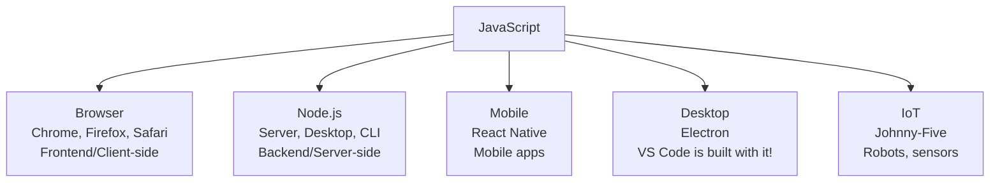

# Day 6: JavaScript Basics — Part 1

---

## Day Schedule (8 Hours)

| Time | Session | Duration |
|------|---------|----------|
| 09:00 - 09:15 | Welcome to Week 2 & Setup Check | 15 min |
| 09:15 - 10:30 | Session 1: JavaScript History & Variables (var, let, const) | 75 min |
| 10:30 - 10:45 | Break | 15 min |
| 10:45 - 12:00 | Session 2: Data Types & Type System | 75 min |
| 12:00 - 13:00 | Session 3: Hands-on — Variables & Data Types Practice | 60 min |
| 13:00 - 13:45 | Lunch Break | 45 min |
| 13:45 - 14:45 | Session 4: Operators — Arithmetic, Comparison, Logical | 60 min |
| 14:45 - 15:00 | Break | 15 min |
| 15:00 - 16:00 | Session 5: Template Literals, String Methods & Type Coercion | 60 min |
| 16:00 - 16:45 | Session 6: Hands-on — String Exercises & Calculator Program | 45 min |
| 16:45 - 17:00 | Assessment & Wrap-up | 15 min |

---

## What You'll Learn Today

By the end of this session, you will be able to:
- Explain why JavaScript is the language of the web (and beyond)
- Declare variables using `var`, `let`, and `const` correctly
- Identify and use all JavaScript data types
- Use arithmetic, comparison, and logical operators
- Understand type coercion and why `===` is better than `==`
- Use template literals and string methods to manipulate text
- Write basic JavaScript programs and run them with Node.js

---

## Welcome to Week 2! (09:00 - 09:15)

### Week 2 Overview: JavaScript & Node.js

```
Week 2 Journey:
Day 6:  Variables, Data Types, Operators (TODAY!)
Day 7:  Arrays, Objects, Control Flow (if/else, loops)
Day 8:  Functions, ES6+, Classes
Day 9:  Async/Await, Promises, Node.js Introduction
Day 10: REST APIs with Express.js + Week 2 Quiz
```

### Why JavaScript?

- SAP CAP (our main framework) runs on **Node.js** = JavaScript
- Fiori/UI5 frontends use **JavaScript**
- One language for BOTH frontend AND backend!
- Most popular programming language in the world (Stack Overflow survey)

### Quick Setup Check

Open VS Code terminal and verify:
```bash
node --version    # Should show v20.x.x
```

Create a folder for today's work:
```bash
mkdir -p ~/cap-training/day6
cd ~/cap-training/day6
code .
```

### Your First JavaScript Program!

Create a file called `hello.js`:
```javascript
console.log("Hello, I am learning JavaScript!");
console.log("This is Week 2 of CAP training!");
console.log("By the end of this week, I will code like a developer!");
```

Run it:
```bash
node hello.js
```

**Output:**
```
Hello, I am learning JavaScript!
This is Week 2 of CAP training!
By the end of this week, I will code like a developer!
```

**Congratulations! You just wrote and ran your first JavaScript program!** 🎉

---

## Session 1: JavaScript History & Variables (09:15 - 10:30)

### A Brief History of JavaScript

```
Timeline:
1995 ──── Created by Brendan Eich at Netscape (in just 10 DAYS!)
  |        Originally called "Mocha", then "LiveScript", then "JavaScript"
  |
1997 ──── Standardized as ECMAScript (ES1)
  |
2009 ──── Node.js created by Ryan Dahl
  |        → JavaScript can now run on SERVERS! 
  |
2015 ──── ES6 (ECMAScript 2015) — MASSIVE update!
  |        → let, const, arrow functions, classes, promises
  |
2020+ ─── Annual updates (ES2020, ES2021, ES2022...)
  |        → Modern JavaScript keeps improving every year
  |
Today ─── #1 most used programming language
           → Powers websites, servers, mobile apps, IoT, AI tools
```

**Fun Facts:**
- JavaScript was created in **10 days** (and it shows... some quirks!)
- JavaScript has NOTHING to do with Java (marketing name)
- 98% of websites use JavaScript
- Netflix, Uber, LinkedIn, PayPal all use Node.js (JavaScript) on their servers

---

### Where JavaScript Runs



**For SAP CAP:** We use JavaScript with Node.js (server-side) to build our backend services.

---

### Variables — Storing Information

#### What is a Variable?

A **variable** is a named container that stores a value. Think of it as a **labeled box** where you put things.

```
Real world:
+------------------+
|  Label: "age"    |
|  Value: 25       |
+------------------+

+------------------+
|  Label: "name"   |
|  Value: "Rahul"  |
+------------------+

JavaScript:
let age = 25;
let name = "Rahul";
```

---

### The Three Ways to Declare Variables

JavaScript has 3 keywords for creating variables: `var`, `let`, and `const`.

#### 1. `let` — The Modern Variable (USE THIS!)

```javascript
let city = "Mumbai";       // Create a variable
console.log(city);          // Output: Mumbai

city = "Delhi";             // Can be changed (reassigned)
console.log(city);          // Output: Delhi
```

**When to use:** When the value might change later.

---

#### 2. `const` — The Constant (Can't Be Changed)

```javascript
const PI = 3.14159;         // Create a constant
console.log(PI);            // Output: 3.14159

PI = 3.14;                  // ❌ ERROR! Cannot reassign a const!
// TypeError: Assignment to constant variable.
```

**When to use:** When the value should NEVER change (prices, IDs, config).

---

#### 3. `var` — The Old Way (AVOID!)

```javascript
var score = 100;            // Old way to create a variable
console.log(score);         // Output: 100

score = 200;                // Can be changed
console.log(score);         // Output: 200
```

**When to use:** NEVER in new code! Only exists for backward compatibility.

---

### `let` vs `const` vs `var` — The Complete Comparison

| Feature | `var` (OLD) | `let` (MODERN) | `const` (MODERN) |
|---------|------------|---------------|-----------------|
| Can be reassigned? | ✅ Yes | ✅ Yes | ❌ No |
| Scope | Function-scoped | Block-scoped | Block-scoped |
| Hoisting | Hoisted (undefined) | Hoisted (not initialized) | Hoisted (not initialized) |
| Can redeclare? | ✅ Yes (dangerous!) | ❌ No | ❌ No |
| Use in 2026? | ❌ Avoid | ✅ Use this | ✅ Use this |

---

### Scoping — Where Variables Live

#### Block Scope (let, const)

A **block** is anything inside `{ }` (curly braces):

```javascript
{
  let message = "I'm inside a block";
  console.log(message); // ✅ Works — we're inside the block
}
console.log(message);   // ❌ ERROR! message doesn't exist here
```

```javascript
if (true) {
  let secret = "hidden";
  const password = "12345";
}
console.log(secret);    // ❌ ERROR! Only lives inside the if-block
console.log(password);  // ❌ ERROR! Only lives inside the if-block
```

#### Function Scope (var)

`var` ignores blocks and is scoped to the entire function:

```javascript
if (true) {
  var leaked = "I escaped the block!";
}
console.log(leaked);    // ✅ "I escaped the block!" — var leaks out!
```

**This is why `var` is dangerous!** Variables leak out of blocks unexpectedly.

---

### Scoping Visualized

```javascript
// GLOBAL SCOPE (available everywhere)
const appName = "CAP Training";

function greet() {
  // FUNCTION SCOPE (only inside this function)
  let greeting = "Hello";
  
  if (true) {
    // BLOCK SCOPE (only inside this if-block)
    let blockVar = "I'm trapped here";
    var functionVar = "I escape to function scope!";
    
    console.log(appName);     // ✅ Can access global
    console.log(greeting);    // ✅ Can access parent scope
    console.log(blockVar);    // ✅ Can access own scope
  }
  
  console.log(greeting);      // ✅ Still in function scope
  console.log(functionVar);   // ✅ var leaked out of the block!
  console.log(blockVar);      // ❌ ERROR! blockVar died with the block
}

greet();
console.log(appName);         // ✅ Global is everywhere
console.log(greeting);        // ❌ ERROR! Died with the function
```

---

### Variable Naming Rules

| Rule | Valid ✅ | Invalid ❌ |
|------|---------|-----------|
| Start with letter, `_`, or `$` | `name`, `_count`, `$price` | `123abc`, `-value` |
| Can contain letters, numbers, `_`, `$` | `score1`, `user_name` | `my-var`, `my var` |
| Case-sensitive | `Name` ≠ `name` ≠ `NAME` | |
| Cannot use reserved words | | `let`, `const`, `if`, `for` |

#### Naming Conventions in JavaScript

| Convention | Example | Used For |
|-----------|---------|----------|
| **camelCase** | `firstName`, `totalPrice`, `isActive` | Variables, functions (MOST COMMON!) |
| **PascalCase** | `UserProfile`, `BookService` | Classes, constructors |
| **UPPER_SNAKE_CASE** | `MAX_RETRIES`, `API_KEY` | Constants (values that never change) |
| **lowercase** | `i`, `x`, `count` | Loop counters, short-lived vars |

```javascript
// Good naming ✅
let firstName = "Priya";
let totalOrderAmount = 4500;
let isLoggedIn = true;
const MAX_LOGIN_ATTEMPTS = 5;

// Bad naming ❌
let x = "Priya";           // What is x?
let a = 4500;              // Meaningless!
let flag = true;           // Flag for what?
```

**Golden Rule:** A variable name should tell you WHAT it stores without needing a comment.

---

### Hoisting — JavaScript's Quirky Behavior

**Hoisting** = JavaScript moves variable declarations to the top of their scope (before code runs).

```javascript
// What you write:
console.log(x);      // undefined (not an error!)
var x = 5;

// What JavaScript actually sees:
var x;               // Declaration moved to top (hoisted)
console.log(x);      // undefined (declared but no value yet)
x = 5;              // Assignment stays in place
```

```javascript
// With let/const — safer behavior:
console.log(y);      // ❌ ReferenceError: Cannot access 'y' before initialization
let y = 5;
```

**Takeaway:** `let` and `const` protect you from hoisting bugs. Another reason to avoid `var`!

---

### Practice: Try It Yourself! (5 minutes)

Open your `day6` folder in VS Code. Create `variables.js`:

```javascript
// 1. Declare variables using let and const
let myName = "YOUR NAME HERE";
let myAge = 22;
const courseTitle = "SAP CAP Training";
const trainingDuration = 45;

// 2. Print them
console.log("Name:", myName);
console.log("Age:", myAge);
console.log("Course:", courseTitle);
console.log("Duration:", trainingDuration, "days");

// 3. Try to change them
myAge = 23;  // ✅ This works (let can be reassigned)
console.log("Updated age:", myAge);

// 4. Try to change a const (uncomment to see the error)
// courseTitle = "Something else";  // ❌ This will crash!

// 5. Scope experiment
if (true) {
  let blockVariable = "I only exist here";
  console.log("Inside block:", blockVariable);
}
// console.log("Outside block:", blockVariable);  // ❌ Error!
```

Run: `node variables.js`

---

## Session 2: Data Types & Type System (10:45 - 12:00)

### What are Data Types?

A **data type** defines what KIND of value a variable holds. JavaScript has 7 primitive types + 1 complex type.

**Analogy:** Think of data types like different types of containers:
- A **jar** holds liquids (String holds text)
- A **box** holds solid items (Number holds quantities)
- A **switch** is on or off (Boolean holds true/false)

---

### The 7 Primitive Data Types

```mermaid
graph TB
    subgraph "JavaScript Data Types"
        subgraph "Primitive Types (Simple Values)"
            S[String<br/>"Hello World"]
            N[Number<br/>42, 3.14]
            B[Boolean<br/>true, false]
            U[Undefined<br/>undefined]
            NL[Null<br/>null]
            BI[BigInt<br/>9007199254740991n]
            SY[Symbol<br/>Symbol('id')]
        end

        subgraph "Complex Type"
            O[Object<br/>{name: 'Rahul', age: 25}]
            AR[Array<br/>[1, 2, 3, 4, 5]]
            FN[Function<br/>function greet() {}]
        end
    end
```

---

### 1. String — Text Data

Strings are text values, enclosed in quotes:

```javascript
// Three ways to create strings:
let single = 'Hello World';          // Single quotes
let double = "Hello World";          // Double quotes
let backtick = `Hello World`;        // Backticks (template literal)

// All three are valid! Most teams pick one style and stick with it.
// Recommendation: Use double quotes " " or backticks ` `

// Examples in SAP context:
let productName = "Laptop Pro X1";
let customerId = "CUST-00425";
let orderStatus = "In Progress";
let description = "SAP BTP is a platform for building enterprise apps";
```

**Key facts about Strings:**
- Immutable (cannot change individual characters)
- Have a `.length` property
- Zero-indexed (first character is at position 0)

```javascript
let greeting = "Hello";
console.log(greeting.length);    // 5
console.log(greeting[0]);        // "H" (first character)
console.log(greeting[4]);        // "o" (last character)
```

---

### 2. Number — Numeric Data

JavaScript has ONE number type for both integers and decimals:

```javascript
// Integers (whole numbers)
let age = 25;
let quantity = 100;
let year = 2026;

// Decimals (floating-point)
let price = 49.99;
let pi = 3.14159;
let temperature = -5.5;

// Special numbers
let infinity = Infinity;
let negInfinity = -Infinity;
let notANumber = NaN;            // "Not a Number" — result of invalid math

// Examples in SAP context:
let orderAmount = 15000.50;
let stockQuantity = 250;
let discountPercent = 10;
let gstRate = 18;
```

**Key facts about Numbers:**
- Max safe integer: 9,007,199,254,740,991
- `NaN` is a Number type (weird but true!)
- All math operations return Number type

```javascript
console.log(typeof 42);          // "number"
console.log(typeof 3.14);       // "number"
console.log(typeof NaN);        // "number" (yes, really!)
console.log(typeof Infinity);   // "number"
```

---

```javascript
console.log(typeof 42);         
console.log(typeof 3.14);       
console.log(typeof NaN);        
console.log(typeof Infinity);   
```

### 3. Boolean — True or False

Booleans have only two possible values: `true` or `false`.

```javascript
let isLoggedIn = true;
let hasPermission = false;
let isAdult = age >= 18;         // true (if age is 25)

// Examples in SAP context:
let isOrderApproved = true;
let isStockAvailable = false;
let isDraftMode = true;
let canUserDelete = false;
```

**When to use Booleans:** For yes/no questions, flags, conditions.

```javascript
// Naming convention: start with is, has, can, should, will
let isActive = true;         // Is the user active?
let hasAddress = false;      // Does the user have an address?
let canEdit = true;          // Can the user edit this record?
let shouldNotify = false;    // Should we send a notification?
```

---

### 4. Undefined — No Value Assigned

A variable that has been declared but NOT given a value is `undefined`:

```javascript
let futureValue;
console.log(futureValue);        // undefined
console.log(typeof futureValue); // "undefined"

// This also happens when you access missing properties:
let user = { name: "Rahul" };
console.log(user.age);           // undefined (age doesn't exist)
```

**Undefined means:** "This variable exists but has no value yet."

---

### 5. Null — Intentionally Empty

`null` means "this variable intentionally has NO value":

```javascript
let selectedProduct = null;      // Nothing is selected yet
let middleName = null;           // Person doesn't have a middle name

// The difference:
// undefined = "I forgot to assign a value" (accident)
// null = "I intentionally set this to nothing" (on purpose)
```

```javascript
// SAP context example:
let currentOrder = null;         // No order loaded yet
// ... user clicks an order ...
currentOrder = { id: "PO-001", amount: 5000 };  // Now we have data!
```

---

### 6. Object — Complex Data (Key-Value Pairs)

Objects store multiple related values together:

```javascript
// A simple object:
let employee = {
  firstName: "Priya",
  lastName: "Sharma",
  age: 28,
  department: "Development",
  isActive: true
};

// Access values:
console.log(employee.firstName);      // "Priya"
console.log(employee["department"]);  // "Development"

// Change values:
employee.age = 29;

// Add new properties:
employee.email = "priya@company.com";
```

**Objects in SAP Context:**

```javascript
let purchaseOrder = {
  poNumber: "PO-2026-001",
  vendor: "TechSupply Inc.",
  amount: 75000,
  currency: "INR",
  status: "Approved",
  items: 5,
  createdDate: "2026-05-21"
};

console.log(purchaseOrder.poNumber);  // "PO-2026-001"
console.log(purchaseOrder.amount);    // 75000
```

---

### 7. Checking Types with `typeof`

The `typeof` operator tells you what type a value is:

```javascript
console.log(typeof "Hello");     // "string"
console.log(typeof 42);         // "number"
console.log(typeof true);       // "boolean"
console.log(typeof undefined);  // "undefined"
console.log(typeof null);       // "object" ← JavaScript bug! Should be "null"
console.log(typeof {});         // "object"
console.log(typeof []);         // "object" (arrays are objects!)
```

**The `null` bug:** `typeof null` returns `"object"` — this is a famous JavaScript bug from 1995 that was never fixed (would break too many websites!).

---

### Data Types Summary Table

| Type | Example | typeof Result | Use For |
|------|---------|--------------|---------|
| **String** | `"Hello"`, `'World'` | `"string"` | Text, names, IDs |
| **Number** | `42`, `3.14`, `NaN` | `"number"` | Math, quantities, prices |
| **Boolean** | `true`, `false` | `"boolean"` | Yes/no, flags, conditions |
| **Undefined** | `undefined` | `"undefined"` | Unassigned variables |
| **Null** | `null` | `"object"` (bug!) | Intentional "no value" |
| **Object** | `{key: "value"}` | `"object"` | Complex data, records |
| **BigInt** | `123n` | `"bigint"` | Very large numbers (rare) |
| **Symbol** | `Symbol("id")` | `"symbol"` | Unique identifiers (rare) |

---

### Practice: Create `datatypes.js` (5 minutes)

```javascript
// Explore all data types:
let myString = "SAP CAP Developer";
let myNumber = 45;
let myDecimal = 99.99;
let myBoolean = true;
let myNull = null;
let myUndefined;
let myObject = { name: "CAP", version: 7 };

// Print each with its type:
console.log(myString, "→", typeof myString);
console.log(myNumber, "→", typeof myNumber);
console.log(myDecimal, "→", typeof myDecimal);
console.log(myBoolean, "→", typeof myBoolean);
console.log(myNull, "→", typeof myNull);         // Watch for the bug!
console.log(myUndefined, "→", typeof myUndefined);
console.log(myObject, "→", typeof myObject);

// Fun experiment:
console.log(typeof NaN);           // What do you expect?
console.log(typeof typeof 42);     // typeof always returns a string!
```

---

## Session 3: Hands-on — Variables & Data Types Practice (12:00 - 13:00)

### Exercise Set 1: Variable Declarations (10 minutes)

Create `exercise1.js`:

```javascript
// EXERCISE 1: Fix the errors in this code
// Each line has a mistake. Fix it and run the file.

// 1. This should be a constant (PI never changes)
let PI = 3.14159;

// 2. This variable name is invalid
let 2ndPlace = "Silver";

// 3. This should use let (score changes during the game)
const score = 0;

// 4. This tries to redeclare an existing variable
let player = "Alice";
let player = "Bob";

// 5. This uses a reserved word as variable name
let class = "JavaScript";
```

<details>
<summary>Solutions</summary>

```javascript
// 1. Use const for constants
const PI = 3.14159;

// 2. Variable names can't start with a number
let secondPlace = "Silver";

// 3. Use let for values that change
let score = 0;

// 4. Can't redeclare with let — just reassign
let player = "Alice";
player = "Bob";

// 5. 'class' is a reserved word — use another name
let className = "JavaScript";
```

</details>

---

### Exercise Set 2: Data Type Identification (10 minutes)

Create `exercise2.js`:

```javascript
// EXERCISE 2: Predict the output of typeof for each value
// Write your guess as a comment, then run to verify!

console.log(typeof "42");           // Your guess: ___
console.log(typeof 42);            // Your guess: ___
console.log(typeof true);          // Your guess: ___
console.log(typeof undefined);     // Your guess: ___
console.log(typeof null);          // Your guess: ___
console.log(typeof {name: "SAP"}); // Your guess: ___
console.log(typeof [1, 2, 3]);     // Your guess: ___
console.log(typeof NaN);           // Your guess: ___
console.log(typeof function(){}); // Your guess: ___
```

<details>
<summary>Answers</summary>

```
"string"    — "42" is in quotes, so it's a string!
"number"    — 42 without quotes is a number
"boolean"   — true/false are booleans
"undefined" — undefined is its own type
"object"    — null returns "object" (famous bug!)
"object"    — {} is an object
"object"    — arrays are objects in JavaScript
"number"    — NaN is technically a number type (Not-a-Number is a Number 🤯)
"function"  — functions have their own typeof result
```

</details>

---

### Exercise Set 3: Build a Student Profile (15 minutes)

Create `exercise3.js`:

```javascript
// EXERCISE 3: Create a complete student profile using correct data types

// TODO: Declare these variables with appropriate types:
// 1. Student's full name (string)
// 2. Student's age (number)
// 3. Student's GPA (decimal number)
// 4. Is the student currently enrolled? (boolean)
// 5. Student's graduation date (null — hasn't graduated yet)
// 6. Student's favorite subjects (object with 3 subjects and their scores)

// YOUR CODE HERE:


// Print a formatted profile:
// Expected output:
// === Student Profile ===
// Name: [name]
// Age: [age]
// GPA: [gpa]
// Enrolled: [true/false]
// Graduated: [null or date]
// Subjects: [object]
// =======================
```

<details>
<summary>Solution</summary>

```javascript
const fullName = "Ananya Patel";
let age = 21;
let gpa = 8.7;
let isEnrolled = true;
let graduationDate = null;
let subjects = {
  mathematics: 92,
  computerScience: 88,
  physics: 85
};

console.log("=== Student Profile ===");
console.log("Name:", fullName);
console.log("Age:", age);
console.log("GPA:", gpa);
console.log("Enrolled:", isEnrolled);
console.log("Graduated:", graduationDate);
console.log("Subjects:", subjects);
console.log("=======================");
```

</details>

---

### Exercise Set 4: SAP-Style Data Modeling (15 minutes)

Create `exercise4.js`:

```javascript
// EXERCISE 4: Model real SAP business data using JavaScript variables

// Create objects for:
// 1. A Purchase Order
// 2. A Product
// 3. A Customer

// PURCHASE ORDER should have:
// - PO Number (string, format: "PO-YYYY-NNN")
// - Vendor name (string)
// - Total amount (number)
// - Currency (string: "INR" or "USD")
// - Status (string: "Draft", "Submitted", "Approved", "Rejected")
// - Number of items (number)
// - Is urgent? (boolean)
// - Approved by (null — not yet approved)

// YOUR CODE HERE:
let purchaseOrder = {
  // fill in...
};

// PRODUCT should have:
// - Product ID (string)
// - Name (string)
// - Price (number)
// - Stock quantity (number)
// - Category (string)
// - Is available? (boolean)

let product = {
  // fill in...
};

// CUSTOMER should have:
// - Customer ID (string)
// - First name, Last name (strings)
// - Email (string)
// - Total orders placed (number)
// - Is VIP? (boolean)
// - Loyalty points (number)

let customer = {
  // fill in...
};

// Print all three:
console.log("--- Purchase Order ---");
console.log(purchaseOrder);
console.log("\n--- Product ---");
console.log(product);
console.log("\n--- Customer ---");
console.log(customer);

// ACCESS CHALLENGE: Print these specific values:
// 1. Just the PO status
// 2. Just the product price
// 3. The customer's full name (first + " " + last)
```

---

### Exercise Set 5: Scope Challenge (10 minutes)

Create `exercise5.js`:

```javascript
// EXERCISE 5: Predict the output WITHOUT running the code first!
// Write your prediction, then run to verify.

// Challenge 1:
let x = 10;
{
  let x = 20;
  console.log("Inside block:", x);    // Prediction: ___
}
console.log("Outside block:", x);     // Prediction: ___

// Challenge 2:
var y = 100;
{
  var y = 200;
  console.log("Inside block:", y);    // Prediction: ___
}
console.log("Outside block:", y);     // Prediction: ___

// Challenge 3:
const z = "original";
{
  const z = "modified";
  console.log("Inside:", z);          // Prediction: ___
}
console.log("Outside:", z);           // Prediction: ___
```

<details>
<summary>Answers</summary>

```
Challenge 1 (let — block scoped):
  Inside block: 20     (inner let x is separate from outer let x)
  Outside block: 10    (outer x was never changed)

Challenge 2 (var — function scoped, NOT block scoped):
  Inside block: 200    (var y overwrites the outer y!)
  Outside block: 200   (var leaked! The outer y was overwritten)

Challenge 3 (const — block scoped):
  Inside: modified     (inner const z is separate)
  Outside: original    (outer z was never changed)
```

**Key lesson:** `var` leaks out of blocks. `let` and `const` don't!

</details>

---

## Session 4: Operators (13:45 - 14:45)

### What are Operators?

**Operators** are symbols that perform operations on values. Like `+` adds numbers, `>` compares them.

---

### 1. Arithmetic Operators (Math)

| Operator | Name | Example | Result |
|----------|------|---------|--------|
| `+` | Addition | `5 + 3` | `8` |
| `-` | Subtraction | `10 - 4` | `6` |
| `*` | Multiplication | `6 * 7` | `42` |
| `/` | Division | `20 / 4` | `5` |
| `%` | Modulo (remainder) | `10 % 3` | `1` |
| `**` | Exponent (power) | `2 ** 3` | `8` |

```javascript
// Basic math:
let price = 1000;
let quantity = 5;
let total = price * quantity;          // 5000
let gst = total * 0.18;              // 900 (18% GST)
let grandTotal = total + gst;         // 5900

console.log("Subtotal:", total);       // 5000
console.log("GST (18%):", gst);       // 900
console.log("Grand Total:", grandTotal); // 5900
```

#### The Modulo Operator (%) — Super Useful!

`%` gives you the REMAINDER after division:

```javascript
console.log(10 % 3);    // 1  (10 ÷ 3 = 3 remainder 1)
console.log(15 % 5);    // 0  (15 ÷ 5 = 3 remainder 0)
console.log(7 % 2);     // 1  (7 ÷ 2 = 3 remainder 1)


console.log(10 % 3);    
console.log(15 % 5);    
console.log(7 % 2);    

// Practical uses:
// Check if a number is even or odd:
let num = 42;
if (num % 2 === 0) {
  console.log(num, "is even");    // 42 is even
} else {
  console.log(num, "is odd");
}
```

---

### 2. Assignment Operators

| Operator | Example | Same As | Result (if x = 10) |
|----------|---------|---------|-------------------|
| `=` | `x = 5` | — | `x = 5` |
| `+=` | `x += 3` | `x = x + 3` | `x = 13` |
| `-=` | `x -= 2` | `x = x - 2` | `x = 8` |
| `*=` | `x *= 4` | `x = x * 4` | `x = 40` |
| `/=` | `x /= 2` | `x = x / 2` | `x = 5` |
| `%=` | `x %= 3` | `x = x % 3` | `x = 1` |
| `++` | `x++` | `x = x + 1` | `x = 11` |
| `--` | `x--` | `x = x - 1` | `x = 9` |

```javascript
let score = 0;
score += 10;    // score is now 10
score += 25;    // score is now 35
score -= 5;     // score is now 30
score *= 2;     // score is now 60
console.log("Final score:", score);  // 60

let count = 0;
count++;        // count is now 1
count++;        // count is now 2
count++;        // count is now 3
console.log("Count:", count);  // 3
```

---

### 3. Comparison Operators

These compare two values and return `true` or `false`:

| Operator | Name | Example | Result |
|----------|------|---------|--------|
| `==` | Equal (loose) | `5 == "5"` | `true` ⚠️ |
| `===` | Equal (strict) | `5 === "5"` | `false` ✅ |
| `!=` | Not equal (loose) | `5 != "5"` | `false` ⚠️ |
| `!==` | Not equal (strict) | `5 !== "5"` | `true` ✅ |
| `>` | Greater than | `10 > 5` | `true` |
| `<` | Less than | `3 < 7` | `true` |
| `>=` | Greater than or equal | `5 >= 5` | `true` |
| `<=` | Less than or equal | `4 <= 3` | `false` |

---

### `==` vs `===` — The MOST Important Difference!

```javascript
// == (loose equality) — converts types before comparing
console.log(5 == "5");       // true 😱 (string "5" becomes number 5)
console.log(0 == false);     // true 😱 (false becomes 0)
console.log("" == false);    // true 😱 (both become 0)
console.log(null == undefined); // true 😱

// === (strict equality) — NO type conversion, compares as-is
console.log(5 === "5");      // false ✅ (number ≠ string)
console.log(0 === false);    // false ✅ (number ≠ boolean)
console.log("" === false);   // false ✅ (string ≠ boolean)
console.log(null === undefined); // false ✅ (different types)
```

**RULE: ALWAYS use `===` and `!==`!** Never use `==` or `!=` unless you have a very specific reason.

```javascript
// SAP context examples:
let orderStatus = "Approved";
let targetStatus = "Approved";

if (orderStatus === targetStatus) {
  console.log("Order is approved!");   // This runs ✅
}

let quantity = 0;
if (quantity === 0) {
  console.log("Out of stock!");        // Correct check ✅
}
// vs dangerous:
if (quantity == false) {
  console.log("This is confusing...");  // Also runs! 😱 Avoid!
}
```

---

### 4. Logical Operators

Combine multiple conditions:

| Operator | Name | Description | Example |
|----------|------|-------------|---------|
| `&&` | AND | Both must be true | `true && true` → `true` |
| `\|\|` | OR | At least one must be true | `false \|\| true` → `true` |
| `!` | NOT | Flips true↔false | `!true` → `false` |

```javascript
let age = 25;
let hasID = true;
let hasTicket = false;

// AND (&&) — Both conditions must be true
console.log(age >= 18 && hasID);        // true (both true)
console.log(age >= 18 && hasTicket);    // false (one is false)

// OR (||) — At least one must be true
console.log(hasID || hasTicket);        // true (at least one is true)
console.log(!hasID || !hasTicket);      // true (!hasTicket is true)

// NOT (!) — Flips the value
console.log(!true);                     // false
console.log(!false);                    // true
console.log(!hasTicket);                // true (flips false → true)
```

#### Real-World Examples

```javascript
// SAP approval logic:
let orderAmount = 50000;
let approverLevel = "Manager";
let isUrgent = true;

// Can this order be auto-approved?
let canAutoApprove = orderAmount < 10000 && !isUrgent;
console.log("Auto-approve?", canAutoApprove);  // false

// Does this need VP approval?
let needsVPApproval = orderAmount > 100000 || isUrgent;
console.log("Needs VP?", needsVPApproval);     // true (isUrgent is true)

// Can the user place an order?
let isLoggedIn = true;
let hasCredit = true;
let isBanned = false;
let canOrder = isLoggedIn && hasCredit && !isBanned;
console.log("Can order?", canOrder);            // true
```

---

### Operator Precedence (Order of Operations)

Just like math: PEMDAS/BODMAS applies!

```javascript
// What's the result?
let result = 2 + 3 * 4;        // 14 (not 20!)
// Multiplication (*) happens before addition (+)

let result2 = (2 + 3) * 4;     // 20 (parentheses first!)

// Precedence order (high to low):
// 1. () — Parentheses (always first!)
// 2. **, ++, --, !  — Unary, exponent
// 3. *, /, %  — Multiplication/Division
// 4. +, -  — Addition/Subtraction
// 5. <, >, <=, >=  — Comparison
// 6. ===, !==  — Equality
// 7. &&  — Logical AND
// 8. ||  — Logical OR
// 9. =, +=, -=  — Assignment (always last!)
```

**Pro tip:** When in doubt, use parentheses `()` to make your intent clear!

```javascript
// Hard to read:
let x = a > b && c < d || e === f;

// Easy to read:
let x = (a > b && c < d) || (e === f);
```

---

## Session 5: Template Literals, String Methods & Type Coercion (15:00 - 16:00)

### Template Literals (Backtick Strings)

Template literals use backticks `` ` `` instead of quotes, and provide two superpowers:

#### Superpower 1: String Interpolation (embed variables in strings)

```javascript
// OLD way (concatenation with +):
let name = "Rahul";
let age = 25;
let message = "Hello, my name is " + name + " and I am " + age + " years old.";
// Ugly, error-prone, hard to read!

// NEW way (template literals with ${}):
let message2 = `Hello, my name is ${name} and I am ${age} years old.`;
// Clean, readable, easy!

console.log(message2);
// Output: Hello, my name is Rahul and I am 25 years old.
```

```javascript
// You can put ANY expression inside ${}:
let price = 1000;
let qty = 3;
console.log(`Total: ₹${price * qty}`);           // Total: ₹3000
console.log(`GST: ₹${price * qty * 0.18}`);     // GST: ₹540
console.log(`Is expensive? ${price > 500}`);     // Is expensive? true
```

#### Superpower 2: Multi-line Strings

```javascript
// OLD way (awkward):
let html = "<div>\n" +
           "  <h1>Hello</h1>\n" +
           "  <p>World</p>\n" +
           "</div>";

// NEW way (natural):
let html2 = `
<div>
  <h1>Hello</h1>
  <p>World</p>
</div>
`;

// SAP context — building messages:
let poNumber = "PO-2026-001";
let status = "Approved";
let approver = "Priya Sharma";

let notification = `
Purchase Order Update:
─────────────────────
PO Number: ${poNumber}
New Status: ${status}
Approved by: ${approver}
Date: ${new Date().toLocaleDateString()}
─────────────────────
`;
console.log(notification);
```

---

### String Methods — Manipulating Text

Strings have many built-in methods (functions) for manipulation:

#### Finding & Checking

| Method | What It Does | Example | Result |
|--------|-------------|---------|--------|
| `.length` | Count characters | `"Hello".length` | `5` |
| `.indexOf(str)` | Find position of substring | `"Hello".indexOf("ll")` | `2` |
| `.includes(str)` | Check if contains substring | `"Hello".includes("ell")` | `true` |
| `.startsWith(str)` | Check if starts with | `"Hello".startsWith("He")` | `true` |
| `.endsWith(str)` | Check if ends with | `"Hello".endsWith("lo")` | `true` |

```javascript
let email = "developer@sap.com";

console.log(email.length);               // 17
console.log(email.includes("@"));        // true
console.log(email.includes("gmail"));    // false
console.log(email.startsWith("dev"));    // true
console.log(email.endsWith(".com"));     // true
console.log(email.indexOf("@"));         // 9
```

---

#### Transforming

| Method | What It Does | Example | Result |
|--------|-------------|---------|--------|
| `.toUpperCase()` | All caps | `"hello".toUpperCase()` | `"HELLO"` |
| `.toLowerCase()` | All lowercase | `"HELLO".toLowerCase()` | `"hello"` |
| `.trim()` | Remove spaces from edges | `"  hi  ".trim()` | `"hi"` |
| `.replace(a, b)` | Replace first occurrence | `"hello".replace("l","L")` | `"heLlo"` |
| `.replaceAll(a, b)` | Replace all occurrences | `"hello".replaceAll("l","L")` | `"heLLo"` |
| `.repeat(n)` | Repeat n times | `"ha".repeat(3)` | `"hahaha"` |

```javascript
let input = "  Hello World  ";
console.log(input.trim());              // "Hello World"
console.log(input.trim().toUpperCase()); // "HELLO WORLD"

let status = "in_progress";
let formatted = status.replace("_", " ").toUpperCase();
console.log(formatted);                  // "IN PROGRESS"
```

---

#### Extracting

| Method | What It Does | Example | Result |
|--------|-------------|---------|--------|
| `.slice(start, end)` | Extract portion | `"Hello".slice(1, 4)` | `"ell"` |
| `.substring(start, end)` | Similar to slice | `"Hello".substring(0, 3)` | `"Hel"` |
| `.split(separator)` | Split into array | `"a,b,c".split(",")` | `["a","b","c"]` |
| `.charAt(index)` | Get character at position | `"Hello".charAt(0)` | `"H"` |

```javascript
// Extract parts of a PO number:
let poNumber = "PO-2026-00142";
let year = poNumber.slice(3, 7);          // "2026"
let sequence = poNumber.slice(8);         // "00142"
console.log(`Year: ${year}, Seq: ${sequence}`);

// Split a CSV line:
let csvLine = "Laptop,Electronics,45000,InStock";
let parts = csvLine.split(",");
console.log(parts);    // ["Laptop", "Electronics", "45000", "InStock"]
console.log(parts[0]); // "Laptop"
console.log(parts[2]); // "45000"

// Split a full name:
let fullName = "Priya Sharma";
let [firstName, lastName] = fullName.split(" ");
console.log(firstName);  // "Priya"
console.log(lastName);   // "Sharma"
```

---

### Method Chaining — Combining Methods

You can chain multiple string methods together:

```javascript
let rawInput = "   hello WORLD   ";

// Chain: trim → lowercase → replace
let clean = rawInput.trim().toLowerCase().replace("world", "JavaScript");
console.log(clean);  // "hello javascript"

// Validate and format an email:
let userEmail = "  Admin@Company.COM  ";
let normalizedEmail = userEmail.trim().toLowerCase();
console.log(normalizedEmail);  // "admin@company.com"
let isValid = normalizedEmail.includes("@") && normalizedEmail.includes(".");
console.log("Valid?", isValid);  // true
```

---

### Type Coercion — JavaScript's Hidden Magic

**Type coercion** = JavaScript automatically converts types when needed.

#### Implicit Coercion (JavaScript does it automatically)

```javascript
// String + Number → String (number becomes string)
console.log("5" + 3);         // "53" (NOT 8!)
console.log("Hello" + 42);   // "Hello42"
console.log(1 + 2 + "3");    // "33" (1+2=3, then 3+"3"="33")

// Number - String → Number (string becomes number)
console.log("10" - 5);       // 5 (string "10" becomes number 10)
console.log("6" * "7");      // 42 (both become numbers!)
console.log("10" / 2);       // 5

// Boolean in math → Number
console.log(true + 1);       // 2 (true becomes 1)
console.log(false + 1);      // 1 (false becomes 0)
```

**The Rule:** `+` with a string = concatenation. Other math operators try to convert to numbers.

---

#### Explicit Coercion (YOU do it on purpose)

```javascript
// Convert String to Number:
let str = "42";
let num1 = Number(str);        // 42
let num2 = parseInt(str);      // 42 (integer)
let num3 = parseFloat("3.14"); // 3.14 (decimal)
let num4 = +"42";              // 42 (shorthand using +)

// Convert Number to String:
let n = 42;
let s1 = String(n);            // "42"
let s2 = n.toString();         // "42"
let s3 = n + "";               // "42" (shorthand)

// Convert to Boolean:
let b1 = Boolean(1);           // true
let b2 = Boolean(0);           // false
let b3 = Boolean("");          // false (empty string)
let b4 = Boolean("hello");    // true (non-empty string)
let b5 = Boolean(null);       // false
let b6 = Boolean(undefined);  // false
```

---

#### Truthy and Falsy Values

In JavaScript, every value is either "truthy" or "falsy" when used in a boolean context:

**Falsy values (only 6!):**

| Value | Type |
|-------|------|
| `false` | Boolean |
| `0` | Number |
| `""` (empty string) | String |
| `null` | Null |
| `undefined` | Undefined |
| `NaN` | Number |

**Everything else is truthy!** (including `"0"`, `"false"`, `[]`, `{}`)

```javascript
// These are all falsy:
if (0) console.log("nope");          // Doesn't run
if ("") console.log("nope");         // Doesn't run
if (null) console.log("nope");       // Doesn't run

// These are all truthy:
if (1) console.log("yes!");          // Runs!
if ("hello") console.log("yes!");    // Runs!
if ([]) console.log("yes!");         // Runs! (empty array is truthy!)
if ({}) console.log("yes!");         // Runs! (empty object is truthy!)
```

---

## Session 6: Hands-on — String Exercises & Calculator (16:00 - 16:45)

### String Manipulation Exercises (10 Problems)

Create `strings.js`:

```javascript
// ===== STRING MANIPULATION EXERCISES =====
// Solve each problem using string methods!

// Problem 1: Convert to uppercase
let city = "mumbai";
// Expected output: "MUMBAI"
// Your code:


// Problem 2: Extract the domain from an email
let email = "developer@sapbtp.com";
// Expected output: "sapbtp.com"
// Hint: Use indexOf("@") and slice()
// Your code:


// Problem 3: Count the number of words in a sentence
let sentence = "SAP BTP is a powerful cloud platform";
// Expected output: 7
// Hint: Split by space, then check length
// Your code:


// Problem 4: Check if a string is a valid PO number (starts with "PO-")
let po1 = "PO-2026-001";
let po2 = "SO-2026-001";
// Expected: po1 → true, po2 → false
// Your code:


// Problem 5: Replace all spaces with hyphens
let title = "My First CAP Project";
// Expected output: "My-First-CAP-Project"
// Your code:


// Problem 6: Extract first name and last name
let fullName = "Rajesh Kumar Sharma";
// Expected: firstName = "Rajesh", lastName = "Sharma"
// Hint: Use split() and array positions
// Your code:


// Problem 7: Mask a credit card number (show only last 4 digits)
let cardNumber = "4532015112830366";
// Expected output: "************0366"
// Hint: Use slice() and repeat()
// Your code:


// Problem 8: Check if a password meets requirements
let password = "MyP@ss123";
// Check: length >= 8, contains a number, contains uppercase
// Expected: print whether each requirement is met
// Your code:


// Problem 9: Create a formatted receipt line
let item = "Laptop";
let price = 65000;
// Expected output: "Laptop .............. ₹65,000"
// Hint: Use padEnd() or repeat()
// Your code:


// Problem 10: Reverse a string
let word = "JavaScript";
// Expected output: "tpircSavaJ"
// Hint: split("") → reverse() → join("")
// Your code:

```

<details>
<summary>Solutions for All 10 Problems</summary>

```javascript
// Problem 1:
console.log(city.toUpperCase());  // "MUMBAI"

// Problem 2:
let domain = email.slice(email.indexOf("@") + 1);
console.log(domain);  // "sapbtp.com"

// Problem 3:
let wordCount = sentence.split(" ").length;
console.log(wordCount);  // 7

// Problem 4:
console.log(po1.startsWith("PO-"));  // true
console.log(po2.startsWith("PO-"));  // false

// Problem 5:
console.log(title.replaceAll(" ", "-"));  // "My-First-CAP-Project"

// Problem 6:
let nameParts = fullName.split(" ");
let firstName = nameParts[0];
let lastName = nameParts[nameParts.length - 1];
console.log(firstName, lastName);  // "Rajesh" "Sharma"

// Problem 7:
let masked = "*".repeat(12) + cardNumber.slice(-4);
console.log(masked);  // "************0366"

// Problem 8:
console.log("Length >= 8:", password.length >= 8);
console.log("Has number:", /\d/.test(password));
console.log("Has uppercase:", password !== password.toLowerCase());

// Problem 9:
let dots = ".".repeat(30 - item.length);
console.log(`${item} ${dots} ₹${price.toLocaleString()}`);

// Problem 10:
let reversed = word.split("").reverse().join("");
console.log(reversed);  // "tpircSavaJ"
```

</details>

---

### Calculator Program

Create `calculator.js`:

```javascript
// ===== SIMPLE CALCULATOR =====
// This calculator works with hardcoded values for now.
// (We'll make it interactive later when we learn functions!)

let num1 = 24;
let num2 = 6;

console.log("===========================");
console.log("    SIMPLE CALCULATOR");
console.log("===========================");
console.log(`Number 1: ${num1}`);
console.log(`Number 2: ${num2}`);
console.log("---------------------------");

// Perform all operations:
console.log(`Addition:       ${num1} + ${num2} = ${num1 + num2}`);
console.log(`Subtraction:    ${num1} - ${num2} = ${num1 - num2}`);
console.log(`Multiplication: ${num1} × ${num2} = ${num1 * num2}`);
console.log(`Division:       ${num1} ÷ ${num2} = ${num1 / num2}`);
console.log(`Modulo:         ${num1} % ${num2} = ${num1 % num2}`);
console.log(`Power:          ${num1} ^ ${num2} = ${num1 ** num2}`);

console.log("---------------------------");

// Bonus: GST Calculator
let basePrice = 1000;
let gstRate = 18;
let gstAmount = basePrice * (gstRate / 100);
let totalWithGST = basePrice + gstAmount;

console.log("\n===== GST CALCULATOR =====");
console.log(`Base Price:  ₹${basePrice}`);
console.log(`GST Rate:    ${gstRate}%`);
console.log(`GST Amount:  ₹${gstAmount}`);
console.log(`Total Price: ₹${totalWithGST}`);
console.log("===========================");

// Bonus: Percentage Calculator
let obtained = 432;
let total = 500;
let percentage = (obtained / total) * 100;
console.log(`\nMarks: ${obtained}/${total} = ${percentage}%`);
```

Run: `node calculator.js`

---

## Assessment: MCQ (15 Questions)

**Q1.** JavaScript was created in which year?
- a) 2001
- b) 1995
- c) 2009
- d) 2015

<details><summary>Answer</summary>b) 1995 — by Brendan Eich at Netscape, in just 10 days!</details>

---

**Q2.** Which keyword should you use for a variable whose value will NOT change?
- a) `var`
- b) `let`
- c) `const`
- d) `fixed`

<details><summary>Answer</summary>c) `const` — constants cannot be reassigned</details>

---

**Q3.** What is the output of: `typeof "42"`?
- a) `"number"`
- b) `"string"`
- c) `"integer"`
- d) `"NaN"`

<details><summary>Answer</summary>b) `"string"` — anything in quotes is a string, even "42"</details>

---

**Q4.** What is the output of: `5 + "3"`?
- a) `8`
- b) `"53"`
- c) `"8"`
- d) Error

<details><summary>Answer</summary>b) `"53"` — when + has a string, it concatenates (joins) instead of adding</details>

---

**Q5.** Which comparison operator should you ALWAYS use?
- a) `==`
- b) `===`
- c) `=`
- d) `!=`

<details><summary>Answer</summary>b) `===` (strict equality) — no type coercion, compares both value AND type</details>

---

**Q6.** What is the output of: `console.log(typeof null)`?
- a) `"null"`
- b) `"undefined"`
- c) `"object"`
- d) `"nothing"`

<details><summary>Answer</summary>c) `"object"` — this is a famous bug in JavaScript from 1995 that was never fixed</details>

---

**Q7.** Which of these is a FALSY value in JavaScript?
- a) `"false"` (string)
- b) `[]` (empty array)
- c) `0` (zero)
- d) `{}` (empty object)

<details><summary>Answer</summary>c) `0` — the 6 falsy values are: false, 0, "", null, undefined, NaN</details>

---

**Q8.** What does `"Hello World".split(" ")` return?
- a) `"Hello World"`
- b) `["Hello", "World"]`
- c) `"Hello" "World"`
- d) `2`

<details><summary>Answer</summary>b) `["Hello", "World"]` — split breaks a string into an array at the separator</details>

---

**Q9.** `let` variables are:
- a) Function-scoped
- b) Block-scoped
- c) Global-scoped
- d) No scope

<details><summary>Answer</summary>b) Block-scoped — they only exist inside the `{}` where they are declared</details>

---

**Q10.** What does the `%` (modulo) operator do?
- a) Calculates percentage
- b) Returns the remainder after division
- c) Divides two numbers
- d) Multiplies by 100

<details><summary>Answer</summary>b) Returns the remainder — `10 % 3` = 1 (because 10 ÷ 3 = 3 remainder 1)</details>

---

**Q11.** Template literals use:
- a) Single quotes `' '`
- b) Double quotes `" "`
- c) Backticks `` ` ` ``
- d) Parentheses `( )`

<details><summary>Answer</summary>c) Backticks — and use `${variable}` to embed values</details>

---

**Q12.** What is the output of: `"10" - 5`?
- a) `"105"`
- b) `"5"`
- c) `5`
- d) Error

<details><summary>Answer</summary>c) `5` — the minus operator converts the string "10" to number 10, then subtracts</details>

---

**Q13.** `const` means:
- a) The variable can never be used
- b) The variable cannot be reassigned to a new value
- c) The variable is automatically deleted
- d) The variable is only available globally

<details><summary>Answer</summary>b) Cannot be reassigned — but if it holds an object, the object's properties CAN still change</details>

---

**Q14.** Which method converts a string to all lowercase?
- a) `.lower()`
- b) `.toLowerCase()`
- c) `.toLower()`
- d) `.caseLower()`

<details><summary>Answer</summary>b) `.toLowerCase()` — JavaScript uses camelCase for method names</details>

---

  **Q15.** What is the output of: `true + true + true`?
  - a) `"truetruetrue"`
  - b) `true`
  - c) `3`
  - d) Error

<details><summary>Answer</summary>c) `3` — in math operations, `true` becomes 1 (and `false` becomes 0), so 1+1+1 = 3</details>

---

## Assignment: 10 Coding Exercises

### Due: Start of Day 7

Create a file called `day6_assignment.js` and solve all 10 problems:

```javascript
// ============================================
//  DAY 6 ASSIGNMENT: Variables & Operators
// ============================================
// Solve each problem. Run with: node day6_assignment.js
// Each problem should print the answer to console.

// PROBLEM 1: Temperature Converter
// Convert 98.6 Fahrenheit to Celsius
// Formula: C = (F - 32) × 5/9
// Expected output: "98.6°F = 37°C"
let fahrenheit = 98.6;
// Your code:


// PROBLEM 2: Simple Interest Calculator
// Calculate simple interest for:
// Principal: ₹50,000, Rate: 8.5%, Time: 3 years
// Formula: SI = (P × R × T) / 100
// Print: Principal, Rate, Time, Interest, and Total Amount


// PROBLEM 3: Swap Two Variables
// Given: a = 10, b = 20
// Swap their values WITHOUT using a third variable
// Hint: Use arithmetic or destructuring
// Print before and after values


// PROBLEM 4: Check Even or Odd
// Given a number, determine if it's even or odd using modulo (%)
// Test with: 17, 42, 0, -5
// Print: "17 is odd", "42 is even", etc.


// PROBLEM 5: Extract and Format
// Given: "  john.DOE@email.COM  "
// 1. Remove extra spaces
// 2. Convert to lowercase
// 3. Extract the username (part before @)
// 4. Capitalize first letter of username
// Print the formatted username: "John.doe"


// PROBLEM 6: Age Calculator
// Given birth year = 2001 and current year = 2026
// Calculate age and determine:
// - Can vote? (>= 18)
// - Can drive? (>= 18)
// - Can drink? (>= 21)
// Print all results using template literals


// PROBLEM 7: String Statistics
// Given: "JavaScript is the language of the web"
// Calculate and print:
// - Total characters
// - Total words
// - Number of 'a' characters (hint: split by 'a' and subtract 1)
// - First word
// - Last word


// PROBLEM 8: Bill Splitter
// Total bill: ₹4500, Number of people: 4, Tip: 15%
// Calculate:
// - Tip amount
// - Total with tip
// - Amount per person (including tip)
// Print a formatted bill summary


// PROBLEM 9: BMI Calculator
// Weight: 72 kg, Height: 1.75 meters
// Formula: BMI = weight / (height * height)
// Categories: <18.5 = Underweight, 18.5-24.9 = Normal, 25-29.9 = Overweight, >=30 = Obese
// Print: BMI value and category
// Hint: Use comparison operators and logical AND (&&) for range checking


// PROBLEM 10: SAP Invoice Generator
// Create an invoice using template literals:
// Company: "TechCorp Solutions"
// Invoice #: "INV-2026-0042"
// Items: 3 items (hardcoded)
//   - Item 1: "SAP License", Qty: 5, Price: ₹12000 each
//   - Item 2: "Cloud Hosting", Qty: 12, Price: ₹2500 each
//   - Item 3: "Support Plan", Qty: 1, Price: ₹45000 each
// Calculate: Subtotal per item, Grand total, GST (18%), Final amount
// Print a nicely formatted invoice using template literals and string methods
```

---

## Key Takeaways

| # | Topic | One-Line Summary |
|---|---|---|
| 1 | JavaScript | #1 language — runs in browsers, servers (Node.js), mobile, desktop |
| 2 | var vs let vs const | Avoid var. Use `let` for changing values, `const` for fixed values |
| 3 | Scope | `let`/`const` are block-scoped (safe). `var` is function-scoped (leaky) |
| 4 | Data Types | String, Number, Boolean, Undefined, Null, Object (+ BigInt, Symbol) |
| 5 | typeof | Tells you the type of a value (watch out: `typeof null` = "object") |
| 6 | Operators | Arithmetic (+,-,*,/,%), Comparison (===,!==,>,<), Logical (&&,\|\|,!) |
| 7 | === vs == | ALWAYS use === (strict). == does sneaky type coercion |
| 8 | Template Literals | Use backticks `` ` `` with `${variable}` for clean string formatting |
| 9 | String Methods | .toUpperCase(), .toLowerCase(), .trim(), .split(), .includes(), .slice() |
| 10 | Type Coercion | JS auto-converts types. "5"+3="53" but "5"-3=2. Be aware! |

---

## Glossary

| Term | Definition |
|------|-----------|
| **Variable** | A named container that stores a value |
| **const** | Declares a variable that cannot be reassigned |
| **let** | Declares a block-scoped variable that can be reassigned |
| **var** | Old way to declare variables — function-scoped (avoid!) |
| **Block Scope** | Variable only exists inside the `{ }` where it's declared |
| **Data Type** | The kind of value a variable holds (string, number, boolean, etc.) |
| **String** | Text data enclosed in quotes |
| **Number** | Numeric data (integers and decimals) |
| **Boolean** | `true` or `false` value |
| **Null** | Intentionally empty value (assigned on purpose) |
| **Undefined** | Variable declared but no value assigned (yet) |
| **Object** | Collection of key-value pairs |
| **typeof** | Operator that returns the data type of a value |
| **Type Coercion** | Automatic conversion of values between types |
| **Truthy/Falsy** | Values that evaluate to true/false in boolean context |
| **Template Literal** | String using backticks with `${}` for interpolation |
| **Operator** | Symbol that performs an operation (+, -, ===, &&, etc.) |
| **Modulo (%)** | Returns the remainder after division |
| **Strict Equality (===)** | Compares value AND type without coercion |
| **Hoisting** | JavaScript moves declarations to the top before executing |

---

## Preparation for Day 7

Tomorrow: **JavaScript Basics Part 2 — Arrays, Objects, Control Flow**

You'll learn:
- `if/else`, `switch`, ternary operator
- `for`, `while`, `for...of` loops
- Array methods (push, pop, map, filter, reduce)
- Object manipulation and destructuring

**To prepare:**
- Complete today's assignment (all 10 problems)
- Get comfortable running files with `node filename.js`
- Practice using template literals — they'll be everywhere from now on!

---

*End of Day 6 — Welcome to the world of JavaScript!* 🚀
