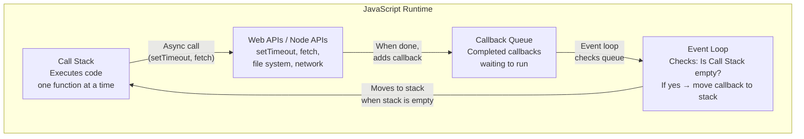
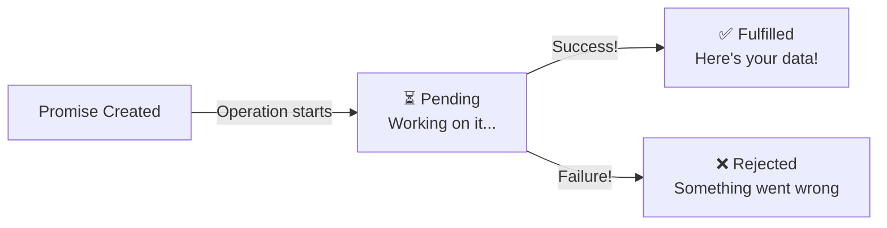
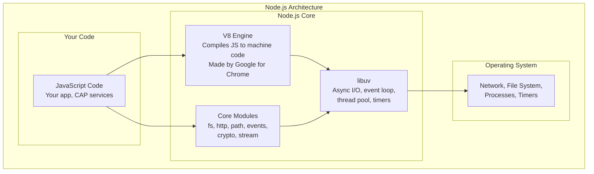

# Day 9: Asynchronous JavaScript & Node.js Introduction

---

## Day Schedule (8 Hours)

| Time | Session | Duration |
|------|---------|----------|
| 09:00 - 09:15 | Day 8 Recap & Quick Fire | 15 min |
| 09:15 - 10:30 | Session 1: Synchronous vs Asynchronous & The Event Loop | 75 min |
| 10:30 - 10:45 | Break | 15 min |
| 10:45 - 12:00 | Session 2: Callbacks, Callback Hell & Promises | 75 min |
| 12:00 - 13:00 | Session 3: Hands-on — Promises Practice | 60 min |
| 13:00 - 13:45 | Lunch Break | 45 min |
| 13:45 - 14:45 | Session 4: Async/Await — The Modern Way | 60 min |
| 14:45 - 15:00 | Break | 15 min |
| 15:00 - 16:00 | Session 5: Node.js Architecture & npm Deep-Dive | 60 min |
| 16:00 - 16:45 | Session 6: Hands-on — First Node.js Project & npm Packages | 45 min |
| 16:45 - 17:00 | Assessment & Wrap-up | 15 min |

---

## What You'll Learn Today

By the end of this session, you will be able to:
- Explain the difference between synchronous and asynchronous code
- Describe how the JavaScript Event Loop works
- Create and chain Promises
- Use `async/await` to write clean asynchronous code
- Handle errors in async code
- Explain Node.js architecture (V8, libuv, event-driven)
- Initialize a Node.js project with `npm init`
- Install and use npm packages
- Build a file reader utility using async/await

---

## Day 8 Recap — Quick Fire (09:00 - 09:15)

1. What's the shortest arrow function to double a number? → _____
2. What is a closure? → _____
3. What does `super()` do in a child class? → _____
4. What's the difference between `module.exports` and `export`? → _____
5. What does `try/catch` do? → _____
6. Name a higher-order function you've used → _____

<details>
<summary>Answers</summary>

1. `const double = n => n * 2;`
2. A function that remembers variables from its creation scope
3. Calls the parent class's constructor
4. `module.exports` = CommonJS (Node.js); `export` = ES Modules (modern)
5. Attempts risky code in `try`; if it throws, handles error in `catch` (doesn't crash)
6. `.map()`, `.filter()`, `.reduce()`, `.sort()`, `.find()` (any one)

</details>

---

## Session 1: Synchronous vs Asynchronous & The Event Loop (09:15 - 10:30)

### The Problem: JavaScript is Single-Threaded

JavaScript can only do **ONE thing at a time** (single-threaded). This means:

```
Synchronous (blocking):
Task A: [████████████] 3 seconds
Task B:              [████] 1 second
Task C:                   [██████] 2 seconds

Total time: 6 seconds 😫 (each waits for the previous to finish)
```

But what if Task A is "fetching data from a server" (slow network)? Everything else WAITS? That's terrible!

### The Solution: Asynchronous Programming

```
Asynchronous (non-blocking):
Task A: [████████████────────→ finishes later]
Task B: [████]  ← starts immediately, doesn't wait!
Task C: [██████] ← also starts immediately!

Total time: ~3 seconds 🚀 (tasks run "in parallel")
```

---

### Real-World Analogy: The Restaurant

**Synchronous (Bad Restaurant):**
```
1. Waiter takes Order A → Goes to kitchen → WAITS until food is ready → Serves
2. THEN takes Order B → Goes to kitchen → WAITS → Serves
3. THEN takes Order C → ...

Result: 30 minutes for 3 tables 😡
```

**Asynchronous (Good Restaurant):**
```
1. Waiter takes Order A → Sends to kitchen → DOESN'T WAIT
2. Takes Order B → Sends to kitchen → DOESN'T WAIT
3. Takes Order C → Sends to kitchen → DOESN'T WAIT
4. Kitchen calls back: "Order A ready!" → Waiter serves Order A
5. Kitchen calls back: "Order C ready!" → Waiter serves Order C
6. Kitchen calls back: "Order B ready!" → Waiter serves Order B

Result: 12 minutes for 3 tables 🎉
```

The waiter is **JavaScript (single-threaded)**. The kitchen is **external systems (network, file system, database)**. The "call back when ready" is a **callback/promise**!

---

### Synchronous Code — Line by Line

```javascript
console.log("1. Starting");
console.log("2. Processing...");  // Imagine this takes 5 seconds
console.log("3. Done!");

// Output (in order, always):
// 1. Starting
// 2. Processing...
// 3. Done!
```

### Asynchronous Code — Out of Order!

```javascript
console.log("1. Starting");

setTimeout(() => {
  console.log("2. This runs LATER (after 2 seconds)");
}, 2000);

console.log("3. This runs IMMEDIATELY (doesn't wait!)");

// Output:
// 1. Starting
// 3. This runs IMMEDIATELY (doesn't wait!)    ← Runs first!
// 2. This runs LATER (after 2 seconds)         ← Runs after 2s
```

**Mind-blowing for beginners:** Line 3 prints BEFORE line 2! Because `setTimeout` is asynchronous — JavaScript doesn't wait, it moves on.

---

### What is Asynchronous in Real Development?

| Operation | Sync or Async? | Why? |
|-----------|---------------|------|
| `let x = 5 + 3;` | Sync | Instant math — no waiting |
| Reading a file from disk | **Async** | Disk I/O takes time (milliseconds) |
| Fetching data from an API | **Async** | Network request takes time (100ms - seconds) |
| Querying a database | **Async** | Database query takes time |
| `console.log("hi")` | Sync | Instant output |
| Writing to a file | **Async** | Disk I/O |
| `setTimeout/setInterval` | **Async** | Timer-based delay |

**Rule of thumb:** Anything involving I/O (network, file, database) is asynchronous in Node.js!

---

### The Event Loop — JavaScript's Secret Weapon

The Event Loop is how JavaScript handles async operations despite being single-threaded.



#### Step-by-Step: How the Event Loop Works

```javascript
console.log("A");              // 1. Goes to Call Stack → executes → prints "A"

setTimeout(() => {
  console.log("B");            // 2. Goes to Web API (timer: 0ms)
}, 0);                         //    After 0ms → callback goes to Queue

console.log("C");              // 3. Goes to Call Stack → executes → prints "C"

// 4. Call Stack is now EMPTY
// 5. Event Loop checks Queue → finds "B" callback → moves to Call Stack
// 6. Executes → prints "B"

// Final Output: A, C, B (NOT A, B, C!)
```

**Even with 0ms timeout, "B" prints LAST!** Because:
1. `setTimeout` always goes through the queue
2. The Event Loop only moves callbacks when the stack is EMPTY
3. "C" was already in the stack, so it runs first

---

### Event Loop Visualized (Animation in Your Mind)

```
Time →

Call Stack:         [console.log("A")]  →  [setTimeout(...)]  →  [console.log("C")]  →  [EMPTY]  →  [callback: "B"]
                         prints "A"          sends to API          prints "C"            Loop checks    prints "B"

Web API:                                    [timer: 0ms] →  [DONE! → moves to queue]

Callback Queue:                                                   [() => log("B")]  →  [EMPTY]

Output:             "A"                                      "C"                        "B"
```

---

### Common Async Functions in Node.js

| Function | What It Does | Is Async? |
|----------|-------------|-----------|
| `setTimeout(fn, ms)` | Runs fn after ms milliseconds | Yes (timer) |
| `setInterval(fn, ms)` | Runs fn every ms milliseconds | Yes (timer) |
| `fs.readFile(path, fn)` | Reads a file from disk | Yes (I/O) |
| `fetch(url)` | Makes HTTP request | Yes (network) |
| `fs.writeFile(path, data, fn)` | Writes to a file | Yes (I/O) |

---

### Discussion Activity (5 minutes)

Predict the output order:

```javascript
console.log("1");

setTimeout(() => console.log("2"), 1000);

setTimeout(() => console.log("3"), 0);

console.log("4");

// What's the output order?
```

<details>
<summary>Answer</summary>

```
1, 4, 3, 2

Explanation:
- "1" → sync, runs immediately
- setTimeout "2" → goes to Web API (1000ms timer)
- setTimeout "3" → goes to Web API (0ms timer → immediately to queue)
- "4" → sync, runs immediately
- Stack is empty → Event Loop moves "3" from queue → prints "3"
- 1000ms later → Event Loop moves "2" from queue → prints "2"
```

</details>

---

## Session 2: Callbacks, Callback Hell & Promises (10:45 - 12:00)

### Callbacks for Async Operations

A **callback** is how old-school JavaScript handled async results — "call me back when you're done":

```javascript
const fs = require('fs');

// Async file read with callback:
fs.readFile('data.txt', 'utf8', (error, data) => {
  if (error) {
    console.log("Error reading file:", error.message);
    return;
  }
  console.log("File content:", data);
});

console.log("This prints FIRST! (doesn't wait for file read)");
```

**Pattern:** `asyncOperation(params, (error, result) => { ... })`

This is called the **"error-first callback"** pattern (Node.js convention):
- First argument to callback = error (null if success)
- Second argument = result data

---

### Callback Hell — The Pyramid of Doom 😱

What happens when you need async operations in SEQUENCE?

```javascript
// Read file → Parse data → Fetch from API → Save result → Send notification
// Each step depends on the previous!

fs.readFile('config.json', 'utf8', (err, config) => {
  if (err) { console.log("Error 1"); return; }
  
  parseConfig(config, (err, settings) => {
    if (err) { console.log("Error 2"); return; }
    
    fetchFromAPI(settings.url, (err, data) => {
      if (err) { console.log("Error 3"); return; }
      
      saveToDatabase(data, (err, result) => {
        if (err) { console.log("Error 4"); return; }
        
        sendNotification(result, (err, response) => {
          if (err) { console.log("Error 5"); return; }
          
          console.log("Finally done! 😫");
          // 5 levels deep... imagine 10 levels!
        });
      });
    });
  });
});
```

**Problems with callback hell:**
- Code moves to the right (pyramid shape) → hard to read
- Error handling repeated at every level
- Hard to maintain and debug
- Can't easily add logic between steps

---

### Promises — The Solution to Callback Hell!

A **Promise** represents a value that will be available in the future. It's like an **order receipt** at a restaurant — you don't have the food yet, but you have a promise that it's coming!

#### Three States of a Promise



| State | Meaning | Analogy |
|-------|---------|---------|
| **Pending** | Operation in progress | Order placed, kitchen cooking |
| **Fulfilled** | Operation succeeded, has result | Food is ready! |
| **Rejected** | Operation failed, has error | Kitchen is out of ingredients |

---

### Creating a Promise

```javascript
const cookFood = (dish) => {
  return new Promise((resolve, reject) => {
    console.log(`👨‍🍳 Cooking ${dish}...`);
    
    setTimeout(() => {
      if (dish === "poison") {
        reject(new Error("We don't serve that here! ❌"));
      } else {
        resolve(`🍽️ ${dish} is ready! Enjoy!`);
      }
    }, 2000);
  });
};

// Using the promise:
cookFood("Biryani")
  .then(result => console.log(result))    // Runs if resolved (success)
  .catch(error => console.log(error.message)); // Runs if rejected (failure)

// Output after 2 seconds: "🍽️ Biryani is ready! Enjoy!"
```

**Structure:**
```javascript
new Promise((resolve, reject) => {
  // Do async work...
  if (success) {
    resolve(resultValue);   // → triggers .then()
  } else {
    reject(errorValue);     // → triggers .catch()
  }
});
```

---

### Promise Chaining — Sequential Async Operations

Each `.then()` returns a new Promise, so you can chain them:

```javascript
const fetchOrder = (orderId) => {
  return new Promise((resolve) => {
    setTimeout(() => resolve({ id: orderId, amount: 5000, vendor: "TechCorp" }), 500);
  });
};

const validateOrder = (order) => {
  return new Promise((resolve, reject) => {
    setTimeout(() => {
      if (order.amount > 0) resolve({ ...order, valid: true });
      else reject(new Error("Invalid amount"));
    }, 300);
  });
};

const approveOrder = (order) => {
  return new Promise((resolve) => {
    setTimeout(() => resolve({ ...order, status: "Approved", approvedAt: new Date().toISOString() }), 400);
  });
};

// CHAINED (flat, readable!):
fetchOrder("PO-001")
  .then(order => {
    console.log("1. Fetched:", order.id);
    return validateOrder(order);
  })
  .then(validOrder => {
    console.log("2. Validated:", validOrder.valid);
    return approveOrder(validOrder);
  })
  .then(approvedOrder => {
    console.log("3. Approved:", approvedOrder.status);
    console.log("Final result:", approvedOrder);
  })
  .catch(error => {
    console.log("❌ Error in chain:", error.message);
  });
```

**Compare to callback hell:** Flat chain vs nested pyramid! Much easier to read.

---

### Promise.all — Run Multiple Promises in Parallel

Wait for ALL promises to finish:

```javascript
const fetchUser = () => new Promise(resolve => 
  setTimeout(() => resolve({ name: "Priya" }), 1000)
);
const fetchOrders = () => new Promise(resolve => 
  setTimeout(() => resolve([{ id: "PO-001" }, { id: "PO-002" }]), 1500)
);
const fetchSettings = () => new Promise(resolve => 
  setTimeout(() => resolve({ theme: "dark" }), 800)
);

// Sequential (slow — 3.3 seconds total):
// const user = await fetchUser();        // 1s
// const orders = await fetchOrders();    // 1.5s
// const settings = await fetchSettings();// 0.8s

// Parallel (fast — 1.5 seconds total!):
Promise.all([fetchUser(), fetchOrders(), fetchSettings()])
  .then(([user, orders, settings]) => {
    console.log("User:", user);
    console.log("Orders:", orders);
    console.log("Settings:", settings);
    console.log("All loaded in ~1.5 seconds! 🚀");
  })
  .catch(error => {
    console.log("One of them failed:", error.message);
  });
```

**Use Promise.all when:** Multiple independent async operations that can run simultaneously.

---

### Promise.race — First One Wins

Returns the result of whichever Promise finishes first:

```javascript
const fastAPI = () => new Promise(resolve => 
  setTimeout(() => resolve("Fast API responded!"), 500)
);
const slowAPI = () => new Promise(resolve => 
  setTimeout(() => resolve("Slow API responded!"), 3000)
);
const timeout = () => new Promise((_, reject) => 
  setTimeout(() => reject(new Error("Timeout!")), 2000)
);

// Race between APIs and timeout:
Promise.race([fastAPI(), slowAPI(), timeout()])
  .then(result => console.log("Winner:", result))
  .catch(error => console.log("Error:", error.message));
// Output: "Winner: Fast API responded!" (fastest wins at 500ms)
```

**Use Promise.race when:** You want a timeout, or want the fastest response from multiple sources.

---

### Promise Methods Summary

| Method | What It Does | Resolves When | Rejects When |
|--------|-------------|--------------|-------------|
| `Promise.all([p1, p2, p3])` | Run all in parallel | ALL succeed | ANY one fails |
| `Promise.race([p1, p2, p3])` | Race — first result wins | First one settles | First one rejects |
| `Promise.allSettled([...])` | Wait for all (success or failure) | All settle | Never rejects |
| `Promise.any([p1, p2, p3])` | First SUCCESS wins | First one resolves | ALL fail |

---

## Session 3: Hands-on — Promises Practice (12:00 - 13:00)

### Exercise 1: Create Your Own Promises (15 minutes)

Create `promises.js`:

```javascript
// EXERCISE 1: Simulate async operations with Promises

// 1. Create a function 'delay(ms)' that returns a Promise
// that resolves after 'ms' milliseconds
const delay = (ms) => {
  // Your code here
};

// Test:
// delay(1000).then(() => console.log("1 second passed!"));


// 2. Create 'fetchProduct(id)' that simulates fetching a product
// - If id starts with "PRD", resolve with product object after 500ms
// - If id doesn't start with "PRD", reject with "Invalid product ID"
const fetchProduct = (id) => {
  // Your code here
};

// Test:
// fetchProduct("PRD-001").then(p => console.log(p)).catch(e => console.log(e));
// fetchProduct("INVALID").then(p => console.log(p)).catch(e => console.log(e));


// 3. Create a 'retryFetch(url, maxRetries)' function that:
// - Simulates a fetch that fails 70% of the time
// - Retries up to maxRetries times
// - Resolves with data if any attempt succeeds
// - Rejects if ALL attempts fail
const retryFetch = (url, maxRetries = 3) => {
  // Your code here
};
```

<details>
<summary>Solutions</summary>

```javascript
// 1. Delay
const delay = (ms) => new Promise(resolve => setTimeout(resolve, ms));

delay(1000).then(() => console.log("1 second passed!"));

// 2. Fetch Product
const fetchProduct = (id) => {
  return new Promise((resolve, reject) => {
    setTimeout(() => {
      if (id.startsWith("PRD")) {
        resolve({ id, name: `Product ${id}`, price: Math.floor(Math.random() * 10000) });
      } else {
        reject(new Error(`Invalid product ID: ${id}`));
      }
    }, 500);
  });
};

// 3. Retry Fetch
const retryFetch = (url, maxRetries = 3) => {
  return new Promise((resolve, reject) => {
    let attempts = 0;
    
    const attempt = () => {
      attempts++;
      const success = Math.random() > 0.7; // 30% success rate
      
      setTimeout(() => {
        if (success) {
          resolve({ url, data: "Response data!", attempt: attempts });
        } else if (attempts < maxRetries) {
          console.log(`  Attempt ${attempts} failed. Retrying...`);
          attempt();
        } else {
          reject(new Error(`All ${maxRetries} attempts failed for ${url}`));
        }
      }, 300);
    };
    
    attempt();
  });
};
```

</details>

---

### Exercise 2: Promise Chaining (15 minutes)

```javascript
// Simulate an SAP order processing pipeline:
// Step 1: Fetch order from database (500ms)
// Step 2: Validate order (check amount > 0) (300ms)
// Step 3: Check inventory (200ms)
// Step 4: Process payment (800ms)
// Step 5: Send confirmation email (400ms)

// Create 5 functions that return Promises, then chain them together.
// If any step fails, the chain should stop and print the error.

// Expected output (success):
// ✅ Step 1: Order PO-001 fetched
// ✅ Step 2: Order validated (amount: ₹15000)
// ✅ Step 3: Inventory available (5 items)
// ✅ Step 4: Payment processed
// ✅ Step 5: Confirmation email sent to customer@email.com
// 🎉 Order complete!

// Expected output (failure at step 3):
// ✅ Step 1: Order PO-002 fetched
// ✅ Step 2: Order validated (amount: ₹85000)
// ❌ Error: Insufficient inventory for order PO-002
```

---

### Exercise 3: Promise.all — Dashboard Loader (15 minutes)

```javascript
// Build a dashboard that loads 4 data sources in parallel:
// 1. User profile (800ms)
// 2. Recent orders (1200ms)
// 3. Notifications (600ms)
// 4. Analytics summary (1500ms)

// Use Promise.all to load everything at once.
// Print: "Dashboard loaded in X ms" (should be ~1500ms, not ~4100ms)

const loadDashboard = async () => {
  const start = Date.now();
  
  // Your code: use Promise.all with 4 simulated data fetches
  
  const elapsed = Date.now() - start;
  console.log(`\n🎉 Dashboard loaded in ${elapsed}ms`);
};

loadDashboard();
```

---

## Session 4: Async/Await — The Modern Way (13:45 - 14:45)

### What is Async/Await?

`async/await` is **syntactic sugar** over Promises. It makes async code LOOK like sync code — much easier to read!

```javascript
// With Promises (.then chains):
fetchOrder("PO-001")
  .then(order => validateOrder(order))
  .then(valid => approveOrder(valid))
  .then(result => console.log(result))
  .catch(err => console.log(err));

// With Async/Await (looks like sync code!):
async function processOrder() {
  try {
    const order = await fetchOrder("PO-001");
    const valid = await validateOrder(order);
    const result = await approveOrder(valid);
    console.log(result);
  } catch (err) {
    console.log(err);
  }
}
```

**Same behavior, much more readable!**

---

### The Rules of Async/Await

```javascript
// Rule 1: 'await' can ONLY be used inside an 'async' function
async function myFunction() {
  const data = await somePromise();  // ✅ Works!
}

// await somePromise();  // ❌ Error! Not inside async function

// Rule 2: 'async' functions ALWAYS return a Promise
async function getName() {
  return "Priya";  // Automatically wrapped in Promise.resolve("Priya")
}
getName().then(name => console.log(name));  // "Priya"

// Rule 3: 'await' pauses execution until the Promise resolves
async function demo() {
  console.log("Before");
  await delay(2000);       // Pauses here for 2 seconds
  console.log("After");    // Runs after the delay
}
```

---

### Async/Await with Error Handling

```javascript
// ALWAYS wrap await calls in try/catch:
const processOrder = async (orderId) => {
  try {
    console.log(`Processing order ${orderId}...`);
    
    const order = await fetchOrder(orderId);
    console.log(`✅ Fetched: ${order.vendor}`);
    
    const validated = await validateOrder(order);
    console.log(`✅ Validated: amount ₹${validated.amount}`);
    
    const approved = await approveOrder(validated);
    console.log(`✅ Approved by: ${approved.approvedBy}`);
    
    return approved;
    
  } catch (error) {
    console.log(`❌ Failed: ${error.message}`);
    throw error;  // Re-throw if caller needs to know
  }
};

// Call it:
processOrder("PO-001");
```

---

### Converting Callbacks to Async/Await

#### Before (Callback):
```javascript
const fs = require('fs');

fs.readFile('data.txt', 'utf8', (err, data) => {
  if (err) {
    console.log("Error:", err.message);
    return;
  }
  console.log("Content:", data);
});
```

#### After (Async/Await):
```javascript
const fs = require('fs').promises;  // Note: .promises version!

const readData = async () => {
  try {
    const data = await fs.readFile('data.txt', 'utf8');
    console.log("Content:", data);
  } catch (err) {
    console.log("Error:", err.message);
  }
};

readData();
```

**Much cleaner!** The `.promises` version of `fs` returns Promises instead of using callbacks.

---

### Async/Await with Promise.all (Parallel)

```javascript
// WRONG — Sequential (slow):
const loadPage = async () => {
  const user = await fetchUser();         // Wait 1s
  const orders = await fetchOrders();     // Wait 1.5s
  const settings = await fetchSettings(); // Wait 0.8s
  // Total: 3.3 seconds 😫
};

// RIGHT — Parallel (fast):
const loadPage = async () => {
  const [user, orders, settings] = await Promise.all([
    fetchUser(),       // All three start
    fetchOrders(),     // at the same
    fetchSettings()    // time!
  ]);
  // Total: ~1.5 seconds 🚀 (longest one determines total time)
  
  console.log(user, orders, settings);
};
```

**Rule:** Use `await` sequentially when step B needs step A's result. Use `Promise.all` when operations are independent!

---

### Practical Examples

#### Example 1: API Fetching (Simulated)

```javascript
const fetchUserData = async (userId) => {
  try {
    // Simulate API call:
    const user = await new Promise(resolve => 
      setTimeout(() => resolve({ id: userId, name: "Priya", role: "Developer" }), 500)
    );
    
    const orders = await new Promise(resolve => 
      setTimeout(() => resolve([
        { id: "PO-001", amount: 5000 },
        { id: "PO-002", amount: 12000 }
      ]), 700)
    );
    
    return {
      ...user,
      orders,
      totalOrders: orders.length,
      totalAmount: orders.reduce((sum, o) => sum + o.amount, 0)
    };
    
  } catch (error) {
    console.log("Failed to load user data:", error.message);
    return null;
  }
};

// Usage:
const main = async () => {
  const userData = await fetchUserData("USER-001");
  console.log("User Data:", JSON.stringify(userData, null, 2));
};
main();
```

#### Example 2: Sequential Processing with Loop

```javascript
const processAllOrders = async (orderIds) => {
  const results = [];
  
  for (const id of orderIds) {
    try {
      console.log(`Processing ${id}...`);
      const result = await processOrder(id);
      results.push({ id, status: "success", data: result });
    } catch (error) {
      results.push({ id, status: "failed", error: error.message });
    }
  }
  
  return results;
};

// Process one by one (sequential):
processAllOrders(["PO-001", "PO-002", "PO-003"])
  .then(results => console.log("All done:", results));
```

---

### Async Patterns Cheat Sheet

| Pattern | When to Use | Syntax |
|---------|-------------|--------|
| Sequential | Step B needs Step A's result | `const a = await A(); const b = await B(a);` |
| Parallel | Independent operations | `const [a, b] = await Promise.all([A(), B()]);` |
| Error handling | Might fail | `try { await op(); } catch(e) { handle(e); }` |
| Loop (sequential) | Process items one by one | `for (const item of items) { await process(item); }` |
| Loop (parallel) | Process all items at once | `await Promise.all(items.map(i => process(i)));` |

---

## Session 5: Node.js Architecture & npm (15:00 - 16:00)

### What is Node.js? (Recap + Deep Dive)

**Node.js** = A JavaScript runtime built on Chrome's V8 engine that lets you run JavaScript on servers.



---

### Key Components

#### V8 Engine

```
What: Google's JavaScript engine (same one in Chrome!)
Job:  Compiles JavaScript → Machine Code (super fast)
Why:  Makes Node.js incredibly fast for a scripting language

JavaScript Code                   Machine Code
"let x = 5 + 3"    →  V8  →     (binary instructions CPU understands)
```

#### libuv

```
What: Cross-platform async I/O library (written in C)
Job:  Handles everything async: file I/O, network, timers, DNS
Why:  Enables Node.js to be non-blocking despite being single-threaded

How: Uses a thread pool (4 threads by default) for heavy I/O
     while keeping your JavaScript on ONE thread
```

#### Event-Driven Architecture

```
Node.js is EVENT-DRIVEN:

1. Something happens (request arrives, file read completes, timer fires)
2. An EVENT is emitted
3. A registered HANDLER (callback/listener) runs

Similar to: Clicking a button on a website triggers a handler
```

---

### Why Node.js for SAP CAP?

| Feature | Why It Matters for CAP |
|---------|----------------------|
| **JavaScript everywhere** | Same language for frontend (Fiori) and backend (CAP) |
| **Non-blocking I/O** | Handles thousands of concurrent requests (API server) |
| **npm ecosystem** | Millions of packages available (including @sap/cds) |
| **Fast startup** | Apps start in seconds (great for cloud deployment) |
| **JSON native** | JavaScript objects = JSON — perfect for REST APIs |
| **Event-driven** | Natural fit for enterprise event handling |

---

### npm — Node Package Manager

**npm** is three things:
1. A **registry** — online database of 2M+ packages (npmjs.com)
2. A **CLI tool** — command-line tool to install packages
3. A **website** — browse, search, read docs (npmjs.com)

---

### package.json — Your Project's ID Card

```json
{
  "name": "my-cap-project",
  "version": "1.0.0",
  "description": "My first CAP application",
  "main": "server.js",
  "scripts": {
    "start": "cds-serve",
    "watch": "cds watch",
    "test": "jest",
    "build": "cds build"
  },
  "dependencies": {
    "@sap/cds": "^7.9.0",
    "express": "^4.18.0",
    "@sap/hana-client": "^2.19.0"
  },
  "devDependencies": {
    "@sap/cds-dk": "^7.9.0",
    "jest": "^29.0.0"
  }
}
```

| Field | Purpose | Example |
|-------|---------|---------|
| `name` | Project name (lowercase, no spaces) | `"my-cap-project"` |
| `version` | Semantic versioning (major.minor.patch) | `"1.0.0"` |
| `scripts` | Custom commands you can run with `npm run` | `"start": "cds-serve"` |
| `dependencies` | Packages your app NEEDS to run in production | `@sap/cds`, `express` |
| `devDependencies` | Packages needed ONLY during development | `jest`, `@sap/cds-dk` |

---

### npm Commands You'll Use Daily

| Command | What It Does | When To Use |
|---------|-------------|-------------|
| `npm init -y` | Create package.json (with defaults) | Starting a new project |
| `npm install` | Install ALL dependencies from package.json | After cloning a project |
| `npm install express` | Install a package (adds to dependencies) | Adding a new library |
| `npm install jest --save-dev` | Install as dev dependency | Adding dev-only tools |
| `npm install -g @sap/cds-dk` | Install globally (available everywhere) | CLI tools |
| `npm run start` | Run the "start" script | Starting your app |
| `npm run watch` | Run the "watch" script | Development mode |
| `npm list` | List installed packages | Check what's installed |
| `npm outdated` | Show outdated packages | Check for updates |
| `npm uninstall express` | Remove a package | Removing unused libraries |

---

### Semantic Versioning (SemVer)

```
Version: 7.9.2
         │ │ │
         │ │ └── PATCH: Bug fixes (safe to update)
         │ └──── MINOR: New features, backward compatible (usually safe)
         └────── MAJOR: Breaking changes (be careful!)

In package.json:
  "^7.9.0"  → Accepts 7.9.x and 7.10.x (minor + patch updates)
  "~7.9.0"  → Accepts 7.9.x only (patch updates only)
  "7.9.0"   → Exactly this version (locked)
```

---

### package-lock.json — The Lockfile

```
package.json:       "I need express version ^4.18.0" (flexible)
package-lock.json:  "I'm using express 4.18.2 exactly" (locked)

Why does this matter?
- package.json says "any 4.18.x is fine"
- But YOUR machine installed 4.18.2
- Your colleague might get 4.18.3 (a newer patch)
- package-lock.json ensures EVERYONE gets 4.18.2 (identical installs!)

Rules:
- ✅ ALWAYS commit package-lock.json to Git
- ❌ NEVER manually edit package-lock.json
- ✅ Run `npm install` (not `npm update`) for consistent builds
```

---

## Session 6: Hands-on — First Node.js Project & npm (16:00 - 16:45)

### Activity 1: Initialize Your First Node.js Project (10 minutes)

```bash
# Create project folder:
mkdir ~/cap-training/day9-project
cd ~/cap-training/day9-project

# Initialize with npm:
npm init -y

# Look at what was created:
cat package.json
```

Now install some packages:

```bash
# Install a date formatting library:
npm install dayjs

# Install a color library for console output:
npm install chalk@4

# Install a dev-only testing tool:
npm install --save-dev jest

# Check what's in your folder:
ls node_modules/    # See all installed packages
cat package.json    # See dependencies added
```

---

### Activity 2: Use Installed Packages (10 minutes)

Create `app.js`:

```javascript
const dayjs = require('dayjs');

// Use dayjs for date formatting:
const now = dayjs();
console.log("Current date:", now.format('YYYY-MM-DD'));
console.log("Current time:", now.format('HH:mm:ss'));
console.log("Formatted:", now.format('dddd, MMMM D, YYYY'));
console.log("3 days from now:", now.add(3, 'day').format('YYYY-MM-DD'));
console.log("Last Monday:", now.subtract(now.day() - 1, 'day').format('YYYY-MM-DD'));
```

Run: `node app.js`

---

### Activity 3: Create a Script in package.json (5 minutes)

Edit `package.json` — add a custom script:

```json
{
  "scripts": {
    "start": "node app.js",
    "dev": "node --watch app.js"
  }
}
```

Now run:
```bash
npm start       # Same as: node app.js
npm run dev     # Runs with --watch (auto-restart on file changes)
```

---

### Activity 4: Build the File Reader Utility (20 minutes)

Create some test files first:

```bash
echo "Hello from file 1! This is a test." > file1.txt
echo '{"name": "SAP CAP", "version": "7.0", "features": ["CDS", "OData", "HANA"]}' > config.json
echo "Line 1\nLine 2\nLine 3\nLine 4\nLine 5" > multiline.txt
```

Create `fileReader.js`:

```javascript
const fs = require('fs').promises;
const path = require('path');

// ============================================
//  ASYNC FILE READER UTILITY
// ============================================

// 1. Read a single file
const readFile = async (filePath) => {
  try {
    const absolutePath = path.resolve(filePath);
    const content = await fs.readFile(absolutePath, 'utf8');
    const stats = await fs.stat(absolutePath);
    
    return {
      path: absolutePath,
      content,
      size: stats.size,
      modified: stats.mtime.toISOString(),
      lines: content.split('\n').length
    };
  } catch (error) {
    if (error.code === 'ENOENT') {
      throw new Error(`File not found: ${filePath}`);
    }
    throw error;
  }
};

// 2. Read JSON file and parse it
const readJSON = async (filePath) => {
  try {
    const { content } = await readFile(filePath);
    return JSON.parse(content);
  } catch (error) {
    if (error instanceof SyntaxError) {
      throw new Error(`Invalid JSON in file: ${filePath}`);
    }
    throw error;
  }
};

// 3. Read multiple files in parallel
const readMultipleFiles = async (filePaths) => {
  const results = await Promise.allSettled(
    filePaths.map(fp => readFile(fp))
  );
  
  return results.map((result, index) => ({
    file: filePaths[index],
    status: result.status,
    data: result.status === 'fulfilled' ? result.value : null,
    error: result.status === 'rejected' ? result.reason.message : null
  }));
};

// 4. List files in a directory
const listFiles = async (dirPath) => {
  try {
    const entries = await fs.readdir(dirPath, { withFileTypes: true });
    return entries.map(entry => ({
      name: entry.name,
      type: entry.isDirectory() ? 'directory' : 'file',
      path: path.join(dirPath, entry.name)
    }));
  } catch (error) {
    throw new Error(`Cannot read directory: ${dirPath}`);
  }
};

// 5. Write file safely (with backup)
const writeFile = async (filePath, content) => {
  try {
    // Check if file exists — make backup
    try {
      await fs.access(filePath);
      await fs.copyFile(filePath, `${filePath}.backup`);
      console.log(`  📋 Backup created: ${filePath}.backup`);
    } catch {
      // File doesn't exist — no backup needed
    }
    
    await fs.writeFile(filePath, content, 'utf8');
    return { success: true, path: filePath, size: content.length };
  } catch (error) {
    throw new Error(`Failed to write: ${error.message}`);
  }
};

// ============================================
//  TEST THE UTILITY
// ============================================

const main = async () => {
  console.log("═".repeat(50));
  console.log("  📁 ASYNC FILE READER UTILITY");
  console.log("═".repeat(50));
  
  // Test 1: Read a single file
  console.log("\n📖 Test 1: Read single file");
  try {
    const fileData = await readFile('file1.txt');
    console.log(`  File: ${fileData.path}`);
    console.log(`  Size: ${fileData.size} bytes`);
    console.log(`  Lines: ${fileData.lines}`);
    console.log(`  Content: "${fileData.content.trim()}"`);
  } catch (error) {
    console.log(`  ❌ ${error.message}`);
  }
  
  // Test 2: Read JSON file
  console.log("\n📋 Test 2: Read JSON file");
  try {
    const config = await readJSON('config.json');
    console.log(`  Name: ${config.name}`);
    console.log(`  Version: ${config.version}`);
    console.log(`  Features: ${config.features.join(', ')}`);
  } catch (error) {
    console.log(`  ❌ ${error.message}`);
  }
  
  // Test 3: Read multiple files (including one that doesn't exist)
  console.log("\n📚 Test 3: Read multiple files");
  const results = await readMultipleFiles(['file1.txt', 'config.json', 'nonexistent.txt']);
  results.forEach(r => {
    if (r.status === 'fulfilled') {
      console.log(`  ✅ ${r.file} (${r.data.size} bytes)`);
    } else {
      console.log(`  ❌ ${r.file}: ${r.error}`);
    }
  });
  
  // Test 4: List directory
  console.log("\n📂 Test 4: List current directory");
  const files = await listFiles('.');
  files.forEach(f => {
    const icon = f.type === 'directory' ? '📁' : '📄';
    console.log(`  ${icon} ${f.name}`);
  });
  
  // Test 5: Write a file
  console.log("\n✍️ Test 5: Write a file");
  const writeResult = await writeFile('output.txt', 
    `Report generated at: ${new Date().toISOString()}\nStatus: All tests passed!`
  );
  console.log(`  Written: ${writeResult.path} (${writeResult.size} bytes)`);
  
  console.log("\n" + "═".repeat(50));
  console.log("  ✅ All tests complete!");
  console.log("═".repeat(50));
};

main();
```

Run: `node fileReader.js`

---

## Assessment: MCQ (15 Questions)

**Q1.** What is the output order of this code?
```javascript
console.log("A");
setTimeout(() => console.log("B"), 0);
console.log("C");
```
- a) A, B, C
- b) A, C, B
- c) B, A, C
- d) C, A, B

<details><summary>Answer</summary>b) A, C, B — setTimeout (even with 0ms) goes through the event loop queue, so sync code (A, C) runs first.</details>

---

**Q2.** A Promise in the "pending" state means:
- a) The operation failed
- b) The operation hasn't completed yet
- c) The operation was cancelled
- d) The Promise was never created

<details><summary>Answer</summary>b) Pending = the async operation is still in progress (hasn't resolved or rejected yet)</details>

---

**Q3.** `async` functions always return:
- a) undefined
- b) A string
- c) A Promise
- d) An error

<details><summary>Answer</summary>c) A Promise — even if you return a plain value, it's automatically wrapped in `Promise.resolve(value)`</details>

---

**Q4.** What does `await` do?
- a) Makes code run faster
- b) Pauses the async function until the Promise resolves
- c) Creates a new thread
- d) Cancels the Promise

<details><summary>Answer</summary>b) `await` pauses execution of the async function and waits for the Promise to resolve (or reject), then continues</details>

---

**Q5.** `Promise.all([p1, p2, p3])` resolves when:
- a) The first Promise resolves
- b) ALL Promises resolve successfully
- c) Any one Promise resolves
- d) 2 out of 3 resolve

<details><summary>Answer</summary>b) ALL must resolve — if any one rejects, the entire Promise.all rejects immediately</details>

---

**Q6.** To handle errors in async/await, you use:
- a) `.then()` and `.catch()`
- b) `try/catch` blocks
- c) `if/else` statements
- d) `switch/case`

<details><summary>Answer</summary>b) `try/catch` — wrap await calls in try/catch to handle rejections gracefully</details>

---

**Q7.** The Event Loop's job is to:
- a) Create new threads for each operation
- b) Move callbacks from the queue to the call stack when the stack is empty
- c) Compile JavaScript to machine code
- d) Manage memory allocation

<details><summary>Answer</summary>b) The Event Loop continuously checks: "Is the call stack empty? If yes, take the next callback from the queue and push it to the stack."</details>

---

**Q8.** `fs.readFile` with a callback is an example of:
- a) Synchronous code
- b) Asynchronous code with callback pattern
- c) A Promise
- d) Multi-threading

<details><summary>Answer</summary>b) Async callback pattern — the function returns immediately, and calls your callback when the file read is complete</details>

---

**Q9.** In Node.js, which engine compiles JavaScript to machine code?
- a) libuv
- b) V8
- c) npm
- d) Express

<details><summary>Answer</summary>b) V8 — Google's open-source JavaScript engine (also used in Chrome browser)</details>

---

**Q10.** `npm install express` does what?
- a) Creates a new Express project
- b) Downloads the Express package and adds it to node_modules + package.json dependencies
- c) Updates Node.js
- d) Starts an Express server

<details><summary>Answer</summary>b) Downloads the package from npm registry into node_modules/ and adds it to the dependencies in package.json</details>

---

**Q11.** `devDependencies` in package.json contains:
- a) All packages the app needs to run
- b) Packages needed only during development (testing, building), not in production
- c) Operating system dependencies
- d) Database connections

<details><summary>Answer</summary>b) Dev-only packages like testing frameworks (jest), build tools, linters — NOT included in production builds</details>

---

**Q12.** Which should you use for independent async operations that should run simultaneously?
- a) Sequential `await` statements
- b) `Promise.all()`
- c) Nested callbacks
- d) `for` loop with `await`

<details><summary>Answer</summary>b) `Promise.all()` — runs all promises in parallel, resolves when all complete (much faster than sequential)</details>

---

**Q13.** "Callback hell" refers to:
- a) Callbacks that run forever
- b) Deeply nested callbacks creating pyramid-shaped, unreadable code
- c) Callbacks that throw errors
- d) Using too many npm packages

<details><summary>Answer</summary>b) Deeply nested callback chains (pyramid of doom) that are hard to read, maintain, and debug. Promises and async/await solve this.</details>

---

**Q14.** `package-lock.json` ensures:
- a) Nobody can install packages
- b) Exact same dependency versions are installed on every machine
- c) Packages are downloaded faster
- d) The project is locked from changes

<details><summary>Answer</summary>b) It locks exact versions — ensures every developer and CI/CD system installs the SAME versions, preventing "works on my machine" bugs</details>

---

**Q15.** Node.js handles thousands of concurrent requests because:
- a) It uses thousands of threads
- b) It's event-driven and non-blocking (uses event loop + libuv for I/O)
- c) It pre-computes all responses
- d) It's faster than all other languages

<details><summary>Answer</summary>b) Non-blocking I/O + event loop — a single thread handles all requests, delegating I/O to libuv's thread pool. No thread-per-request overhead.</details>

---

## Assignment: Build a File Reader Utility

### Due: Start of Day 10

Expand the file reader utility from Session 6 into a more complete tool. Create `assignment.js`:

```javascript
// ============================================
//  DAY 9 ASSIGNMENT: Advanced File Utility
// ============================================
// Build a command-line file utility with these features.
// Use async/await, Promises, and proper error handling.

const fs = require('fs').promises;
const path = require('path');

// ===== TASK 1: File Info =====
// Create 'getFileInfo(filePath)' that returns:
// { name, extension, size (in KB), lastModified, content (first 100 chars) }
// Handle: file not found, permission errors


// ===== TASK 2: Directory Scanner =====
// Create 'scanDirectory(dirPath)' that:
// - Lists all files and subdirectories
// - Calculates total size of all files
// - Groups files by extension
// - Returns: { totalFiles, totalDirs, totalSize, byExtension: {'.js': 3, '.txt': 2} }


// ===== TASK 3: File Search =====
// Create 'searchInFiles(dirPath, searchTerm)' that:
// - Reads ALL .txt and .js files in a directory
// - Searches for a term in each file
// - Returns: [{file, line, content}] for every match
// - Use Promise.all for parallel file reading


// ===== TASK 4: JSON Config Manager =====
// Create a config manager with:
// - load(filePath) — reads and parses JSON file
// - get(key) — returns a specific config value
// - set(key, value) — updates a value
// - save(filePath) — writes config back to file
// Handle: invalid JSON, missing keys, write errors


// ===== TASK 5: Log File Analyzer =====
// Create 'analyzeLog(filePath)' that reads a log file and returns:
// - Total lines
// - Lines containing "ERROR"
// - Lines containing "WARN"
// - Lines containing "INFO"
// - Most recent error message
// Create a sample log file for testing:
/*
2026-05-25 10:00:01 INFO Server started on port 4004
2026-05-25 10:00:05 INFO Database connected
2026-05-25 10:01:12 WARN Memory usage high: 85%
2026-05-25 10:02:30 ERROR Failed to fetch data from S/4HANA
2026-05-25 10:02:31 INFO Retrying connection...
2026-05-25 10:02:35 INFO Connection restored
2026-05-25 10:05:00 ERROR Timeout: Purchase Order API
2026-05-25 10:05:01 WARN Response time > 5s for /api/orders
2026-05-25 10:10:00 INFO Scheduled backup complete
*/


// ===== TASK 6: Watch and Report =====
// Create 'watchAndReport(dirPath, intervalMs)' that:
// - Checks the directory every intervalMs milliseconds
// - Reports any new files, deleted files, or modified files
// - Runs 5 times then stops
// - Use setInterval + Promise

// ===== RUN ALL TASKS =====
const main = async () => {
  console.log("=== Task 1: File Info ===");
  // ...
  
  console.log("\n=== Task 2: Directory Scanner ===");
  // ...
  
  console.log("\n=== Task 3: File Search ===");
  // ...
  
  console.log("\n=== Task 4: JSON Config ===");
  // ...
  
  console.log("\n=== Task 5: Log Analyzer ===");
  // ...
  
  console.log("\n=== Task 6: Watch & Report ===");
  // ...
};

main().catch(console.error);
```

### Grading Rubric

| Task | Points | Key Criteria |
|------|--------|-------------|
| Task 1: File Info | 2 | Returns correct info, handles missing files |
| Task 2: Directory Scanner | 2 | Groups by extension, calculates sizes |
| Task 3: File Search | 2 | Parallel reading with Promise.all, finds matches |
| Task 4: Config Manager | 2 | CRUD operations on JSON, proper error handling |
| Task 5: Log Analyzer | 1 | Correctly parses and categorizes log lines |
| Task 6: Watch & Report | 1 | Uses interval, detects changes, stops after 5 |
| **Total** | **10** | |

---

## Key Takeaways

| # | Topic | One-Line Summary |
|---|---|---|
| 1 | Sync vs Async | Sync blocks (waits), Async doesn't (moves on, handles result later) |
| 2 | Event Loop | Moves callbacks from queue to call stack when stack is empty |
| 3 | Callbacks | Old pattern: pass function to be called when async work completes |
| 4 | Callback Hell | Deeply nested callbacks → unreadable. Solved by Promises! |
| 5 | Promise | Object representing a future value — pending → fulfilled/rejected |
| 6 | .then/.catch | Handle Promise results (.then = success, .catch = failure) |
| 7 | Promise.all | Run multiple Promises in parallel — resolves when ALL complete |
| 8 | async/await | Modern syntax that makes async code look synchronous |
| 9 | try/catch in async | How to handle errors in async/await code |
| 10 | Node.js | JavaScript runtime built on V8 + libuv (event-driven, non-blocking) |
| 11 | npm | Package manager — install/manage libraries from npmjs.com |
| 12 | package.json | Project config — name, version, scripts, dependencies |
| 13 | node_modules | Where installed packages live (never commit to Git!) |
| 14 | package-lock.json | Locks exact versions (always commit to Git!) |
| 15 | SemVer | Major.Minor.Patch — ^ allows minor updates, ~ allows patch only |

---

## Preparation for Day 10

Tomorrow: **Node.js Deep-Dive & REST APIs with Express.js + Week 2 Quiz**

You'll learn:
- Node.js core modules (fs, path, http, events)
- Creating an HTTP server from scratch
- Express.js basics (routing, middleware)
- REST API principles (GET, POST, PUT, DELETE)
- Building a complete CRUD API
- Week 2 comprehensive quiz (30 questions)

**To prepare:**
- Complete today's assignment (file reader utility)
- Make sure you understand async/await — tomorrow builds heavily on it
- Think about: How would you build a simple API that serves JSON data?

---

*End of Day 9*
